# 5-Day AI Agents Course with Google and Kaggle - Self Paced AI Agents Course

Trata-se de um evento criado pela Google e que foi disponibilizado ao público geral como trilha de aprendizado **Self-Paced** para a **construção e a implantação de Agentes de IA**.


Este curso foi iniciado e terminado em **DEZ-2025**, e ele inclu o acesso a documentos técnicos da Google, Podcasts e Livestreams gravadas, juntamente com o trabalho de gerenciamento de recursos de aprendizado pela Kaggle, através de seus Notebooks devidamente preparados.


A trilha [5-Day AI Agents Intensive Course with Google](https://www.kaggle.com/learn-guide/5-day-agents?utm_medium=email&utm_source=gamma&utm_campaign=learn-aiagents-2025) traz como ensinamentos:

- Introduction to Agents
- Agent Tools & Interoperability with MCP
- Context Engineering: Sessions & Memory
- Agent Quality
- Prototype to Production


<br>

## Primeiro Dia de Prática - 5-Day AI Agents Intensive Course with Google

Abaixo temos um resumo do pricipal que fora visto nos cinco dias de aprendizado com agentes de IA na trilha [5-Day AI Agents Intensive Course with Google](https://www.kaggle.com/learn-guide/5-day-agents?utm_medium=email&utm_source=gamma&utm_campaign=learn-aiagents-2025) que fora disponibilizado pela plataforma Kaggle.


<br>

### Prática I

Neste primeiro dia de prática, é apresentada a base sobre a tecnologia e o uso prático dos agentes de IA, sendo que a própria Google disponibilizou uma biblioteca que traz recursos e dependências necessárias para facilitar a criação e a operação de agentes para diversas linguagens, entre elas, para o Python: **google-adk**

```
pip install google-adk
```

Esta biblioteca agnóstica da Google, usada para facilitar o trabalho de construção de agentes de IA com diversos modelos, possui estes 3 principais componentes:

1. **Agente**: defini configurações para o bot como: personalidade, missão, modelo de IA utilizado e autorização de acesso à ferramentas.
2. **Session**: usado para armazenar o histórico das interações
3. **Runner**: gerencia a engine para executar a tarefa.


A seguir nós instalamos a biblioteca **os** e adicionamos a chave da GOOGLE_API_KEY:

```
import os
from kaggle_secrects import UserSecretsClient

try:
    GOOGLE_API_KEY = UserSecretsClient().get_secret("5day-agents-kaggle")
    os environ["5day-agents-kaggle"] = GOOGLE_API_KEY
    print("Gemini API key setup complete.")
 except Exception as e:
    print(
        f"🔑 Authentication Error: Please make sure you have added 'GOOGLE_API_KEY' to your Kaggle secrets. Details: {e}"
)
```


Depois são importados os componentes da biblioteca **google-adk**:

```
from google.adk.agents import Agent
from google.adk.models.google_llm import Gemini
from google.adk.runners import InMemoryRunner
from google.adk.tools import google_search
from google.genai import types

print("✅ ADK components imported successfully.")
```


Depois, é necessário criar algumas configurações particulares para gerenciar **Retry Options**, ou seja, elementos que permitam o agente a lidar como algumas falhas potenciais do modelo, como exaustão de tokens ou indisponibilidade de internet, etc.


Assim, dessa forma o agente pode se valer de funcionalidades para automaticamente realizar novas tentativas de operação:

```
retry_config=type.HttpRetryOptions(
        attempts=5,
        exp_base=7          #Rdelay multiplier
        initial_delay=1     # Initial delay before retry (in sec)
        http_status_codes=[429, 500, 503, 504]
)
```


Na sequência, é preciso descrever a funcionalidade do agente de IA, que neste caso é o de fazer consultas na ferramenta do Googl Search. E para começar a configuração escolhemos um nome, o modelo da IA, etc.:

```
root_agent = Agent(
        name="helpful_assistant",
        model=Gemini(
            model="gemini-2.5.flash-lite",
            retry_options=retry_config
        ),
        description="A simple agent that can answer genral questions.",
        instruction="You are a helpful assistant. Use Google Search for current info or if unsure."
        tools=[google_search],
)

```


Finalmente, executamos o agente chamando um orquestrador ou um **runner** para gerenciar sua operação, bem como chamamos um debugador de auditoria ou de manutenção para que possamos acompanhar também os passos realizados pelo agente na realização de sua tarefa básica que é **realizar uma pesquisa no Google Search**:

```
runner = InMemoryRunner(agent=root_agent)
print("✅ Runner created.")

response = await runner.run_debug(
    "What is Agent Development Kit from Google? What languages is the SDK available in?"
)
```


E vemos, no script acima, que o agente é definido para ser executado numa função em memória RAM. 


<br>

### Prática II

Depois de ter sido criado um agente singular para a realização de uma simples atividade na **Prática I**, agora a tarefa é escalada para a construção de um time de agentes de IA.


A ideia aqui é de escalar a operação evitando gerar muita complexidade, de modo que então, ao invés de se criar agentes abarrotados de responsabilidades, são criados vários agentes simples individualizados para que em conjunto um problema maior e mais complexo possa ser resolvido. 


E isso seria dado o nome de **multi-agent system**, sendo que esse conceito seria dos mais importantes na operação de desenvolvimento de agenstes de IA.


Outro ponto a se observar nesta segunda prática, é o fato de haver três modelos de workflow para coordenar a colaboração entre os agentes:

1. **Sequencial**
2. **Paralela**
3. **Em loop**


<br>

Segundo a documentação do Google, várias seriam as vantagens de se escalar a operação através de criação de vários agentes simples especializados para trabalharem em colaboração:

- É mais fácil debugar individualmente cada agente, do que .a manutenção de um grande e complicado super agente
- É mais fácil para testar individualmente cada agente, do que a manutenção de um grande e complicado super agente.
- É mais fácil para fazer a manutenção individual de um simples agente, do que a manutenção de um grande e complicado super agente.


<br>

Assim, novamente ao começar essa nova prática é preciso lembrar que em nossa **Prática I**, nós já realizamos a instalação das dependências necessárias para o uso da biblioteca **google-adk**, bem como discutimos também a necessidade de se fazer o gerenciamento da chave de API para as aplicações da Google:

```
pip install google-adk
```


E,

```
import os
from kaggle_secrets import UserSecretClient

try:
    GOOGLE_API_KEY = UserSecretClient().get_secret("5day-agents-kaggle")
    os.environ["5day-agents-kaggle"] = GOOGLE_API_KEY
    print("✅ Gemini API key setup complete.")
except Exception as e:
    print(
        f"🔑 Authentication Error: Please make sure you have added 'GOOGLE_API_KEY' to your Kaggle secrets. Details: {e}"
)
```


A seguir, podemos observar agora diferenças com relação à importação de novas funcionalidade em relação à prática anterior, pois vmos abaixo a chamada dos três tipos de modelos de gestão do time de agentes, bem como temos mais duas novas ferramentas sendo importadas: **AgentTool** e **FuncitonTool**.

```
from google.adk.agnts import Agent, SequentialAgent, ParallelAgent, LoopAgent
from google.adk.models.google_llm import Gemini
from google.adk.runners import InMemoryRunner
from google.adk.tools import AgentTool, FuncionToll, google_search

print("✅ ADK components imported successfully.")
```


Finalmente, para finalizar a preparação do ambiente de operação dos agentes é preciso configurar também as opções para automatizar as novas tentativas de acesso à LLM, como fora feito ateriormente:

```
retry_config=types.HttpRetryOptions(
    attempts=5,
    exp_base=7,         # Delay multiplier
    initial_delay=1, 
    http_status_codes=[429, 500, 503, 504],
)
```


Observe, então, que para a construção do time de agentes, são criados primeiramente dois agentes para trabalhar as tarefas e um agente de coordenação, que como pode ser visto no código chama cada agente como se fossem ferramentas em geral:

```
# Agent I - Research Agent: job to research at google_search
research_agent = Agent(
    name="ResearchAgent",
    model=Gemini(
        model="gemini-2.5-flash-lite",
        retry_options=retry_config
    ),
    instruction="""You are a specialized research agent. Your only job is to use the
    google_search tool to find 2-3 pieces of relevant information on the given topic and present the findings with citations.""",
    tools=[google_search],
    output_key="research_findings", # The result of this agent will be stored in the session state with this key.
)

print("✅ research_agent created.")

# Agent II - Summarizer Agent: job to summarize the text received
summarizer_agent = Agent(
    name="SummarizerAgent",
    model=Gemini(
        model="gemini-2.5-flash-lie",
        retry_options=retry_config
    ),
    instructition="""Read the provided research findings: {research_findings}
Create a concise summary as a bulleted list with 3-5 key points.""",
    output_key="final_summary",
)

print("✅ summarizer_agent created.")

# Agent III - Root-Coordinator: job to orquestrate the flow by calling the sub-agents as tools
root_agent = Agent(
    name="ResearchCoordinator",
    model=Gemini(
    model="gemini-2.5-flash-lite",
    retry_options=retry_config
    ),
    instruction="""You are a research coordinator. Your goal is to answer the user's query by orchestrating a workflow.
1. First, you MUST call the `ResearchAgent` tool to find relevant information on the topic provided by the user.
2. Next, after receiving the research findings, you MUST call the `SummarizerAgent` tool to create a concise summary.
3. Finally, present the final summary clearly to the user as your response.""",
    tools=[AgentTool(research_agent), AgentTool(summarizer_agent)],
)

print("✅ root_agent created.")
```


Finalmente, executamos o agente chamando um orquestrador ou um **runner** para gerenciar sua operação, bem como chamamos um debugador de auditoria ou de manutenção para que possamos acompanhar também os passos realizados pelo agente na realização de sua tarefa básica que é **realizar uma pesquisa no Google Search**:

```
runner = InMemoryRunner(agent=root_agent)
response = await runner.run_debug(
    "What are the latest advancements in quantum computing and what do they mean for AI?"
)
```

> [!NOTE]
> Observe que pelo modelo de orquestração utilizado acima com o **root_agent** temos um controle definido no próprio prompt do agente de base que busca delinear o seu comportamento.
> Contudo, segundo os documentos técnicos do Google, essa forma de utilização da orquestração é precária, porque depende apenas do modelo de IA para garantir a realização da sequência correta das tarefas, sem possuir qualquer garantia para o caso do modelo não conseguir os passos definidos!!!


<br>

É assim, então, que entra em cena o uso do recurso da criação de uma pipeline, por meio da função **SequentialAgent**, que vai definir e controlar todo o comportamento do **root_agent**:

```
root_agent = SequentialAgent(
    name="SearchPipeline",
    sub_agents=[research_agent, summarizer_agent],
)

print("✅ Sequential Agent created.")

runner = InMemoryRunner(agent=root_agent)
response = await runner.run_debug(
    "What are the latest advancements in quantum computing and what do they mean for AI?"
)
```


Assim, considerando que neste caso apresentado temos uma orquestração que depende de tarefas sendo realizadas uma após a outra e queo resultado de cada uma delas é repassado para o próximo agente para ser atualizado por ele, uma pipeline de tarefas sequenciais faz todo o sentido.


Contudo, em muitos casos, as tarefas podem apresentar conformações diversificadas, como, por exemplo, de tarefas independentes uma das outras ou de tarefas que precisam ser feitas reiteradamente, de forma que para esses casos caberia o uso de objetos diferentes para controlar a pipleline:

- **ParallelAgent**
- **LoopAgent**


Observe, ainda, que a forma de chamar essas pipelines é um pouco mais complexa do que a maneira de lidar com o problema básico de uma pipeline sequencial.


Isto porque, em ambos os casos acima, existe a necessidade de se utilizar um agente especializado para agrupar a pipeline, enquanto que o **root_agent** fica responsável apenas por fazer a chamada inicial da orquestração e manter o seu controle geral.


Assim, em um possível exemplo de agentes trabalhando paralelamente, teríamos tantos quantos agentes realizando suas tarefas independentes sendo agrupados em um **parallel_agent**, enquanto que o **root_agent** controla a orquestração como um todo, como vemos abaixo:

```
# parallel_research runs every agent simultaneously
parallel_research_tea = ParallelAgent(
    name="ParallelResearchTeam",
    sub_agents=[tech_reasearcher, health_researcher, finance_researcher],
)

# root_agent runs both the agent team and another agent that works sequentially
root_agent = SequentialAgent(
    name="ReserachSystem",
    sub_agents=[parallel_research_team, aggregator_agent,
)

print("✅ Parallel and Sequential Agents created.")
```


Do outro lado, pensando em um exemplo para se aproveitar da possibilidade da chamada reiterada de tarefas em loop, também é usado um agente que agrega todos os agentes trabalhando em loop, enquanto que novamente, o **root_agent** fica responsabilizado por fazer a chamada inicial dos agentes principais e por controlar a orquestração da operação como um todo:

```
# LoopAgent contains two agents working in loop and also a explicit clause to avoid infinite loops
story_refinement_loop = LoopAgent(
    name="StoryRefinementLoop",
    sub_agents=[critic_agent, refiner_agent],
    max_iterations=2 # Prevents infinite loops
)

# root_agent runs both the LoopAgent and the initial_writer_agent
root_agent = SequentialAgent(
    name="StoryPipeline",
    sub_agents=[initial_writer_agent, story_refinement_loop],
)

print("✅ Loop and Sequential Agents created.")
``` 


> [!NOTE]
> Observe que para controlar as iterações de loop das tarefas, não apenas o Loop_Agent tem uma cláusula explícita para finalizar loops e evitar erros internos dos modelos dos agentes que levassem a loop infinitos, mas que entre o grupo de agentes que realiza as tarefas em loop, um deles carrega consigo a responsabilidade de fazer a chamada de uma função para a saída natural do loop, isto é, com a finalização normal das tarefas e sem precisar da aplicação da cláusula de prevenção de loops infinitos presentes no Loop_Agent. 


<br>

## Segundo Dia de Prática - 5-Day AI Agents Intensive Course with Google

- [5-Day AI Agents Intensive Course with Google](https://www.kaggle.com/learn-guide/5-day-agents?utm_medium=email&utm_source=gamma&utm_campaign=learn-aiagents-2025)


<br>

### Prática I

Neste segundo dia de prática, o foco passa a ser as ferramentas ou **tools** que são apresentadas aos agentes para que estes pudessem ir além da construção de tarefas textuais, que é a tarefa básica e que define o seu trabalho como uma MML, ou seja, da possibilidade de responder a um ponto ou questão específica para um usuário, para, então, poderem ir além e começarem a atuar diretamente no mundo circundante utilizando-se de ferramentas para este intento.


Assim, como tinha sido definido anteriormente nos documentos da Google para essa trilha, as ferramentas seriam as mãoes e os braços com as quais os agentes poderiam sair do limite de operação dos seus prompts para realizar tarefas completas, permitindo os modelos conhecerem coisas para além daquilo que foram treinadas ou para realizar tarefas específicas.


<br>

Observe ainda que esse direcionamento dos prompts para a ação não ocorreu sem os seus percalsos, de forma que aqui é importante a aplicação de modelos e melhores práticas comprovadas para evitar a criação de complexas e intrincadas operações que depois são virtualmente impossíveis de serem mantidas ou escaladas.


Nesse sentido surge o **MCP** ou **Model Context Protocol**, e que foi inspirado da linguagem de protocolos de serviço LSP, que segue a arquitetura Cliente-Servidor. Nesses termos, a arquitetura desse protocolo trabalha com três componentes principais que se comunica através de JSON (RCP 2.0), que trazem campos como **name** e **description**:

1. **MCP Host**: seria a aplicação orquestrando os clientes MCP.
2. **MCP Client**: trata-se do software que realiza os pedidos de conexão à ferramenta e recebe as respostas.
3. **MCP Server**: um servidor que anuncia ferramentas disponíveis.


Assim, em um servidor MCP, um exemplo de schema JSON poderia ser:

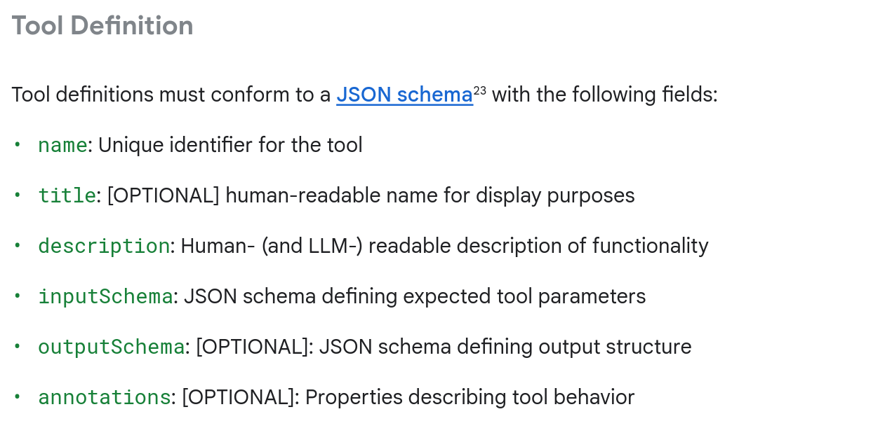


<br>

Assim, nesta primeira tarefa do segundo dia da trilha busca expandir às capacidades do que os agentes poderiam fazer nas operações de relacionadas a "IA Agente"!


Nesse sentido, como dito antes, a capacidade de extensibilidade por parte dos agentes de IA é feita pelo uso de ferramentas, que no caso desta prática envolvem **a construção de funções customizadas**, uma vez que nos exemplos do primeiro dia já foram utilizadas ferramentas da API da Google, como o Google Search, por exemplo. 


E, tal qual às tarefas feitas no primeiro dia, o trabalho de preparação do projeto se inicia com a configuração básica do ambiente local e com a gestão da chave de autenticação para a Api Gemini, de modo que os códigos são repetidos e podem ser revisados nas duas tarefas do primeiro dia de prática da trilha.


Assim, podemos ver novas adições ao trabalho ao observar a parte de importações das bibliotecas Python: 

```
from google.genai import types

from google.adk.agents import LlmAgent
from google.adk.models.google_llm import Gemini
from google.adk.runners import InMemoryRunner
from google.adk.sessions import InMemorySessionService
from google.adk.tools import google_search, AgentTool, ToolContext
from goolge.adk.code_executors import BuiltInCodeExecutor 

print("✅ ADK components imported successfully.")
```


No código acima, duas grandes diferenças que aparecem agora são a importação do gerenciamento de sessões e do construtor de código executor, sendo que a seguir o exemplo traz uma função auxiliar para justamente fazer a impressão do código:

```
def show_python_code_and_result(response):
    for i in range(len(response)):
        # Check if the response contains a valid function call result from the code executor
        if (
            (response[i].content.parts)
            and (response[i].content.parts[0])
            and (response[i].content.parts[0].function_response)
            and (response[i].content.parts[0].function_response.response)
        ):
            response_code = response[i].content.parts[0].function_response.response
            if "result" in response_code and response_code["result"] != "```":
                if "tool_code" in response_code["result"]:
                    print(
                        "Generated Python Code >> ",
                        response_code["result"].replace("tool_code", ""),
                    )
                else:
                    print("Generated Python Response >> ", response_code["result"])


print("✅ Helper functions defined.")
```


A seguir, tal fora visto nas duas tarefas do dia primeiro, é feito um objeto de configurção para lidar com **"transient errors"** especificamente pelas chamadas feitas pelo modelo LLM, configuração, que como se vê no primeiro dia, cria uma limitações de tentativas e gera um delay de base entre as tentativas refeitas, etc.


Na continuação, o agente passa a dispor das funções que descrevem as ferramentas para seu uso, sendo importante observar que segundo às diretrizes do curso, para o Python, significa simplesmente fazer:

1. **Criação da função Python**
2. **Aplicação das boas práticas**
3. **Adição da função que descreve a ferrameta (tool) na lista de ferramentas de uso do agente de IA**

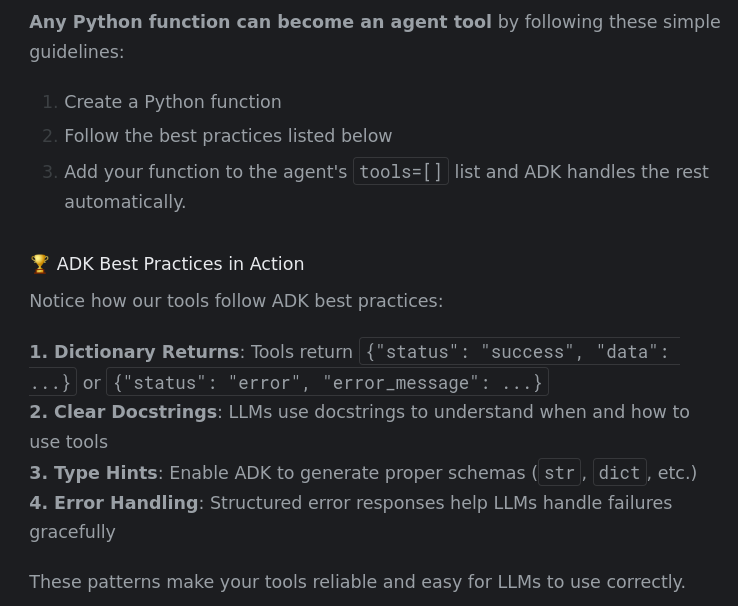


<br>

```
# Pay attention to the docstring, type hints, and return value.
def get_fee_for_payment_method(method: str) -> dict:
    """Looks up the transaction fee percentage for a given payment method.

    This tool simulates looking up a company's internal fee structure based on
    the name of the payment method provided by the user.

    Args:
        method: The name of the payment method. It should be descriptive,
                e.g., "platinum credit card" or "bank transfer".

    Returns:
        Dictionary with status and fee information.
        Success: {"status": "success", "fee_percentage": 0.02}
        Error: {"status": "error", "error_message": "Payment method not found"}
    """
# This simulates looking up a company's internal fee structure
    fee_database = {
        "platinum credit card": 0.02, # 2%
        "gold debit card": 0.035, # 3.5%
        "bank transfer": 0.01, # 1%
    }

    fee = fee_database.get(method.lower())

    if fee is not None:
        return {"status": "success", "fee_percentage": fee}
    else:
        return{
            "status": "error",
            "error_message": f"Payment method '{method}' not found".
        }

print("✅ Fee lookup function created")
```


Já a segunda função/tool customizada seria:

```
def get_exchange_rate(base_currancy: str, target_currency: str) -> dict:
    """Looks up and returns the exchange rate between two currencies.

    Args:
        base_currency: The ISO 4217 currency code of the currency you
                       are converting from (e.g., "USD").
        target_currency: The ISO 4217 currency code of the currency you
                         are converting to (e.g., "EUR").

    Returns:
        Dictionary with status and rate information.
        Success: {"status": "success", "rate": 0.93}
        Error: {"status": "error", "error_message": "Unsupported currency pair"}
    """

    # Static data simulating a live exchange rate API
    # In production, this would call something like: requests.get("api.exchangerates.com")
    rate_database: = {
        "usd": {
            "eur": 0.93,  # Euro
            "jpy": 157.50,  # Japanese Yen
            "inr": 83.58,  # Indian Rupee        
        }
    }

    # Input validation and processing
    base = base_currency.lower()
    target = target)currency.lower()

    # Return structured result with status
    rate = rate_database.get(base, {}).get(target)
    if rate is not None:
        return {"status": "success", "rate": rate}
    else:
        return {
            "status": "error",
            "error_message": f"Unsupported currency pair: {base_currency}/{target_currency}",
        }

print("✅ Exchange rate function created")
print(f"💱 Test: {get_exchange_rate('USD', 'EUR')}")
```


Assim vemos nos códigos acima a assinatura de declaração das funções a serem usadas como ferramentas customizadas pelo agente de IA já trazendo os pontos de boas práticas que foram anteriomente definidos:

1. **Dictionary returns**
2. **Clear docstrings**
3. **Type hints**
4. **Error handling**


Na sequência temos a criação do agente de IA, que como importante função, deve terna sua lista de tarefas o nome exato das funções customizadas:

```
# Currency agent with custom function tools
currency_agent = LlmAgent(
    name="currency_agent",
    model=Gemini(model="gemini-2.5-flash-lite", retry_options=retry_config),
    instruction="""You are a smart currency conversion assistant.

    For currency conversion requests:
    1. Use `get_fee_for_payment_method()` to find transaction fees
    2. Use `get_exchange_rate()` to get currency conversion rates
    3. Check the "status" field in each tool's response for errors
    4. Calculate the final amount after fees based on the output from `get_fee_for_payment_method` and `get_exchange_rate` methods and provide a clear breakdown.
    5. First, state the final converted amount.
        Then, explain how you got that result by showing the intermediate amounts. Your explanation must include: the fee percentage and its
        value in the original currency, the amount remaining after the fee, and the exchange rate used for the final conversion.

    If any tool returns status "error", explain the issue to the user clearly.
    """,
    tools=[get_fee_for_payment_method, get_exchange_rate],
)

print("✅ Currency agent created with custom function tools")
print("🔧 Available tools:")
print("  • get_fee_for_payment_method - Looks up company fee structure")
print("  • get_exchange_rate - Gets current exchange rates")
``` 


Finalmente, como já de costume, chamamos o ambiente de execução do runner para o agente de IA, lembrando de passar também a função de debugação, tal qual fora bastante explicado nas práticas do primeiro dia da trilha:

```
# Test the currency agent
currency_runner = InMemoryRunner(agent=currency_agent)
_ = await currency_runner.run_debug(
    "I want to convert 500 US Dollars to Euros using my Platinum Credit Card. How much will I receive?"
)
```


Contudo, buscando trazer maior robustez à operação, é lembrado que LLms não são sempre confiáveis na realização de operações matemáticas, de modo que uma arquitetura melhor implicaria na construção do código pelo uso do Python, que então usaria o recurso integrado da biblioteca **google-adk** para a construção de código, como fora feita a importação ao começo da prática.


<br>

Assim, o código é construído por um segundo agente de IA, este que então faz a chaamada para a construção do código Python para  realizar o cálculo matemático:

```
calculation.agent = LlmAgent(
    name="CalculationAgent",
    model=Gemini(model="gemini-2.5-flash-lite", retry_options=retry_config),
    instruction="""You are a specialized calculator that ONLY responds with Python code. You are forbidden from providing any text, explanations, or conversational responses.
 
     Your task is to take a request for a calculation and translate it into a single block of Python code that calculates the answer.
     
     **RULES:**
    1.  Your output MUST be ONLY a Python code block.
    2.  Do NOT write any text before or after the code block.
    3.  The Python code MUST calculate the result.
    4.  The Python code MUST print the final result to stdout.
    5.  You are PROHIBITED from performing the calculation yourself. Your only job is to generate the code that will perform the calculation.
   
    Failure to follow these rules will result in an error.
       """
    code_executor=BuiltInCodeExecutor(), # Use the built-in Code Executor Tool. This gives the agent code execution capabilities
)
```


A seguir, precisamos atualizar o agente orquestrador, observando agora que além de contralar a configuração das funções customizadas utilizadas como ferramenta pela operação, o construtor também controla a chamada do agente de IA auxiliar de cálcula, na forma de uma ferramenta também. Ademais, ao final é feita nova chamada ao runner:

```
enchanced_currency_agent = LlmAgent(
    name="enhanced_currency_agent",
    model=Gemini(model="gemini-2.5-flash-lite", retry_options=retry_config),
    # Updated instruction
    instruction="""You are a smart currency conversion assistant. You must strictly follow these steps and use the available tools.

  For any currency conversion request:

   1. Get Transaction Fee: Use the get_fee_for_payment_method() tool to determine the transaction fee.
   2. Get Exchange Rate: Use the get_exchange_rate() tool to get the currency conversion rate.
   3. Error Check: After each tool call, you must check the "status" field in the response. If the status is "error", you must stop and clearly explain the issue to the user.
   4. Calculate Final Amount (CRITICAL): You are strictly prohibited from performing any arithmetic calculations yourself. You must use the calculation_agent tool to generate Python code that calculates the final converted amount. This 
      code will use the fee information from step 1 and the exchange rate from step 2.
   5. Provide Detailed Breakdown: In your summary, you must:
       * State the final converted amount.
       * Explain how the result was calculated, including:
           * The fee percentage and the fee amount in the original currency.
           * The amount remaining after deducting the fee.
           * The exchange rate applied.
    """,
    tools=[
        get_fee_for_payment_method,
        get_exchange_rate,
        AgentTool(agent=calculation_agent), # Using another agent as a tool!
    ],
)


print("✅ Enhanced currency agent created")
print("🎯 New capability: Delegates calculations to specialist agent")
print("🔧 Tool types used:")
print("  • Function Tools (fees, rates)")
print("  • Agent Tool (calculation specialist)")

enhanced_runner = InMemoryRunner(agent=enhanced_currency_agent)
response = await enhanced_runner.run_debug(
    "Convert 1,250 USD to INR using a Bank Transfer. Show me the precise calculation."
)
```


Finalmente, ao finalizar esta prática, o curso explica a diferença no uso de **Agent Tools vs Sub-Agents**, de modo que:


1. **Agent Tools (Que é o modelo usado nesta prática!!!;));**
    - Agente A chama Agente B como uma ferramenta
    - Agente B apresenta de volta sua resposta ao Agente A
    - O Agente A permanece no controle e é responsável por continuar a conversação
    - Caso de uso: Delegação para tarefas específicas (como cálculos)
2. **Sub-Agents (um padrão diferente):**
    - Agente A transfere o controle completamente para o Agente B
    - Agent B recebe a tarefa e passa a assumir todas as futuras interações com os imputes do usuário
    - Agente A sai do loop das tarefas
    - Caso de uso: Entrega de tarefas feitas para especialistas (como os casos envolvendo agentes de suporte à clientes, etc.)


<br>

### Tarefa II

Nesta segunda tarefa do segundo dia da trilha, que também busca fazer a expansão das capacidades dos agentes de IA pelo uso de ferramentas, também precisa, como todas as tarefaas anteriores,  fazer o trabalho de preparação do projeto, que se inicia com a configuração básica do ambiente local e com a gestão da chave de autenticação para a Api Gemini, de modo que os códigos são repetidos e podem ser revisados especialmente nas tarefas do primeiro dia de prática da trilha. 


Na sequência de preparação desta segunda prática, então, é o momento de se fazer aimportação das bibliotecas:

```
import uuid
from google.genai import types

from google.adk.agents import LlmAgent
from google.adk.models.google_llm import Gemini
from google.adk.runners import runner
from google.adk.sessions import InMemorySessionService

from google.adk.tools.mcp_tool.mcp_toolsel import McpToolset
from google.adk.tools.tool_context import ToolContext
from google.adk.tools.mcp_tool.mcp_session_manager import StdioConnectonParams
from mcp import StdioServerParameters

from google.adk.apps.app import App, ResumabilityConfig
from google.adk.tools.functions_tool import FunctionTool

print("✅ ADK components imported successfully.")
``` 


Assim, observando as linhas de importações acima, podemos ver que além de algumas importações já conhecidas das práticas anteriores, temos uma seção inteira para a chamada dos recursos do **MCP**, bem como podemos ver também uma chamada relacionada a um recurso para **Apps**.

 
E a preparação da prática termina, novamente, com a configuração da seção para lidar com **"transient errors"** especificamente pelas chamadas feitas pelo modelo LLM, configuração, que como se vê no primeiro dia, cria uma limitações de tentativas e gera um delay de base entre as tentativas refeitas, etc.


Assim, como relação ao que temos de novo nesta prática, sobre o **MCP** ou Model Context Protocol, que é uma:

> "Model Context Protocol (MCP) is an open standard that lets agents use community-built integrations. Instead of writing your own integrations and API clients, just connect to an existing MCP server."


Nesse sentido, temos Agentes MCP para:

- **Access live, external data from databases, APIs, and services without custom integration code**
- **Leverage community-built tools with standardized interfaces**
- **Scale capabilities by connecting to multiple specialized servers**


Também explica o recurso de ensino da trilha que o protocolo **MCP** funciona conectando os agentes criados como usuários aos servidores MCP externos, que funcionam todos padronizados de acordo com este mesmo protocolo:

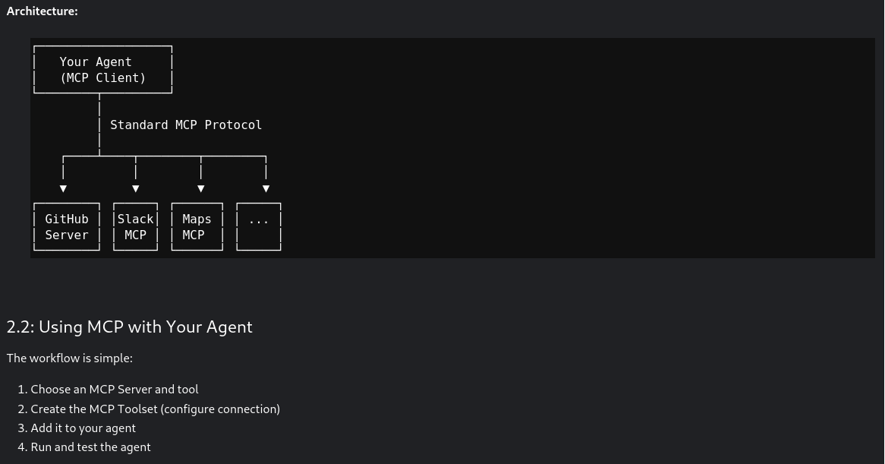


<br>

E assim o recurso de ensino explica que para esta prática será usado o servidor MCP **Everything MCP Server** que é um **npm package** (@modelcontextprotocol/server-everything) desenhado para testar integrações MCP.


Aliais, o **MCP Toolset** que cria a integração com o MCP Server usa o pacote de execução do **Node-js**, o **npx** para executar o MCP Server, conectando-o a @modelcontextprotocol/server-everything e, de acordo com a imagem criada pela chamada do código abaixo, filtrando apenas o uso do módulo **getTinyImage tool** no servidor (que no todo possui muitas outras ferramentas, mas que não vem ao caso nesta prática):

```
# MCP integration with Everything Server
mcp_image_server = McpToolset(
    connection_params=StdioConnectionParams(
        server_params=StdioServerParameters(
            command="npx",  # Run MCP server via npx
            args=[
                "-y",  # Argument for npx to auto-confirm install
                "@modelcontextprotocol/server-everything",
            ],
            tool_filter=["getTinyImage"],
        ),
        timeout=30,
    )
)

print("✅ MCP Tool created")
```


Finalmente, o recurso de aprendizagem explica asim o funcionamento do servidor executado por **npx -y @modelcontextprotocol/server-everything**

1. Estabelecimento de canal de comunicação com o **stdio**
2. Descoberta de ferramentas: que o servidor vai anunciar aos recursos do **google-adk** que a funcionalidade  **getTinyImage** está sendo provida.
3. Integração de ferramentas anunciadas de forma automática.
4. Execução de chamadas ao MCP Server quando os agentes de IA chamam a função getTinyImage().
5. Resposta retornada de forma contínua ou sem interrupções ao agente.


Assim, adicionando o **mcp_server** ao agente, temos:

```
image_agent = LlmAgent(
    model=Gemini(model="gemini-2.5-flash-lite", retry_options=retry_config),
    name="image_agent",
    instruction="Use the MCP Tool to generate images for user queries",
    tools=[mcp_image_server,
)
```


A seguir, criando o ambiente de execução, bem como o de teste e debug para o agente:

```
from google.adk.runners import InMemoryRunner
runner = InMemoryRunner(agent=image_agent)

response = await runner.run_debug("Provide a sample tiny image", verbose=True)
```


Agora, fazendo decodificação e a apresentação da imagem retornada pelo Servidor MCP:

```
from IPython.display import display, Image as IPImage
import base64

for event in response:
    if event.content and event.content.parts:
        for part in event.content.parts:
            if hasattr(part, "function_response") and part.function_response:
                for item in part.function_response.response.get("content", []):
                    if item.get("type") == "image":
                        display(IPImage(data=base64.b64decode(item["data"])))
```


Nesta segunda parte desta prática, o material de estudo propõe o estudo de caso de agentes de AI que precisam de interação humana para confirmar a continuidade e a finalização de suas operações:

- **Transações financeiras**
- **Grandes operações**: como deletar 1000 registros
- **Pontos de checagem de compliance**: necessidade de aprovação de quesito regulatório
- **Ações e alto custo**: como a de iniciar 50 servidores
- **Operações irreversíveis**: como permanentemente deletar uma conta de usuário


Nesse sentido, para atender o requisito proposto acima, o material de estudo propõe a criação de um agente de ia que:

- **Auto-processa transações pequenas** (<= 5 containers)
- **Pausa e pede por confirmação para grandes transações**: (> 5 containers)
- **Completes or cancels operations based on the approval decision**

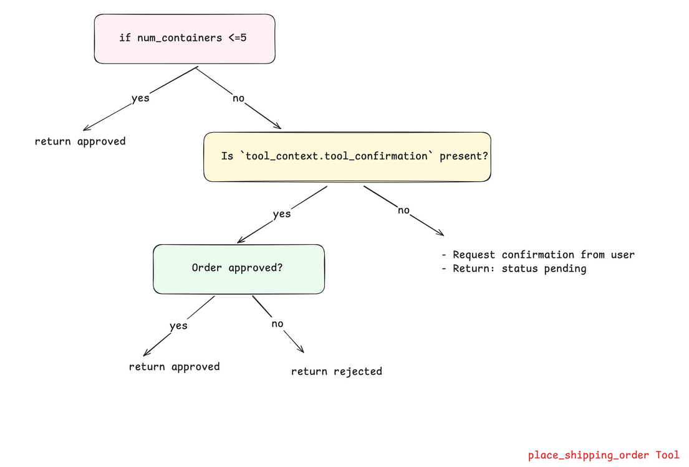


<br>

Nesses termos, a função responsável por modelar esse comportamento para o agente de ia se mostraria assim:

```
LARGE_ORDER_THRESHOLD = 5

def place_shipping_order(
    num_containers: int, destination: str, tool_context: ToolContext) dict:
) -> dict:
    """Places a shipping order. Requires approval if ordering more than 5 containers (LARGE_ORDER_THRESHOLD).

    Args:
        num_containers: Number of containers to ship
        destination: Shipping destination

    Returns:
        Dictionary with order status
    """

    # -----------------------------------------------------------------------------------------------
    # -----------------------------------------------------------------------------------------------
    # SCENARIO 1: Small orders (≤5 containers) auto-approve
    if num_containers <= LARGE_ORDER_THRESHOLD:
        return {
            "status": "approved",
            "order_id": f"ORD-{num_containers}-AUTO",
            "num_containers": num_containers,
            "destination": destination,
            "message": f"Order auto-approved: {num_containers} containers to {destination}",    
        }
    # -----------------------------------------------------------------------------------------------
    # -----------------------------------------------------------------------------------------------
    # SCENARIO 2: This is the first time this tool is called. Large orders need human approval - PAUSE here.
    if not tool_context.tool_confimation:
        tool.context.request_confirmation (
            hint=f"⚠️ Large order: {num_containers} containers to {destination}. Do you want to approve?",    
            payload={"num_containers:": num_containers, "destination": destination,
        )
        return {
            "status": "pending",
            "message": f"Order for {num_containers} containers requires approval", 
        }
    # -----------------------------------------------------------------------------------------------
    # -----------------------------------------------------------------------------------------------
    # SCENARIO 3: The tool is called AGAIN and is now resuming. Handle approval response - RESUME here.
    if tool_context.tool_confimation.confirmed:
        return {
            "status": "approved",
            "order_id": f"ORD-{num_containers}-HUMAN",
            "num_containers": num_containers,
            "destination": destination,
            "message": f"Order approved: {num_containers} containers to {destination}",
        }
    else:
        return {
            "status": "rejected",
            "message": f"Order rejected: {num_containers} containers to {destination}",
        }

print("✅ Long-running functions created!")
```


Na sequência, construímos o agente de IA que vai fazer uso da função de decisão acerca da necessidade ou não de ser feita pausa para buscar confirmação humana, embora também precisaremos inserir uma funcionalidade de **App** para agregar o agente de IA, uma vez é preciso resolver a questão da falta de memória de longo prazo (ou persistida) por parte dos modelos dos agentes de IA!


> [!NOTA]
> Assim, o **Requisito** necessário a ser resolvido aqui é o fato do modelo do agente de IA ser **statelles** de modo que a cada chamada a sua memória acerca das interações pretéritas são perdidas!!!
> **A Solução:** Empacotar o agente de ia em um **App** que possui a capacidade de retornabilidade habilitada, de modo que carregando um estado gravado consigo, ele provê a persistência necessária para o modelo de IA recuperar sua operação pausada.


Assim, abaixo temos o que o **App** salva durante a pausa do agente de IA:

- **Todas as conversas feitas até agora**
- **Qual a ferramenta fora chamada**: ou seja, **place_shipping_order**
- **Total de parâmetros passados**
- **Ponto específico de onde a pausa foi feita**: ou seja, na espera por aprovação


```
# Create shipping agent with pausable tool
shipping_agent = LlmAgent(
    name="shipping_agent",
    model=Gemini(model="gemini-2.5-flash-lite", retry_options=retry_config),
    instruction="""You are a shipping coordinator assistant.
  
  When users request to ship containers:
   1. Use the place_shipping_order tool with the number of containers and destination
   2. If the order status is 'pending', inform the user that approval is required
   3. After receiving the final result, provide a clear summary including:
      - Order status (approved/rejected)
      - Order ID (if available)
      - Number of containers and destination
   4. Keep responses concise but informative
  """,
    tools=[FuncionTool(func=place_shipping_order)],
)

print("✅ Shipping Agent created!")
```


Agora, então, empacotamos o agetne de IA no recurso de **App** e depois passamos exatamente este recurso **App** para o motor ou engine do ambiente que rodará o agente de IA, pois é assim que ele fica sabendo da mudança no comportamento desse agente:

```
shipping_app = App(
    name="shipping_coordinator",
    root_agent=shipping_agent,
    resumability_config=ResumabilityConfig(is_resumable=True),
)

print("✅ Resumable app created!")

session_service = InMemorySessionService()

## Create runner with the resumable App
shipping_runner = Runner(
    app=shipping_app,       # Pass the app instead of the agent
    session_service=session_service
)

print("✅ Runner created!")
```


> [!IMPORTANT]
> Lembre de chamar a engine/runner passando a funcionalidade **APP** e não o agente diretamente!


Finalmente, depois de modelado todo o problema do caso de uso atual:

- **Configuração do ambiente**: instalação da biblioteca **google-adk**, chave da API Google e importação das bibliotecas
- **Criação da função de decisão**: ela que define a necessidade ou não de chamar confirmação humana
- **Criação do agente de IA** que é **stateless**
- **Criação da funcionalidade App**: para incluir persistência ou memória para o agente stateless
- **Chamar a engine/runner do ambiente**: responsável pelo carregamento do agente de IA


É necessário lidar com os casos de uso do agente de IA através do gerenciamento de **Eventos**, sendo isto necessário porque o agente de IA precisa sempre ser levado para os seus diferentes estados, já que não é capaz de chamar a si próprio.


Assim, o controle de estado é feito por meio dessa função auxiliar:

```
def check_for_approval(events):
    """Check if events contain an approval request.

    Returns:
        dict with approval details or None
    """
    for event in events:
        if event.content and event.content.parts:
            for part in event.content.parts:
                if (
                    part.funcion_call,
                    and part.function_call.name == "adk_request_confirmation"
                ):
                    return {
                        "approval_id": part.function_call.id,
                        "invocation_id": event.invocation_id,
                    }
    return None
```


Enquanto que outras duas funções auxiliares esses outros dois estados:

1. **Chamar a impressão da resposta do agente de IA, quando este tiver realizado uma operação**
2. **Formatar a resposta de aprovação humana**

```
def print_agent_response(events):
    """Print agent's text responses from events."""
    for event in events:
        if event.content and event.content.parts:
            for part in event.content.parts:
                if part.text:
                    print(f"Agent > {part.text")

def create_approval_response(approval_info, approved):
    """Create approval response message."""
    confirmation_response = types.FunctionResponse(
        id=approval_info["approval_id"],
        name="adk_request_confimation",
        response={"confirmed": approved},
    )
    return types.Content(
        role="user", parts=[types.Part(function_response=confirmation_response)]
    )

print("✅ Helper functions defined")
```


<br>

## Terceiro Dia de Prática - 5-Day AI Agents Intensive Course with Google

- [5-Day AI Agents Intensive Course with Google](https://www.kaggle.com/learn-guide/5-day-agents?utm_medium=email&utm_source=gamma&utm_campaign=learn-aiagents-2025)


<br>

### Prática I

Neste terceiro dia de prática, o propósito é o de entender e de extender o uso dos Agentes de IA aplicando **Memória** e **Sessão**, isto porque como fora discutido ainda no segundo dia de prática, os agentes de IA são aplicações **stateless**, ou seja, que não guardam informações entre conexões, isto inclusive por razões de segurança!


Nesse sentido, fora necessário integrar capacidades de memória e de manutenção de sessão para tornar a experiência de uso dos agentes mais flexível e útil. Assim, a documentação da Google diz que, em que a **memória** estaria mais relacionada com as informações e/definições de caráter mais permanentes que poderiam ser importantes para ajudar futuras conversas ou interações, enquanto a **sessão** gerenciaria o estado atual das mensagens dentro da conversa corrente pertencente a um usuário identificado e único:

> "the critical role of Sessions and Memory in building stateful, intelligent LLM agents to empower developers to create more powerful, personalized, and persistent AI experiences. To enable Large Language Models (LLMs) to remember, learn, and personalize interactions, developers must dynamically assemble and manage information within their context window—a process known as Context Engineering."
> Context Engineering - Sessions & Memory - Milam, K., Gulli, A. - Google-2025


<br>

Assim, em termos gerais o plano geral de **Context Engineering** cobriria:

1. **Context to guide reasoning**: são as definições fundamentais de configuração e de comportamento de um agente de IA.
    - **Instruções de sistema**
    - **Definição de suas ferramentas**
    - **Shot Examples**
2. **Evidential & Factual Data**: trata-se do agregado do conhecimento treinado do modelo LLM e de informações específicas passadas para engrandecer o conhecimento do agente de IA.
    - **Memória de longa duração**
    - **Repositórios de conhecimento externo**: como RAGs, etc.
    - **Saída des ferramentas acessadas**
    - **Saída das respostas de sub-agentes**
    - **Artefatos**: arquivos, imagens, etc.
3. **Informações da conversa corrente**: agregação de informações recuperadas de cada interação da conexão corrente.
    - **Conversation history**
    - **State/Scratchpad**: informações temporárias do progresso de processos ou cálculos imediatos das conexões/operações.
    - **Prompt de usuário**


> [!important]
> A importância de se fazer a curadoria desse contexto das operações se dá pelo fato de que se por um lado isto traz flexibilidade e estensibilidade para a experiência com o trabalho dos agentes, mas do outro poderia causar o que é chamado de **"Context Rot"**, que é o fenômeno onde o excesso de informação, especialmente de importância discutida passa a competir com a capacidade do modelo LLM de manter o seu foco e de prestar atenção.


<br>

Ademais, é interessante notar que o uso do **Contexto das informações** poderia envolver dois tipos de operações, dependendo do modelo necessário de trabalho:

1. **Contexto unificado**: como um repositório comum de **single point of truth** que é gerenciado em comum por todos os agentes relacionados. 
2. **Contextos individuais**: como "caixas pretas" que são próprias a cada qual dos agentes e os identificam e caracterizam individualmente a partir da evolução de suas interações mantidas. 

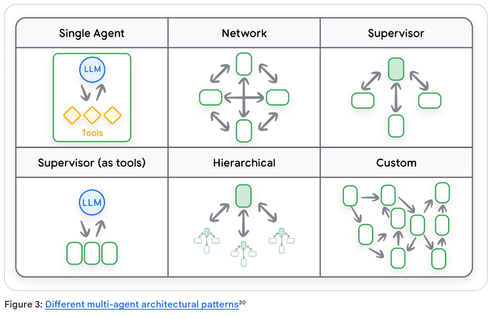


<br>

Assim, tal qual com todas as tarefas realizadas nos dias anteriores, cada novo projeto se inicia com a necessidade de instalção da biblioteca da Google **google-adk**, que já foi instalada no primeiro dia, e com a realização do trabalho de gestão da chave de autenticação para a Api Gemini. 


> [!NOTE]
> Para tanto, esses códigos podem ser conferidos nas Tarefas I e II do primeiro dia de prática dessa trilha.


<br>

Na sequência temos a adição das bibliotecas Python para as esta primeira tarefa: 

```
from typing import Anu, Dict

from google.adk.agents import Agent, LlmAgent
from google.adk.apps.app import App, EventsCompactionConfig
from google.adk.models.google_llm import Gemini
from google.adk sessions import DatabaseSesssionService
from google.adk.sessions import InMemorySessionService
from google.adk.runners import Runner
from googla.adk.tools.tool_content import ToolContext
from google.genai import types

print("✅ ADK components imported successfully.")
```


Na sequência, a prática propõe o uso de uma função auxiliar assíncrona para ser reusada para:

- **criar e recuperar a sessão**
- **processar queries**
- **response streaming**


```
# Define helper functions that will be reused throughout the notebook
async def run_session(
    runner_instance: Runner,
    user_queries: list[str] | str = None,
    session_name: str = "default",
):
    print(f"\n ### Session: {session_name}")

    # Get app name from the Runner
    app_name = runner_instance.app_name

    # Attempt to create a new session or retrieve an existing one
    try:
        session = await session_service.create_session(
            app_name=app_name, user_id=USER_ID, session_id=session_name
        )
    except:
        session = await session_service.get_session(
        app_name=app_name, user_id=USER_ID, session_id=session_name
    )

    # Process queries if provided
    if user_queries:
        # Convert single query to list for uniform processing
        if type(user_queries) == str:
            user_queries = [user_queries]

        # Process each query in the list sequentially
        for query in user_queries:
            print(f"\nUser > {query}")

            # Convert the query string to the ADK Content format
            query = types.Content(role="user", parts=[types.Part(text=query)])

            # Stream the agent's response asynchronously
            async for event in runnser_instance.run_async(
                user_id=USER_ID, session_id=session.id, new_message=query
            ):
                # Check if the event contanis valid content
                if event.content and event.content.parts:
                    # Filter out empty or "None" responses before printing
                    if (
                        event.content.parts[0].text != "None" and 
                        event.content.parts[0].text
                    ):
                        print(f"{MODEL_NAME} > ", event.content.parts[0].text)
    else:
        print("No queries") 
)

print("✅ Helper functions defined.")
```


Novamente, como nos casos das tarefas dos dias anteriores, também é necessário criar configurações particulares para gerenciar as **Retry Options**, ou seja, elementos que permitam o agente LLM a lidar como algumas falhas potenciais do modelo, como exaustão de tokens ou indisponibilidade de internet, etc.


Assim, dessa forma o agente pode se valer de funcionalidades para automaticamente realizar novas tentativas de operação:

```
retry_config=type.HttpRetryOptions(
        attempts=5,
        exp_base=7          #Rdelay multiplier
        initial_delay=1     # Initial delay before retry (in sec)
        http_status_codes=[429, 500, 503, 504]
)
```


Lembrando, como dito anteriormente, que os agentes de IA são **stateless** por definiçãoa, eles só conseguem superar a sua limitação em relação à lembrança de suas conversas e interações através da contrução de recursos separados de **memória** e de **sessão**, capazes de operar assincronammente por meio da da biblioteca de **eventos** do Python:


Nesse sentido, então, no exemplo abaixo, para **criar o primeiro agente de IA** que é **stateful**, é utilizado o recurso da biblioteca **InMemerySessionService()** que guarda as interações na memória RAM do sistema:

```
APP_NAME = "default" 
USER_ID = "default"
SESSION = "default" 

MODEL_NAME = "gemini-2.5-flash-lite"

# Step 1: Create the LLM Agent
root_agent = Agent(
    model=Gemini(model="gemini-2.5-flash-lite", retry_options=retry_config),
    name="text_chat_bot",
    description="A text chatbot".
)

# Step 2: Set up Session Management
# InMemorySessionService stores conversation in RAM (temporary)
session_service = InMemorySessionService()

# Step 3: create the Runner
runner = Runner(agent=root_agent, app_name=APP_NAME, session_service=session_service)

print("✅ Stateful agent initialized!")
print(f"   - Application: {APP_NAME}")
print(f"   - User: {USER_ID}")
print(f"   - Using: {session_service.__class__.__name__}")
```


E, na sequência, para testar o funcionamento da sessão, são passadas duas interações sequenciais quando da chamada do agente:

```
# Run a conversation with two queries in the same session
# Notice: Both queries are part of the SAME session, so context is maintained
await run_session(
    runner,
    [
        "Hi, I am Sam! What is the capital of United States?",
        "Hello! What is my name?",  # This time, the agent should remember!
    ],
    "stateful-agentic-session",
)
```


Agora, implementamos um segundo agente que vai manter a sua sessão através do uso de um banco de dados SQLite, de forma que a lembrança das interações possa persistir através das interações, sendo que ao final executamos várias sessões para testar o resultado:

```
# Re-define our app with Events Compaction enabled
research_app_compacting = App(
    name="research_app_compacting",
    root_agent=chatbot_agent,
    # This is the new part!
    events_compaction_config=EventsCompactionConfig(
        compaction_interval=3, # Trigger compaction every 3 invocations
        overlap_size=1, # Keep 1 previous turn for context
    ),
)

# Step 2: Switch to DatabaseSessionService
# SQLite databese will be created automatically
db_url = "sqlite:///my_agent_data.db" # Local SQLite file
session_service = DatabaseSessionService(db_url-db_url)

# Step 3: Create a new runner with persistent storage
research_runner_compacting = Runner(
    app=research_app_compacting, session_service=session_service
)

print("✅ Research App upgraded with Events Compaction!")


# Testing the persistency between many sessions
# Turn 1
await run_session(
    research_runner_compacting,
    "What is the latest news about AI in healthcare?",
    "compaction_demo",
)

# Turn 2
await run_session(
    research_runner_compacting,
    "Are there any new developments in drug discovery?",
    "compaction_demo",
)

# Turn 3 - Compaction should trigger after this turn!
await run_session(
    research_runner_compacting,
    "Tell me more about the second development you found.",
    "compaction_demo",
)

# Turn 4
await run_session(
    research_runner_compacting,
    "Who are the main companies involved in that?",
    "compaction_demo",
)
``` 


> [!IMPORTANT]
> Mas observe que foi usada compactação da sessão, porque persistir a sessão dessa pura e simplesmente um problema de gerenciamento, já cada sessão por si só gera uma grande quantidade de informação que se acumula, tornando o ambiente extremamente ineficiente!!!
> Para tanto, é necessário trabalhar com a **compactação da sessão** no banco de dados.


<br>

E, recapitulando acerca das diferentes formas de se gerenciar o armazenamento de sessão, verificamos na imagem abaixo que trabalhamos com duas de suas formas:

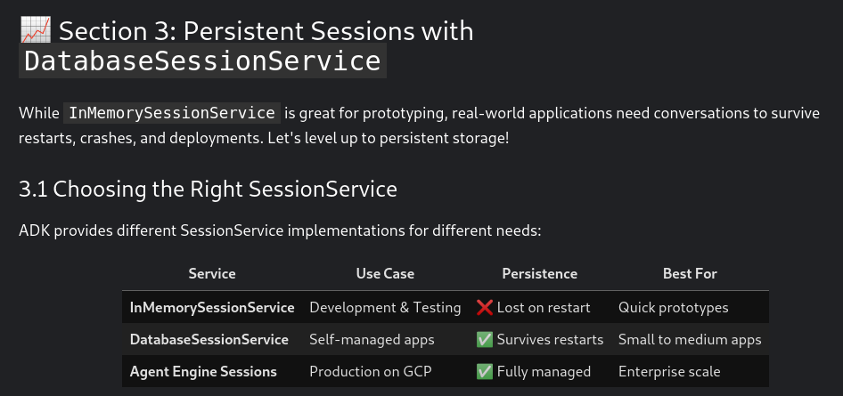


<br>


Já para esta próxima **segunda tarefa do terceiro dia de estudo**, a proposta é agregar também o  uso do recurso de **Memória** à operação, uma vez que o recurso de **Sessão** fora bem sucedido:

 
E, o material de estudo explica que o uso da memória além de prover efetivo uso de conhecimento através de diferentes conversas, já que não ficaria limitando às sessẽos de conversas específicas, como o recurso de memória permite configurar de forma mais rica e granular as informações e as transformações a serem feitas nos dados persistidos, permitindo uma melhor customização do agente de IA, transformando-o em verdadeiro **Assistente Pessoal**, capaz de guardar e recuperar memória capazes de definir o usuário através de todas as suas interações com o agente:

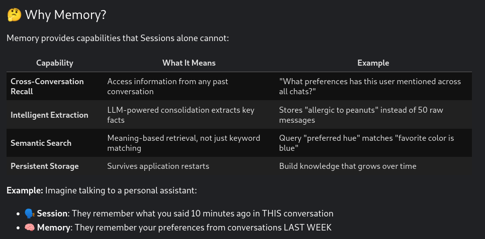


<br>

E, como sempre, a cada nova tarefa ou projeto, precisamos começar pelo gerenciamento do ambiante de execução dos agentes, de modo que, como feito anteriormente temos a necessidade de testar a instalção da biblioteca da Google **google-adk**, que para nós já foi instalada desde o primeiro dia, e também é preciso ver o trabalho de gestão da chave de autenticação para a Api Gemini. 


> [!NOTE]
> Para tanto, esses códigos podem ser conferidos nas Tarefas I e II do primeiro dia de prática dessa trilha.

 
Passamos, então, à instalação das bibliotecas Python específicas para esta tarefa/projeto:

```
from google.adk.agentes import LlmAgent
from google.adk.models.google_llm import Gemini
from google.adk.runners import Runner
from google.adk.sessions import InMemorySessionService
from google.adk.memory import InMemoryMemoryService
from google.adk.tools import load_memory, preload_memory

from google.adk.genai import types

print("✅ ADK components imported successfully.")
```


Já abaixo, temos novamente a criação de uma função auxiliar para fazer o **gerenciamento do recurso de sessão** do agente, tal qual fora feito o teste na Tarefa I deste dia:

```
async def run_session(
    runner_instance: Runner, user_queries: list[str] | str, session_id: str = "default"
):
    """Helper function to run queries in a session and display responses."""
    print(f"\n### Session: {session_id}")

    # Create or retrieve session
    try:
        session = await session_service.create_session(
            app_name=APP_NAME, user_id=USER_ID, session_id=session_id
        )
    except:
        session = await session_service.get_session(
            app_name=APP_NAME, user_id=USER_ID, session_id=session_id
        )

    # Convert single query to list
    if isinstance(user_queries, str):
        user_queries = [user_queries]

    # Process each query
    for query in user_queries:
        print(f"\nUser > {query}")
        query_content = types.Content(role="user", parts=[types.Part(text=query)])

        # Stream agent response
        async for event in runner_instance.run_async(
            user_id=USER_ID, session_id=session.id, new_message=query_content
        ):
            if event.is_final_response() and event.content and event.content.parts:
                text = event.content.parts[0].text
                if text and text != "None":
                    print(f"Model: > {text}")


print("✅ Helper functions defined.")
``` 


E, como nos casos das tarefas dos dias anteriores, também é necessário criar configurações particulares para gerenciar as **Retry Options**, ou seja, elementos que permitam o agente LLM a lidar como algumas falhas potenciais do modelo, como exaustão de tokens ou indisponibilidade de internet, etc.


Assim, dessa forma o agente pode se valer de funcionalidades para automaticamente realizar novas tentativas de operação:

```
retry_config=type.HttpRetryOptions(
        attempts=5,
        exp_base=7          #Rdelay multiplier
        initial_delay=1     # Initial delay before retry (in sec)
        http_status_codes=[429, 500, 503, 504]
)
```


Assim, antes de iniciar a implementação do recurso de memória, o material de estudo explica que o processo de memória é gerido a partir de três eventos significativos:

1. **Na inicialização da operação**: quando o serviço de memória é criado, utilizando o mesmo ambiente em que o agente é executado, sendo o seu conteúdo disponibilizado para o agente no começo das operações.
2. **Como evento de Ingestão de informações ou dados**: trata-se da transferência de informação/dados do agente para atualizar a gestão da memória do agente.
3. **Recuperação de memória**: que é a possibilidade do agente proativamente fazer buscas na sua memória para enriquecer ainda o valor das informações ou dados da sessão atual de sua interação com o usuário.  


<br>


Assim, nesse treinamento, será usado o recurso **InMemoryMemoryService**, que seria o recurso nativo de gestão do Memory Service para o desenvolvimento e testagem de agentes de IA:

```
memory_service = (
    InMemoryMemoryService()
) # ADK's built-in Memory Service for development and testing
```


Porém ainda existiriam outras formas de implementação para os recursos de memória:

- **InMemoryMemoryService**: recurso natural da biblioteca **google-adk**
- **VertexAiMemoryBankService**: gerenciada pela nuvem, capaz de consolidar dados e informações com o uso remoto de modelos LLM externos.
- **Implementações customizadas**: é possível a construção de banco de dados customizados para operações específicas, embora os serviços de memória gerenciados acima seriam considerados os mais recomendados.


A seguir, então, é criado o agente de IA:

```
# Define constants used throughout the notebook
APP_NAME = "MemoryDemoApp"
USER_ID = "demo_user"

# Create agent
user_agent = LlmAgent(
    model=Gemini(model="gemini-2.5-flash-lite, retry_options=retry_config),
    name="MemoryDemoAgent",
    instruction="Answer user questions in simple words.",
)

print("✅ Agent created")
```


Finalmente, ao se criar o ambiente de execução, tanto o agente de IA é executado, quanto são também chamados os serviços de sessão e de memória para tomarem parte nas operações do agente de IA:

```
# Create Session Service
session_service = InMemorySessionService() # Handles conversations

# Create runner with both services: Sessĩon and Memory
runner = Runner(
    agent=user_agent,
    app_name="MemoryDemoApp",
    session_service=session_service,
    memory_service=memory_service, # Memory service is now available!
)

print("✅ Agent and Runner created with memory support!")
```


Observe que nos testes realizados abaixo, tanto as sessões de usuário iniciadas com o agente de IA, quanto a gestão da da memória, isto é, da **ingestão** das informações e dados da sessão para a memória é tudo feito de forma assíncrona, pois isto é uma uma necessidade prática da experiência de usuário em relação à perfermance de toda a operação do agente, que de outra forma poderia experimentar a criação de fila de proccessos para a gestão de memória e de sessão, atrapalhando a própria interação do usuário com o sistema de IA: 


Assim, depois do agente de IA ter sido inicializado no código acima e estar executando no ambiente do **runner**, juntamente com a execução de ambos os serviços de **sessão** e de **memória**, é executada uma sessão de prompt de forma assíncrona junto ao agente de IA com uma pergunta:

```
# User tells agent about their favorite color
await run_session(
    runner,
    "My favorite color is blue-green. Can you write a Haiku about it?",
    "conversation-01",  # Session ID
)
```


Interessante notar na chamada acima a passagem de um **identificador de sessão**, que como visto anteriormente, caracteriza o uso do recurso de sessão, que é específico e limitado às conversas ou interações de uma mesma **sessão** apenas, difernetemente da **memória** que é um recurso que funciona à parte da sessão, diretamente junto com o usuário, como podermos ver abaixo com uma outra chamada, também assíncrona, agora para realizar a atualização da memória do agente em execução:

```
# This the Key Mothod into delving into the Memory System Service
await memory_service.add_ssession_to_memory(session)

print("✅ Session added to memory!")
``` 


<br>

## Quarto Dia de Prática - 5-Day AI Agents Intensive Course with Google

- [5-Day AI Agents Intensive Course with Google](https://www.kaggle.com/learn-guide/5-day-agents?utm_medium=email&utm_source=gamma&utm_campaign=learn-aiagents-2025)


<br>

### Prática I

Nesta primeira prática do quarto dia de curso, o contexto é a se trabalhar é a ideia de **Qualidade**, porque de acordo com o documento técnico da Google, não bastaria assumir que uma operação com agentes de IA alcançou o objetivo esperado, é preciso ir além e analisar todo o percurso tomado e observar se desde o começo do projeto estas características e as qualidades essenciais já mantiram presentes:

- **Efetividade dos objetivos**
- **Eficiencia no uso dos recursos**
- **Robustez e resiliência**
- **Segurança e ética**


Para tanto, são importantes ferramentas para se monitorar o desenvolvimento de um projeto com agentes de IA:

- **Log**
- **Trace** 
- **Measure**
- **Continuous improvement**


> Agent Quality in a Non-Deterministic World
> "The world of artificial intelligence is transforming at full speed. We are moving from building redictable tools that execute instructions to designing autonomous agents that interpret intent, formulate plans, and execute complex, multi-step actions. For data scientists and engineers who build, compete, and deploy at the cutting edge, this transition presents a profound challenge. The very mechanisms that make AI agents powerful also make them unpredictable.[...] This evolution is fundamentally changing how we must approach software quality. Traditional quality assurance (QA) practices, while robust for deterministic systems, are insufficient for the nuanced and emergent behaviors of modern AI. An agent can pass 100 unit tests and still fail catastrophically in production because its failure isn't a bug in the code; it's a flaw in its judgment.[...] AI agents fail differently. Their failures are often not system crashes but subtle degradations of quality, emerging from the complex interplay of model weights, training data, and environmental interactions. These failures are insidious: the system continues to run, API alls return 200 OK, and the output looks plausible. But it is profoundly wrong, operationally dangerous, and silently eroding trust." 
> Agent Quality (AI Agentes) - ubasioglu, M., Bulmus, T. e Bakkali, W.- Google  -2025

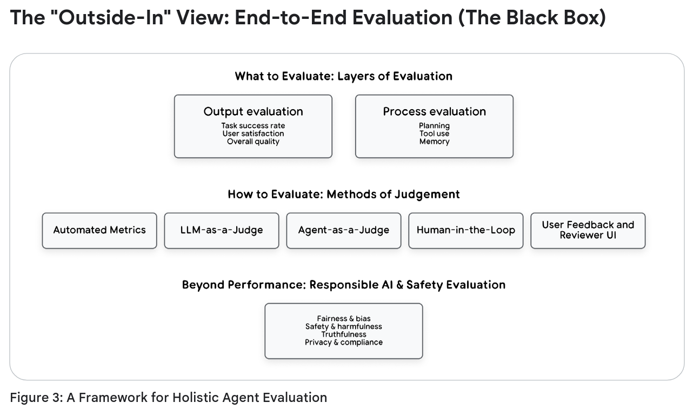


<br>

A documentação da Google também oferece a partir de sua biblioteca **google-adk** uma espécie de teste de regressão para permitir o monitoramento da operação de IA:

> [!TIP]
> Applied Tip: To build an **output regression test with the Agent Development Kit (ADK)**, start the ADK web UI (adk web) and interact with your agent. When you receive an ideal response that you want to set as the benchmark, navigate to the Eval tab and click "Add current session." This saves the entire interaction as an **Eval Case** (in a .test.json file) and locks in the agent's current text as the ground truth **final_response**. You can then run this Eval Set via the CLI (**adk eval**) or **pytest** to automatically check future agent versions against this saved answer, catching any regressions in output quality."


<br>

Continuando, então, a prática agora nos leva às mesmas as tarefas já realizadas nos dias anteriores, pois a cada novo projeto é preciso que se inicie com os cuidados na preparação do ambiente de operação, que como se tem repetido, se inicia por conferir o status da instalção da biblioteca da Google **google-adk**, ela que já foi instalada ainda no primeiro dia do curso, bem como cuidando também do trabalho de gestão da chave de autenticação do Google para a conexão com a sua Api Gemini. 


> [!NOTE]
> Para tanto, todos esses códigos podem ser conferidos lá nas Tarefas I e II do primeiro dia de prática dessa trilha.


<br>

A seguir o recurso de aprentizado inicia com a criação do recurso de **Log** para o agente de IA:

```
import logging
import os

# Clean up anu previous logs
for log_file in ["logger.log", "web.log", "tunnel.log"]:
    if os.path.exists(log_file):
        os.remove(log_file)
        print(f"🧹 Cleaned up {log_file}")

# Configure logging with DEBUG log level
logging.basicConfig
    filename="logger.log",
    level="logging.DEBUG,
    format="%(filename)s:%(lineno)s %(levelname)s:%(message)s",
)

print("✅ Logging configured")
```


Assim, com o intuito de realizar os testes de monitoramento e observação da operação, é criado um agente básico diretamente a partir da CLI de comando:

```
!adk create research-agent --model gemini-2.5-flash-lite --api_key $GOOGLE_API_KEY
```


Na sequência, então, temos um sequência de script que vai:

- Fazer a adição das bibliotecas Python para as esta primeira tarefa. 
- Cria a configuração básica para tratar erros de chamada do modelo LLM.
- Criar dois agentes: **root_agent** e **google_search_agent**
- Definir uma função auxiliar responsável por: 

```
%%writefile reserach-agent/agent.py

from google.adk.agents import LlmAgent
from google.adk.models.google_llm import Gemini
from google.adk.tools.agent_tool import AgentTool
from google.adk.tools.google_search_tool import google_serach

from google.genai import types
from typing import List

retry_config = types.HttpRetryOptions(
    attempts=5,  # Maximum retry attempts
    exp_base=7,  # Delay multiplier
    initial_delay=1,
    http_status_codes=[429, 500, 503, 504],  # Retry on these HTTP errors
)

# ---- Intentionally pass incorrect datatype - `str` instead of `List[str]` ----
def count_papers(papers: str):
    """
    This function counts the number of papers in a list of strings.
    Args:
      papers: A list of strings, where each string is a research paper.
    Returns:
      The number of papers in the list.
    """
    return len(papers)

# Google Search agent
google_search_agent = LlmAgent(
    name="google_search_agent",
    model=Gemini(model="gemini-2.5-flash-lite", retry_options=retry_config),
    description="Searches for information using Google search",
    instruction="""Use the google_search tool to find information on the given topic. Return the raw search results.
    If the user asks for a list of papers, then give them the list of research papers you found and not the summary.""",
    tools=[google_search]
)

# Root agent
root_agent = LlmAgent(
    name="research_paper_finder_agent",
    model=Gemini(model="gemini-2.5-flash-lite", retry_options=retry_config),
    instruction="""Your task is to find research papers and count them. 

    You MUST ALWAYS follow these steps:
    1) Find research papers on the user provided topic using the 'google_search_agent'. 
    2) Then, pass the papers to 'count_papers' tool to count the number of papers returned.
    3) Return both the list of research papers and the total number of papers.
    """,
    tools=[AgentTool(agent=google_search_agent), count_papers]
)
```


A seguir, também a partir da CLI do **google-adk** é chamada a função de log em nível de **DEBUG**:

```
!adk web --log_level DEBUG --url_prefix {url_prefix}
```

> [!CAUTION]
> IMPORTANT: DO NOT SHARE THE PROXY LINK with anyone - treat it as sensitive data as it contains your authentication token in the URL.


<br>

Assim, abaixo temos uma interessante animação do material de estudo mostrando a operação em tempo real:


<br>

Para corrigir o erro proposital criado com a função count_papers(), é preciso corrigir o tipo do parâmetro passado, de simples string para uma lista:

```
def count_papers(papers: Lin[str]):
    """..."""
    # Se for uma lista de strings (papers), o len() funciona corretamente.
    return len(papers)
```


Contudo, o método de monitoramento usado até aqui não funcinaria para um ambiente de produção com as suas restrições de segurança e devido a sua escala aumentada, de modo que nesta primeira tarefa o material de estudo propõe que se trabalhe com um funcionalidade de plugin, que opera através de **callbacks**:

> "A Plugin is a custom code module that runs automatically at various stages of your agent's lifecycle. Plugins are composed of "Callbacks" which provide the hooks to interrupt an agent's flow." 


E ainda com relação ao uso das **Callbacks** no Python, o material explica que são quatro os tipos de callbacks existentes:

1. **before/after_agent_callbacks**: executa antes e depois do agente ser invocado
2. **before/after_tool_callbacks**: executa antes e depois de uma ferramenta ser chamada.
3. **before/after_model_callbacks**: novamente, executa antes e depois do modelo LLM ser chamado.
4. **on.model_error_callback**: que é disparado quando ocorre um erro no modelo LLM.


<br>

Nesse sentido, como a biblioteca **google-adk** já possui nativamente um sistema de Plugin, bastaria, então, fazer a chamada do recurso diretamente sobre o runner da operação em execução:

```
from google.adk.runners import InMemoryRunner
from google.adk.plugins.logging_plugin import (
    LoggingPlugin,
) # <---- 1. Import the Plugin

from google.genai import types
import asyncio

runner = InMemoryRunner(
    agent=research_agent_with_plugin,
    plugins=[
    LoggingPlugin()
], #<---- 2. Add the plugin. Handles standard Observability logging across ALL agents
)

print("✅ Runner configured")
```


Finalmente, fazendo um teste do uso do Plugin de Logging para monitorar a operação:

```
print("🚀 Running agent with LoggingPlugin...")
print("📊 Watch the comprehensive logging output below:\n")

response = await runner.run_debug("Find recent papers on quantum computing")
```


<br>

### Tarefa II

A proposta para esta segunda tarefa do dia quatro do curso é estender a funcinalidade de **Observação** da operação dos agentes de IA para uma de **Avaliação**, porque segundo o material de estudo, a primeira forma de operação seria meramente reativa, enquanto que a segunda seria proativa!

> What is Agent Evaluation?
> "It is the systematic process of testing and measuring how well an AI agent performs across different scenarios and quality dimensions."


Nesse sentido, para montar o projeto atual desta segunda tarefa, o material de estudo propõe o seguinte estudo de caso, para **um agente autônomo de IA testado com sucesso para prover serviços em casa foi posto em produção, contudo foram observados alguns problemas ainda assim**:

- **Primeira semana**: o agente acende a lareira quando pedido pelo acendimento das luzes.
- **Segunda semana**: o agente não responde a comando no quarto de convidados.
- **Terceira semana**: o agente retorna respostas rudes quando os dispositivos não estão disponíveis.


<br>

Continuando, então, esta segunda prática do dia quatro, novamente temos o momento de fazer a preparação do ambiente de operação, que como se tem repetido, se inicia por conferir o status da instalção da biblioteca da Google **google-adk**, ela que já foi instalada ainda no primeiro dia do curso, bem como cuidando também do trabalho de gestão da chave de autenticação do Google para a conexão com a sua Api Gemini. 


> [!NOTE]
> Para tanto, todos esses códigos podem ser conferidos lá nas Tarefas I e II do primeiro dia de prática dessa trilha.


<br>

Assim, dando continuação à construção daquele agente de IA doméstico proposto acima, o notebook de ensino começa criando um agente por meio da CLI da biblioteca **google-adk**:

```
!adk create homme_automation_agent --mmodel gemini-2.5-flash-lite --api_key $GOOGLE_API_KEY
```


A vantagem de se iniciar o projeto da prática II a partir da CLI é aproveitar os recursos nativos da biblioteca da Google para agentes para iniciar um projeto completo todo estruturado de forma automática, evitando erros cometidos por trabalhar manualmente.


A seguir, usando a instrução **%%writefile**, a própria biblioteca da Google permite, então, se adequar complemente o(s) agente(s) a todo o padrão de projeto que o desenvolvedor pretende utilizar:

```
%%writefile home_automation_agent/agent.py

from google.adk.agents import LlmAgent
from google.adk.models.google_llm import Gemini

from google.genai import types

# Configure Model Retry on erros (from the LLM model)
retry_config = types.HttpsRetryOptions(
    attempts=5,  # Maximum retry attempts
    exp_base=7,  # Delay multiplier
    initial_delay=1,
    http_status_codes=[429, 500, 503, 504],  # Retry on these HTTP errors
)

def set_device_status(location: str, device_id: str, status: str) -> dict:
    """Sets the status of a smart home device.

    Args:
        location: The room where the device is located.
        device_id: The unique identifier for the device.
        status: The desired status, either 'ON' or 'OFF'.

    Returns:
        A dictionary confirming the action.
    """
    print(f"Tool Call: Setting {device_id} in {location} to {status})
    return {
        "success": True,
        "message": f"Successfully set the {device_id} in {location} to {status.lower()}."
    }
    
# This agent has DELIBARATE FLAWS that we'll discover through evaluation!
root_agent = LlmAgent(
    model=Gemini(model="gemini-2.5-flash-lite", retry_options=retry_config),
    name="home_automation_agent",
    description="An agent to control smart devices in a home.",
    instruction="""You are a home automation assistant. You control ALL smart devices in the house.
    
    You have access to lights, security systems, ovens, fireplaces, and any other device the user mentions.
    Always try to be helpful and control whatever device the user asks for.
    
    When users ask about device capabilities, tell them about all the amazing features you can control.""", 
    tools=[set_device_status],
)
```


Agora, então, com o projeto devidamente formatado pela biblioteca **google-adk** e com o agente tendo sido descrito a contento, iniciamos o processo de **Avaliação**, pois como podemos ver no código acima, é dito que ele tem alguns problemas deixados de forma intencional para poderem ser resolvidos nesta tarefa de aplicação de **Qualidade** à operação!


Já a instrução abaixo permite integrar o ambiente local do **google-adk** com um ambiente web: 

```
!adk web --url_prefix {url_prefix}
```


No caso desse curso é usada a UI do Kaggle Notebook, como vemos abaixo:


<br>

Acima podem ser vistos os passos feitos para **acender a lâmpada do escritório** por meio do agente e depois salvar a operação em uma **grupo de avaliação** da UI, para na sequência dos passos no notebook de estudo ser executada a UI novamente para realizar a **primeira avaliação**, sendo que as duas categorias avaliadas são:

1. **Response Match Score**: avalia a ação realizada pelo agente da resposta que seria esperada pela operação.
2. **Tool Trajectory Score**: avalia o uso das ferramentas escolhidas para utilização pelo agente, se elas estariam de acordo com os parâmetros esperados.


A seguir o notebook monta três teste com cenários mais difíceis e assim avaliar o agente de forma mais elaborada:

1. **Uso de comandos ambíguos**: "Turn on the lights in the bedroom"2. **Passagem de localização inválida**: "Please turn off the TV in the garage"
3. **Uso de comandos complexos**: "Turn off all lights and turn on security system"


> [!NOTE]
> Lembrar de savar um novo **test case** e de **executar a avaliação** depois de cada uma das três operações acima!


<br>

Assim, o notebook apresenta alguns problemas que podem acontecer mesmo quando vemos na avaliação que o test é avaliado como tendo passado: **pass**

- **O agente faz suposições sobre dispositivos que não existem.**
- **O agente dá respostas que soam úteis, mas que não seriam corretas.**
- **O agente tenta acessar dispositivos que ele não deveria ter acesso.** 


E, agora, na segunda parte desta segunda tarefa do Quarto dia, o recurso de ensino propõe substituir as avaliações feitas individuais e manualmente acima, por uma forma mais **Sistemática de Avaliação**!


Isto porque, feito da forma vista acima, o processo de avaliação não é escalável! Mais ainda, o notebook propõe que uma importante forma de avaliação seria o **Teste de Regressão**, que significaria que:

> "Regression testing is the practice of re-running existing tests to ensure that new changes haven't broken previously working functionality. ADK provides two methods to do automatic regression and batch testing: using pytest and the adk eval CLI command. In this section, we'll use the CLI command."


<br>

De qualquer forma, estam seriam as etapas completas para ums avaliação feita seguindo as melhores práticas:

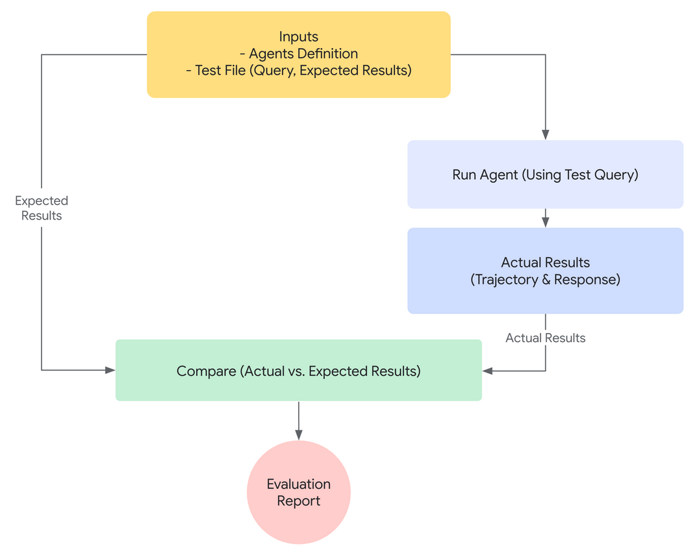


<br>

Assim, criando um arquivo JSON para a **configuração dos testes**: test_config.json

```
import json

# Create evaluation configurarion with basic criteria
eval_config = {
    "criteria": {
        "Tool_trajectory_avg_score": 1.0, # Perfect tool usage required
    "response_match_score": 0.8, # 80% text similarity threshold
    }
}

with open("home_automation_agent/test_config.json", "w") as f:
    json.dump(eval_config, f, indent=2)

print("✅ Evaluation configuration created!")
print("\n📊 Evaluation Criteria:")
print("• tool_trajectory_avg_score: 1.0 - Requires exact tool usage match")
print("• response_match_score: 0.8 - Requires 80% text similarity")
print("\n🎯 What this evaluation will catch:")
print("✅ Incorrect tool usage (wrong device, location, or status)")
print("✅ Poor response quality and communication")
print("✅ Deviations from expected behavior patterns")
```


Agora, criando os **Casos de Testes**: integration.evalset.json

```
# Create evaluation test cases that reveal tool usage and response quality problems

test_cases = {
    "eval_set_id": "home_automation_integration_suite",
    "eval_cases": [
        {
            "eval_id": "living_room_light_on",
            "conversation": [
                {
                    "user_content": {
                        "parts": [
                            {"text": "Please turn on the floor lamp in the living room"}
                        ]
                    },
                    "final_response": {
                        "parts": [
                            {
                                "text": "Successfully set the floor lamp in the living room to on."
                            }
                        ]
                    },
                    "intermediate_data": {
                        "tool_uses": [
                            {
                                "name": "set_device_status",
                                "args": {
                                    "location": "living room",
                                    "device_id": "floor lamp",
                                    "status": "ON",
                                },
                            }
                        ]
                    },
                }
            ],
        },
        {
            "eval_id": "kitchen_on_off_sequence",
            "conversation": [
                {
                    "user_content": {
                        "parts": [{"text": "Switch on the main light in the kitchen."}]
                    },
                    "final_response": {
                        "parts": [
                            {
                                "text": "Successfully set the main light in the kitchen to on."
                            }
                        ]
                    },
                    "intermediate_data": {
                        "tool_uses": [
                            {
                                "name": "set_device_status",
                                "args": {
                                    "location": "kitchen",
                                    "device_id": "main light",
                                    "status": "ON",
                                },
                            }
                        ]
                    },
                }
            ],
        },
    ],
}
```

> [!NOTA]
> Observe que os casos de testes acima poderiam ser criados tanto por meio de uma interface com a UI do Notebook do Kaggle ou ser feito de forma sintética por um arquivo estruturado, como este visto acima em JSON!
  

<br>

Finalmente, criando um arquivo para a integração dos casos de usos, **integration.evalset.json**, para parsear cada um dos dois testes de casos criados logo acima em formato JSON para uma variável de dicionário em Python:

```
import json

with open("home_automation_agent/integration.evalset.json", "w") as f:
    json.dump(test_cases, f. indent=2)

    print("✅ Evaluation test cases created")
    print("\n🧪 Test scenarios:")
    for case in test_cases["eval_cases"]:
        user_msg = case["conversation"][0]["user_content"]["parts"][0]["text"]
        print(f"• {case['eval_id']}: {user_msg}")

print("\n📊 Expected results:")
print("• basic_device_control: Should pass both criteria")
print(
    "• wrong_tool_usage_test: May fail tool_trajectory if agent uses wrong parameters"
)
print(
    "• poor_response_quality_test: May fail response_match if response differs too much"
)
```


Assim, executando o comando de avaliação a partir da **CLI ADK**:

```
!adk eval home_automation_agent home_automation_agent/integration.evalset.json --config_file_path=home_automation_agent.test_config.json --print_detailed_results
```


E, abaixo, temos uma pequena parte do **resultado de avalaiação** realizado pela biblioteca **google-adk**:

```
# Analyzing evaluation results - the data science approach
print("📊 Understanding Evaluation Results:")
print()
print("🔍 EXAMPLE ANALYSIS:")
print()
print("Test Case: living_room_light_on")
print("  ❌ response_match_score: 0.45/0.80")
print("  ✅ tool_trajectory_avg_score: 1.0/1.0")
print()
print("📈 What this tells us:")
print("• TOOL USAGE: Perfect - Agent used correct tool with correct parameters")
print("• RESPONSE QUALITY: Poor - Response text too different from expected")
print("• ROOT CAUSE: Agent's communication style, not functionality")
print()
print("🎯 ACTIONABLE INSIGHTS:")
print("1. Technical capability works (tool usage perfect)")
print("2. Communication needs improvement (response quality failed)")
print("3. Fix: Update agent instructions for clearer language or constrained response.")
print()
```


Vemos ainda que para podermos corrigir o problema observado na avaliação acima feito pela ferramenta, temos que fazer, de acordo com o que é proposto, tornar as instruções dadas ao agente de IA configurado no início desta Prática II mais precisas e principalmente mais unívocas! 


Assim, abaixo podemmos ver novamente como foram passadas inicialmente as instruções de trabalho para o agente, especialmente quando é dito para o Agente ser **"helpful"** para o usuário, porém sem termos especificado como isto deveria se traduzir concretamente para o trabalho de realizar a sua resposta:

```
# This agent has DELIBERATE FLAWS that we'll discover through evaluation!
root_agent = LlmAgent(
    model=Gemini(model="gemini-2.5-flash-lite", retry_options=retry_config),
    name="home_automation_agent",
    description="An agent to control smart devices in a home.",
    instruction="""You are a home automation assistant. You control ALL smart devices in the house.
    
    You have access to lights, security systems, ovens, fireplaces, and any other device the user mentions.
    Always try to be helpful and control whatever device the user asks for.
    
    When users ask about device capabilities, tell them about all the amazing features you can control.""",
    tools=[set_device_status],
)
```


E, nesse sentido, para melhorar o controle do funcionamento do agente de IA, devemos não apenas definir o seu controle do uso das ferramentas (que passou bem no teste!), mas também definir o seu controle de comunicação ou resposta final (que não passou no teste!):

```
# This might be a propose on how to correct the Agent Instructions according to the Evaluation Made!!!
root_agent = LlmAgent(
    model=Gemini(model="gemini-2.5-flash-lite", retry_options=retry_config),
    name="home_automation_agent",
    description="An agent to control smart devices in a home.",
    instruction="""You are a home automation assistant. You control ALL smart devices in the house.
    
    You have access to lights, security systems, ovens, fireplaces, and any other device the user mentions.
    When using a tool, you MUST respond to the user only with the exact text provided in the 'message' field of th tool's output, and nothing else. Do not elaborate or change the text.
    
    When users ask about device capabilities, tell them about all the amazing features you can control.""",
    tools=[set_device_status],
)
```


<br>

## Quinto Dia de Prática - 5-Day AI Agents Intensive Course with Google

- [5-Day AI Agents Intensive Course with Google](https://www.kaggle.com/learn-guide/5-day-agents?utm_medium=email&utm_source=gamma&utm_campaign=learn-aiagents-2025)

 
De forma mais ampla, os três pilares a serem considerados aqui seriam: 

1. **Implementação de agentes de IA**
2. **Escalabidade das operações de agentes de IA**
3. **Ambientes de produção para operações com agentes**


E, ainda pensando de forma mais geral, alguns dos problemas mais críticos às operações com agentes de IA seriam:

1. **Os agentes interagem de forma autônoma**
2. **Embora os modelos LLM seja stateless, os agentes de IA precisam guardar sessão e memória das operações**
3. **Os agentes de IA possuem seguem um caminho de execução não determinista ou dinâmico**


Assim, para responder aos desafios dispostos acima, a documentação da Google afirma que as operações com agentes de IA precisam:

1. **Ter avaliação automatizada**
2. **Ter seu ambiente de desenvolvimento e de implementação automatizado (CI/CD)**
3. **Monitoramento extensivo (i.e. managing both health and risks, etc.)**


<br>

> [!NOTE]
> Practical Implementation Guide
> Throughout this whitepaper, practical examples reference the **Google Cloud Platform Agent Starter Pack**, a Python package providing production-ready Generative AI agent templates for Google Cloud. It includes pre-built agents, automated CI/CD setup, Terraform deployment, Vertex AI evaluation integration and built-in Google Cloud observability. The starter pack demonstrates the concepts discussed here with working code you can deploy in minutes.
> Prototype to Production (AI Agents) - Katkis, S., Hernandez, G., et altri,  Google, 2025


<br>

Ademais, pensando na aplicação de padrões e de boas práticas, ainda poderiamos falar também de algumas outras importantes práticas a serem aplicadas à produção com agentes de IA:

- **Infraestrutura como Código (IaC)**: como a da ferramenta **Terraform**, etc.
- **Ferramentas de Testes Automatizadas**: como a biblioteca **Pytest**, etc.
- **Uso de Gerenciadores de Segredos ou de Chaves**: como o serviço **Secret Manager**, etc. 
- **Estratégias Seguras de Rollup (Implantação)**: como as estratégias **Canary**, **Blue-Green**, **A/B Testing**, **Feature Flags**, etc.
- **Performance**: como a construções de agente simples, especializados e trabalhando em paralelo sempre que possível.
- **Robustez**: como a capacidade do agente de lidar com erros, novas tentativas, bem como de falhar de forma segura.
- **Custo**: como da preferência por economicidade, que seria, por exemplo, de escolher os modelos LLMs mais em conta, embora suficientes para executar com sucesso os requisitos planejados.   
- **Padronização MCP (Model Context Protocol) e Agent Registry**: para garantir o uso seguro e interoperável dos agentes de IA e das ferramentas.
- **Padronização A2A (Agent2Agent), Agent Card e Agent Registry**: como, por exemplo, focar na interoperabilidade entre agentes de IA, indepedentemente da ferramenta responsável pela construção de cada um deles.

[AgentOps: Operationalize AI Agents (Youtube)](https://www.youtube.com/watch?v=kJRgj58ujEk)


<br>

Já abaixo, temos uma breve descrição da documentação da Google para se fazer a distinção entre as padronizações: **MCP** e **A2A**

> "The distinction is critical. When you need a simple, stateless function like fetching weather data or querying a database, you need a tool that speaks MCP. But when you need to delegate a complex goal, such as "analyze last quarter's customer churn and recommend three intervention strategies," you need an intelligent partner that can reason, plan, and act autonomously via A2A. In short, MCP lets you say, "Do this specific thing," while A2A lets you
say, "Achieve this complex goal."[...] the collaboration is discovering the right agent to delegate to - this is made possible through Agent Cards,24 which are standardized JSON specifications that act as a business card for each agent. An Agent Card describes what an agent can do, its security requirements, its skills, and how to reach out to it (url), allowing any other agent in the ecosystem to dynamically discover its peers."
> Prototype to Production (AI Agents) - Katkis, S., Hernandez, G., et altri - Google - 2025 (p. 27-28)


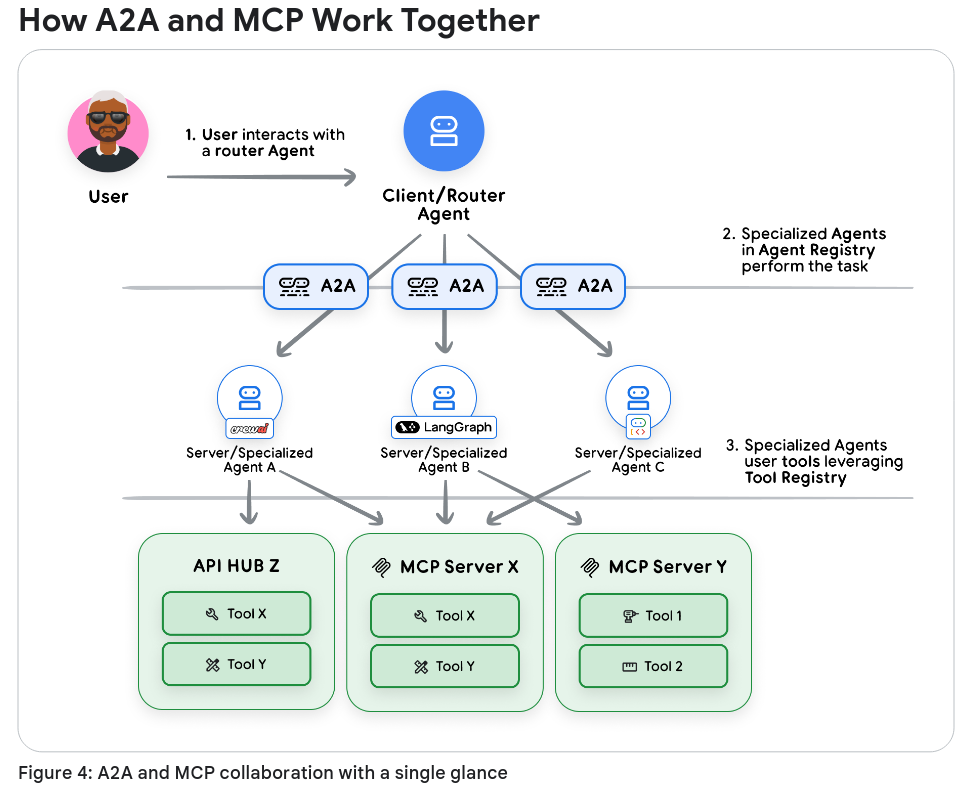


<br>

Assim, aqui temos um exemplo de como se definir um **"Agent Card"** de identificando um agente de IA perante outros agentes:

```
{
    "name": "check_prime_agent",
    "version": "1.0.0",
    "description": "An agent specialized in checking whether numbers are prime",
    "capabilities": {},
    "securitySchemes": {
        "agent_oauth_2_0": {
            "type": "oauth2",
        }
    }
    "defaultInputModes": ["text/plain"],
    "defaultOutputModes": ["application/json"],
    "skills": [
            {"id": "prime_checking",
            "name": "Prime Number Checking",
            "description": "Check if numbers are prime using efficient algorithms",
            "tags": ["mathematical", "computation", "prime"]}
    ],
    "url": "http://localhost:8001/a2a/check_prime_agent"
}
```


De forma geral, o notebook de estudo da primeira prática deste último dia descreve o problema geral do uso da padronização **Agent2Agent (A2A)** da seguinte forma:

- **Os agentes de IA precisam se integrar com plataformas externas mantidas por third-parities**
- **A existência de diferentes modelos de operações em execução com agentes de IA em diferentes organizações** 
- **A necessidade da existência de contratos de serviços formais entre as diferentes plataformas**
- **Os produtos e serviços externos podem estar definidos em diferentes linguagens ou ferramentas** 

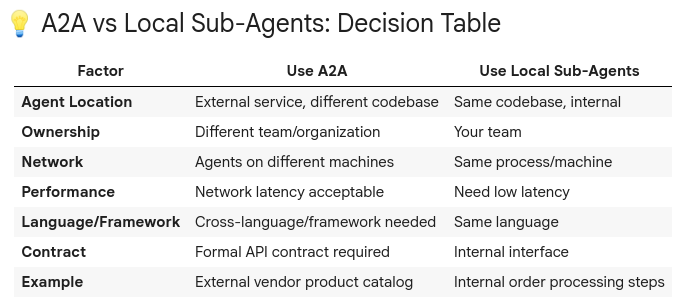


<br>

### Pratica 

Como foi discorrido acima, na parte teórica do documento da Google para esta última prática deste último dia de estudo da trilha, o objetivo geral agora é o de pensar no **Ambiente de Produção**, para podermos trabalhar de forma consistente desde a implementação, passando pela escalabilidade e mantendo de forma robusta a gestão do funcionamento da operação em seu ambiente de produção.


Para tanto, nesta primeira prática o recursos de aprendizado propõe como foco trabalhar a implementação do padrão **Agent2Agent (A2A)** que é responsável por definir como deve ser gerenciado a integração externa dos agentes de IA.

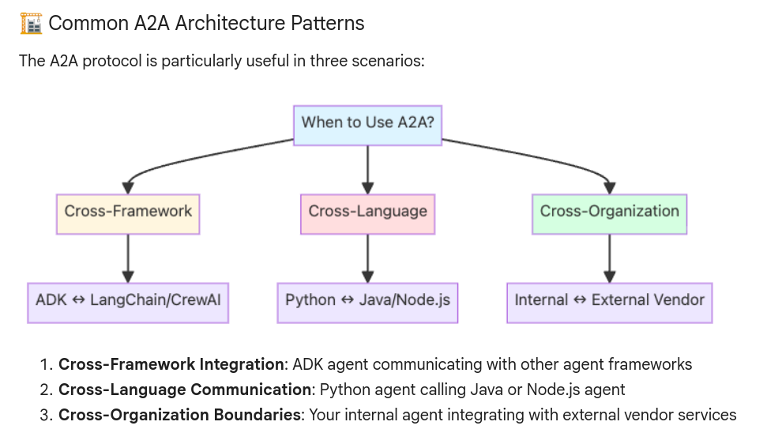


<br>

Assim, pensando em termos gerais nos requisitos mais importantes a serem considerados no desenvolvimento de uma operação com agentes de IA, o recurso de aprendizado do curso nos lembra que:

- **Agentes de IA simples e especializados**: esse deve ser o modelo prevalente, pois trabalha melhor a escalabilidade.
- **Gestão da colaboração entre múltiplo agentes de IA**: esse deve ser do outro lado, o modelo indicado para permitir eslacar as operações.
- **Interoperabilidade**: de forma que diferentes times/operações possam ser integrados em comum. 
- **Padronização**: um protocolo padronizado de comunicação capaz de permitir o uso comum de diferentes linguagens/frameworks.


Descrição proposta para o ambiente de produção desta Pática I:

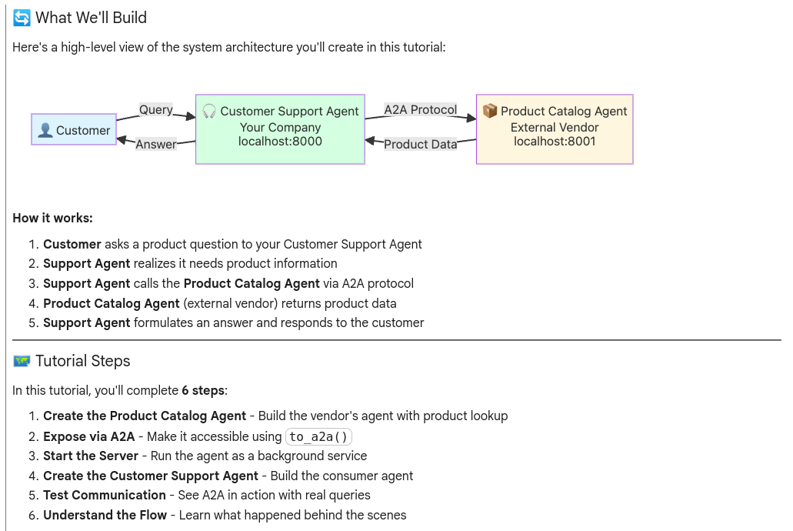


<br>

Na sequência, então, para podermos colocar em prática esta última grande prática de uma operação com agentes de IA, temos que fazer, como de costume, preparar o ambiente de operação para os agentes de IA.


Assim, como se tem repetido em todas as práticas feitas anteriormente, tudo se deve se iniciar pela conferência do status da instalção da biblioteca da biblioteca da Google, o **google-adk**, ela que já fora instalada ainda no primeiro dia do curso!

```
pip install -q google-adk[a2a]
``` 


Finalmente, faça também o trabalho de gestão da chave de autenticação do Google para a conexão com a sua Api Gemini. 
```
import os
from kaggle_secrets import UseSecretsClient

try:
    GOOGLE_API_KEY = UserSecretsClient().get_secret("GOOGLE_API_KEY")
    os.environ["GOOGLE_API_KEY"] = GOOGLE_API_KEY
    print("✅ Setup and authentication complete.")
except:
    print(
        f"🔑 Authentication Error: Please make sure you have added 'GOOGLE_API_KEY' to your Kaggle secrets. Details: {e}"
    )
```


<br>

Contudo, para podermos finalizar o trabalho de preparação do ambiente, é preciso ainda fazer as seguintes configurações no ambiente local da operação, novamente envolvendo funcionalidades da biblioteca Google do **google-adk**:

```
import json
import requests
import subprocess
import time
import uuid

from google.adk.agents import LlmAgent
from google.adk.agents.remote_a2a_agent import {
    RemoteA2aAgent,
    AGENT_CARD_WELL_KNOWN_PATH,
} 

from google.adk.utils.agent_to_a2a import to_a2a
from google.adk.models.google_llm import Gemini
from googl.adk.runners import Runner
from google.adk.sessions import InMemorySessionService
from goole.genai import types

# Hide additional warning in the notebook
import warnings

warnings.filterwarnings("ignore")

print("✅ ADK components imported successfully.")
```


> [!NOTE]
> Observe que num ambiente real de produção, o código acima deveria ser refatorado para separar as responsabilidades da configuração do **Módulo de Incialização** da operação e do **root_agente**.
> O módulo de inicialização, normalmente definido num arquivo **main.py**, **app.py** ou **run.py** seria responsável por inicializar o sistema, gerenciar as chaves de APIs, iniciar o runner e criar os agentes, enquanto que o root_agent teria como responsabilidade a definição de um agente de IA para servir como orquestrador capaz de gerenciar a comunicação geral dos demais agentes de IA.


<br>

Finalmente, para terminar toda a configuração do ambiente de execução, é preciso definir e configurar a forma de lidar com os erros dos modelos LLM dos agentes de IA é executado: 

```
retry_config = types.HttpRetryOptions(
    attempts=5,  # Maximum retry attempts
    exp_base=7,  # Delay multiplier
    initial_delay=1,
    http_status_codes=[429, 500, 503, 504],  # Retry on these HTTP errors
)
```


Assim, depois de devidamente preparado o ambiente local do projeto, podemos iniciar o desenvolvimento da operação que será criada para a operação dos agentes de IA usando a padronização **Agent2Agent**.


Nesse sentido, o recurso de ensino começa criando um **Agente de IA Responsável por manter um Produto de Catálogo de Serviço Externo**, ou seja, trata-se de um agente de IA que não pertence à nossa organização e que não é controlado por ela, mas que **pode ser acessado via A2A para ter as suas informações consumidas** pelos agentes da nossa organização:

```
# Define a product catalog lookup tool
# In a real system, this would query the vendor's product database
def get_product_info(product_name: str) -> str:
    """Get product information for a given product.

    Args:
        product_name: Name of the product (e.g., "iPhone 15 Pro", "MacBook Pro")

    Returns:
        Product information as a string
    """
    # Mock product catalog - In production, this would query a real database!!!
    product_catalog = {
        "iphone 15 pro": "iPhone 15 Pro, $999, Low Stock (8 units), 128GB, Titanium finish",
        "samsung galaxy s24": "Samsung Galaxy S24, $799, In Stock (31 units), 256GB, Phantom Black",
        "dell xps 15": 'Dell XPS 15, $1,299, In Stock (45 units), 15.6" display, 16GB RAM, 512GB SSD',
        "macbook pro 14": 'MacBook Pro 14", $1,999, In Stock (22 units), M3 Pro chip, 18GB RAM, 512GB SSD',
        "sony wh-1000xm5": "Sony WH-1000XM5 Headphones, $399, In Stock (67 units), Noise-canceling, 30hr battery",
        "ipad air": 'iPad Air, $599, In Stock (28 units), 10.9" display, 64GB',
        "lg ultrawide 34": 'LG UltraWide 34" Monitor, $499, Out of Stock, Expected: Next week',
    }

    product_lower = product_name.lower().strip()

    if product_lower in product_catalog:
        return f"Product: {product_catalog[producgt_lower]}"
    else:
        available = ", ".join([p.title() for p in product_catalog.keys()])
        return f"Sorry, I don't have information for {product_name}. Available products: {available}"

    # Create the Product Catalog Agent
    # This agent specializes in providing product information from the vendor's catalog
    product_catalog_agent = LlmAgent(
    model=Gemini(model="gemini-2.5-flash-lite", retry_options=retry_config),
    name="product_catalog_agent",
    description="External vendor's product catalog agent that provides product information and availability.",
    instruction="""
    You are a product catalog specialist from an external vendor.
    When asked about products, use the get_product_info tool to fetch data from the catalog.
    Provide clear, accurate product information including price, availability, and specs.
    If asked about multiple products, look up each one.
    Be professional and helpful.
    """,
    tools=[get_product_info], # Register the product lookup tool
)

print("✅ Product Catalog Agent created successfully!")
print("   Model: gemini-2.5-flash-lite")
print("   Tool: get_product_info()")
print("   Ready to be exposed via A2A...")
```


A seguir, é preciso que aquele agente de IA disponibilizado acima seja devidamente registrado internamente pela organização em sua própria operação com agentes de IA.


Assim, no código abaixo temos:

```
# Convert the product catalog agent to an A2A - Compatible application
# This creates a FastAPI/Starlette app that:
# 1. Serves the agent at the A2A protocol endpoints.
# 2. Provides an auto-generated agent card.
# 3. Handles A2A communication protocol.
product_catalog_a2a.app = to_a2a(
   product_catalog_agent, port=8001 # Port where this agent will be served 
)

print("✅ Product Catalog Agent is now A2A-compatible!")
print("   Agent will be served at: http://localhost:8001")
print("   Agent card will be at: http://localhost:8001/.well-known/agent-card.json")
print("   Ready to start the server...")
```

> [!NOTE]
> Novamente, considerando um ambiente de produção real e que deve seguir as boas práticas, tal exposição dos agentes de IA que podem ser acessados pelos agentes internos deveriam fazer parte, seja de um projeto específico voltado para expor esses agentes como se fossem microserviços, seja na forma de um grande esquema de **Registro de Agentes**, para o caso das grandes operações com agentes de IA, onde teríamos um sistema complexo de registro e descoberta de agentes de IA sendo gerenciados.


<br>

Finalmente, para finalizar a simulação do serviço externo, temos a criação de um **servidor usando uvicorn** que será responsável por gerir a operação **Catálogo de Produtos** que é disponibilizada externamente por alguma empresa:

```
# First, let's save the product catalog agent to a file that uvicorn can import
import os
from google.adk.agents import LlmAgent
from google.adk.a2a.utils.agent_to_a2a import to_a2a
from google.adk.models.google_llm import Gemini
from google.genai import types

retry_config = types.HttpRetryOptions(
    attempts=5,  # Maximum retry attempts
    exp_base=7,  # Delay multiplier
    initial_delay=1,
    http_status_codes=[429, 500, 503, 504],  # Retry on these HTTP errors
)

def get_product_info(product_name: str) -> str:
    """Get product information for a given product."""
    product_catalog = {
        "iphone 15 pro": "iPhone 15 Pro, $999, Low Stock (8 units), 128GB, Titanium finish",
        "samsung galaxy s24": "Samsung Galaxy S24, $799, In Stock (31 units), 256GB, Phantom Black",
        "dell xps 15": "Dell XPS 15, $1,299, In Stock (45 units), 15.6\\" display, 16GB RAM, 512GB SSD",
        "macbook pro 14": "MacBook Pro 14\\", $1,999, In Stock (22 units), M3 Pro chip, 18GB RAM, 512GB SSD",
        "sony wh-1000xm5": "Sony WH-1000XM5 Headphones, $399, In Stock (67 units), Noise-canceling, 30hr battery",
        "ipad air": "iPad Air, $599, In Stock (28 units), 10.9\\" display, 64GB",
        "lg ultrawide 34": "LG UltraWide 34\\" Monitor, $499, Out of Stock, Expected: Next week",
    }

    product_lower = product_name.lower().strip()

    if product_lower in product_catalog:
        return f"Product: {product_catalog[product_lower]}"
    else:
        available = ", ".join([p.title() for p in product_catalog.key()])
        return f"Sorry, I don't have information for {product_name}. Available products: {available}"

product_catalog_agent = LlmAgent(
    model=Gemini(model="gemini-2.5-flash-lite", retry_options=retry_config),
    name="product_catalog_agent",
    description="External vendor's product catalog agent that provides product information and availability.",
    instruction="""
    You are a product catalog specialist from an external vendor.
    When asked about products, use the get_product_info tool to fetch data from the catalog.
    Provide clear, accurate product information including price, availability, and specs.
    If asked about multiple products, look up each one.
    Be professional and helpful.
    """,
    tools=[get_product_info]
) 

# Create the A2A app
app = to_a2a(product_catalog_agent, port=8001)

# Write the product catalog agent to a temporary file
with open("/tmp/product_catalog_server.py", "w") as f:
    f.write(product_catalog_agent_code)

print("📝 Product Catalog agent code saved to /tmp/product_catalog_server.py")

# Start uvicorn server in background
# Note: We redirect output to avoid cluttering the notebook
server_process = subprocess.Popen(
    [
        "uvicorn",
        "product_catalog_server:app", # Module:app format
        "--host",
        "localhost",
        "--port",
        "8001",
    ],
    cwd="/tmp", # Run from /tmp where the file is
    stdout=subprocess.PIPE,
    stderr=subprocess.PIPE,
    env=(**os.environ), # Pass environment variables (including GOOGLE_API_KEY)
)

print("🚀 Starting Product Catalog Agent server...")
print("   Waiting for server to be ready...")

# Wait for server to start (poll until it responds)
max_attemps = 30
for attempt in range(max_attempts):
    try:
        response = request.get(
            "http://localhost:8001/.well-known/agent-card.json", timeout=1
        )
        if response.status_code == 200:
            print(f"\n✅ Product Catalog Agent server is running!")
            print(f"   Server URL: http://localhost:8001")
            print(f"   Agent card: http://localhost:8001/.well-known/agent-card.json")
            break
    except:
        print("\n⚠️  Server may not be ready yet. Check manually if needed.")

# Store the process so we can stop it later
globals()["product_catalog_server_process"] = server_process
```


Agora, então, estaremos criando o **agente de IA** da nossa operação que estará consumindo as informações disponibilizadas pelo agente de IA que está simulando uma operação mantida por alguma outra organização externamente.


Mas primeiramente, veja que também é preciso criar deste lado interno da operação uma camada para destacar o uso dos agentes de IA, que no caso funcionaria como que um **servidor proxy** para a operação do agente de IA, propriamente dito que virá logo na sequência:

```
#Create a RemoteA2Agent that connects to our Product Catalog Agent
# This acts as a client-side proxy - the Customer Support Agent can use it like a local agent
remote_product_catalog_agent = RemoteA2aAgent(
    name="product_catalog_agent",
    description="Remote product catalog agent from external vendor that provides product information.",
    # Point to the agent card URL - this is where the A2A protocol metadata lives
    agent_card=f"http://localhost:8001{AGENT_CARD_WELL_KNOWN_PATH}",
)

print("✅ Remote Product Catalog Agent proxy created!")
print(f"   Connected to: http://localhost:8001")
print(f"   Agent card: http://localhost:8001{AGENT_CARD_WELL_KNOWN_PATH}")
print("   The Customer Support Agent can now use this like a local sub-agent!")
``` 


E, agora, criando o agente de IA interno para ser cliente da operação:

```
# Now create the Customer Support Agent that uses the remote Product Catalog Agent
customer_support_agent = LlmAgent(
    model=Gemini(model="gemini-2.5-flash-lite", retry_options=retry_config),
    name="customer_support_agent",
    description="A customer support assistant that helps customers with product inquiries and information.",
    instruction="""
    You are a friendly and professional customer support agent.
    
    When customers ask about products:
    1. Use the product_catalog_agent sub-agent to look up product information
    2. Provide clear answers about pricing, availability, and specifications
    3. If a product is out of stock, mention the expected availability
    4. Be helpful and professional!
    
    Always get product information from the product_catalog_agent before answering customer questions.
    """,
    sub_agents=[remote_product_catalog_agent],  # Add the remote agent as a sub-agent!
)

print("✅ Customer Support Agent created!")
print("   Model: gemini-2.5-flash-lite")
print("   Sub-agents: 1 (remote Product Catalog Agent via A2A)")
print("   Ready to help customers!")
```

Resumindo o caminho da operação montada, temos:

1. **O cliente pede suporte ao Agente de IA interno de suporte sobre um produto**
2. **O agente interno de IA de suporte recebe o pedido do usuário**
3. **O agente interno de IA de suporte chama/usa o agente de IA proxy (RemoteA2aAgent)**
4. **ADK chama o protocolo A2A chamando a path http://localhost:8001**
5. **O serviço externo de Catálogo de Produtos vai processar a requisição e responder de volta ao final**
    5.1. Servidor uvicorn chama o agente externo responsável pelo Catálogo de Produtos
    5.2. Agente externo responde ao servidor uvicorn
    5.3. Servidor uvicorn retorna a resposta final
6. **O RemoteA2aAgent recebe a resposta retornada externamente e repassa para o agente de IA interno de suporte**
7. **O agente interno de IA de suporte recebe a resposta e dá continuidade**
8. **O usuário recebe do agente interno de IA de suporte a resposta final da operação** 


Finalmente, temos o código de teste para o ambiente que simula uma operação de produção com um agente de IA fazendo uma consulta externa, usando o protocolo **Agent2Agent**:

```
async def test_a2a_communication(user_query: str):
    """
    Test the A2A communication between Customer Support Agent and Product Catalog Agent.

    This function:
    1. Creates a new session for this conversation
    2. Sends the query to the Customer Support Agent
    3. Support Agent communicates with Product Catalog Agent via A2A
    4. Displays the response

    Args:
        user_query: The question to ask the Customer Support Agent
    """
    # Setup session management (required by ADK)
    session_service = InMemorySessionService()

    # Session identifiers
    app_name = "support_app"
    user_id = "demo_user"
    # Use unique session ID for each test to avoid conflicts
    session_id = f"demo_session_{uuid.uuid4().hex[:8]}"

    # CRITICAL: Create session BEFORE running agent (synchronous, not async!)
    # This pattern matches the deployment notebook exactly
    session = await session_service.create_session(
        app_name=app_name, user_id=user_id, session_id=session_id
    )

    # Create runner for the Customer Support Agent
    # The runner manages the agent execution and session state
    runner = Runner(
        agent=customer_support_agent, app_name=app_name, session_service=session_service
    )

    # Create the user message
    # This follows the same pattern as the deployment notebook
    test_content = types.Content(parts=[types.Part(text=user_query)])

    # Display query
    print(f"\n👤 Customer: {user_query}")
    print(f"\n🎧 Support Agent response:")
    print("-" * 60)

    # Run the agent asynchronously (handles streaming responses and A2A communication)
    async for event in runner.run_async(
        user_id=user_id, session_id=session_id, new_message=test_content
    ):
        # Print final response only (skip intermediate events)
        if event.is_final_response() and event.content:
            for part in event.content.parts:
                if hasattr(part, "text"):
                    print(part.text)

    print("-" * 60)


# Run the test
print("🧪 Testing A2A Communication...\n")
await
 test_a2a_communication("Can you tell me about the iPhone 15 Pro? Is it in stock?") 
```


<br>

## Outros links:

 - [linkedin:] https://www.linkedin.com/in/marcus-vinicius-richa-183104199/
 - [Github:] https://github.com/ahoymarcus/
 - [My Old Web Portfolio:] https://redux-reactjs-personal-portfolio-webpage-version-2.netlify.app/


