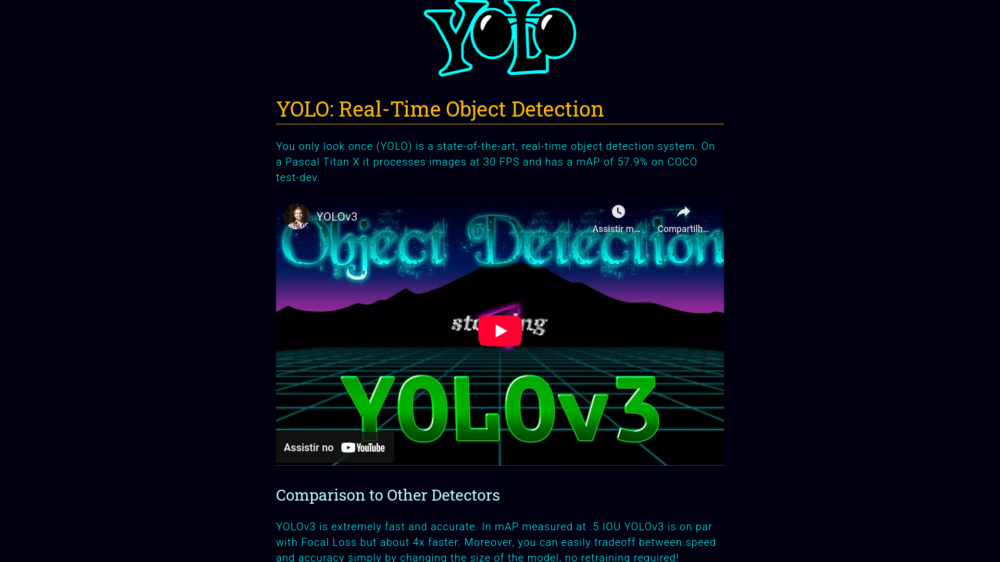

# Criação de Uma Base de Dados e Treinamento de Rede YOLO - Desafio 4
 
Olá, este é o meu repositório para o quarto desafio do bootcamp "BairesDev - Machine Learning Training" da Dio.me! 

<br>

## Entendendo o Problema

Neste laboratório do prof. Diego Renan, o objetivo está dividido em duas partes, onde a primeira visa entender sobre a criação de uma base de dados para machine learning, especificamente, para aplicações de machine learning voltados para tarefas como **Classificação**, **Detecção** e **Segmentação** de imagens. Enquanto que na segunda para busca-se entender a estrutura e o funcionamento da Rede YOLO que é uma rede de detecção de objetos em tempo real.


Ao longo deste treinamento machine learning com Python, o prof. Renan tem apresentado desde as bases desse tipo de tarefa dentro da área de ciência de dados, passando pela apresentação dos modelos de linguagem de grande escala ou do inglês LLMs, dos algoritmos de suporte de vetor, dos bio-inspirados, das diferentes linguaguagens e ferramentas voltadas para o campo da ciência de dados, e especificamente do machine learning:

- **Python**
- **Scilab**
- **R**
- **TensorFlow**


A seguir, foram discutidos conceitos importantes dentro do contexto do machine learning, como:

- **Treinamento não-supervisionado em machine learning**
- **Treinamento supervisionado em machine learning**
- **Aprendizado por reforço em machine learning**
- **Algoritmos de Regressão para machine learning**
- **Extração de Features e Redução de Dimensionalidade**
- **Métodos de Validação de Treinamento**
- **Métodos de Otimização de Aprendizado**
- **Otimização de Modelos em Hiperparâmetros**
- **Métricas de Avaliação de Desempenho de Modelos**


Daqui, a partir deste ponto do curso, o foco se dirigiu principalmente para falar mais especificamente das redes de **Deep Learning** ou redes profundas, em contraposição às redes mais simples, também conhecidas como redes **"Shallow"** ou razas.


<br>

### Os Diferentes Tipos de Redes de Deep Learning

Entre os seus diferentes tipos, temos:

- **Redes de Classificação**
- **Redes de Detecção**
- **Redes de Segmentação**


Aqui, então, torna-se importante sublinhar o seguinte fato no que tange este projeto: que o objetivo ou foco estaria em estudar ou entender a construção de uma base de dados para treinamento com uma Rede YOLO, esta que por sua vez é descrita como sendo um modelo de machine learning construído por meio de uma operação de **redes neurais convolucionais (CNNs)**, também conhecido como **Deep Learning** para a tarefa de **Detecção**.  


Abaixo podemos ver o [site da Rede YOLO](https://pjreddie.com/darknet/yolo/) da organização responsável por manter esta ferraenta:




> "Our model has several advantages over classifier-based systems. It looks at the whole image at test time so its predictions are informed by global context in the image. It also makes predictions with a single network evaluation unlike systems like R-CNN which require thousands for a single image. This makes it extremely fast, more than 1000x faster than R-CNN and 100x faster than Fast R-CNN. See our paper for more details on the full system."


<br>

Assim, como foi dito, então, se de um lado temos um modelo baseado numa rede de deep learning voltado para a detecção de objetos, do outro lado devemos pensar também de que forma essa rede trabalharia para fazer a detecção desses objetos, uma vez que isso determinaria sobremaneira a forma como esses objetos deveriam ser apresentados para serem consumidos ou trabalhados por essa rede de detecção.


Isto, então, pode ser visto durante o curso ministrado pelo prof. Renan, de que esses modelos modelos de Deep Learning voltados para a tarefa de **Detecção** de objetos precisam ser preparados para trabalhar em um contexto diferente daqueles voltados para o uso em contextos mais específicos como o que é feito pelas redes de **Classificação**.


Isto porque, para o caso de uma imagem voltada para uma **rede de classficação**, esta imagem é apresentada, via de regra, de maneira mais simples para a sua rede , ou seja, na forma de objetos ou imagens independentes (ou "totais"), ou que de uma forma ou de outra haveria de ser reduzirdos ou focados a uma imagem apenas (por exemplo, uma imagem de um gato para ser classificado, em que o "pano de fundo" ou background é simplesmente desconsiderado para a tarefa em questão.


Assim, no sentido daquela imagem "total", ela vai ter todo o foco da operação voltado para ela: 


Na imagem acima, vemos além das imagens preparadas para o modelo de classificação, os seus rótulos também, embora isto não seja um ponto essencial para este projeto, porque a distinção entre a presença ou a ausência de rótulos seja mais determinante para a definição do que seriam **redes supervisionadas** ou **redes não-supervisionadas**.


<br>

Ou seja, numa rede supervisionada, o modelo está sendo supervisionado ou treinado a partir de um elemento ou referência externa, que aqui no caso é representado por um rótulo que vai definir esse objeto, enquanto que em uma rede não supervisionada, essa referência externa, no caso o rótulo, não haveria de estar presente.


Mas voltando ao ponto central deste projeto, das **redes de detecção**, estas, por sua vez, poderiam ser consideradas mais complexas que as **redes de classificações**, na medida em que ao trabalharem as suas imagens ou objetos, elas haveriam de trabalhar simultaneamente com diferentes elementos ou focos a um mesmo tempo, diferentemente da operação de classificação que, como fora visto, tinha apenas um elemento total, ou tinha o seu foco reduzido para operar por sobre apenas um único elemento apenas:


A importância de se frisar este ponto que diferencia a operação desses dois tipos de modelos de machine learning estaria no fato de que para a própria preparação dos objetos ou dados também haveriam de ser diferentes, que no caso de uma redes de detecção, por exemplo, precisaria apresentar e diferenciar esses diferentes "elementos" ou "focos" para as regiões de cada uma das imagens: 


<br>

Acima vemos o prof. Renan apresentando a ferramenta online [LabelMe](http://labelme.csail.mit.edu/Release3.0/), enquanto demonstra o funcionamento e a forma de se representar as áreas de "interesse" ou "foco" numa imagem para treinamento por detecção através do uso do recursos das **Bounding Boxes** ou simplesmente **"caixas delimitadoras"**.


Na image acima, então, podemos ver o prof. Renan delimitando e rotulando quatro objetos ou elementos para serem detectados pelo modelo:

1. Placa de sinalização.
2. Carro azul claro.
3. Carro azul marinho.
4. Parte de cima de um caminhão.


<br>

## Introduzindo a Rede YOLOv3

Com o intuito de apresentar a sua **Rede YOLOv3**, bem como para ensinar noções gerais de como realizar um treinamento usando aquele modelo, a ferramenta **Darknet** criou um Google Notebook Colab com um tutorial para trabalhar a rede YOLOv3.


<br> 

Nesse sentido, o Notebook apresenta alguns passos relacionados à configuração do **Google Notebook Colab** a uma conta específica da Google, para na sequência configurar as permissões da ferramenta Notebook e criar a pasta **darknet** na path indicada pelo tutorial: 

- _"/content/gdrive/My Drive/darknet"_


Assim, os passos subsequentes são:

1. Criar a pasta **"darknet"** naquele path acima
    1.1. Testa a criação da pasta:

```
!ls -la "/content/gdrive/My Drive/darknet"  
```

2. Clonar o repositório **Darknet** do Github e compilá-lo na path criada acima:

```
!git clone https://github.com/kriyeng/darknet/
%cd darknet

!git checkout feature/google-colab

!make

!cp ./darknet /content/gdrive/My\ Drive/darknet/bin/darknet
```


Assim, com o código acima, baixamos o código-fonte do projeto na path da máquina virtual, navegamos até a pasta **darknet**, operamos um comando da ferramente de versionamento Git para mudar a branch e com o comando **make** compilamos o código-fonte. Finalmente, com o comando **cp** é feit a cópia do executável da ferramenta darknet.


> [!WARNING]
> Observe, contudo, que parece haver um erro de **versão** no Notebook do projeto para uso com o Colab Notebook gratuito, porque ocorreu um erro persistente de em relação à compilação do arquivo 'darknet', especialmente em relação a alguns recursos aparentemente relacionados ao **OpenCV** instalado no Colab por default. 


De qualquer forma, alguns testes foram feitos para tentar resolver o problema manualmente. E, primeiramente, é testada a versão da GPU disponível na versão gratuita do Colab:

```
# Testa a configuração para a GPU disponível no Colab
!nvidia-smi
```


Após isso, foi tentado refazer a clonagem do repositório do projeto no Github da Darknet, para tentar fazer algumas correções manuais no arquivo de configuração do programa **darknet** a ser compilado. Assim, embora não tenha sido bem sucedido, o script usado foi o seguinte:

```
# Refazer a montagem da instância do Colab (e das permissões do projeto)
from google.colab import drive
drive.mount('/content/gdrive')


# 1. Navega para o diretório /content para garantir que o git clone funcione
%cd /content

# 2. Clona o repositório do Darknet de AlexeyAB, a versão mais compatível
!git clone https://github.com/AlexeyAB/darknet.git

# 3. Navega para o diretório do Darknet
%cd /content/darknet

# 4. Edita o Makefile para habilitar GPU, CUDNN, OPENCV e a arquitetura da GPU
!sed -i 's/GPU=0/GPU=1/g' Makefile
!sed -i 's/CUDNN=0/CUDNN=1/g' Makefile
!sed -i 's/OPENCV=0/OPENCV=1/g' Makefile
!sed -i 's/ARCH= -gencode arch=compute_60,code=sm_60/ARCH= -gencode arch=compute_75,code=sm_75/g' Makefile

# 5. Compila o Darknet
!make clean
!make

# 6. Copia o executável compilado para o Google Drive
!cp ./darknet /content/gdrive/My\ Drive/darknet/darknet
```


<br>

## Testando a Versão Compacta da Rede "Tiny YOLOv3" Localmente

Como não foi possível rodar a Rede YOLOv3 no ambiente remoto com Notebook Colob, foi feita então a clonagem do projeto do Github para o teste local da rede com a versão **Tiny YOLOv3** dessa rede de detecção.


Assim, primeiramente fora clonado o repositório da Rede [YOLO: Real-Time Object Detection](https://pjreddie.com/darknet/yolo/) localmente, e depois fora feita a sua configuração para o modelo reduzido da rede de detecção na versão **Tiny YOLOv3**:

```
git clone https://github.com/pjreddie/darknet
cd darknet

# Compilar a ferramenta 'darknet'
make

# Baixar os Pesos e Métricas do modelo Tiny
wget https://data.pjreddie.com/files/yolov3-tiny.weights
```


<br>

Aqui, temos a imagem **dog.jpg** para o teste feito localmente:


E abaixo, executamos o modolo de detecção para a predição da imagem:
 
```
# Executando o detector do modelo reduzido numa imagem
./darknet detect cfg/yolov3-tiny.cfg yolov3-tiny.weights data/dog.jpg
```


<br>

Interessante de se notar nos resultados obtidos para as predições abaixo, especialmente para os valores alcançados para detecção da imagem pelo modelo **Tiny YOLOv3**, pois observamos que as predições ficaram contidas na casa dos 50-60%: 

```
layer     filters    size              input                output
    0 conv     16  3 x 3 / 1   416 x 416 x   3   ->   416 x 416 x  16  0.150 BFLOPs
    1 max          2 x 2 / 2   416 x 416 x  16   ->   208 x 208 x  16
    2 conv     32  3 x 3 / 1   208 x 208 x  16   ->   208 x 208 x  32  0.399 BFLOPs
    3 max          2 x 2 / 2   208 x 208 x  32   ->   104 x 104 x  32
    4 conv     64  3 x 3 / 1   104 x 104 x  32   ->   104 x 104 x  64  0.399 BFLOPs
    5 max          2 x 2 / 2   104 x 104 x  64   ->    52 x  52 x  64
    6 conv    128  3 x 3 / 1    52 x  52 x  64   ->    52 x  52 x 128  0.399 BFLOPs
    7 max          2 x 2 / 2    52 x  52 x 128   ->    26 x  26 x 128
    8 conv    256  3 x 3 / 1    26 x  26 x 128   ->    26 x  26 x 256  0.399 BFLOPs
    9 max          2 x 2 / 2    26 x  26 x 256   ->    13 x  13 x 256
   10 conv    512  3 x 3 / 1    13 x  13 x 256   ->    13 x  13 x 512  0.399 BFLOPs
   11 max          2 x 2 / 1    13 x  13 x 512   ->    13 x  13 x 512
   12 conv   1024  3 x 3 / 1    13 x  13 x 512   ->    13 x  13 x1024  1.595 BFLOPs
   13 conv    256  1 x 1 / 1    13 x  13 x1024   ->    13 x  13 x 256  0.089 BFLOPs
   14 conv    512  3 x 3 / 1    13 x  13 x 256   ->    13 x  13 x 512  0.399 BFLOPs
   15 conv    255  1 x 1 / 1    13 x  13 x 512   ->    13 x  13 x 255  0.044 BFLOPs
   16 yolo
   17 route  13
   18 conv    128  1 x 1 / 1    13 x  13 x 256   ->    13 x  13 x 128  0.011 BFLOPs
   19 upsample            2x    13 x  13 x 128   ->    26 x  26 x 128
   20 route  19 8
   21 conv    256  3 x 3 / 1    26 x  26 x 384   ->    26 x  26 x 256  1.196 BFLOPs
   22 conv    255  1 x 1 / 1    26 x  26 x 256   ->    26 x  26 x 255  0.088 BFLOPs
   23 yolo
Loading weights from yolov3-tiny.weights...Done!
data/dog.jpg: Predicted in 0.558667 seconds.
dog: 57%
car: 52%
truck: 56%
car: 62%
bicycle: 59%
```
 

E, comparando-se o resultado das predições obtidas acima para a imagem **dog.jpg**, com os valores apresentados no site oficial da ferramenta, podemos confirmar como foi grande a defasagem em função do uso da versão reduzida do modelo local, em relação ao que pode ser alcançado pelo modelo pleno da rede **YOLOv3**.


E podemos observar ainda nos resultados em comparação, que não apenas o modelo reduzido trouxera predições com percentuais muito reduzidos para a imagem do automável, que ele parece ter ficado em dúvidas com relação à sua classificação final:

- Carro-1: **52%** 
- Caminhão: **56%** 
- Carro-2: **62%** 


Enquanto isso, do outro lado, o modelo completo não apenas trouxe valores muito altos para a predição dos objetos, como ele apresenta um único valor para a predição do veículo na imagem.


<br>

Finalmente, num último teste da ferramenta de detecção **Tiny YOLOv3**, vemos que no trabalho do modelo reduzido de tentar detectar e predizer os objetos presentes na imagem **horses.jpg**, que ele parece ter tido bastante dificuldade, não apenas para detectar as cinco imagens de cavalos existentes, bem como para também fazer a identificações corretamente como cavalos:


<br>

Nesse sentido, além de também retornar valores baixos para as suas predições, vemos que ela teria retornado duas identificações incorretas para os objetos, predizendo-os como vacas e não cavalos:

- **detect cfg/yolov3-tiny.cfg yolov3-tiny.weights data/horses.jpg**

```
layer     filters    size              input                output
    0 conv     16  3 x 3 / 1   416 x 416 x   3   ->   416 x 416 x  16  0.150 BFLOPs
    1 max          2 x 2 / 2   416 x 416 x  16   ->   208 x 208 x  16
    2 conv     32  3 x 3 / 1   208 x 208 x  16   ->   208 x 208 x  32  0.399 BFLOPs
    3 max          2 x 2 / 2   208 x 208 x  32   ->   104 x 104 x  32
    4 conv     64  3 x 3 / 1   104 x 104 x  32   ->   104 x 104 x  64  0.399 BFLOPs
    5 max          2 x 2 / 2   104 x 104 x  64   ->    52 x  52 x  64
    6 conv    128  3 x 3 / 1    52 x  52 x  64   ->    52 x  52 x 128  0.399 BFLOPs
    7 max          2 x 2 / 2    52 x  52 x 128   ->    26 x  26 x 128
    8 conv    256  3 x 3 / 1    26 x  26 x 128   ->    26 x  26 x 256  0.399 BFLOPs
    9 max          2 x 2 / 2    26 x  26 x 256   ->    13 x  13 x 256
   10 conv    512  3 x 3 / 1    13 x  13 x 256   ->    13 x  13 x 512  0.399 BFLOPs
   11 max          2 x 2 / 1    13 x  13 x 512   ->    13 x  13 x 512
   12 conv   1024  3 x 3 / 1    13 x  13 x 512   ->    13 x  13 x1024  1.595 BFLOPs
   13 conv    256  1 x 1 / 1    13 x  13 x1024   ->    13 x  13 x 256  0.089 BFLOPs
   14 conv    512  3 x 3 / 1    13 x  13 x 256   ->    13 x  13 x 512  0.399 BFLOPs
   15 conv    255  1 x 1 / 1    13 x  13 x 512   ->    13 x  13 x 255  0.044 BFLOPs
   16 yolo
   17 route  13
   18 conv    128  1 x 1 / 1    13 x  13 x 256   ->    13 x  13 x 128  0.011 BFLOPs
   19 upsample            2x    13 x  13 x 128   ->    26 x  26 x 128
   20 route  19 8
   21 conv    256  3 x 3 / 1    26 x  26 x 384   ->    26 x  26 x 256  1.196 BFLOPs
   22 conv    255  1 x 1 / 1    26 x  26 x 256   ->    26 x  26 x 255  0.088 BFLOPs
   23 yolo
Loading weights from yolov3-tiny.weights...Done!
data/horses.jpg: Predicted in 0.572339 seconds.
cow: 56%
cow: 54%
horse: 56%
```


<br>

## Outros links:

 - [linkedin:] https://www.linkedin.com/in/marcus-vinicius-richa-183104199/
 - [Github:] https://github.com/ahoymarcus/
 - [My Old Web Portfolio:] https://redux-reactjs-personal-portfolio-webpage-version-2.netlify.app/


