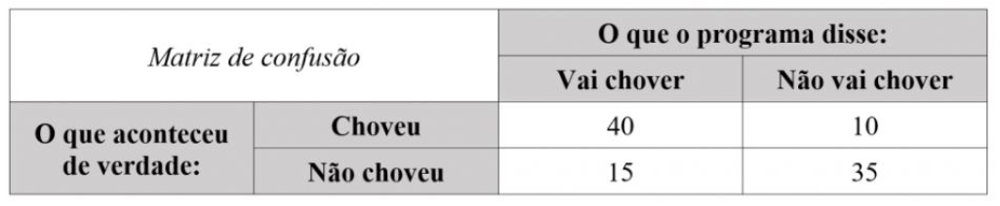
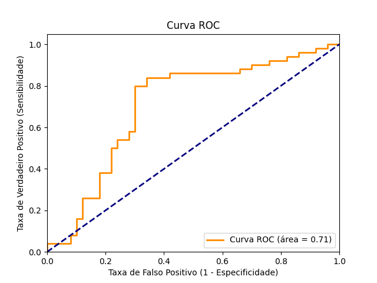

# Cálculo de Métricas de Avaliação de Aprendizado - Desafio 3
 
Olá, este é o meu repositório para o terceiro desafio do bootcamp "BairesDev - Machine Learning Training" da Dio.me! 


<br>

## Entendendo o Problema

Neste laboratório do prof. Diego Renan, o objetivo é estudar de perto a aplicação das principais métricas para a avaliação da eficiência de modelos de machine learning, o que em geral representa avaliar de forma quantitativa, através de métricas, quão eficiente, produtivo ou performático um modelo de machine learning se tornou.


Ainda com relação à operação de avaliação ou otimização dos processos de machine learning, como foi visto ao longo das aulas desta unidade do curso, o prof. Renan explica que em meio à tarefa de se construir modelos para **machine learning**, não bastaria apenas a realização de um esforço da aplicação de recursos computacionais, como o uso de algoritmos e de ferramentas ou de linguagens de programação, para a implementação de processos relacionados ao aprendizado de máquina.


Nesse sentido, seria preciso também avaliar para garantir que todos esses esforços computacionais aplicados foram capazes de retornar não apenas resultados corretos, mas em uma escalada que pudesse justificar definir tal projeto com realmente bem sucedido! 


Para tanto, esse processo de avaliação ou **Otimização** se utiliza de métricas para avaliar e determinar o quão bem sucedido um projeto se tornou ou deveria se tornar.


Ou seja, nos termos de se avaliar e de mensurar modelos e projetos de machine learning com o foco em **otimização**, não bastaria a definição de um projeto ou modelo de ML que funcione, mas que seria sim necessário que em seu funcionamento, um modelo ou operação de machine learning pudesse alcançar os padrões quantitativos definidos pelas métricas de otimização:
   

No curso, as **métricas**, então, são seriam definidas como:

> [!IMPORTANT]   
>  "medidas quantificáveis usadas para analisar o resultado de um processo, ação ou estratégia. De maneira geral, são medidas de desempenho" (prof. Diego Renan)


Como visto, então, nesta definição acima, o foco do cálculo de métricas para avaliação de um processo de machine learning é pegar modelos que já estão prontos e em funcionamento para testar e avaliar o seu desempenho, bem como responder questões relacionadas à qualidade da entrega de resultados que estão sendo feitas por aquela processo de machine learning. 


E para agregar e reunir todo o conjunto de métricas, o prof. Renan definiu como ferramenta a ser utilizada a **Matriz de Confusão**, que se trata de uma ferramenta visual que faz o contraste em os valores de erros e de acertos do modelo de machine learning em quaro categorias:

1. **Verdadeiro Positivo (VP)**: tratam se de todas as ocorrências/resultados em que o modelo de ML respondeu/previu corretamente de forma positiva um evento (ou seja, afirmar o pertencimento a uma classe ou categoria). 
2. **Verdadeiro Negativo (VN)**: tratam se de todas as ocorrências/resultados em que o modelo de ML respondeu/previu corretamente de forma negativa um evento (ou seja, afirmar o não pertencimento a uma classe ou categoria).
3. **Falso Positivo (FP)**: tratam de todas as ocorrências/resultados em que o modelo de ML respondeu/previu incorretamente de forma positiva um evento (ou seja, fazer a afirmação do pertencimento a uma classe ou categoria falsamente).
4. **Falso Negativo (FN)**: tratam-se de todas as ocorrências/resultados em que o modelo de ML respondeu/previu incorretamente de forma negativa um evento (ou seja, fazer a afirmação do não pertencimento a uma classe ou categoria falsamente).


Assim, uma vez definida a ferramenta a ser utilizada para reunir os resultados da avaliação, caberia também apresentar quais as métricas a se utilizar para a analisar e quantificar os dados que foram agregados, e nesse sentido, o prof. Renan definiu as seguintes métricas para esse projeto: 

1. **Sensibilidade**: essa métrica busca avaliar a capacidade do modelo de detectar os resultados positivos.
    - Sensibilidade = Verdadeiro Positivo / (Verdadeiro Positivo + Falso Negativo)  
2. **Especificidade**: essa métrica busca avaliar a capacidade do modelo de detectar os resultados negativos.
    - Especificidade = Verdadeiro Negativo / (Verdadeiro Negativo + Falso Positivo)
3. **Acurácia**: uma das métricas mais simples e mais importantes, que visa avaliar o percentual de acertos dos resultados:
    - Acurácia = Total de Acertos / Total de Itens, ou
    - Acurácia = (Verdadeiro Positivo + Verdadeiro Negativo) / Total de Itens
4. **Precisão**: busca avaliar a quatidade de Verdadeiros Positivos sobre a soma de todos os valores positivos.
    - Precisão = Verdadeiro Positivo / (Verdadeiro Positivo + Falso Positivo)
5. **F-Score**: também conhecido como **F-Measure** ou **F1**, trata-se de uma média harmônica calculada com base na **Precisão** e na **Sensibilidade**.
    

Finalmente, uma nota interessante sobre o uso ou a escolha de todas essas métricas poderia ser vista de forma prática nos seguintes exemplos:

- Num modelo de machine learning voltado para operações bancárias em caixas eletrônicos, quando a operação mais importante a ser feita é de se evitar que pessoas estranhas ou erradas fizessem transações bancárias, uma métrica preferencial a ser escolhida para avaliar esse modelo deveria se preocupar principalmente em afastar a ocorência de **falso positivo**, ou seja, que é quando o modelo analisaria equivocadamente como usuário válido um usuário que não é o verdadeiro possuidor da contacorrente.
    - Ou seja, neste caso, o modelo vai preferir reconhecer os casos em que pode fazer o reconhecimmento com absoluta precisão, evitando quaisquer valores de **falso positivo** para afastar a possibilidade de fazer falsos reconhecimentos, mesmo que isso pudesse significar que por vezes um usuário correto ou verdadeiro fosse impedido de acessar uma transação bancária por não ter podido ser identificado com a máxima precisão. 
- Do outro lado, contrastando o modelo anterior, em uma aplicação de machine learning voltada para o reconhecimento de sinais de trânsito em veículos não tripulados, esta aplicação deveria preferir o uso de métricas capazes de privilegiar a análise de valores de **falso positivos**, isto porque seria melhor gastar recursos analisando informamções desnecessárias, do que correr o risco de deixar passar informações vitais para o funcionamento do sistema.
    - Ou seja, que no caso no veículo não tripulado, é mais importante que o modelo foque em ressaltar a ocorrência de um perigo, mesmo que ele pudesse não existir de fato ou em realidade, do que deixar passar uma situação de perigo sem ser dado um alerta ou feita a análise.
 


<br>

## Construindo o Projeto

Neste projeto, então, que tem como objetivo central calcular várias métricas comumente utilizizadas para a avaliação de modelos de machine learning, foi escolhida para exemplo de uso, a seguinte **matriz de confusão**, ela que reune e agrega de forma exemplificativa possíveis resultados de previsões de tempo, que poderiam ter sido feitos por modelos de ML em operação: 

 


Coletando as informações descritas na tabela acima, então, temos:

1. **Verdadeiros Positivos**: 40
2. **Verdadeiros Negativos**: 35
3. **Falsos Positivos**: 15
4. **Falsos Negativos**: 10


<br>

### Cálculo da Sencibilidade

- Sensibilidade = Verdadeiro Positivo / (Verdadeiro Positivo + Falso Negativo) 

> [!NOTE]   
> Sensibilidade = 40 / (40 + 10) = 0.8


<br>

### Cálculo da Especifcidade

- Especificidade = Verdadeiro Negativo / (Verdadeiro Negativo + Falso Positivo)

> [!NOTE]   
> Especificidade = 35 / (35 + 15)  = 0.7


<br>

### Cálculo da Acurácia

Acurácia = (Verdadeiro Positivo + Verdadeiro Negativo) / Total de Itens

> [!NOTE]   
> Acurácia = (40 + 35) / (40 + 35 + 15 + 10) = 0.75


<br>

### Cálculo da Precisão

- Precisão = Verdadeiro Positivo / (Verdadeiro Positivo + Falso Positivo)

> [!NOTE]   
> Precisão = 40 / (40 + 15) = 0.73 


<br>

### Cálculo do F-Score (F-Measure ou F1) 

- f1 = 2 * ((Precisão * Sensibilidade)  / (Precisão + Sensibiliade)) 

> [!NOTE]   
> f1 = 2 * ((0.73 * 0.8) / (0.73 + 0.8)) ~= 0.76 


<br>

## Outros links:

 - [linkedin:] https://www.linkedin.com/in/marcus-vinicius-richa-183104199/
 - [Github:] https://github.com/ahoymarcus/
 - [My Old Web Portfolio:] https://redux-reactjs-personal-portfolio-webpage-version-2.netlify.app/


<br>

### Automatizando o Projeto com Python

No trabalho de avaliação simulado acima, fora feito todo ele manualmente, o que não haveria de ser a realidade dos projetos de machine learning nos dias de hoje, bem como não seria o indicado pelas **Boas Práticas** por ficar mais propenso a erros e por dificultar tanto a gestão da tarefa de avaliação, bem como de sua visualização e até de poder escalá-la para o futuro.


Abaixo, temos outra simulação, de como aqueles dados obtidos através de uma Matriz de Confusão poderiam gerar um projeto de avaliação de um modelo de machine learning automatizado pela linguagem Python: 

```
import numpy as np
from sklearn.metrics import confusion_matrix, accuracy_score, precision_score, recall_score, f1_score, roc_curve, roc_auc_score
import matplotlib.pyplot as plt

# Valores de teste para a Matriz de Confusão
y_verdadeiro = np.array([1]*50 + [0]*50) # 50 vezes que "choveu" (1) e 50 que "não choveu" (0)
y_previsoes = np.array([1]*40 + [0]*10 + [1]*15 + [0]*35) # Previsões feitas pelo modelo hipotético


# 1. Calcular a Matriz de Confusão
cm =  confusion_matrix(y_verdadeiro, y_previsoes)
print("Matriz de Confusão: \n", cm)
print("-" * 30)

# 2. Calcular as Métricas
acuracia = accuracy_score(y_verdadeiro, y_previsoes)
sensibilidade = recall_score(y_verdadeiro, y_previsoes)
especificidade = cm[0,0] / (cm[0,0] + cm[0,1]) # Cálculo manual
precisao = precision_score(y_verdadeiro, y_previsoes)
f1 = f1_score(y_verdadeiro, y_previsoes)

print(f"Acurácia: {acuracia:.2f}")
print(f"Sensibilidade (Recall): {sensibilidade:.2f}")
print(f"Especificidade: {especificidade:.2f}")
print(f"Precisão: {precisao:.2f}")
print(f"F1-Score: {f1:.2f}")
print("-" * 30)

# 3. Gerar a Curva ROC
# Para o gráfico, é necessário as probabilidades ou pontuações do modelo
# Simular as probabilidades do modelo
y_probabilidades = np.concatenate([np.random.uniform(0.6, 0.9, 40), # VP: Prob. alta para chuva
                                    np.random.uniform(0.1, 0.4, 10), # FN: Prob. baixa para chuva
                                    np.random.uniform(0.6, 0.9, 15), # FP: Prob. alta para chuva
                                    np.random.uniform(0.1, 0.4, 35)]) # VN: Prob. baixa para chuva

fpr, tpr, thresholds = roc_curve(y_verdadeiro, y_probabilidades)
roc_auc = roc_auc_score(y_verdadeiro, y_probabilidades)

plt.figure()
plt.plot(fpr, tpr, color='darkorange', lw=2, label=f'Curva ROC (área = {roc_auc:.2f})')
plt.plot([0, 1], [0, 1], color='navy', lw=2, linestyle='--')
plt.xlim([0.0, 1.0])
plt.ylim([0.0, 1.05])
plt.xlabel('Taxa de Falso Positivo (1 - Especificidade)')
plt.ylabel('Taxa de Verdadeiro Positivo (Sensibilidade)')
plt.title('Curva ROC')
plt.legend(loc="lower right")
plt.show()
```


Dois pontos interessantes de se notar no código Python proposto aciam:

1. Que o Python não possui uma métrica padronizada para o cálculo da **Especificidade**, de modo que fora necessário fazer o cálculo manualmente através da referência dos índices com as posições dos valores na matriz:

```
especificidade = cm[0,0] / (cm[0,0] + cm[0,1])
``` 

2. Que para gerar o gráfico da **Curva ROC** em um projeto real, seria preciso contar com as **probabilidades** ou **pontuações do modelo**, de forma que para contornar essa questão, fora usado o método random.uniform() da biblioteca NumPy para gerar valores aleatórios:

```
y_probabilidades = np.concatenate([np.random.uniform(0.6, 0.9, 40), # VP: Prob. alta para chuva
                                    np.random.uniform(0.1, 0.4, 10), # FN: Prob. baixa para chuva
                                    np.random.uniform(0.6, 0.9, 15), # FP: Prob. alta para chuva
                                    np.random.uniform(0.1, 0.4, 35)]) # VN: Prob. baixa para chuva
```    


De resto, como podemos ver no script Python que simula essa tarefa de avaliação dos resultados de um modelo de machine learning, inclusive com a construção da Curva de ROC, que o ecossistema de bibliotecas e métodos da linguagem provê uma grande quantidade de recusos prontos e bastante testados pela comunidade.


Assim, com relação ao que poderia ser o resultado prático da simulação oferecido pelo script acima, temos:

```
Matriz de Confusão:
 [[35 15]
 [10 40]]
------------------------------
Acurácia: 0.75
Sensibilidade (Recall): 0.80
Especificidade: 0.70
Precisão: 0.73
F1-Score: 0.76
------------------------------
``` 

E para o gráfico da Curva de ROC, já levando em conta que ele é gerando usando valores randômicos para as probabilidades ou pontuações do modelo, de forma que a cada nova execução ele seria renderizado de forma diferente:




<br>

## Outros links:

 - [linkedin:] https://www.linkedin.com/in/marcus-vinicius-richa-183104199/
 - [Github:] https://github.com/ahoymarcus/
 - [My Old Web Portfolio:] https://redux-reactjs-personal-portfolio-webpage-version-2.netlify.app/


