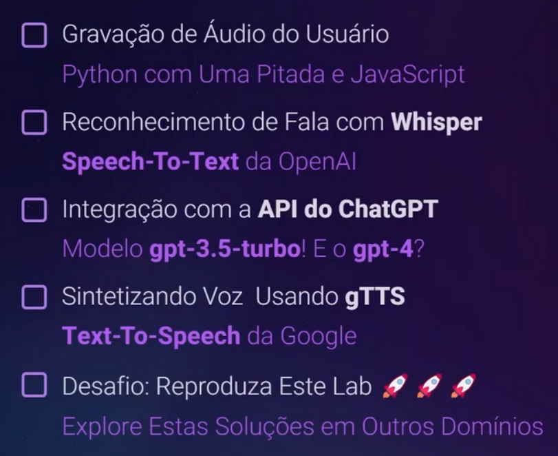

# Conversando por Voz Com o ChatGPT Utilizando Whisper (OpenAI) e Python - desafio 2
 
Olá, este é o meu repositório para o segundo desafio do bootcamp "Bradesco - GenAI & Dados" de 2025-2026, da Dio.me! 

<br>

## Entendendo o Problema

Neste segundo laboratório do curso, o professor Venilton Falvo Jr. propõe a criação de uma aplicação de IA integrando alguns módulos ou recursos tanto da OpenAI, quanto da Google, para ao final criar uma aplicação completa de IA.


Assim, ao final desse percurso, essa aplicação deveria ser capaz de realizar um reconhecimento de fala do usuário, para depois fazer uma chamada a um modelo de IA capaz de sintetizar o áudio de input para texto, para depois levar este resultado para um agente de chat de IA, para, ao final, transformar a resposta retornada pelo chat novamente em um áudio para o usuário:




<br>

Portanto, observando o que foi proposto acima pelo professor, precisamos passar pelos seguintes passos ou recursos para alcançarmos nossos objetivos:

- **[Colab](https://colab.research.google.com/drive/1rHGq5N-sbEGtZsNUiQFT8q60BhRbj99b?usp=sharing)**: uso o ambiente da Google para rodar a aplicação.
- **Python**: uso da linguagem Python para modelar a parte principal da aplicação.
- **JavaScript**: uso do JS para resolver questões pontuais do problema.
- **Whisper**: tecnologia de reconhecimento automático de dala da OpenAI.
- **Chat GPT**: modelo de IA da OpenAI.
- **gTTS**: ou Google Text-To-Speech, que é uma solução da Google para sintetizar entradas de texto em voz.


<br>

## Preparando o Ambiente do Google Colab

Este projeto, então, procura se aproveitar de toda a flexibilidade de recursos existente no ambiente da nuvem Google, especialmente com o uso do seu ambiente Colab, que é capaz de rodar numa aplicação web a linguagem Python, além de ser capaz de acessar todo o Google Drive por usando Bash, que é a linguagem própria do Linux.


Assim, no seu Colab, o prof. Venilton começa criando uma variável para guardar a definição do idioma com o qual o modelo estará trabalhando, no caso o português. E na sequência, ele usa uma biblioteca do Python capaz de enviar para o browser chamadas em JavaScript, para que este realizasse a operação de gravar audio, acessando o microfone, devolvendo o resultado logo a seguir:

```
# Referência: https://gist.github.com/korakot/c21c3476c024ad6d56d5f48b0bca92be

from IPython.display import Audio, display, Javascript
from google.colab import output
from base64 import b64decode

# Código JavaScript para gravar áudio do usuário usando a "MediaStream Recording API"
RECORD = """
const sleep  = time => new Promise(resolve => setTimeout(resolve, time))
const b2text = blob => new Promise(resolve => {
  const reader = new FileReader()
  reader.onloadend = e => resolve(e.srcElement.result)
  reader.readAsDataURL(blob)
})
var record = time => new Promise(async resolve => {
  stream = await navigator.mediaDevices.getUserMedia({ audio: true })
  recorder = new MediaRecorder(stream)
  chunks = []
  recorder.ondataavailable = e => chunks.push(e.data)
  recorder.start()
  await sleep(time)
  recorder.onstop = async ()=>{
    blob = new Blob(chunks)
    text = await b2text(blob)
    resolve(text)
  }
  recorder.stop()
})
"""

def record(sec=5):
  # Executa o código JavaScript para gravar o áudio
  display(Javascript(RECORD))
  # Recebe o áudio gravado como resultado do JavaScript
  js_result = output.eval_js('record(%s)' % (sec * 1000))
   # Decodifica o áudio em base64
  audio = b64decode(js_result.split(',')[1])
  # Salva o áudio em um arquivo
  file_name = 'request_audio.wav'
  with open(file_name, 'wb') as f:
    f.write(audio)
  # Retorna o caminho do arquivo de áudio (pasta padrão do Google Colab)
  return f'/content/{file_name}'

# Grava o áudio do usuário por um tempo determinado (padrão 5 segundos)
print('Ouvindo...\n')
record_file = record()

# Exibe o áudio gravado
display(Audio(record_file, autoplay=False))
```


Vemos que as instruções em JS são chamadas pelo Python (Colab) na forma de texto, sendo o seu resultado recebido pela variável **js_result**, que por sua vez tem o seu resultado devidamente decodificado usando uma outra **biblioteca do Python para audio**: **b64decode(js_result.split(',')[1])**


Nesse script simples, o resultado enviado pelo browser é separado usando uma vírgula como separador e escolhendo o conteúdo presente na segunda posição da lista resultante, que é justamente o valor de áudio que fora codificado para envio!


Finalmente, o resultado do projeto de decofificação do áudio recebido do browser é gravado em arquivo e, por meio do uso da **biblioteca Display do Python**, é possível ouvir o áudio recém gravado...


Observe, que no caso do teste feito com o meu notebook, a mensagem dita, **"Teste de audio com o Colab"**, ela foi gravada corretamente, porém levando em consideração alguns ruídos, provavelmente em função da qualidade do meu microfone!!! :)

 
<br>

### Integrando as Funcionalidades de IA

O professor Venilton inicia esta segunda parte do laboratório integrando a primeira aplicação IA para o projeto, que é justamente com a instalação da biblioteca do **Whisper** para o Python:

```
!pip install git+https://github.com/openai/whisper.git -q 

import whisper

# Selecione o modelo do Whisper que melhor atenda às suas necessidades:
# https://github.com/openai/whisper#available-models-and-languages
model = whisper.load_model("small")

# Transcreve o audio gravado anteriormente.
result = model.transcribe(record_file, fp16=False, language=language)
transcription = result["text"]
print(transcription)
```


Assim, no código acima, primeiro a biblioteca do Whisper é instalada, e depois o prof. Venilton configura a versão e o tipo do modelo de IA escolhido para realizar a operação, fazendo tudo isso enquanto passa aquela mesma variável criada anteriormente de áudio, sendo que o resultado da transcriçao feita pela IA foi este a seguir:

```
Teste de áudio com colada.
```


Assim, podemos ver acima que a IA foi capaz de reconhecer quase perfeitamente o áudio de 5 segundos enviado! E que, possivelmente em função da brevidade do conteúdo do áudio e da falta de outras informações adicionais, ele não tenha sido capaz de referenciar o contexto da ferramenta do Colab do Google? Ou talvez ele tenha tido algumas dificuldades com ruídos do áudio, mas seja como for, podemos ver que o teste em si mesmo foi mais do que bem sucedido!!! :) 


<br> 

Na sequência do laboratório, o objetivo do professor Venilton é repassar o texto transcrito pelo Whisper para o agente de IA da OpenAI, o **ChatGPT**, que para tanto, pode ser integrado para o ambiente do Colab a partir da biblioteca **openai** e pela passagem de uma chave de acesso que pode ser conseguida acessando-se o site da OpenAI:

```
!pip install openai

import os

# Documentação Oficial da API OpenAI: https://platform.openai.com/docs/api-reference/introduction
# Informações sobre o Período Gratuito: https://help.openai.com/en/articles/4936830

# Para gerar uma API Key:
# 1. Crie uma conta na OpenAI
# 2. Acesse a seção "API Keys"
# 3. Clique em "Create API Key"
# Link direto: https://platform.openai.com/account/api-keys

# Substitua o texto "TODO" por sua API Key da OpenAI, ela será salva como uma variável de ambiente.
os.environ['OPENAI_API_KEY'] = 'TODO'
```


E, logo depois, importamos a biblioteca da **openai** instalada, para podermos passar a chave de acesso ao modelo do Chat GPT, configurar qual a versão do modelo usar, passando ainda, na forma de um JSON, um prompt contendo uma definição para o comportamento do modelo de IA e a transcrição do áudio feita pela ferramenta Whisper:

```
import openiai

# Configura a chave de API da OpenAI usando a variável de ambiente 'OPENAI_API_KEY'
openai.api_key = os.environ.get('OPENAI_API_KEY')

# Envia uma requisição à API do ChatCompletion usando o modelo GPT-3.5 Turbo
# Lembrando que, a variável 'transcription' contém a transcrição do nosso áudio.
response = openai.ChatCompletion.create(
    model="gpt-3.5-turbo" # "gpt-4"
    messages=[{ "role": "user", "content": transcription }]
)

# Obtém a resposta gerada pelo ChatGPT
chatgpt_response = response.choices[0].message.content
print(chatgpt_response)
```


<br>

O último passo, então, é integrar também a ferramenta do **Google Text-To-Speech**, para que agora possamos repassar a resposta devolvida pelo ChatGPT no passo anterior e ouvir a sintetização do áudio criado, então, pela ferramenta do Google, a **gTTS**:

```
!pip install gTTS

from gtts import gTTS

# Cria um objeto gTTS com a resposta gerada pelo ChatGPT e a língua que será sintetizada em voz (variável "language").
gtts_object = gTTS(text=chatgpt_response, lang=language, slow=False)

# Salva o áudio da resposta no arquivo especificado (pasta padrão do Google Colab)
response_audio = "/content/response_audio.wav"
gtts_object.save(response_audio)

# Reproduz o áudio da resposta salvo no arquivo
display(Audio(response_audio, autoplay=True))
```


<br>

## Outros links:

 - [linkedin:] https://www.linkedin.com/in/marcus-vinicius-richa-183104199/
 - [Github:] https://github.com/ahoymarcus/
 - [My Old Web Portfolio:] https://redux-reactjs-personal-portfolio-webpage-version-2.netlify.app/


