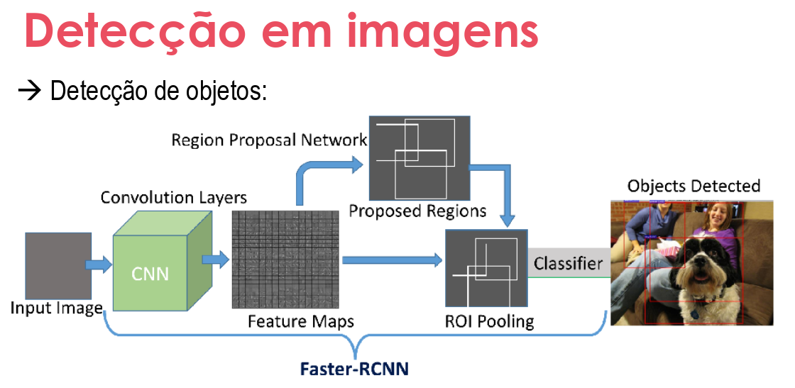
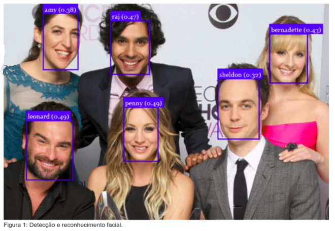
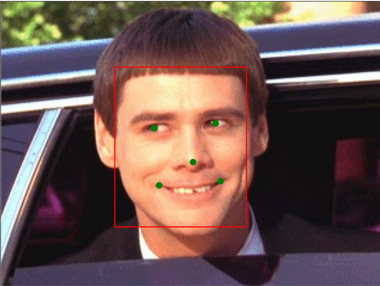
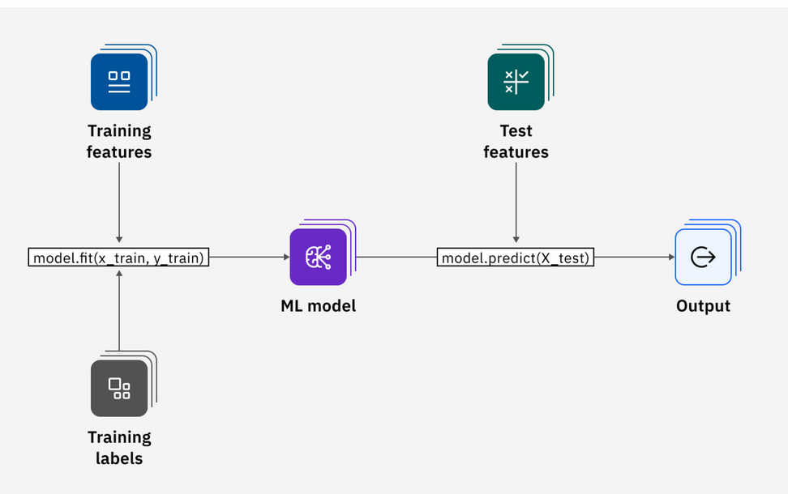

# Criando Um Sistema de Reconhecimento Facial do Zero - Desafio 5
 
Olá, este é o meu repositório para o quinto desafio do bootcamp "BairesDev - Machine Learning Training" da Dio.me! 

<br>

## Entendendo o Problema

Neste laboratório do prof. Diego Renan, o objetivo é criar um sistema de detecção e de classificação de imagem utilizando o framework **TensorFlow**, em conjunto com as bibiliotecas Python necessárias para se alcançar o resultado pretendido:

1. Criar um modelo de detecção treinada para detectar faces.
2. Utilizar uma rede de classificação para classificar a face detectada.


Finalmente, tendo apresentado acima os requisitos definidos pelo professor para o desafio/laboratório, e considerando que este quinto desafio do curso, "BairesDev - Machine Learning Training", se insere dentro do sexto módulo das disciplinas, "Frameworks de Deep Learning", o qual tem justamente aquele framework **TensorFlow** como elemento central, decidimos, então, começar a entender esse problema bucando conhecer um pouco mais sobre esta ferramenta e como ela se integração com as demais bibliotecas, recursos e funcionalidades do ecossoistema Python para se alcançar os resultados almejados neste trabalho.


<br>

## O Framework _TensorFlow_

O primeiro ponto a ser notado é que, enquanto algumas referências parecem tratar o **TensorFlow** como sendo mais uma biblioteca para machine learning, outras parecem tratá-lo de um modo mais abrangente como sendo uma ferramente, enquanto que no site de sua mantenedora [Tensorflow.org](https://www.tensorflow.org/?hl=pt-br) ele chega mesmo a ser tratado como sendo uma "plataforma completa" de machine learning.


De qualquer forma, a plataforma do [tensorflow.org](www.tensorflow.org) apresenta um Notebook Colab para um teste rápido dessa experiêcia com o uso do TensorFlow que basicamente roda o seguinte código:

```
import tensorflow as tf
mnist = tf.keras.datasets.mnist

(x_train, y_train),(x_test, y_test) = mnist.load_data()
x_train, x_test = x_train / 255.0, x_test / 255.0

model = tf.keras.models.Sequential([
  tf.keras.layers.Flatten(input_shape=(28, 28)),
  tf.keras.layers.Dense(128, activation='relu'),
  tf.keras.layers.Dropout(0.2),
  tf.keras.layers.Dense(10, activation='softmax')
])

model.compile(optimizer='adam',
  loss='sparse_categorical_crossentropy',
  metrics=['accuracy'])

model.fit(x_train, y_train, epochs=5)
model.evaluate(x_test, y_test)
``` 


Acima, mesmo nesse pequeno exemplo de entrada para o recurso, realmente vemos o que parece ser uma presença marcante do TensorFlow através de vários do que poderíamos chamar de **"Ciclo de Vida do machine learning"**:

1. O TensorFlow é chamado (ou ativado) como qualquer outra biblioteca Python através de um import padrão.
2. Que o TensorFlow realiza uma função de "alto nível" para acessar um conjunto de dados do **MNIST** utilizando-se de uma outro funcionalidade Python, a **Keras** (biblioteca de alto nível desenvolvida sobre Theano e TensorFlow - [databricks.com/br/glossary/keras-model](www.databricks.com/br/glossary/keras-model):   
    2.1. No glossário de Databricks.com, **Keras** é tratado como uma API para a criação de camadas e de arquiteturas de Deep Learning e Redes Neurais, de modo que parece ficar claro que em meio aquela simples chamada de alto nível feita pelo TensorFlow para o banco de dados **MNIST**, ele estaria gerenciando conexões tanto com a API do Keras, quanto com o banco de dados do **MNIST**.
3. Depois, novamente acionando a API do Keras, o TensorFlow faz uma chamada para a construção do que parece ser um "modelo sequencial" de machine learning.
4. Mas a gestão do TensorFlow não parece ter acabado, porque através do controle exercido por sobre a variável **model** o TensorFlow também realizaria o treinamento do modelo.
5. Para na sequência, ainda com o controle da variável **model** avaliar o modelo criado, calculando a sua acurácia.


Assim, parece mesmo que atrevés dessa pequena experiência introdutória apresentada no tutorial do site do TensorFlow, "[TensorFlow 2 início rápido para iniciantes](https://www.tensorflow.org/tutorials/quickstart/beginner?hl=pt-br)", com o treino de um pequeno modelo de classificação de imagens, que este recurso chamado de TensorFlow parece cumprir tudo aquilo que dele era esperado ao começo da experiência, isto é:

1. Que ele integraria toda a aplicação Python como a mesma naturalidade e a mesma flexibilidade de qualquer outra biblioteca da linguagem.
2. Que uma vez acionado ele desencadearia a chamada de diferentes recursos relacionados à operação de machine learning (acesso aos dados, construção do modelo, treinamento do modelo e avaliação do modelo), como é esperado de ferramentas digitais em geral, e neste caso específico, de uma ferramenta de machine learning.
3. Que ele também realizaria operações ou agiria como uma espécie de "recurso de gestão e controle" para outros recursos ainda, tal qual fora feito ao se utilizar de chamadas à API Keras de Deep Learning para gerenciar as etapas de acesso aos dados do MNIST e para a construação do modelo de detecção de imagens, tal qual se poderia esperar de uma **Plataforma de Desenvolvimento Completa** para machine learning.


<br>

## Construindo um Modelo de Detecção e Classificação Facial

Inicialmente, antes mesmo de se considerar o objeto deste desafio em questão, talvez fosse interessante retornar um pouco aquele ponto feito mais acima acerca do **Ciclo de Vida do Machine Learning**, isto porque, quando ainda falávamos da sequência de operações realizadas pelo framework TensorFlow, seria importante de se considerar também se haveria a necessidade de passos ou etapas para a realização de certas operações.


Assim, por exemplo, quando anteriormente, quando descrevíamos sobre a forma de operação daquele script de tutorial provido pela organização da ferramenta TensorFlow, foram colocadas como etapas iniciais, isto é, nas etapas 'I' e 'II' respectivamente que "o TensorFlow é chamado (ou ativado) como qualquer outra biblioteca Python" e que "o TensorFlow realiza uma função de 'alto nível' para acessar um conjunto de dados".


Nesse caso, fica fácil de observar que inclusive as "Boas Práticas" preconizam e determinam que a chamada de bibliotecas, ferramentas e variáveis globais de um projetos deveriam ser logo ao início de uma implementação. Ademais, podemos observar também a necessidade de que em projetos que envolvem processos análise de dados e da construção de modelos sobre bases integradas de dados, que estes dados deveriam não apenas ser integrados previamente a qualquer operação que deles pudesse depender, mas que esses dados também deveriam ser tratados da forma necessárias para que deles se pudesse extrair as melhores análises, os mais corretos modelos e as mais claras decisões, etc.


Nesse mesmo sentido, voltando ao objeto deste desafio, observamos que é pedido em questão, parece ter um caráter não apenas complexo, no sentido de se exigir a construção de um modelo de dados para a predição de eventos, mas que nesse caso envolve também uma multiplicidade ou sequencialidade de operações, haja vista que em termos da arquitetura de tal operação, os passos necessários para se conseguir chegar ao objetivo definido, um **"ato"** de detecção haveria de preceder qualquer ou **"fato"** a ser predito ou classificado!


Seja como for, o prof. Renan ao longo do curso teria feito essa observação, de que em um modelo de **Detecção e Classificação Facial**, haveria um aspecto bastante peculiar a este problema porque, enquanto operação bastante especializada da área de machine learning, tal modelo de dados precisa primeiramente detectar objetos presentes em uma imagem, fazer a marcação dos objetos encontrados em uma imagem, fazer o mapeamento de suas posições de maneira individualizada, para só ao final poder levar à frente a tarefa de predizer qual a classificação de cada um daqueles objetos que foram encontrados e marcados.




<br>

A imagem acima foi tirada do material do curso do prof. Renan, e mostra justamente o ciclo de trabalhos necessários que precisam ser feitos sobre uma imagem em uma operação de **detecção e classificação** de imagens ou faces, em que primeiramente é preciso serem detectados e marcardos todos os objetos encontrados dentro de uma imagem com as chamadas linhas de **bounding boxes**, para só ser possível proceder à classificação de cada objeto detectado na imagem:




> [!IMPORTANT]
> Requisitos principais para o modelo: que por meio da Figura 1 é possível visualizar o resultado esperado para o modelo proposto, devendo detectar e reconhecer mais de uma face ao mesmo tempo:     
> 1. Utilizar uma rede de detecção treinada para detectar faces.   
> 2. Utilizar uma rede de classificação para classificar a face detectada.   


<br>

Observando, então, a complexidade de operações relacionadas a este desafio de machine learning, que é o de construir um modelo para **detectar e classificar** faces, pensamos então em trabalhar o problema de acordo com a seguinte estrutura:

- Simplificar o projeto o máximo possível, tentando dividí-lo em dois módulos mais simples, para dentro do possível, um módulo ou modelo voltado para a **Detação de Faces** e um módulo ou modelo ainda mais simples, voltado apenas para analisas imagens, no caso, imagens de faces, para realizar a sua predição.


Nesse sentido, pensou-se na utilização das seguintes arquiteturas:

1. O uso do modelo **[MTCNN](https://github.com/ipazc/mtcnn)**, que é um modelo pré-treinado e especializado em reconhecimento facial.
2. A utilização de um modelo básico para a classificação final das imagens detectadas e mapeadas na etapa anterior. 


<br>

### O Modelo MTCNN para a Detecção de Imagens Faciais

Iván de Paz Centeno é Ph.D em inteligência artificial e Chief AI Officer na organização SMARKIA, que mantém em seu Github um ótimo teste para a biblioteca **MVCNN (Multi-Task Cascaded Convolutional Networks)**, um projeto que ele leva à frente juntamente com outros inúmeros desenvolvedores e apoiadores.


Assim, enquanto que a configuração do projeto de teste pede a instalação da biblioteca **MTCNN**, ela também pede a integração com a ferramenta **TensorFlow**:

```
pip install mtcnn
pip install mtcnn[tensorflow]
```


Já com relação à imagem para ser detectada e o código de teste para essa operação, temos:


<br>

```
from mtcnn import MTCNN
from mtcnn.utils.images import load_image

# Criar uma instância do detector
detector = MTCNN(device="CPU:0")

# Carregar uma imagem
image = load_image("lloyd.jpg")


result = detector.detect_faces(image)
print(result)
``` 


Neste script de teste vemos a importação da biblioteca 'mtcnn', bem como de um utilitário para o carregamento da imagem para a detecção, de forma que com a instanciação do modelo para detecção, temos o resultado do mapeamento das posições:

```
[
    {
        'box': [191, 110, 221, 268], 
        'confidence': np.float64(0.9949396848678589), 
        'keypoints': {
            'nose': [np.int64(323), np.int64(270)], 
            'mouth_right': [np.int64(369), np.int64(302)], 
            'right_eye': [np.int64(361), np.int64(205)], 
            'left_eye': [np.int64(258), np.int64(213)], 
            'mouth_left': [np.int64(266), np.int64(309)]
        }
    }
]
```


E com algumas modificações ao código de teste do prof. Iván Centeno, podemos imprimir a saída visual para a composição da imagem sobreposta com os valores de referência mapeados:




<br>

# O Modelo FaceNet para a Classificação das Imagens Faciais

A **FaceNet** é uma rede neural de reconhecimento faial desenvolvida pelo Google e que se utiliza de **representação vetorial (embedding) de alta qualidade de rostos**, de modo que, segundo a ferramenta de pesquisa da própria Google, ela permitiria realizar tarefas como:

1. Reconhecimento
2. Verificação
3. Agrupamento de faces


Diz ainda a plataforma que a rede neural **"mapeia imagens de rostos para um espaço euclidiano onde a distância entre os vetores reflete a similaridade entre os rostos"**.

```
import os
import cv2
import numpy as np
from mtcnn.mtcnn import MTCNN
from keras_facenet import FaceNet

# Iniciar modelos
detector = MTCNN()
facenet = FaceNet()

def extract_faces(filename, required_size=(160, 160)):
    image = cv2.imread(filename)
    if image is None:
        return None
    image = cv2.cvtColor(image, cv2.COLOR_BGR2RGB)

    # Deteacção da face
    results = detector.detect_faces(image)
    if not results:
        return None

    # Pegar o primeiro rosto detectado (geralmente o mais proeminente)
    x, y, width, height = results[0]['box']
    face = image[y:y+height, x:x+width]

    # Redimensionar a face para o tamanho padrão da FaceNet
    face = cv2.resize(face, required_size)
    return face

def load_faces(directory):
    faces = []
    for filename in os.listdir(directory):
        path = os.path.join(directory, filename)
        face = extract_faces(path)
        if face is not None:
            faces.append(face)
    return faces

def load_dataset(directory):
    x, y = [], []
    for subdir in os.listdir(directory):
        path = os.path.join(directory, subdir)
        if not os.path.isdir(path):
            continue

        # Carregar todas as faces do diretório
        faces = load_faces(path)

        # Criar os embeddings para cada face
        for face in faces:
            embedding = facenet.embeddings(np.expand_dims(face, axis=0))
            x.append(embedding[0])
            y.append(subdir) # O nome da subpasta é o rótulo

    return np.array(x), np.array(y)

# Diretório do connjunto de imagens
dataset_path = '../dataset'

# Extrair os embeddings e os rótulos
print('Carregando e extraindo embeddings...')
x, y = load_dataset(dataset_path)

# Salvar os embeddings e os rótulos em arquivos .npy
np.save('embeddings.npy', x)
np.save('labels.npy', y)
print('Embeddings e rótulos salvos com sucesso!')
```


Acima, temos então uma continuação da operação iniciada com a biblioteca **MTCNN**, como um modelo especializado para trabalhar com imagens de face. A ele, então, foram adicionados os recursos do projeto **FaceNet** através da sua biblioteca para Python, **keras_facenet**, de modo que no código acima podemos logo depois das importações necessárias para o programa, vemos a instaciação desse dois modelos: **mtcnn** e **keras_facenet** 


Nesse sentido, junto aos dois modelos instanciado, são criadas três funções auxiliares (**load_dataset()**, **load_faces()** e **extract_faces()**) com a responsabilidade de criar uma operação completa para:

1. **Carregamento das imagens**: dataset de imagens a serem carregadas para o modelo de detecção e classificação.  
2. **Carregamento das faces**: cada imagem do dataset que é carregada e que precisa ser reencaminhada para o modelo final de treinamento, precisa ser devidamente preparada.
    2.1. Nesse sentido, de cada imagem, é detectada a face presente na imagem que é enviada para a próxima função.
3. **Extração das faces**: esta última função auxiliar recebe o mapeamento do posicionamento das faces para fazer a sua extração.
    3.1. As faces são, então, redimensionadas para o tamanho ideal de compatibilidade com o modelo **keras_facenet**, além de serem marcadas com os pontos e a linha demarcadoras das "bounding boxes" (como visto no teste acima com a imagem da personagem Lloyd de Jim Carey).


O resultado final desta etapa é a criação de dois arquivos com recursos objetidos das informações tratadas e mapeadas das imagens originais, sendo que esses recursos serão usados na próxima etapa quando haverá um treinamento para criar um novo modelo que vai aprender a distinguir entre os dois personagens do filme "Deb e Loid".


<br> 

# Treinando o Modelo de Classificação de Imagens de Faces com a Biblioteca Scikit-Learn

A biblioteca [Scikit-Learn](https://scikit-learn.org/stable/index.html) é um projeto do Google, iniciado em 2007, escrito em Python, tendo como substrato outras bibliotecas do ecossistema Python, como, NumPy, SciPy e Matplotlib. 


Assim, essa biblioteca que é voltada para o aprendizado de máquinas, traria como recursos, segundo o site [What is scikit-learn (sklearn)?](https://www.ibm.com/think/topics/scikit-learn) da **IBM**, as seguintes ferramentas:

- **Classificação**
- **Regressão**
- **Clustering**
- **Redução de dimensionalidade**


<br>



> "By leveraging scikit-learn's robust suite of pretrained neural networks and machine learning algorithms, newcomers to the field can quickly and effectively preprocess datasets for supervised learning applications, such as regression or classification. This step can be accomplished without needing an in-depth understanding of complex mathematical concepts such as linear algebra, calculus or cardinality. Additionally, these tools facilitate unsupervised learning processes including clustering and dimensionality reduction. These tools allow users to focus on higher-level insights and business value creation." [Scikit-Learn](https://scikit-learn.org/stable/index.html)


<br>

```
import numpy as np
from sklearn.model_selection import train_test_split
from sklearn.svm import SVC
from sklearn.metrics import accuracy_score
from sklearn.preprocessing import LabelEncoder
import joblib

# Carregar os embeddings e os rótulos salvos
x = np.load('embeddings.npy')
y = np.load('labels.npy')

# Codificar os rótulos de texto para números (ex: 'c1' -> 0, 'c2' -> 1)# Passo necessário para a maioria dos classificadores do scikit-learn
encoder = LabelEncoder()
y_encoded = encoder.fit_transform(y)

# Dividir dados: Treinamento e Teste
# 80% para Treino, e 20% para Teste
x_train, x_test, y_train, y_test = train_test_split(x, y_encoded, test_size=0.2, random_state=42)

# Inicializar e Treinar o modelo SVM
print("Treinando o classificador SVM...")
model = SVC(kernel='linear', probability=True)
model.fit(x_train, y_train)
print("Treinamento concluído!")

# Avaliar o desempenho do modelo nos dados de teste
print("Avaliando o modelo...")
y_pred = model.predict(x_test)
accuracy = accuracy_score(y_test, y_pred)
print(f'Acurácia do modelo: {accuracy * 100:.2f}%')

# Gravar o modelo treinado para uso   
joblib.dump(model, 'face_classifier.pkl')
joblib.dump(encoder, 'label_encoder.pkl')
print("Modelo e encoder salvos como 'face_classifier.pkl' e 'label_encoder.pkl'.")
```


Observando o código preparado acima, podemos ver de início a importância da biblioteca NumPy para o trabalho realizado pela biblioteca Scikit-Learn, especialmente com relação ao trabalho com arrays multidimensionais:

> "Numpy: A library that provides support for large, multi-dimensional arrays and matrices, along with a wide range of high-performance mathematical functions to manipulate them. It's a fundamental package for scientific computing in Python." [Scikit-Learn](https://scikit-learn.org/stable/index.html)


Assim, esta última estapa começa com a chamada da biblioteca NumPy para consumir os recursos criados na etapa anterior de **embeddings** e **labels** preparando duas variáveis que (**x**, **y**) que vão alimentar o modelo responsável por fazer o treinamento e posteriormente testar o resultado, para medir a **acurácia** do modelo que fora treinado:


```
# Inicializar e Treinar o modelo SVM
print("Treinando o classificador SVM...")
model = SVC(kernel='linear', probability=True)
model.fit(x_train, y_train)
print("Treinamento concluído!")

# Avaliar o desempenho do modelo nos dados de teste
print("Avaliando o modelo...")
y_pred = model.predict(x_test)
accuracy = accuracy_score(y_test, y_pred)
print(f'Acurácia do modelo: {accuracy * 100:.2f}%')
```


Observe que esta etapa acima é uma sequência complexa de operações, que se aproveita a arquitetura da operação construída que divide as imagens para treinamento da seguinte forma:

1. **80%**: Oitenta por cento das imagens são utilizadas para o treinamento do modelo, de modo a garantir o nível de predição desejado pelo sistema (valor este que pode variar dependendo da criticidade de uso do modelo de detecção e classificação).
    1.1. Lembrando que se tratam de duas categorias de imagens, temos: **x_train** e **y_train**.
2. **20%**: Vinte por cento das imagens são utilizadas para o teste: **x_test** e **y_test**. 


<br>

Finalmente, o script termina utilizando-se da biblioteca Python **joblib** para salvar o modelo de forma a permitir o seu reaproveitamento, caso desejado: 

```
# Gravar o modelo treinado para uso   
joblib.dump(model, 'face_classifier.pkl')
joblib.dump(encoder, 'label_encoder.pkl')
print("Modelo e encoder salvos como 'face_classifier.pkl' e 'label_encoder.pkl'.")
```


<br>

```
Treinando o classificador SVM...
Treinamento concluído!
Avaliando o modelo...
Acurácia do modelo: 94.74%
Modelo e encoder salvos como 'face_classifier.pkl' e 'label_encoder.pkl'.
```


<br>

## Outros links:

 - [linkedin:] https://www.linkedin.com/in/marcus-vinicius-richa-183104199/
 - [Github:] https://github.com/ahoymarcus/
 - [My Old Web Portfolio:] https://redux-reactjs-personal-portfolio-webpage-version-2.netlify.app/


