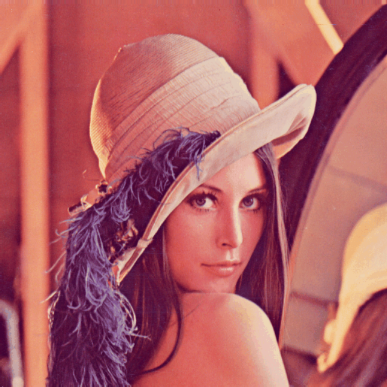
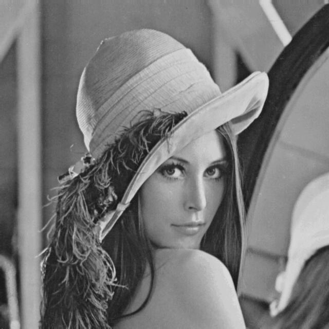
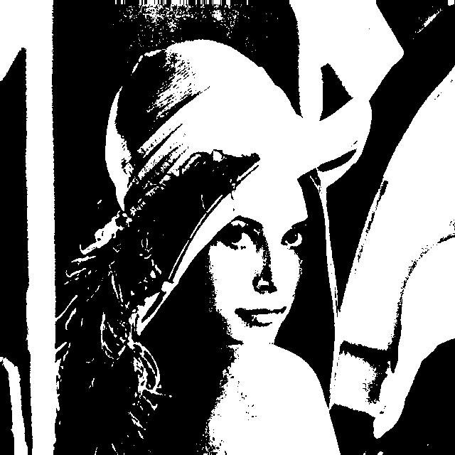

# Redução de Dimensionalidade em Imagens para Redes Neurais - Desafio 2
 
Olá, este é o meu repositório para o segundo desafio do bootcamp "BairesDev - Machine Learning Training" da Dio.me! 


<br>

## Entendendo o Problema

Neste laboratório do prof. Diego Renan, o objetivo é aplicar um método de tratamento sobre uma imagem digitalizada para a redução de suas características. No caso em questão, trata-se da redução do espectro de cores RGB para tons de cinza e depois reduzir novamente para um padrão binário de claro e escuro.


A ideia é de se realizar essa tarefa usando a linguagem Python e a imagem escolhida é a famosa imagem da atriz Lena, que fora na história, a primeira imagem digitalizada com sucesso, isso ainda nos anos de 1973.





Lembramos que em termos computacionais, uma imagem no padrão RGB possui três valores para cada pixel que é representado na imagem digital, ou seja, um valor específico para cada canal de cor: Vermelho, Verde e Azul.


Nesse sentido, ao se pensar na conversão de uma imagem colorida em RGB para Tons de Cinza, iremos passar de uma situação em que uma posição deixaria de ter um array ou vetor com três valores para cores, indo de 0 até 255 cada um, para ficar com apenas 1 valor por posição de uma matriz de dimensão simples, ou seja, de uma matriz de dimensão um, com valores indo de 0 a 255.


Já na segunda operação de redução de dimensionalidade ou de características, a imagem digitalizada deixaria de ser representada por uma matriz de valores variando de 0 a 255, para ser representada por uma matriz com valores binários, ou seja, pelo valor 0 ou por 255.


Finalmente, embora este projeto foque no uso do Python como linguagem ou como ferramenta para a programação e implementar os recursos de redução de dimensionalidade sobre a imagem escolhida, é preciso pensar também no contexto das aplicações de Machine Learning em si mesmos, especialmente no que concerne a importância da realização de tarefas como esta aqui proposta, isto é, **Redução de Dimensionalidade** ou redução de características definidoras do dados.


Assim, nesse sentido, podemos dizer que essas tarefas relacionadas à redução de dimensionalidade são cruciais para ajudar na criação e na gestão dos modelos de machine learning na medida em que permite esta tarefa permite reduzir a complexidade do próprio modelo que está sendo treinado, o que por sua vez acaba por implicar em:   

- **Acelerar o treinamento**: menos dimensões significa menos parâmtros para o modelo aprender.
- **Combater a "maldição da dimensionalidade"**: porque com a simplificação em termos de dimensionalidade ou características de dados, facilita o encontro de padrões pelos algoritmos.
- **Ajudar na visualização do resultados**: acompanhar os sucessivos estágios de trainamentos para mais do que um punhado de características acaba por se tornar um esforço muito difícil, talvez até impossível!!!
- **Diminuição dos custos**: a redução de dimensionalidade visa alcançar os mesmos níveis de performance e de acerto utilizando menos recursos, seja financeiro, seja computacionais. 
 

<br>

## Construindo o Projeto

Como dito, então, neste projeto em que essa tarefa central precisa ser realizada por meio da linguagem de programação Python, o primeiro passo no sentido de se pensar em trabalhar uma imagem como dados para se retirar características seria justamente, de carregar essa imagem dentro do ambiante da linguagem.


E isto é realizado aqui com a ajuda do módulo ou da biblioteca **PIL (Pillow)** do ecossistema Python:

```
from PIL import Image
import numpy as np

image_path = 'Lena_512x512_24bit_RGB.png'

try:
    img = Image.open(image_path)
    print(f"Imagem carregada com sucesso! \nImagem: {image_path}, \nFormato: {img.format}, Modo: {img.mode}, Tamanho: {img.size}")
except FileNotFoundError:
    print(f"Erro: Imagem '{image_path}' não encontrada. Verifique o caminho!")
    exit()
except Exception as e:
    print(f"Ocorreu um erro ao carregar a imagem: {e}")
```


Vemos acima que se trata de um script básico de teste que tão somente carrega a imgagem, e guarda alguns dados para serem posteriormente manipulação na forma de metadados.

>[!NOTE]
> Imagem carregada com sucesso!    
> Image: Lena_512-512_24bit_RGB.png,   
> Formato: PNG, Modo: RGBA, Tamanho: (640, 640)
   

<br>

### Convertendo para Tons de Cinza

Nesta primeira etapa dessa tarefa de extrair características dessa imagem, uma das fórmulas que é proposta para a realização da tarefa de se fazer aquela redução dos três valores RGB de cada pixel, para um único valor cinza no intervalo de 0 a 255, seria o de se **aplicar uma média ponderada por sobre os valores dos canais RGB**.


Em termos matemáticos, essa média ponderada poderia ser descrita assim: 

[!TIP]
> Gray = 0.2989   
> timesR + 0.5870   
> timesG + 0.1140   
> timesB


Ademais, atentamos para o uso no script da tradicional biblioteca Numpy do Python, responsável pelo trabalho com números, para a realização do cálculo das médias ponderadas manualmente em cada ponto dessa complexa matriz de dados que forma a imagem colorida digitalizada: 

```
# Converter o valor numérico da img para o padrão array Numpy
img_np = np.array(img) 

img_gray_np = np.array(0.2989 * img_np[:, :, 0] +
                       0.5870 * img_np[:, :, 1] +
                       0.1140 * img_np[:, :, 2]).astype(np.uint8)

img_gray_manual = Image.fromarray(img_gray_np, mode='L') # 'L' é o modo para escala de cinza
img_gray_manual.save('Lena_gray_manual.jpg')
print("Imagem convertida para tons de cinza (manual) e salva como: 'lena_gray_manual.jpg'.")
```


Interessante de notar que no script acima a aplicação da média ponderada é feita manualmente, usando-se a estrutura do Python chamada de **Slicing** ou **Fatiamento**, que trabalha os subconjuntos ou subarrays da operação na forma: **[início:fim:passo]**
 

Nesse sentido, a operação matemática sobre matriz ocorre por sobre uma estrutura tridimensional, onde a **altura** representaria todas as linhas do array, enquanto que a **largura** seria representada pelas colunas do array, que nesse caso temos três colunas, uma para **R**, outra para **G** e finalmente uma última colona para **B**, sendo que a posição ali acima na posição final, teríamos cada valor ou célula **célula**, propriamente dita! 




<br>

### Convertendo para Valores Binários (Preto e Branco)

Para esta segunda etapa do processo, o tipo de conversão aplicada é chamada de Conversão de Limiar (ou Threshold do inglês), em que para cada pixel, que agora possui apenas um valor remanescente, vai ser testado e processado de acordo com aquele limite ou threshold que fora definido:

```
# Fazer a binarização de forma manual com NumPy
threshold_m = 128

img_bw_np = (img_gray_np > threshold_m).astype(np.uint8) * 255 # Converter para True/False (1 ou 0) e multiplicar por 255
img_bw_manual = Image.fromarray(img_bw_np, mode='1') # Modo '1' para imagens binárias
img_bw_manual.save('lena_bw_manual.jpg')
print("Imagem convertida para preto e branco (manual) e salva como 'Lena_bw_manual.jpg'.")
```


No script acima, o valor de **limiar**  ou de threshold usado para o teste fora de **128**, que nesse caso implicaria justamente no valor médio do intervalo total para as cores que vão de 0 a 255, isto é **256**. Veja ainda que testes específicos poderiam ajustar para mais ou para menos esses limites de acordo com a necessidade de um modelo qualquer!


De qualquer forma, lembrando que temos agora um único valor remanescente para cada posição ou pixel, de forma que este valor é então testado contra o threshold, de forma que, se o valor dele for maior  que o threshold, ele é convertido para o valor final de **255**, isto é, a cor branca, e se o valor dele for menor ou igual ao threshold, então o seu valor é convertido em **0**, isto é, na cor preta, resultando na imagem final formada de uma matriz digital composta de zeros e 255.


E em termos gráficos, o resultado final pode ser visto abaixo:



<br>

## Outros links:

 - [linkedin:] https://www.linkedin.com/in/marcus-vinicius-richa-183104199/
 - [Github:] https://github.com/ahoymarcus/
 - [My Old Web Portfolio:] https://redux-reactjs-personal-portfolio-webpage-version-2.netlify.app/


