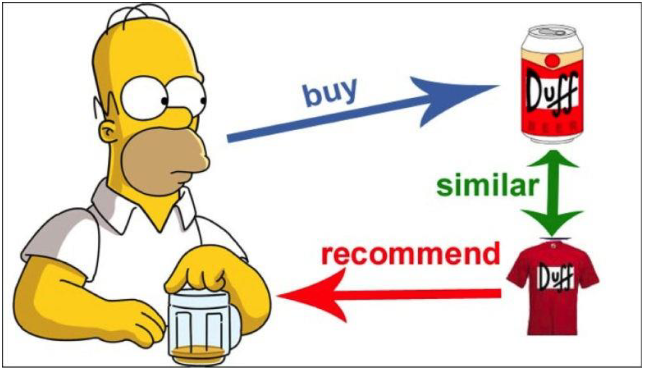
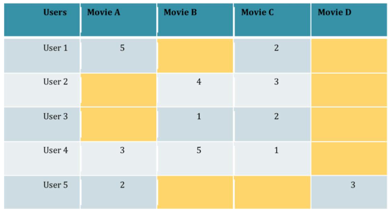

# (não terminado) Criando Um Sistema de Recomendação por Imagens Digitais - Desafio 6
 
Olá, este é o meu repositório para o sexto desafio do bootcamp "BairesDev - Machine Learning Training" da Dio.me! 

 

## Entendendo o Problema

Neste laboratório do prof. Diego Renan, o objetivo é criar um sistema de classificação de imagens, que ao final da operação seja capaz de gerar como resultado a recomendação de um produto para um usuário baseado em similaridades visuais, ou seja:

> "[...]o Sistema de Recomendação deve indicar produtos relacionados, mas não por seus dados textuais (preço, modelo, marca, loja) e, sim, por sua aparência física (formato, cor, textura, etc)." Prof. Renan

Assim, ainda dentro dessa perspectiva de um sistema de recomendações de produtos, o prof. Renan descreve o funcionamento geral de dois tipos de sistemas de acordo com a utilização de dois diferentes filtros para gerar a ação de recomendação aos usuários:

1. **Filtragem baseada em contúdo**: este sistema vai gerar recomendações com base na similaridade dos conteúdos já consumidos por parte do usuário.
    - Ou seja, utiliza-se de relacionamentos baseados na similaridade entre certos produtos para gerar o vínculo entre os mesmos.

 

2. **Filtragem Colaborativa**: este sistema busca gerar recomendações focando na relação de interatividade dos produtos com as pessoas ou usuários.
    - Ou seja, este sistema partiria do princípio de que não seria preciso saber ou se ater às características, como aquelas relacionadas às suas similaridades, mas que deveria de outra forma conhecer acerca do contexto das interações e de compra entre os diferentes usuários que compram ou adquirem os produtos.
    - Para a construção desses perfis de compras, o prof. Renan fala que é comum o uso de ferramentas como as **Matrizes de Interação**:

> "Dessa forma é possível 'trocar' recomendações entre usuários semelhantes ao processar o coletivo" (prof. Renan)  

 

Finalmente, o prof. Renan recomenda o uso de pelo menos quatro classes para a realização do treinamento para a classificação de produtos a serem ofertados a usuários. Por exemplo, algo como: 

1. **Relógio**
2. **Cadeira**
3. **Celular**
4. **Cerveja em latas**

 

## 

 

## Outros links:

 - [linkedin:] https://www.linkedin.com/in/marcus-vinicius-richa-183104199/
 - [Github:] https://github.com/ahoymarcus/
 - [My Old Web Portfolio:] https://redux-reactjs-personal-portfolio-webpage-version-2.netlify.app/

