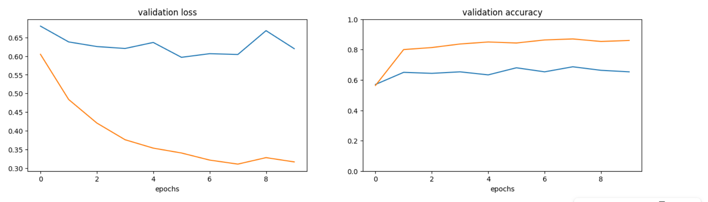
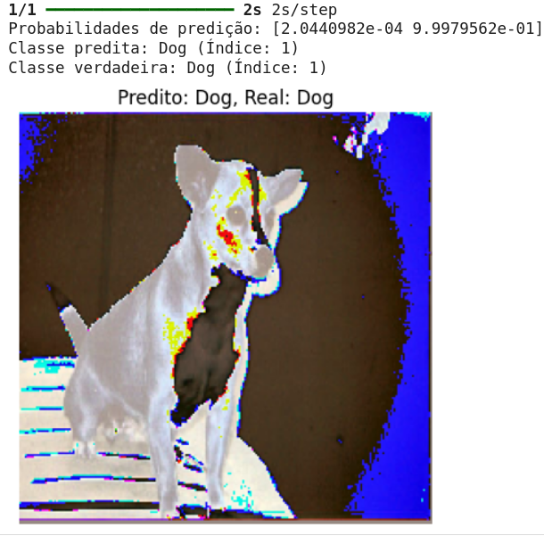

# Treinamento de Redes Neurais com Transfer Learning - Desafio 1
 
Olá, este é o meu repositório para o primeiro desafio do bootcamp "BairesDev - Machine Learning Training" da Dio.me! 

<br>

## Entendendo o Problema

Neste laboratório do prof. Diego Renan, o objetivo é treinar uma rede neural para a identificação de imagens! No caso do presente projeto, a rede neural será treinada para identificar imagens de **'Gatos'** e **'Cachorros'**.


Contudo, visando melhorar a eficiencia no gasto de recursos com o treinamento, bem como visando melhorar a performance do treinamento para a rede sendo criada, será utilizado um recurso adicional chamado de Transfer Learning, que permite transferir métricas e ajustes alcançado em um treinamento anterior, e que possam servir de apoio para o novo modelo sendo treinado.


Neste sentido, existem muitos modelos com exelente performances que são publicados pelos seus autores e que podem ser usados como suporte para outras redes, sendo que neste projeto está sendo utilizado um modelo chamado de **VGG16** disponibilizado pela biblioteca Keras do Python. 


Já com relação aos dados para serem usados no treinamento, eles foram disponibilizados através do site da Microsoft, além de estar também indicado no site de outra importante ferramenta Python que é o Tensorflow:

- [Microsoft: Kaggle Cats and Dogs Dataset](https://www.microsoft.com/en-us/download/details.aspx?id=54765)
- [Tensorflow: gatos_vs_cães](https://www.tensorflow.org/datasets/catalog/cats_vs_dogs?hl=pt-br)


Finalmente, para testar o ganho real de performance e a economia de recursos, o projeto inicial disponibilizado pelo professor Diego Renan no NoteBook Colab da Google, também realiza um treinamento anterior de um modelo sem utilizar a técnica de Transfer Learning, de modo que ao final de todo o processo seja possível fazer a comparação dos resultados performance alcandos por cada um dos processos independentemente! 


<br>

## Construindo o Projeto
 
Como dito, então, ao montar esse desafio de projeto, o prof. Diego Renan disponibilou um arquivo notebook Colab com um projeto base já dividido naqueles três focos de intereses dito anteriormente:

1. Treinar um modelo sem usar do recurso de Transfer Learning para servir de comparação ao resultado final.
2. Treinar um segundo modelo aplicando o recurso de Transfer Learning.
3. Validar o resultado final utilizando das capacidades do Python de análise de dados e para a criação de gráficos de visualização.


Temos logo no início um script que faz um download de uma base de dados e que usa as bibliotecas do Python para realizar tanto um treinamento do zero daquela base de dados, como de fazer o Transfer Learning, utilizando uma rede já treinada, do tipo VGG16, de modo a se aproveitar dos ajustes/treinamentos já existentes para tentar orientar este segundo treinamento buscando mais economia de recursos e melhor performance também!  


E esta é a parte de importação das bibliotecas para o projeto:

```
#if using Theano with GPU
#os.environ["KERAS_BACKEND"] = "tensorflow"


import random
import numpy as np
import keras


import matplotlib.pyplot as plt
from matplotlib.pyplot import imshow


from keras.preprocessing import image
from keras.applications.imagenet_utils import preprocess_input
from keras.models import Sequential
from keras.layers import Dense, Dropout, Flatten, Activation
from keras.layers import Conv2D, MaxPooling2D
from keras.models import Model
```


E um pouco mais abaixo, existe um script utilitário, o qual foi preciso modificar para montar o novo projeto deste desafio, que usa a ferramente _curl_ do Linux, para acessar o repositório das imagens, e depois realizar a tarefa de descompactar o arquivo final também, se necessário, tudo isso dentro de um diretório de trabalho do próprio notebook:

```
echo "Downloading Kaggle Cats and Dogs Dataset for image notebooks"
!curl -L -o kagglecatsanddogs_5340.zip --progress-bar https://download.microsoft.com/download/3/e/1/3e1c3f21-ecdb-4869-8368-6deba77b919f/kagglecatsanddogs_5340.zip
!unzip kagglecatsanddogs_5340.zip
!rm kagglecatsanddogs_5340.zip
!ls
```

Finalmente, o script também usa de uma função Python utilitária para buscar as imagens carregadas no notebook Colab e trazer para serem classificadas pela aplicação (essa função não precisou ser modificada):

```
# helper function to load image and return it and input vector
def get_image(path):
   img = image.load_img(path, target_size=(224, 224))
   x = image.img_to_array(img)
   x = np.expand_dims(x, axis=0)
   x = preprocess_input(x)
   return img, x
```


À seguir, na continuação do código, vem a parte em que o projeto prepara as categorias que serão definidas para treinar o modelo de classificação de imagens. Neste caso também foi preciso modificar o código para se encaixar ao modelo sendo treinado neste projeto, que busca treinar uma ferramenta de IA capaz de classificar imagens de **Gatos** e de **Cachorros**:

```
root = 'PetImages'
train_split, val_split = 0.7, 0.15
categories = ['Cat', 'Dog']
print(categories)
```


Também o script seguinte foi preciso modificar para que este ficasse de acordo com as necessidades deste novo projeto. Veja que aqui, as imagens são carregadas do sistema de arquivos do notebook, usando a função auxiliar em Python vista logo acima, e são preparadas para serem utilizadas no projeto de treinamento do modelo de classificação de imagens.


Inicialmente, elas são separadas em dois grupos de treinamento para **gatos** e para **cachorros**:

```
data = []
max_images_per_category = 1000 # Defina um limite razoável, comece com 1000

for c, category_name in enumerate(categories):
	category_path = os.path.join(root, category_name)

	images_loaded_in_current_category = 0 # Contador para a categoria atual

	images_paths = [os.path.join(dp, f) for dp, dn, filenames
                	in os.walk(category_path) for f in filenames
                	if os.path.splitext(f)[1].lower() in ['.jpg', '.png', '.jpeg']]

	for img_path in images_paths:
    	if images_loaded_in_current_category >= max_images_per_category:
        	print(f"Limite de {max_images_per_category} imagens atingido para a categoria {category_name}. Pulando restantes.")
        	break # Sai do loop interno e vai para a próxima categoria

    	try:
        	img, x = get_image(img_path)
        	data.append({'x':np.array(x[0]), 'y':c})
        	images_loaded_in_current_category += 1
    	except Exception as e:
        	#print(f"Erro ao carregar a imagem {img_path}: {e}") # Descomente para ver erros específicos
        	continue

num_classes = len(categories)
print(f"Total de imagens carregadas: {len(data)}")
```

> [!NOTE]
> Observe que este script acima precisou ser escalado para lidar com algumas situações que não fazem parte do projeto de treinamento de dados em si mesmo, mas que são importantes para tornar a operação da aplicação mais robusta, entre elas: **Tratamento de Exceções** para lidar a presença de imagens problemáticas nas bases de dados, **Criação de limite para o pool de imagens**, porque a versão gratuita disponibilizada pelo Colab possui restrições de provimento de memória RAM, por exemplo, etc.


<br>

## Resultado Final da Tarefa de Modelagem e Validação do Treinamento

Finalmente, o design montado pelo prof. Diego Renan pode ser aplicado a este novo modelo de treinamento definido para este desafio ou laboratório, sendo que por meio da separação dos códigos feita pelo Notebook Colab, é possivel visualizar com facilidade as etapas nas quais todo o processo de treinamento foi construído, passando então para a plotagem dos dados relativos à acurácia e à performance de cada qual dos modelos treinados, para podermos, então, avaliar se a adição do recurso de Transfer Learning ao projeto trouxe benefícios reais e concretos para o modelo de classificação de imagens treinado.


Assim, entre outros, temos importantes informações trazidas ao se analisar os resultadosdos treinamentos:


<br>

### Modelo I (sem a Aplicação do Recurso de Transfer Learning)

> [!IMPORTANT]
> Total params: 1,209,058 (4.61 MB)   
> Trainable params: 1,209,058 (4.61 MB)   
> Non-trainable params: 0 (0.00 B)
>
> Test loss: 0.5728596448898315    
> Test accuracy: 0.7066666483879089


<br>

### Modelo II (com a Aplicação do Recurso de Transfer Learning)

> [!IMPORTANT]
> Total params: 134,268,738 (512.19 MB)  
> Trainable params: 8,194 (32.01 KB)  
> Non-trainable params: 134,260,544 (512.16 MB)  
>
> Test loss: 0.3520883023738861   
> Test accuracy: 0.8333333134651184


<br>

### Análise Final dos Dados do Treinamento e de Validação

Muito importante notar nos valores mostrados acima:

- Como o uso do recurso de Transfer Learning trouxe uma economia de recursos não apenas por tornar o novo modelo, que recebera os parâmetros da rede **VGG16**, mais robusto na sua capacidade de classificar as imagens treinadas, pois utilizou-se de **8x** mais parâmetros de treinamento.
- Que o novo modelo foi capaz de decidir ou não pelo uso dos demais parâmetros tomados de empréstimo, uma vez que, no caso do presente projeto, trata-se apenas de um modelo pequeno e com apenas duas classes de imagens para serem classificadas. Assim, observe não ter havido gasto de recursos adicionais com os 134,260,544 ou 512.16 MB de recursos para parâmetros que não precisaram ser utilizados aqui. 
- Quanto aos valores das **perdas**, podemos ver ali que o modelo sem o recurso de Transfer Learning perderia quase 60% de sua acurácia, em razão de ser um modelo limitado de treinamento, feito como uma base de dados e com recursos computacionais bastante limitados.
- Também do lado da **performance**, vemos uma aprimoramento que leva o modelo a mais de 80% de acerto em suas previsões, o que novamente pode ser considerado uma grande vitória, considerando ser esse um modelo restrito, tanto no uso de imagens, quanto no uso de recursos para realizar uma tarefa de tão grande magnitude.


Nesta primeira imagem podemos ver a plotagem dos gráficos comparativos de desempenho dos dois modelos treinados, um sem a aplicação do recurso de Transfer Learning e o segundo se valendo desse importante recurso:




Finalmente, temos também os valores dos testes de validação da capacidade de previsão correta de novas imagens feitas pelo modelo treinado usando do recurso de Transfer Learning:




<br>

## Outros links:

 - [linkedin:] https://www.linkedin.com/in/marcus-vinicius-richa-183104199/
 - [Github:] https://github.com/ahoymarcus/
 - [My Old Web Portfolio:] https://redux-reactjs-personal-portfolio-webpage-version-2.netlify.app/


