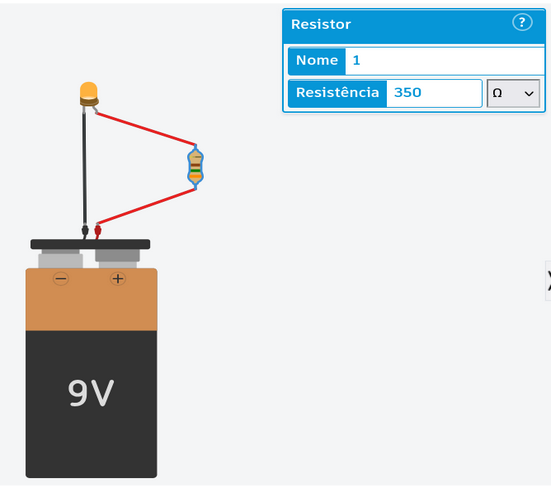
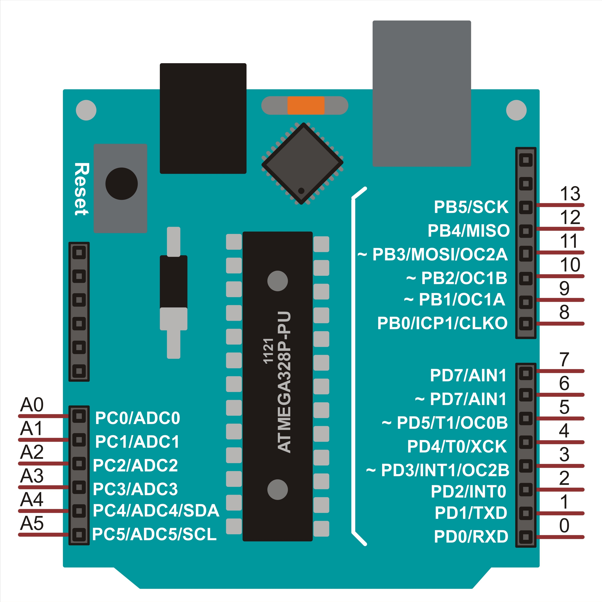
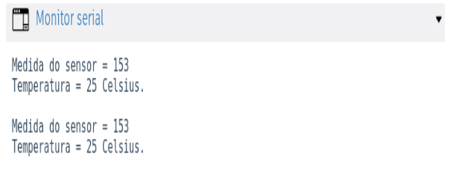
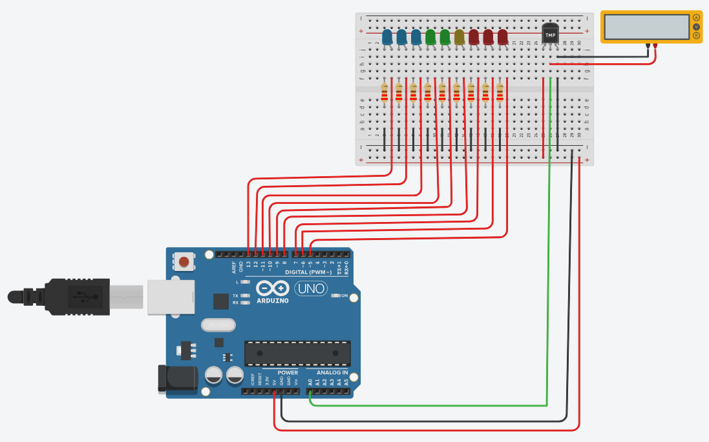
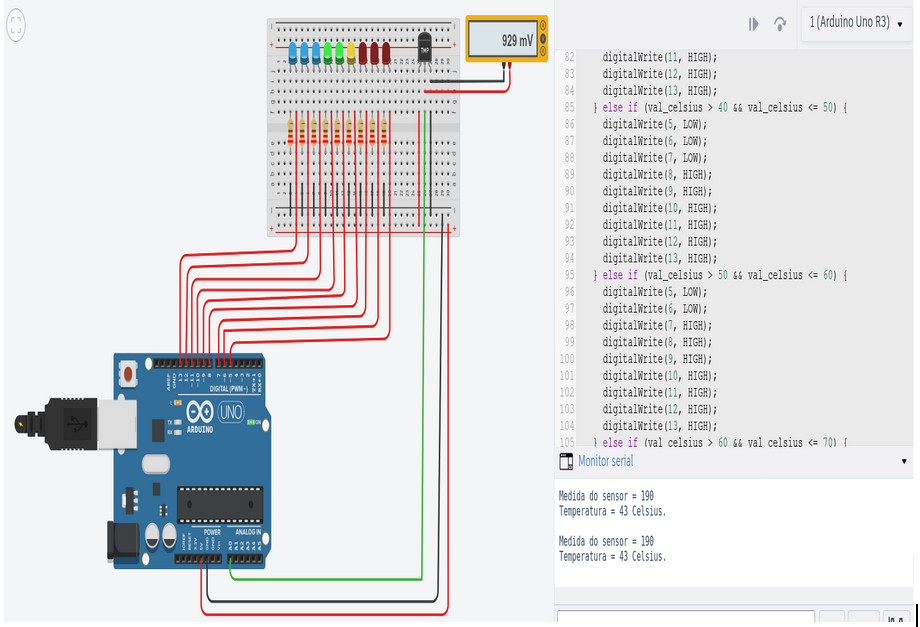
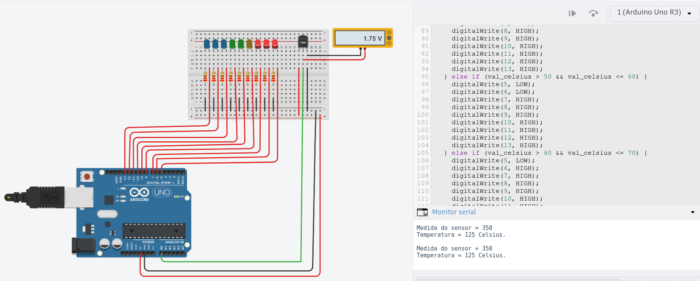
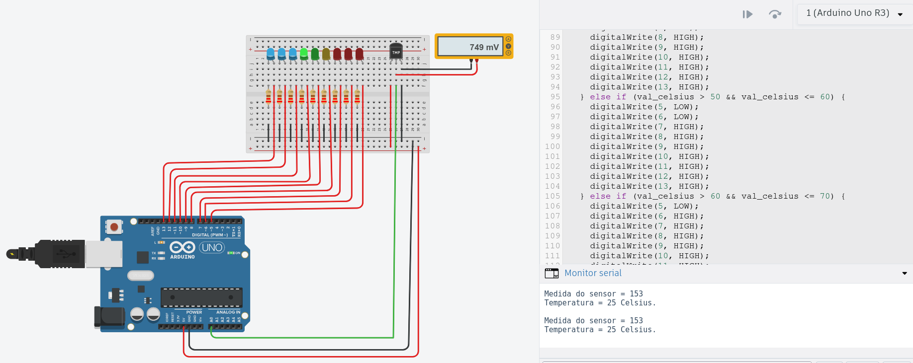

# Arduino com Sensor de Temperatura Analógico e Multímero -- Prototipação 
 
O objetivo deste trabalho é de testar o uso do Arduino para gerenciar um modelo de dispositivos interligados para simular na plataforma Tinkercad a medição da temperatura do ambiente com um sensor analógico, de forma que, a  partir dos valores que forem sendo lidos pelo sensor, o Arduino possa decidir que decisões tomar, o que no caso, significa decidir quais os leds devem ser acesos ou apagados com as mudanças na temperatura medida. 

 - [Link da plataforma Tinkercad](https://www.tinkercad.com/) 


<br>

Observe ainda, que o uso do Arduino em projetos deste tipo não é simplesmente para se permitir a ligar dispositivos entre si, isto porque essa tarefa bem poderia ser feita sem o uso dele, mas precisamente para permitir inserir processamento e decisão neste modelo, de forma que com o Arduino, passamos a poder gerir a todo o sistema de forma integrada. 


Abaixo vemos um simples arranjo de três dispositivos que se ligam para o acendimento de um led sem precisar da participação do Arduino para isso:



<br>


Contudo, quando trabalhamos dessa maneira, não possuímos uma forma prática para fazer o gerenciamento desse modelo, porque para alterarmos o funcionamento do sistema acima, somos obrigados a fazer tudo isso manualmente, como, por exemplo, quando queremos desligar o led e precisamos de cortar a ligação da bateria manualmente.


Do outro lado, quando a gestão é feita pelo Arduino, o projeto pode ser plenamente automatizado, inclusive com a utilização de uma versão da linguagem de programação C++, como poderá ser visto ao longo do projeto.


<br>

## Componentes Utilizados

Neste projeto são utilizados os seguintes componentes:
 - Arduino UNO
 - Placa Protoboard
 - 9 Leds
 - 9 Resistores
 - Sensor de temperatura TMP-36
 - Multímetro


Para esse arranjo de componentes, o Arduino é responsável pelo gerenciamento do sistema e pela distribuição de energia, enquanto que a placa Protoboard é utilizada para permitir a arrumação dos circuitos de forma facilitada e mais limpa.


Assim, caberá ao Arduino fazer o envio de corrente para carregar a placa Protoboard por meio do pino 5V, bem como receber de volta a polaridade de carga negativa da corrente para fechar o circuito através do pino GND. Ademais, também é utilizado o pino analógico A0 do Arduino para receber a leitura de um sensor de temperatura analógico, enquanto são usados os pinos digitais de 5 a 13 para gerenciar o envio de energia para o acendimento individual de cada um dos leds usados. 


Contudo, os leds não podem ser alimentados diretamente pela placa Protoboard, que recebe os 5 Volts do Arduino, de modo que são usados nove resistores para restringir a quantidade de corrente para 220 Ohm, evitando assim queimar os dispositivos.


Finalmente, também será usado um multímetro para nos permitir acompanhar a operação de conversão do valor analógico que é feito pelo sensor para a temperatura em graus Célsius, uma vez que segundo a documentação da plataforma Tinkercad, o pino central do sensor é capaz de mudar o seu valor de saída de acordo com as variações captadas no ambiente, trabalhando dentro da faixa de uma faixa de valores de 0 a 1023, de forma que caberá, então, a uma função de mapeamento usada no Arduino para fazer a conversão final daqueles valores para a faixa de -40º até 125º Celsius. 


Na figura abaixo temos um esquema geral explicativo da placa Arduino UNO:



<br>

## Funcionamento do Projeto

Como dito, então, o projeto funciona seguindo o gerenciamento do Arduino e a prototipagem da placa Protoboard, de forma que o Arduino envia sinal de corrente de 5V para alimentar o sistema, recebendo de volta no pino GND as cargas negativas para garantir o fechamento do circuito. Veja que nas imagens abaixo da próxima seção, os fios que conduzem carga positiva foram padronizados com a cor vermelha, enquanto os que têm carga negativa têm a cor preta.


Embora os leds e os resistores estejam posicionados na placa Protoboard para permitir uma melhor arrumação (e ela esteja recebendo corrente do Arduino), não será a placa a responsável por alimentar os leds com energia, pois como discutimos antes, queremos que seja o próprio Arduino o responsável por controlar de forma automatizada o acendimento e o apagamento dos leds de acordo com algoritmo definido nele.   

Do outro lado, o sensor de temperatura também está posicionado na Protoboard, sendo que dessa vez será a própria placa que o alimentará com energia, afinal, o sensor não precisa ser controlado diretamente pelo Arduino, mas apenas enviar ao Arduino as suas medições que, depois de recebidas, elas são tratadas por ele com um delay de um segundo, que também está definido na programação feita.


Assim, de posse da informação recebida pelo sensor, o Arduino usa a seguinte expressão para fazer a conversão do sinal enviado pelo sensor para o padrão da temperatura Celsius:

    - val_celsius = map(((analogRead(A0) - 20) * 3.04), 0, 1023, -40, 125); 


Vemos na expressão que o valor recebido pelo sensor é subtraído de vinte e multiplicado por 3,04. Já a segunda parte da expressão descreve de um lado a faixa de funcionamento do sensor (de 0 a 1023) e a faixa de capacidade de operação do mesmo, que vai de -40º até 125º Célsius. Ou seja, um sensor mais potente ou ainda um sensor voltado para operações mais específicas poderia ter uma outra capacidade de operação, de forma que, então, deveríamos relacionar a sua nova capacidade de operação correlacionando com o seu valor de funcionamento naquela função de mapeamento.


Na sequência, após o valor recebido do sensor ser convertido para um valor em Célsius, esse valor é usado no algoritmo do Arduino para decidir quais leds acenderão a cada momento.


Para ajudar a visualizar todo esse processo de conversão, utilizamos dois sistemas, como poderá ser visto mais adiante:

1. Método Serial.begin(9600) do Arduino
2. Multímetro


O primeiro permite que possamos jogar o valor recebido pelo pino A0 para um terminal de uso ou um “Monitor Serial”, tal qual a plataforma Tinkercad disponibiliza logo abaixo da caixa de texto de codificação:




<br>

Já o segundo sistema se trata do uso de um multímetro, que está ligado em paralelo ao sensor, isto é, ele tem o seu negativo ligado paralelamente na Protoboard junto ao negativo do sensor, enquanto o seu positivo estaria também ligado em paralelo ao pino central de medição do sensor. 


Assim, segundo o que foi visto na Internet, o pino de medição do sensor, que é chamado de 'Vout' ou Voltagem Out, faria sua medição da temperatura correlacionando com a pressão elétrica ou Volts, cujo valor depois de enviado ao pino analógico do Arduino (A0) receberia um valor proporcional entre 0 e 1023, que é o valor de medição utilizado na fórmula anterior para ser convertido para Célsius, tal qual foi explicado.


Finalmente, ao final de todas essas etapas, indo desde a coleta de um valor pelo sensor, do envio ao arduino pelo pino analógico, e depois passando pela sua conversão para Célsius, ele é então usado em um bloco condicional de programação para decidir sobre o acendimento dos sensores.


No caso deste projeto, os nove sensores foram divididos em quatro grupos de cores (Azul, Verde, Amarelo e Vermelho), sendo que à medida em que sobe o valor da temperatura medida, os leds vão sendo atendidos, até que passando do valor de 70º Celsius, todos os leds Vermelhos são acendidos indicando se tratar de uma situação crítica.


<br>

## Imagens do Projeto

Abaixo, temos as imagens marcando as diferentes etapas do projeto, começando pelo imagem do circuito todo montado:




<br>

Vemos, então, em vermelho tudo que sai como alimentação de energia, ou carga positiva, e em preto tudo que sai como carga negativa para fechar a corrente dos dispositivos.


Já em verde vemos o fio que envia a medição do sensor de temperatura para o pino A0 do Arduino, enquanto que podemos ver também o multímetro montado em paralelo com o sensor de temperatura.


A seguir, temos a primeira parte do código do Arduino em que são definidas duas variáveis básicas para receber, primeiro o valor recebido do sensor e em segundo o valor convertido para Célsius, bem como são definidos os pinos do projeto sendo usados, bem como a sua forma de funcionamento em termos de “Entrada” (INPUT) ou “Saída” (OUTPUT):

```
// C++ code
int val_sensor = 0;
int val_celsius = 0;
void setup()
{
  pinMode(A0, INPUT); // Entrada do Sensor
  Serial.begin(9600);
  pinMode(5, OUTPUT);
  pinMode(6, OUTPUT);
  pinMode(7, OUTPUT);
  pinMode(8, OUTPUT);
  pinMode(9, OUTPUT);
  pinMode(10, OUTPUT);
  pinMode(11, OUTPUT);
  pinMode(12, OUTPUT);
  pinMode(13, OUTPUT);
}
```


<br>

Já no próximo print, podemos ver a parte inicial e a parte final do bloco de condição usado para definir o acendimento dos leds:

```
if (val_celsius <= 0) {
    digitalWrite(5, LOW);
    digitalWrite(6, LOW);
    digitalWrite(7, LOW);
    digitalWrite(8, LOW);
    digitalWrite(9, LOW);
    digitalWrite(10, LOW);
    digitalWrite(11, LOW);
    digitalWrite(12, LOW);
    digitalWrite(13, HIGH);
  } 
...
...
...
  } else if (val_celsius > 60 && val_celsius <= 70) {
    digitalWrite(5, LOW);
    digitalWrite(6, HIGH);
    digitalWrite(7, HIGH);
    digitalWrite(8, HIGH);
    digitalWrite(9, HIGH);
    digitalWrite(10, HIGH);
    digitalWrite(11, HIGH);
    digitalWrite(12, HIGH);
    digitalWrite(13, HIGH);
  } else {
    digitalWrite(5, HIGH);
    digitalWrite(6, HIGH);
    digitalWrite(7, HIGH);
    digitalWrite(8, LOW);
    digitalWrite(9, LOW);
    digitalWrite(10, LOW);
    digitalWrite(11, LOW);
    digitalWrite(12, LOW);
    digitalWrite(13, LOW);
  } 
  delay(1000); // Aplicar um segundo de espera entre medições
}
```


<br>

Ao todo são nove condições testadas, começando com um teste para valores menores ou iguais a zero e terminando com uma cláusula “Else” final que captura todos os valores maiores que 70, sendo que dentro dessa faixa o acendimento e o apagamento das luzes é definido pelo valor individual da expressão digitalWrite(<número_do_pino>, <constante de saída>), em que o valor “HIGH” determina que o pino relacionado envie energia e portanto acenda o led, e o valor “LOW” determina que o pino permaneça inativo e, portanto, mantendo o led o qual gerencia permaneça desligado.


A seguir, temos dois prints apresentando o sistema em funcionamento, em que no primeiro, o recebimento de um valor de 43º Célsius provoca um primeiro alerta, de cor amarela, que é referente a uma temperatura posicionada na faixa entre 40º e 50º Célsius do teste de condição do código acima:




<br>

Já aqui neste print abaixo temos a simulação da temperatura máxima de medição do sistema que é de 125º Célsius, de forma que por se tratar de um valor posicionado no intervalo acima de 70º Célsius, temos os três leds vermelhos marcando o alerta crítico do sistema: 




<br>

E neste terceiro e último print temos uma medição de uma temperatura considerada normal para o sistema, com 23º Celsius, de modo que é acendido o primeiro led de luz verdo, logo depois dos três leds azuis que representam medições para baixas temperaturas:

 


<br>

Finalmente, podemos ver também que em todos os exemplos mostrando o sistema funcionando, também tínhamos o multímetro mostrando o valor real de pressão elétrica ou voltagem que é medida pelo sensor analógico, o qual é enviado também para a porta analógica A0, sendo só ali transformado num valor na faixa de 0 a 1023.


<br>

## Dificuldades Encontradas

Este projeto foi uma tarefa muito interessante de ser feita, mas foi também um projeto bastante desafiador, porque envolve uma série de conhecimentos de física e de elétrica e eletrônica que não são conhecimentos comuns no dia a dia, nem mesmo para algumas das áreas de especialidade encontradas em TI.


Em grande parte, as dificuldades foram resolvidas recorrendo-se à internet para pesquisar alguns pontos específicos relacionados a cada um dos ramos específicos mencionados, como por exemplo, o que trata do entendimento dos circuitos eletrônicos, que é, por exemplo, o que temos como base para entender o  funcionamento de prototipação da Placa Protoboard.


Nela foi preciso entender o funcionamento de um circuito em relação à alimentação e a construção da corrente de energia (cargas positivas e negativas), bem como foi preciso entender o próprio design da placa, que possui um desenho muito interessante com uma “ponte” dividindo a placa em duas partes, permitindo a construção de protótipos mais complexos e com mais eficiência também.


Outra grande dificuldade foi para entender um pouco sobre os conhecimentos relacionados à operação de dispositivos elétricos, sendo que foi uma surpresa agradável observar que o simulador Tinkercad além de simular o funcionamento dos circuitos, ele também é capaz de simular a queima de peças e dispositivos em função de um uso inadequado, quando, por exemplo, uma corrente é passada diretamente para um led sem haver uma limitação da carga utilizando-se um resistor, o que eventualmente causa a queima do led, e a sua consequente perda, concretamente a perda do recurso, caso se tratasse de uma situação real de operação.


<br>

## Conclusão

Este trabalho trouxe como resultado um ótimo aprendizado geral, não apenas porque trouxe a chance de podermos trabalhar um importante ramo da atualidade, que é o da engenharia de prototipagem para circuitos eletrônicos ou embarcados, mas também por trazer outros importantes conhecimentos importantes para os profissionais de tecnologia, incluindo para o curso de Redes de Computadores, que é o curso do qual participo. 


Por exemplo, foi muito esclarecedor a oportunidade de poder trabalhar concretamente no simulador Tinkercad as diferenças entre os dispositivos do tipo digital e analógico, porque isso me ajudou a entender melhor a diferença de funcionamento entre eles e que têm sido visto nas disciplinas do curso, mas que nem sempre é fácil de apreender tudo o que é mais importante nessa relação por falta de uma oportunidade de se poder trabalhar concretamente com as situações de teste e de operação que são vistas e aprendidas na teoria.


<br>

## Outros links:

 - [linkedin:] https://www.linkedin.com/in/marcus-vinicius-richa-183104199/
 - [Github:] https://github.com/ahoymarcus/
 - [My Old Web Portfolio:] https://redux-reactjs-personal-portfolio-webpage-version-2.netlify.app/


