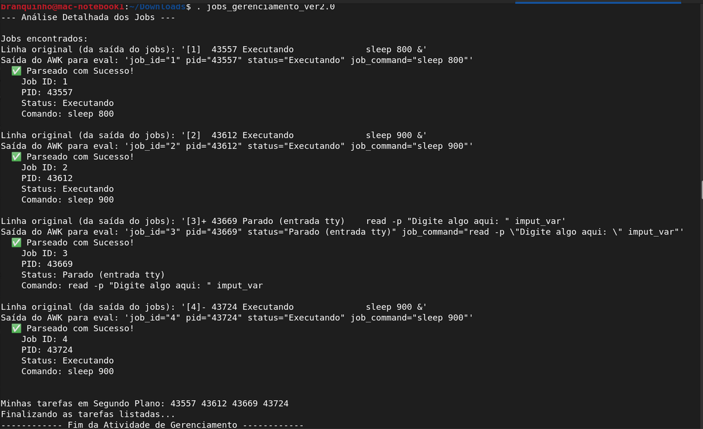

# Automatizando o Gerenciamento de Jobs e Tarefas com Bash e AWK
 
Olá, este é o meu repositório para apresentar um pouco da minha experiência e de meus projectos com sistemas operacionais, e especialmente com o sistema operacional Linux!


Temos abaixo o resultado de um empolgante desafio para fazer a gestão automatizada de alguns trabalhos rodando em segundo plano em um terminal Linux:




<br>

## O _Linux Tooling_ e o Gerenciamento de Jobs de Sistemas Operacionais

Neste projeto, em particular, trata-se da criação e do uso de dois scripts que ajudam na administração de sistema operacional Linux, por meio do uso da linguagem de bash-script, além de inúmeras outras ferramentas e linguagens que fazem parte de um poderoso ferramental do Linux para fazer o gerenciamento dos trabalhos com sistema operacional, buscando integração e automação dos processo em geral.   


E esse projeto nasceu de um desafio da faculdade de _Rede de Computadores_ que pedia justamente para o aluno produzir um script capaz de analisar e gerenciar os processos criados no sistema, bem como seus status e finalmente a possibilidade de serem encerrados, tudo feito de forma automática! 


O primeiro script, que é também o mais simples, aproveitando de uma resposta mais sistematizada por parte do comando **ps**, com valores regulares para os valores como:

1. PID 
2. TTY 
3. TIME 
3. CMD


```
    PID TTY          TIME CMD
  34828 pts/3    00:00:00 bash
  44135 pts/3    00:00:00 sleep
  44190 pts/3    00:00:00 sleep
  44246 pts/3    00:00:00 bash
  44388 pts/3    00:00:00 ps

```


Vemos que esses valores tabulares podem mais facilmente ser enviados a uma variável Bash, para serem iterados a partir das posições dos índices do vetor, para por meio desses valores que se repetem de forma recorrente e padronizadas, relacionar o **nome do comando (CMD**) e o seu **identificador no sistema (PID**), para tomar quaisquer decisões necessárias a serem tomadas para cada um dos processo em particular: como, por exemplo, a exclusão de um processo relacionados a um nome de comando ou a um processo específico, etc.


Do outro lado, o comando **jobs**, por exemplo, que em sua versão mais informativa de,  **jobs -l**, o qual já não traz informações padronizadas para o Bash acerca dos diversos trabalhos e de seus estados sendo obsevados. Disto, surge a necessidade de se realizar uma tarefa de análise da resposta bem mais elaborada e minunciosa sobre os dados:

```
jobs -l
[1]  44135 Executando              sleep 800 &
[2]- 44190 Executando              sleep 900 &
[3]+ 44246 Parado (entrada tty)    read -p "Digite algo aqui: " imput_var

``` 

Já agora, vemos que para os valores tabulares acima existe grande diferença em relação à formação dos campos dos dados, seja pela ocorrência de padrões específicoas para certos comando, como temos acima para o comando **read**. Por essa razão, torna-se impossível para o Bash aplicar a mesma forma de extração direta que fora intentada para as informações obtidas com o comando **ps**, no caso precedente!  


Dessa forma, no caso do comando **Jobs**, então, fora introduzido o trabalho de uma outra ferramenta, dentre o grande arsenal de ferramentas e linguagens orquestradas pelo Bash pertencentes ao ferramental do ecossistema de programação do Linux, e que no caso desse projeto, fora escolhida a ferramenta ou Linguagem AWK, que remonta ainda aos tempos do próprio sistema operacional **Unix** e à tradição da linguagem de programação **C**: 

```
readarray -t job_lines < <(jobs -l 2>&1)

if [ ${#job_lines[@]} -eq 0 ]; then
    echo "Nenhum job trabalhando em segundo plano!"
else
    echo "Jobs encontrados:"
    for line in "${job_lines[@]}"; do
        echo "Linha original (da saída do jobs): '$line'"

        parsed_info=$(echo "$line" | awk '{...}
```

O arquivo completo do script pode ser econtrado nesta mesma pasta de repositório, contudo, esta orquestração do Bash com o AWK, se inicia com o redirecionamento da saída do comando **jobs -l** para um vetor. E abaixo, temos um poderoso processo de análise levado à frente pelo AWK, parseando todos os dados enviados pelo comando **jobs -l** linha a linha: 
 
```
        parsed_info=$(echo "$line" | awk '{
            job_id_raw = $1;
            gsub(/\[|\]|\+|\-/, "", job_id_raw);
            job_id = job_id_raw;
            
            pid = $2;
            status = $3;

            command_start_index = 4;
            
            job_command_str = "";

            if (status == "Parado" && match($0, /Parado[[:space:]]+\(entrada tty\)/)) {
                status = "Parado (entrada tty)";    
                command_start_pos = RSTART + RLENGTH + 1;

                job_command_str = substr($0, command_start_pos);
            } else {

                if (match($0, /^[[:space:]]*[^[:space:]]+[[:space:]]+[^[:space:]]+[[:space:]]+[^[:space:]]+[[:space:]]*(.*)$/, arr)) {
                    job_command_str = arr[1]; 
                }
            }
            gsub(/"/, "\\\"", job_command_str);
            gsub(/&$/, "", job_command_str);
            gsub(/^[[:space:]]+|[[:space:]]+$/, "", job_command_str);
            
            printf "job_id=\"%s\" pid=\"%s\" status=\"%s\" job_command=\"%s\"\n", job_id, pid, status, job_command_str;
        }')
```


Ali encima, a grandeza desse super Pipeline está no fato de que ele pode ser montado a partir da necessidade específica da tarefa, como aqui em que o Bash inicia uma iteração de looping e no meio de cada iteração chama a ferramenta do AWK para analisar uma linha do comando para ele, se aproveitando do fato do AWK ser uma linguagem específica e especializada para a analise e para o processamento de textos:


```
job_id_raw = $1;
            gsub(/\[|\]|\+|\-/, "", job_id_raw);
            job_id = job_id_raw;
            
            pid = $2;
            status = $3;

            command_start_index = 4;

            job_command_str = "";
```
 

Nesta parte do script, para cada linha que o AWK recebe do Bash, ele criar as variáveis básicas que poderão receber os valores básicos do comando, bem como ele também prepara as duas variáveis que vão ser analisadas para serem construídas de acordo com a necessidade:

```
if (status == "Parado" && match($0, /Parado[[:space:]]+\(entrada tty\)/)) {
                status = "Parado (entrada tty)";    
                command_start_pos = RSTART + RLENGTH + 1;

                job_command_str = substr($0, command_start_pos);
            } else {

                if (match($0, /^[[:space:]]*[^[:space:]]+[[:space:]]+[^[:space:]]+[[:space:]]+[^[:space:]]+[[:space:]]*(.*)$/, arr)) {
                    job_command_str = arr[1]; 
                }
            }
```


Acima, então, ocorreria a análise e o processamento principal da ferramenta, pois na medida que os valores fossem capturados pela condição lógica do bloco **If**, as variáveis **'status'** e **'job_command_str'** poderiam ser reatribuídas de acordo com a análise realizada pelo índice construído com o comando: **command_start_pos**.


Caso contrário, bastaria construir a última variável **'job_command_str'**, que havia sido criada vazia, para ser atribuída com o valor capturado pela expressão regular em:

```
/^[[:space:]]*[^[:space:]]+[[:space:]]+[^[:space:]]+[[:space:]]+[^[:space:]]+[[:space:]]*(.*)$/
```

Aqui, nesse exemplo, a variável **'job_command_str'** é construída através do processamento da linha sendo analisada a partir das seguintes especificações:

1. _^_: âncora para o início da linha. 
2. _[[:space:]]*_: zero ou mais caracteres de Expaços em Branco
3. _[^[:space:]]_: um ou mais caracteres diferentes de Espaço em Branco 
4. _[[:space:]]_: um ou mais caracteres de Espaços em Branco
5. _[^[:space:]]_: um ou mais caracteres diferentes de Espaço em Branco
6. _[[:space:]]_: um ou mais caracteres de Espaços em Branco
7. _[^[:space:]]*_: zero ou mais caracateres diferentes de Espaço em Branco 
8. _(.*)_: este é o grupo de captura para processar o valor que será atribuído à variável.
9. _$_: âncora para o final da linha.


Ao final desse extraordinário processo de Pipeline orquestrado pelo Bash, todas os dados são processados e as variáveis finais são processadas, para serem então devolvidas ao Bash que as utilizará para tomar as suas decisões de gerenciamento!

```
printf "job_id=\"%s\" pid=\"%s\" status=\"%s\" job_command=\"%s\"\n", job_id, pid, status, job_command_str;
```


<br>

## Automatização de Processos e Tarefas em TI

A automatização de tarefas na área de tecnologia é uma tendência que se faz presente nas suas mais diversas formas, fazendo despontar toda uma cultura e todo um conjunto de práticas cujo foco está centrado nos esforços para alcançar maior rapidez e maior confiança no desenvolvimento software e na entrega de produtos de tecnologia, flexibilizando e agilizando os processos e as tarefas e definindo esta importante especialização dentro da área de tecnologia que é o DevOps.


Especificamente para as tarefas relacionadas à administração de Sistemas Operacionais a questão da automação é importante, porque permite às equipes de trabalho maior:

1. Padronização das tarefas
2. Robustez para os serviços e aplicações
3. Enumeração de recursos
4. Rastreamento de versões e dependências
5. Flexibilidade


A importância de se padronizar operações e tarefas pode ficar clara na medida em que se consegue criar ambientes e ecossistemas mais simples e de mais fácil integração e escalação, uma vez que se trabalha a partir de soluções pensadas para atenderem de forma sistematiza e padronizada uma abrangende quantidade de aplicações e soluções existentes, enquanto isto também se reflete na forma de robustez das operações, uma vez que se permite melhorar a gestão desses recursos em operação, pela sua melhor enumeração, rastreamento de versões e dependências, pela flexibilização das mudanças e da escalabilidade das operações, etc.


<br>

## A Automatização da Administração de Processos e de Serviços com Sistemas Operacionais

Dentro da área de Sistemas Operacionais, a prática da automatização se faria presente principalmente a partir da codificação, ou seja, pela criação de scripts capazes de apoiar e até de substituir o trabalho manual dos administradores para certas tarefas, e em especial para aquelas mais críticas, que mais poderiam se beneficiar de todos aqueles benefícios apontados logo acima: padronização das tarefas e do trabalhos, práticas mais testadas e mais amplamente distribuídas de modo a prover maior robustez dos serviços, e com conhecimento adiantado dos recursos existentes e das possíveis dependências e limitações existentes em cada versão de aplicações e serviços sendo operados, portanto maior flexibilidade de trablaho e mais oportunidade de crescimento também.   


<br>

## Outros links:

 - [linkedin:] https://www.linkedin.com/in/marcus-vinicius-richa-183104199/
 - [Github:] https://github.com/ahoymarcus/
 - [My Old Web Portfolio:] https://redux-reactjs-personal-portfolio-webpage-version-2.netlify.app/


