# Simulando um Ataque de Brute Force de Senhas com Medusa e Kali Linux - Desafio 1
 
Olá, este é o meu repositório para o primeiro desafio do bootcamp "Santander - Cibersegurança 2025" da Dio.me! 

<br>

## Entendendo o Problema

Neste laboratório da profa. Isadora Ferrão, o objetivo é testar a ferramenta Medusa, criando para tanto um projeto de teste com o Metasploitable-2, por exemplo, para neste caso poder simular cenários de ataque de força bruta, bem como para exercitar medidas de prevenção.


Outra ferramenta proposta para este projeto pela profa. Isadora é o sistema ou ferramenta Kali Linux, que é um projeto de uma grande ferramenta de cibersegurança feita com base na distribuição Debian do Linux. Contudo, por razões de restrições de recursos, os cenários aqui trabalharão com a distribuição Debian diretamente, por ser ela mais leva que a ferramenta completa de Kali.


Nesses termos, então, ao invés de se trabalhar com duas VMs, apenas uma VM portando o Metasploitable-2 será usada, tendo as seguintes configuração no Virtual Box:

- 1024 MB de RAM
- 1 CPU
- 8 GB HD
- Adaptador de rede no modo Host-Only


Ademais, outros objetivos de aprendizagem buscados:

- Compreender ataques de força bruta em diferentes serviços.
- Documentar processos comuns e propor medidas de mitigação.
- Utilizar o GitHub como portfólio técnico para compartilhar documentação e evidências.


<br>

## Entendendo o Processo da Quebra de Senhas

Segundo James Leyte-Vidal, no seu livro, "Aprendendo a Quebrar Senhas: usando John the Ripper, hashcat e métodos avançados", o termo **quebra de senhas** faria parte de um contexto amplo de operações que envolveriam o processo de:

> "recuperar um segredo (secret) a partir de texto codificado (normalmente criptografado ou com hash) [...] A quebra de senhas poder ser dividida em várias abordagens para a tentativa de recuperação do segredo: Baseada em dicionário, Ataques combinados, Força bruta, Híbrida, Conhecimento parcial, também chamada de ataques de máscara."
> Aprendendo a Quebrar Senhas: usando John the Ripper, hashcat e métodos avançados, James Leyte-Vidal


Assim, complementando essa definição de James, podemos entender Criptografia seria: 

> "Criptografia é o processo de codificar informações usando modelos matemáticos para torná-las ilegíveis a pessoas não autorizadas. Para que os dados sejam lidos novamente, é necessária uma "chave" especial para descriptografá-los. Isso garante a confidencialidade e a segurança de dados digitais, tanto quando estão armazenados ("em repouso") quanto quando estão sendo transmitidos ("em trânsito")."
> Gemini - Google


Já para Hash, a definição poderia ser:

> "Hash é um algoritmo criptográfico que transforma dados de qualquer tamanho em uma sequência de caracteres de tamanho fixo, semelhante a uma "impressão digital" digital. É usado para verificar a integridade de arquivos, garantir a segurança de senhas e proteger informações em sistemas, como assinaturas digitais e blockchain. Uma característica fundamental é que é uma função irreversível; qualquer alteração nos dados originais resultará em um hash diferente."
> Gemini - Google


Ou seja, por meio do uso de processos criptográficos ou de hash, um texto ou uma mensagem é modificado, ficando ilegível para o leitor, sendo que o que mudaria para cada qual seria o objetivo ou caso de uso de cada qual:

1. Criptografia: tem o objetivo de tornar uma mensagem legível apenas para quem possui a chave criptográfica correta, capaz de reconstituir a mensagem original para o seu estado legível.
2. Hash: tem como objetivo criar um resumo para a mensagem, um resumo capaz de servir para atestar ou garantir a sua integridade da mensagem original, na medida em que qualquer mudança sobre ela, resultaria na criação de um resumo ou hash distinto, o que explicitaria a quebra de integridade da mensagem original. Ou seja, o objetivo de um hash não é impedir que uma mensagem seja lida ou entendida por quem quer que seja, mas sim de garantir que ela não tenha sido modificada, ainda que pela inserção de um único caractere de espaço em branco na mensagem original!


<br>

### Os Diferentes Tipos de Ataques

1. **Baseado em Dicionário**: se utiliza de uma lista de palavras ou frases que servem como candidatas para a senha buscada.
    - Interessante notar que esse tipo ataque pode se tornar mais efetivo na medida em que essas listas ou dicionários são feitos especificamente para uma operação ou contexto, enquanto que de forma oposta, perdem em efetividade na medida em que as listas ou dicionários criados são usados para contextos generalizados de quebra de senhas.  
2. **Ataques Combinados**: usam duas listas de palavras como entrada para a operação, criando uma string concatenada final para ser candidata a senha que se busca quebrar.
3. **Força Bruta**: estes ataques fazem exatamente o que o nome sugere, que é o que tentar construir string candidatas testando todas as possibilidades de construções de senhas, valendo-se sempre de uma grande quantidade de recursos de processamento.
    - Interessante notar o que diz o autor acerca deste método, que **"é possivel quebrar qualquer senha com essa abordagem. No entanto, o tempo que precisaríamos com o poder computacional atual torna a abordagem uma insensatez para senha maiores ou algoritmos mais complexos[...]"**.
4. **Ataques Híbridos!**: estes tipos de ataques combinariam características tanto dos "ataques combinados", como dos "ataques de força bruta" também. Assim, este ataque usaria uma lista de palavras como base, e passaria a modificar as palavras da lista adicionando caracteres de teste por força bruta.
5. **Conhecimento Parcial ou Ataque de Máscara**: essa tipo de ataque poderia ser considerado uma operação mais eficiente de quebra de senha, quando se parte da constatação que o atacante conhece alguns requisitos exigidos para a criação das senhas, de modo que para a construção das strings de texto canditadas para a senha, elas seriam criadas a partir de uma "máscara" ou modelo base para a sua criação.
    - Um exemplo de máscara ou modelo para a criação de senhas poderia ser: ter um caractere maiúsculo e um número, de modo que a cada tentativa, a oparação inseriria esses requisitos em cada string candidata usada para quebrar a senha. Isto traz a vantagem de reduzir o escopo ou contagem das possibilidades de senhas existentes a serem testadas!


<br>

## Configurando o Servidor Metasploitable-2 para Teste

De acordo com o Gemini (Google), o servidor Metasploitable-2 é um projeto da [Rapid7](https://www.rapid7.com/), uma empresa de cibersegurança que mantém esse servidor, criado intencinalmente com diversos níveis de vulnerabilidades por sobre uma máquina virtual, com o intetuito de servir de base para a realização de testes e de treinamentos de segurança. 


O Metasploitable-2 é baseado no sistema operacional Ubuntu Linux, de 32 bits, contendo uma variedade de serviços e aplicações vulneráveis. Ele pode ser baixado no site da SourceForge: [Metasploitable Files](https://sourceforge.net/projects/metasploitable/files/Metasploitable2/).
 

Ainda, como dito anteriormente, o servidor Metasploitable é um sistema leve de 32bits que pode operar em uma VM com 512KB ou 1024 MB e mais 8GB de HD:

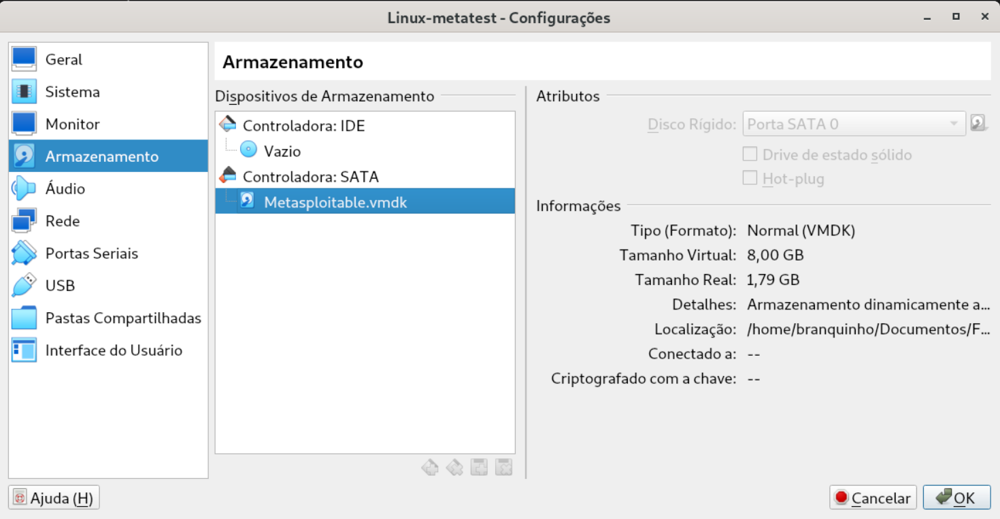


Como podemos ver acima, depois que uma VM linux Ubuntu 32bits básica é criada, podemos abrir a sua configuração de modo a fazer a adapção da imagem do HD do servidor Metasploitable-2 baixado anteriormente: **metasploitable.vmdk**


Já nesta segunda, podemos ver como configurar a rede da VM para ficar segura (sem acesso à Internet), mudando a configuração do adaptador para Host-Only:

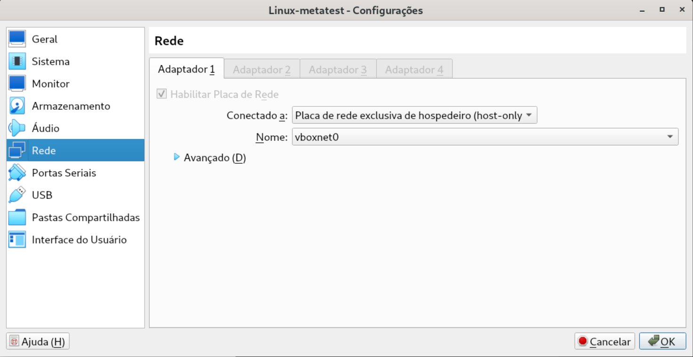


Na imagem seguinte, usamos o comando **ping** no terminal para confirmar que o host Debian tem conexão com a VM Metasploitable-2: 

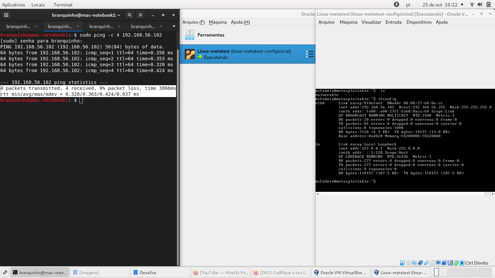

```
$ **ping -c 4 192.168.56.102**
```

<br>

### Acompanhando o Laboratório de Testes da Profa. Isadora  

A profa. Isadora, em seu curso de teste de cibersegurança, explica que o primeiro passo no caminho de se realizar uma operação de auditoria de um sistema ou serviço, seria o de fazer a a **Varredura** ou a **Enumeração** em relação ao sistema/serviço que está sendo trabalhado:

1. **Varredura**: segundo o prof. Cassiano Peres, nosso professor no curso "Santander - Cibersegurança 2025", a varredura seria uma busca mais simplificada e sem maiores detalhes no sistema ou serviço alvo da auditoria.
2. **Enumeração**: do outro lado, ainda segundo o prof. Cassiano, a enumeração já seria uma busca mais detalhada e mais pormenorizada em relação a esse mesmo sistema ou serviço que é alvo dessa auditoria.


Nesse sentido, para inciar o processo de varredura ou enumeração, a profa. Isadora opta pelo uso da ferramenta **NMap**:

```
$ nmap -sV -p 21,22,80,445,139 192.168.56.102
``` 


Em relação ao comando passado acima, temos que a ferramenta **NMap** usa as seguintes flags e parâmetros:

- **sV**: segundo o manual do NMap, esta flag é usada para confirmmar o estado de abertura do alvo, bem como para identificar os serviços ou versões que estariam rodando.
- **p**: já esta flag, permite que sejam especificados ranges de portas para serem testadas.
- **IP**: este é o endereço da VM, o mesmo endereço já visto sendo "pingado" anteriormente para o teste de conexão entre a máquina host e a VM.


E abaixo, nós podemos ver o resultado daquela varredura/enumeração inicial da VM:

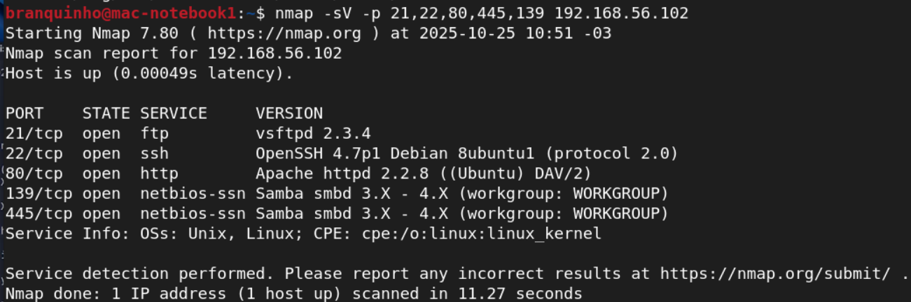


Assim, vemos na imagem acima, que as portas escolhidas pela profa. Isadora, estão abertos os seguintes serviço, aos mesmo tempo em que é apresentada as suas versões em execução: **ftp, ssh, http, netbios**.


Assim, logo de início, mesmo sem ter investigado se os serviços estariam devidamente atualizados e as possíveis vulnerabilidades conhecidas para cada uma das versões apresentadas, podemos ver que o servidor WEB Apache estaria rodando na porta **80**, ou seja, rodando o serviço WEB na porta descriptograda, ao invés da porta **443**, que é a versão do serviço WEB com conexão protegida por criptografia.


A seguir, a profa. tenta fazer a conexão com o servidor FTP da VM Metasploitable-2, observando que, embora o serviço tenha o seu acesso protegido por nome do usuário e senha, que ele está em operação:

```
$ ftp 192.168.56.102
```

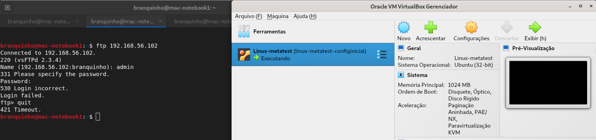


<br>

#### Tentando Comprometer o Sevidor FTP da VM Metasploitable-2

Seguindo no seu laboratório de testes, a profa. Isadora começa, então, a trabalhar para testar a segurança de acesso do servidor FTP operando na **porta 21** da VM Metasploitable-2. Para tanto, ela cria dois arquivos contendo listas de palavras comumente utilizadas por usuários para serem testadas como palavras candidatas para os alvos de **nome de usuário** e da **senha**:

```
$ echo -e 'user\nmsfadmin\nadmin\nroot' > users.txt
```


E:

```
$ echo -e '123456\npassword\nqwerty\nmsfadmin' > pass.txt
```


Os comandos acima, são comandos simples para criar arquivos contendo as listas de palavras presentes entre aspas. Observe que o comando **echo** usa a flag **-e** para permitir o uso de símbolos especiais, no caso **\n**, o que resultará em um salto de linha entre cada palavra que estará sendo redirecionada para os arquivos **.txt**.


Já a ferramenta escolhida pela professora para testar a força da segurança de acesso do serviço FTP é a **Medusa**, esta ferramenta que irá realizar um teste de força bruta, testando as palavras de cada lista em conjunto, uma sendo passada para o campo de usuário e a outra para senha:

```
$ medusa -h 192.168.56.102 -U users.txt -P pass.txt -M ftp -t 6
```


Ademais, a flag **-M** define o módulo ou serviço sendo testado, e a flag **-t** define o uso de 6 threads para acelerar o processamento da operação da ferramenta Medusa utilizando-se de processamento concorrente. Nesse sentido, observando a imagem abaixo, podemos ver que houve um **sucesso**, que fora na sétima tentativa de acesso feita pela ferramenta, usando as palavras candidatas: **msfadmin** e **msfadmin**. Palvras estas que foram usadas de forma bem sucedida na sequência para a realização do acesso manual no serviço FTP da VM Metasploitable-2!!! :-)

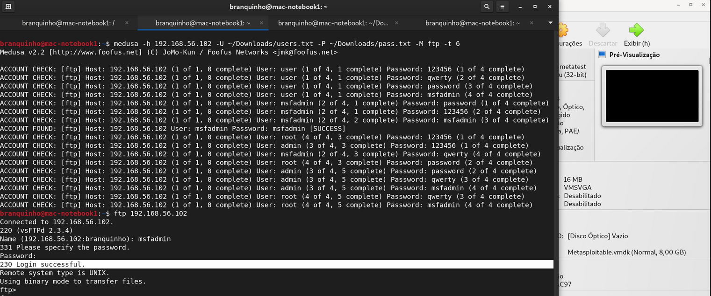


<br>

#### Tentando Comprometer o Sevidor WEB da VM Metasploitable-2 

Neste segundo teste de auditoria do servidor Metasploitable-2, a professora vai buscar tentar fazer o acesso da aplicação WEB por meio de força bruta, também com o uso da ferramenta Medusa. O nome segestivo da aplicação WEB do sistema Metasploitable-2 é **DVWA** que significa "Damn Vulnerable Web Application" do inglês ou Aplicação Web Muito Vulnerável, numa tradução geral para o português.


O servidor Web da VM pode ser acessado pelo seu endereço de IP, juntamente com o endereço do recurso no serviço, que no caso é a página de Login, presente na pasta do servidor DVWA: **192.168.56.102/dvwa/login.php**

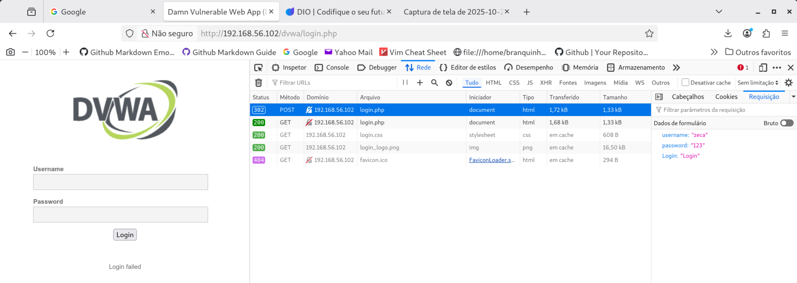


Assim, podemos ver na imagem acima o formulário de acesso para login na aplicação DVWA do Metasploitable-2, podendo ver ainda na tela o conselo do navegador aberto, no qual podemos fazer algumas observações:

- Que houve um tentativa de uma conexão com **POST**, que fora a tentativa feita de acesso à aplicação Web. Ademais, que ao buscar na Aba **Requisições** do console do navegador, podemos ver quais os valores usados para tentar a conexão: **Zeca** e **123**.
- Que após a falha de acesso descrita acima, foram feitas 4 conexões para remontar a página de formulário da aplicação web para a próxima tentativa de login. Em cada uma das 4 conexões, os seguintes recursos da página foram buscados: HTML, CSS, PNG e FAVICON (este último retirado do cache do navegador).  


Uma outra observação muito importante feita pela professora Isadora, diz respeito às informações observadas anteriormente na aba de requisições da primeira tentativa de login. Assim, da mesma forma que antes observamos os valores que foram usados na tentativa de acesso, agora a professora aponta que, para a construção do modelo das listas de palavras a serem utilizadas pela ferramenta Medusa, que é preciso em primeiro lugar observar os campos utilizados como retorno pela aplicação web DVWD!


Nesse sentido, a professora observa estes próximos 4 valores como sendo importantes, sendo que o quarto valor pode ser visto diretamente na página web remontada que aponta a falha de acesso ocorrida!:

1. **username**
2. **password** 
3. **Login** 
4. **failed**


```
$ medusa -h 192.168.56.102 -U users.txt -P pass.txt -M http \
-m PAGE:'/dvwa/login.php' \
-m FORM:'username=^USER^&password=^PASS^&Login=Login' \
-m 'FAIL=Login failed' -t 6
```


No comando acima, temos na primeira parte o mesmo formato já visto no uso de força bruta com o Medusa para acessar o servidor FTP. E podemos ver que os mesmos arquivos de listas de palavras utilizados lá, foram reutilizados aqui!


Na sequência, observamos na flag **-M** que agora o módulo usado é o **HTTP**, sendo que o comando continua utilizando uma barra invertida, **"\"**, que no terminal do Linux faz uma quebra de linha permitindo a continuação do comando, de forma que a seguir temos a flag **-m** usada três vezes seguidas:

1. Passa para o comando aquele mesmo caminho do recurso da página de Login já visto anteriormente.
2. Temos a forma de declaração para o preenchimento do formulário pelo Medusa:
    - Vemos que foram usadas aqui aquelas informações retiradas da aba **Requisições** vista no console do navegador web: **username**, **password** e **Login**, sendo que as duas palavras passadas entre os acentos circunflexos serão justamente os campos a serem substituídos pelas palavras candidatas tiradas das litas passadas.
3. Temos aqui o uso da informação que irá indicar para a ferramenta que a tentativa foi uma falha, ou seja, quando a requisição da página de formulário enviado retorna o texto **Login failed** (como pode ser visto diretamente lá na página web apresentada acima).

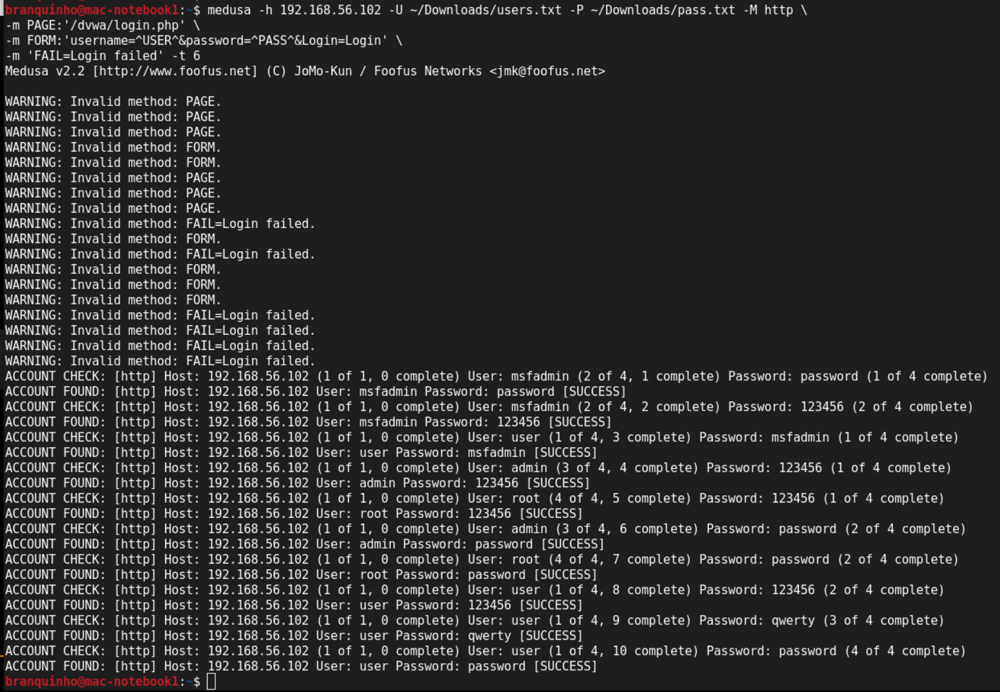


E abaixo:

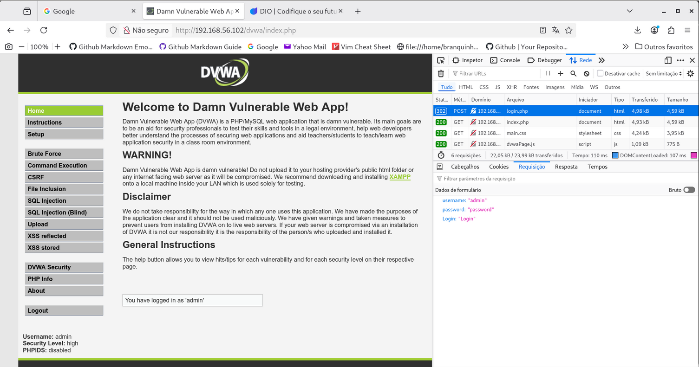 

Importante notar no teste de login visto na imagem acima, foi o fato de que o primeiro valor apresentado pela ferramenta Medusa como tendo sido bem sucedido, não permitiu o acesso à aplicação!? 


E pesquisando no Google com o Gemini, é dito lá que existe a possibilidade de serem retornados valores de **falso positivo** em função de uma especificação não tão consistente dos valores de retornos de falhas formatados diretamente no comando do Medusa, seja em função de diferenças em relação à própria sessão web com o servidor, como, questões como redirecionamentos, "time delays", tolkens, etc.


De qualquer forma, podemos ver lá na imagem que mostra o acesso bem sucedido ao servidor Web do Metasploitable-2, que os valores aceitos foram **admin** e **password**, vistos ali na aba **Requisições** do console do navegador.    


<br> 

#### Ataque de Enumeração e Spray Contra o Seviço SMB do Metasploitable-2

De acordo com o Google, o serviço SMB, ou Server Message Block, pode ser descrito como sendo um protocolo de rede que permite o compartilhamento de arquivos, impressoras e outros recursos em uma rede de computadores.


Assim, esse serviço seria usado por diversos sistemas operacionais para que computadores possam acessar dados em servidores ou outros dispositivos (como imporessoras) de forma remota. Observe ainda que a arquitetura de protocolo funciona segundo o modelo Cliente-Servidor, na qual clientes enviam solicitações de acesso a um servidor, o qual recebe e processa as solicitações para o compartilhamento de recursos. Ademais, interessante de se destacar que o protocolo SMB se encontra atual em sua versão **3.1.1**.


Já com relação ao tipo de ataque chamado de **Password Spraying** ou "Pulverização de Senhas" é descrito pelo site da [Kaspersky](https://www.kaspersky.com.br/resource-center/definitions/what-is-password-spraying) como sendo um ataque de força bruta em que um indivíduo busca ter acesso a recursos repetindo uma mesma senha em diversas constas antes de mudar de senha para fazer uma nova rodada de tentativas.


E é interessante notar justamente esse modo de operação desse tipo de ataque, porque ao fazer um ataque disperso de uma senha em numerosas contas, o ataque evita os bloqueios de usuários usados como segurança por muitas aplicações para proteger o acesso contra múltiplas tentativas falhas de acesso. 
 

Finalmente, o artigo da Kaspersky alerta para três tipos de sinais característicos para serem observados pelas equipes de seguranças:

1. Um alto volume de atividades de login em curto período.
2. Um pico de tentativas de login fracassadas por usuários ativos.
3. Logins de contas não existentes ou inativas.


Como forma de proteção para esses tipos de ataques, o site recomenda:

- Implementação de uma política de senha forte.
- Configuração de detecção de logins
- Garantir um política equilibrada para bloqueio e desbloqueio de contas em função de tentativas múltiplas de acesso falhas.
- Abordagem de segurança de Confiança Zero
- Uso de nomes de usuários que saiam de padrões e convenções (ou seja, facilmente dispostos em listas)
- Ulitização de Múltiplos Fatores de acesso
- Utilização de gerenciadores de senhas para os usuários


Assim, como visto acima entre, umas das formas indicadas para prevenção de riscos de segurança relacionados com acessos ilegítimos, estaria a detecção e o análise de logins de acesso aos sistemas e recursos. É por isso então que uma das formas utilizadas por invasores para lidar com tais restrições estaria no uso de um processo para a enumeração de usuários.


Anteriormente, nós já havíamos discutidos processos de varredura e enumeração de sistemas e serviços, de modo que aqui a ideia é também de aumentar o conhecimento acerca de uma operação de ataque, bem como de diminuir a "pegada" deixada nos logs de acessos acusando também as tentativas de acesso de contas de usuários inexistentes ou inativas.


E, para essa ação de enumeração e coleta de dados em sistemas Windows e para o protocolo SMB (e a ferramenta Samba), existe a ferramenta chamada **enum4linux**, capaz de automatizar todo esse processo de varredura e de coleta de dados. Os tipos de informações que a ferramenta pode retornar são:

- Informações sobre usuários e grupos
- Recursos compartilhados ou Shares
- Informações do sistema operacional
- Política de senhas
- Enumeração de nomes NetBIOS

```
$ enum4linux -a 192.168.56.102 | tee enum4linux_output.txt
```


Vemos no comando acima a passagem do endereço IP da VM como parâmetro, bem como o uso do comando **tee** do Linux para passar os resultados também para um arquivo txt.

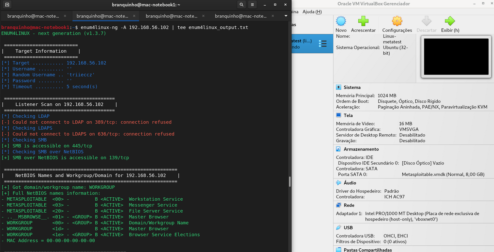


Observando a imagem acima, podemos ver dois pontos interessantes, em que o primeiro é a grande quantidade de informações trazidas pela ferramenta **enum4linux** sobre os recursos e os dispositivos rodadndo aplicações SMB e NetBIOS. Ademais, podemos observar que ali no meu terminal foi utilizada a versão da ferramenta **enum4linux-ng**, porque o pacote da ferramenta original não está presente no repositório oficial do Debian, de modo que foi preciso fazer a instalação manual da ferramenta a partir do projeto no GitHub que assim descreve sua ferramenta escrita em Python: **A next generation version of enum4linux**

> "enum4linux-ng.py is a rewrite of Mark Lowe's (former Portcullis Labs now Cisco CX Security Labs) enum4linux.pl, a tool for enumerating information from Windows and Samba systems, aimed for security professionals and CTF players. The tool is mainly a wrapper around the Samba tools nmblookup, net, rpcclient and smbclient.

I made it for educational purposes for myself and to overcome issues with enum4linux.pl. It has the same functionality as the original tool (though it does some things differently). Other than the original tool it parses all output of the Samba tools and allows to export all findings as YAML or JSON file. The idea behind this is to allow other tools to import the findings and further process them. It is planned to add new features in the future."
> [enum4linux-ng](https://github.com/cddmp/enum4linux-ng)


A seguir, como nos outros casos de testes utilizando a ferramenta Medusa para o ataque de força bruta, a primeira etapa indicada pela professora Isadora fora de criar uma lista de usuários recolhendo informações diretamente a partir das informações recuperadas pela ferramenta enum4linux.


Assim, a professora escolheu os seguintes usuários para fazer teste de acesso, lembrando que o uso de listas específicas para cada ação, não apenas aumenta a possibilidade de sucesso da operação, como também diminui a quantidade de ruído gerado nos sistemas alvos, o que poderia gerar um alerta de intrusão:

```
$ echo -e 'user\nmsfadmin\nservice' > smb_users.txt
``` 


E, para as senhas:

```
$ echo -e 'password\n123456\nWelcome123\nmsfadmin' > senhas_spray.txt
```

Já os comandos do Medusa para o teste de auditoria do serviço SMB e para o acesso manual:

```
$ medusa -h 192.168.56.102 -U smb_users.txt -P senhas_spray.txt -M smbnt -t 2 -T 50
``` 


E:

```
$ smbclient -L //192.168.56.102 -U msfadmin
```


Observe nesse interessante comando passado, em que são passadas duas flags para controle de concorrência, **-t 2** e **-T 50**! Muito embora essa segunda flag não faça muito sentido nesse pequeno estudo de caso em que é feita auditoria em apenas um único host, para casos reais em que existissem múltiplos hosts para serem testados, a flag passada permitiria até cinquenta testes de hosts concorrentes, com cada host podendo ser testado concorrentemente para duas contas de login.

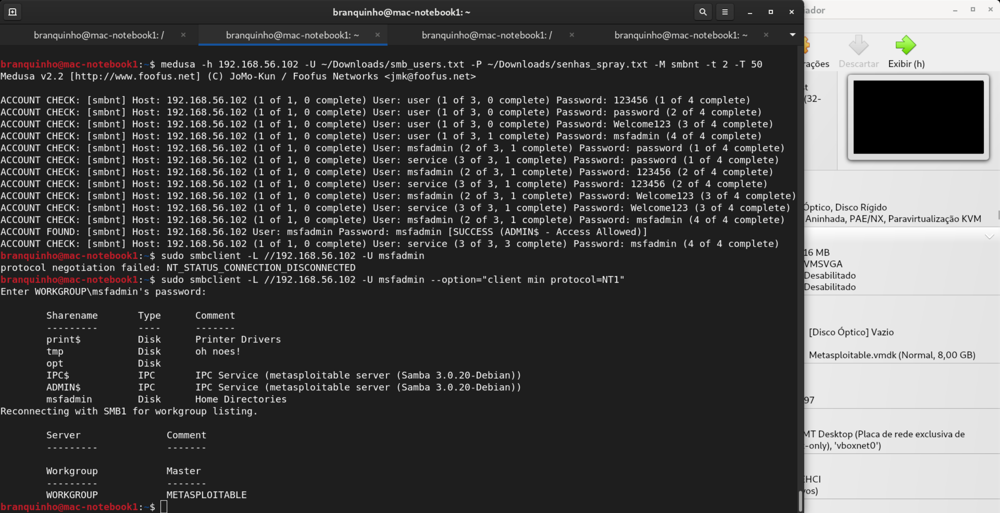


Podemos notar na imagem acima que a ferramenta Medusa consegue encontrar acesso para uma conta, do usuário **msfadmin**, com a senha **msfadmin**. Na sequência é passado o comando para testar manualmente o acesso ao recurso SMB, contudo ocorre um problema, pois ocorre um problema de negociação para o recurso SMB e a desconexão na sequência!


Buscando no Google, tal problema estaria relacionado a diferença de versões entre os recursos SMB tentando conversar, de modo que o meu recurso instalado no Debian para teste, por ser mais atualizado e seguro, não aceitou a conexão com o recurso com a atualização defasada e insegura! Portanto, fora necessário optar taxativamente pelo uso da flag **--option** para definir a versão 1 do protocolo SMB para a conexão, que depois ocorre sem problemas, mostrando que o Medusa havia realmente quebrado com sucesso a senha de acesso para o recurso SMB do Metasploitable-2. 

 
<br>

## Outros links:

 - [linkedin:] https://www.linkedin.com/in/marcus-vinicius-richa-183104199/
 - [Github:] https://github.com/ahoymarcus/
 - [My Old Web Portfolio:] https://redux-reactjs-personal-portfolio-webpage-version-2.netlify.app/


