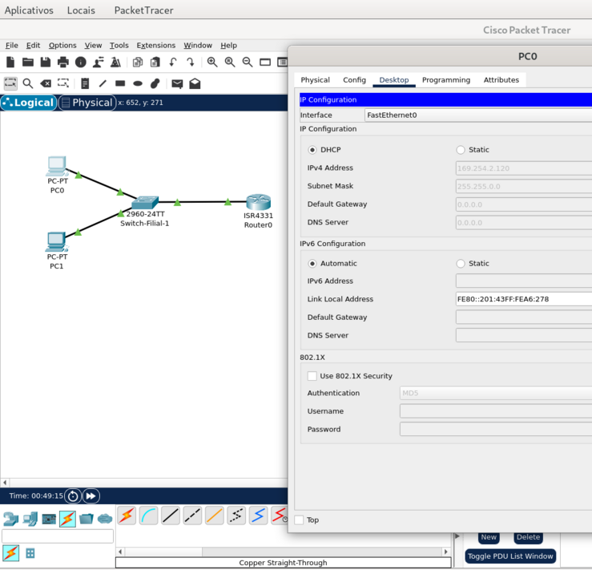
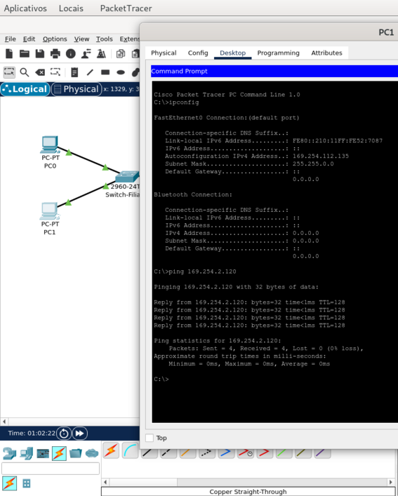
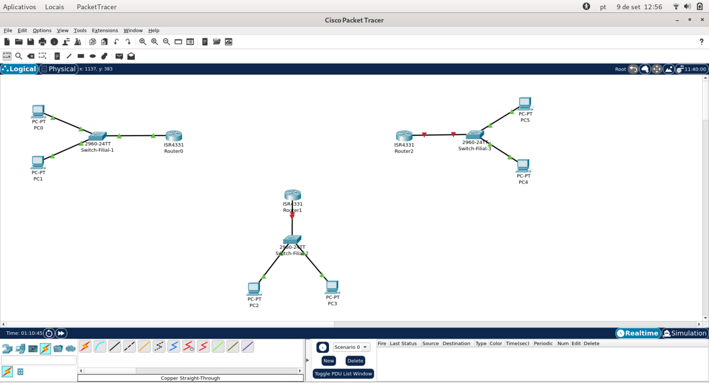
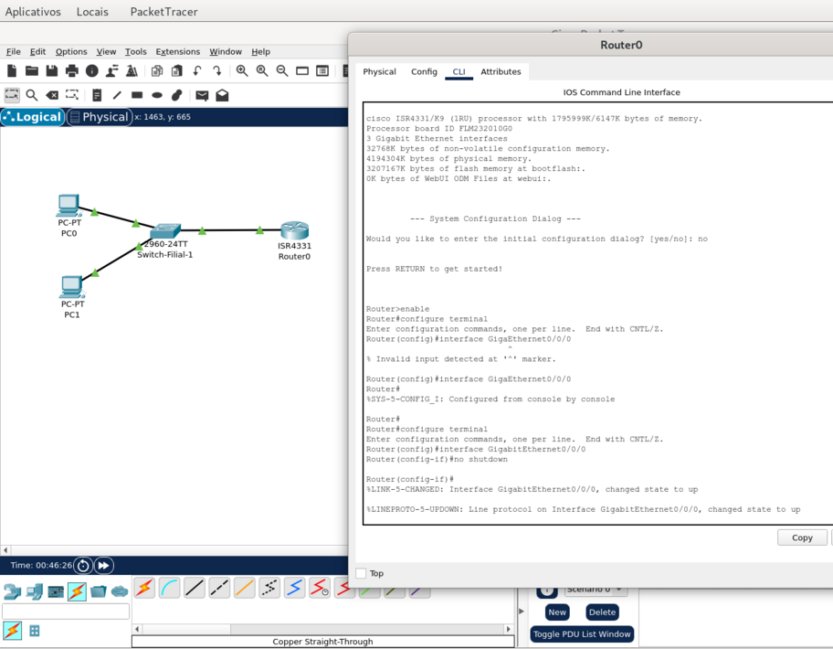
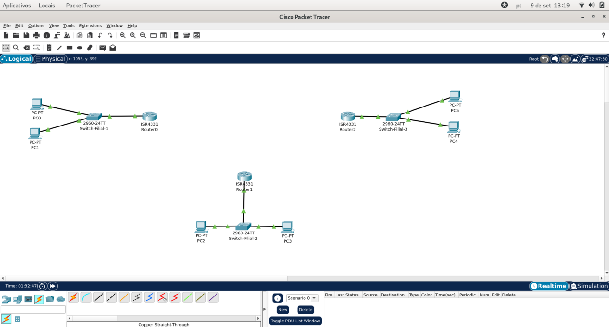
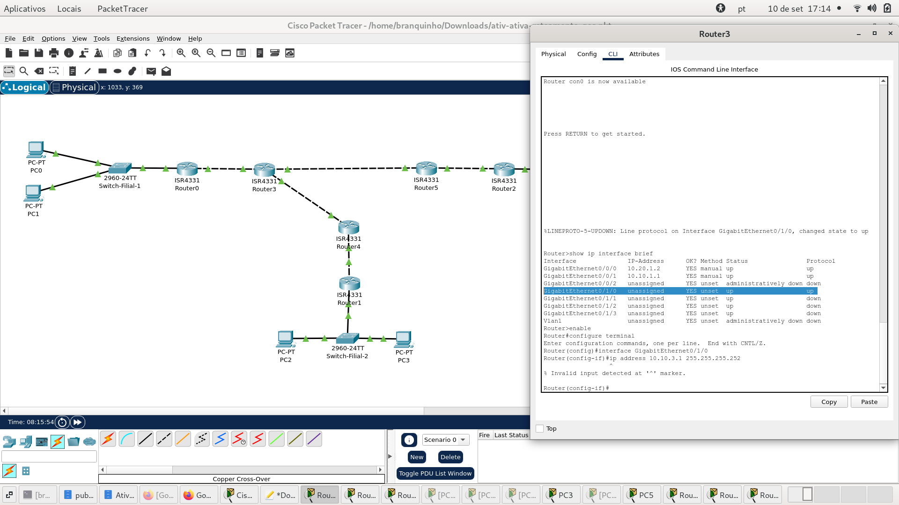
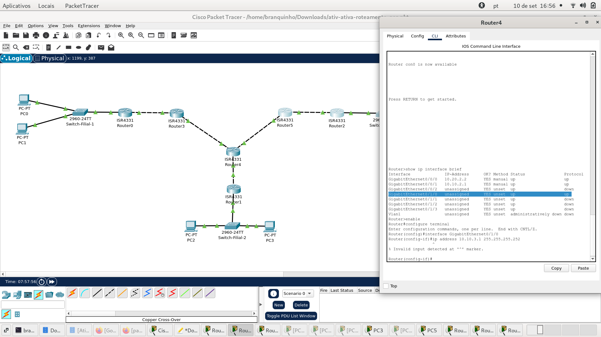
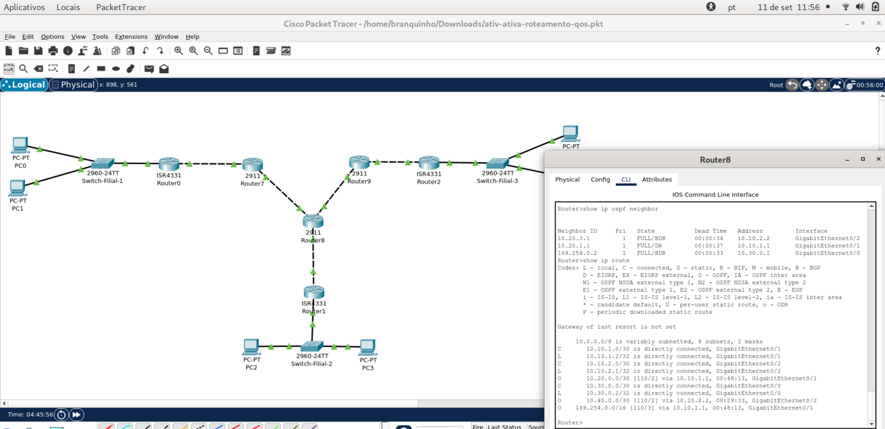
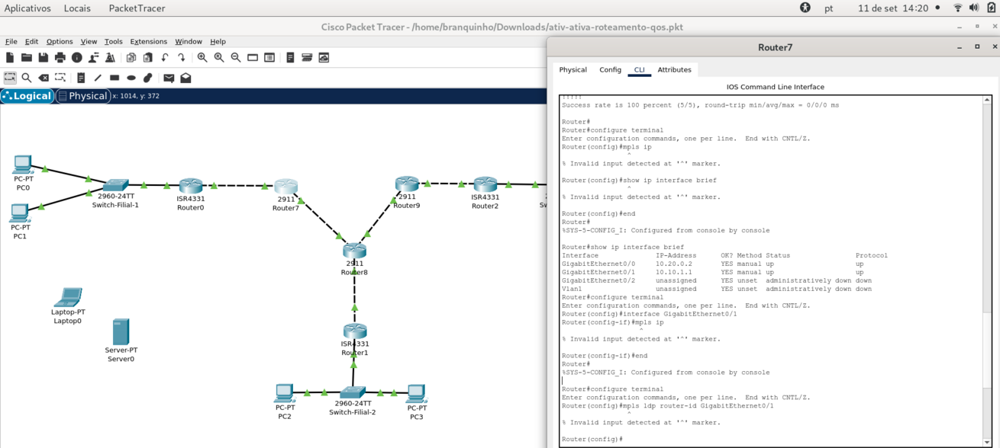

# Criando e Configurando uma Rede com QoS (OSPF e MPLS)
 
Olá, neste projeto do Curso de **Rede de Computadores** da faculdade IESB, eu tenho o desafio de criar e configurar uma rede de uma empresa como QoS, de modo que para a obtenção desse resultado serão usados os protocolos OSPF e MPLS, ademais, serão usandos como base para este projeto o sistema operacional Debian Linux e a aplicação de simulação de redes da CISCO PacketTracer.


Requisitos do Projeto:

1. **Criar três LANs para representar as três filiais de uma empresa**
2. **Usar roteamento dinâmico OSPF: IPv4 e IPv6**
3. **Configura MPLS**
4. **Aplicar QoS para priorizar videoconferência e chamadas de voz**


<br>

## Construindo o Projeto

Como determinam os requisitos para este projeto, a topografia básica desta rede da empresa deve ter pelo menos três LANs para representar cada uma das redes locais das filiais da empresa, de forma que o primeiro passo, então, para este projeto fora construir separadamente cada uma das LANs individualmente.


<br>

### Criando a Topologia Básica das LANs da Empresa

Assim, para dar partida na construção dessa infraestrutura de rede das filiais, fora utilizado um switch que liga alguns hosts a um roteador gateway para representar cada uma dessas LANs.


O procedimento utilizado fora de se escolher os ícones de computadores desktops, switchs e roteador, no PacketTracre da Cisco, para fazer manualmente a conexão de cada dispositivo, lembrando que parte dos requisitos deste projeto é que fossem utilizados endereçamento IPv4 e IPv6.


Dessa forma, cada um dos hosts fora conectado ao switch por meio de cabos **Straight-Through**, nas portas FastEthernet, enquanto cada swicht fora ligado ao seu roteador de gateway por meio das portas GigaEthernet.  


Ademais, para que cada host pudesse receber endereços privados IPv4 e IPv6, fora preciso mudar as configurações dos hosts de endereçamento estático para endereçamento dinâmico por meio do protocolo DHCP:
 



<br>

Podemos ver a seguir que não apenas os endereços privados foram configurados pelo servidor DHCP, como a conexão já estaria pronta, tendo sido testada por meio do comando ping:

```
C:\>ipconfig

FastEthernet0 Connection:(default port)

   Connection-specific DNS Suffix..: 
   Link-local IPv6 Address.........: FE80::210:11FF:FE52:7087
   IPv6 Address....................: ::
   Autoconfiguration IPv4 Address..: 169.254.112.135
   Subnet Mask.....................: 255.255.0.0
   Default Gateway.................: ::
                                     0.0.0.0

Bluetooth Connection:

   Connection-specific DNS Suffix..: 
   Link-local IPv6 Address.........: ::
   IPv6 Address....................: ::
   IPv4 Address....................: 0.0.0.0
   Subnet Mask.....................: 0.0.0.0
   Default Gateway.................: ::
                                     0.0.0.0

C:\>ping 169.254.2.120

Pinging 169.254.2.120 with 32 bytes of data:

Reply from 169.254.2.120: bytes=32 time<1ms TTL=128
Reply from 169.254.2.120: bytes=32 time<1ms TTL=128
Reply from 169.254.2.120: bytes=32 time<1ms TTL=128
Reply from 169.254.2.120: bytes=32 time<1ms TTL=128

Ping statistics for 169.254.2.120:
    Packets: Sent = 4, Received = 4, Lost = 0 (0% loss),
Approximate round trip times in milli-seconds:
    Minimum = 0ms, Maximum = 0ms, Average = 0ms
```




<br>

Contudo, como pode ser visto nesta próxima imagem geral da topologia da empresa, podemos observar que os roteadores, via de regra, vem com as suas portas ou interfaces desativadas por padrão por razões de administração, de modo que essas interfaces precisam ser ligadas manualmente a partir da CLI.




<br>

Nesse sentido, temos abaixo a imagem com a configuração no terminal CLI de um dos roteadores os comandos necessários para abilitar a porta/interface da rede interna da LAN: 



```
Router>enable
Router#configure terminal
Enter configuration commands, one per line.  End with CNTL/Z.
Router(config)#interface GigabitEthernet0/0/0
Router(config-if)#no shutdown

Router(config-if)#
%LINK-5-CHANGED: Interface GigabitEthernet0/0/0, changed state to up

%LINEPROTO-5-UPDOWN: Line protocol on Interface GigabitEthernet0/0/0, changed state to up
```


<br>

Finalmente, vermos a imagem com a visão geral da topologia da empresa com cada uma de suas três LANs plenamente funcionais!




<br>

### Fazendo a Conexão dos Roteadores Gateway das LANs da Empresa 


A primeira tarefa a ser feita para pode iniciar a interligação das três LANs das filias da empresa seria decidir sobre o design do uso dos roteadores para o projeto da rede.


Nesse caso, a ideia seria de se adicionar um roteador para cada filial para que eles pudessem fazer o papel de **roteadores de borada**, este roteadores que seriam, então, conectados uns aos outros da rede da empresa, enquanto o roteador original permanecendo apenas como um roteador Gateway simple para a sua respectiva LAN.


Duas razões que tratam de **Boas Práticas** poderiam justificar essa escolha:

1. **Melhorar a redundância da topologia**
2. **Melhorar a escalabilidade da rede**


Nesse sentido, no caminho de preparar os roteadores Gateway de cada LAN para se conectarem à rede principal da empresa, elas precisam primeiramente fazer uma expansão para adicionar novo módulo de portas para as conexões necessárias.


Os passos para fazer a modança são:

1. **Desligar os roteadores**
2. **Buscar na Aba Physical de sua interface o novo módulo desejado: NIM-ES2-4**


A razão pela escolha desse módulo em particular, **NIM-ES2-4**, tem haver com a topologia mais simples da rede sendo criada, que precisa apenas das portas extras para poder completar todas as conexão necessárias! 

> [!IMPORTANT]
> Após desligar o roteador e fazer a adição do novo módulo, é importante reativar as portas novamente, da mesma forma que fora feito anteriormente neste projeto! 


Finalmente, é preciso estabelecer endereços IPs para as portas internas das LANs dos roteadores gateways das filiais:

```
enable
configure terminal
interface GigabitEthernet0/0/0
ip address 169.254.0.2 255.255.0.0
no shutdown
end
```


E observe que para a porta externa do Gateway será usado um padrão de IP diferente para facilitar a memorização da configuração: 10.20.0.1/30 - 10.30.0.1/30 - 10.40.0.1/30

```
enable
configure terminal
interface GigabitEthernet0/0/1
ip address 10.(x)0.0.1 255.255.255.0
no shotdown
end
``` 


<br>

### Conectando as Redes LANs da Empresa e Configurando o Roteamento OSPF

Agora, então, que as redes LANs estão com a sua estrutrua básica funcionando:

- Hosts e dispositivos
- Switch
- Roteador Gateway


Devemos trazer os novos roteadores, como fora proposto acima, para ocuparem a posição de roteadores de bordas, de olho naquelas vantagens citadas acima: redundância e escalabilidade.


Os novos roteadores terão os mesmos recursos que os outros, ou seja, serão também roteadores do tipo **ISR4331** e terão incorporados o módulo **NIM-ES2-4**, e também precisarão ter as suas portas conectadas ativadas!


Novamente, juntamente com a ativação das novas portas que são conectadas entre os roteadores de borda das filiais entre si, é preciso também definir um endereço para o roteador, dentro do que seria a rede formada entre dois roteadores de borda! E para tanto será usada uma rede de **/30**, porque pelo cálculo de redes e de hosts, haverá 30 bits sendo usados para a rede e apenas 2 para os hosts, de modo que: 2 ^ 2 = 4 endereços. Assim, supondo o uso de um endereço como: **10.10.1.0/30**

- Endereço de rede: 10.10.1.0
- Primeiro roteador: 10.10.1.1
- Segundo roteador: 10.10.1.2
- Endereço de broadcast: 10.10.1.3


E a configuração completa para as três filiais ficaria assim: 
    - Portas internas: 10.20.0.2/30 - 10.30.0.2/30 - 10.40.0.2/30
    - Portas externas: 10.10.1.0/30 - 10.10.2.0/30


- **Portas internas:**

```
enable
configure terminal
interface GigabitEthernet0/0/1
ip address 10.(x)0.0.2 255.255.255.252
no shutdown
end
```


- **Portas externas:**

```
enable
configure terminal
interface GigabitEthernet0/0/1
ip address 10.10.(x).1 255.255.255.252
no shutdown
end
```

> [!NOTA]
> Lembrar que o mesmo procedimento que tem sido feito para definir o enderaçamento de um roteador, deve ser repetido para todos os roteadores, pertencentes às três LANs! 


Agora, que temos todas as 3 LANs estruturadas e os roteadores Gateway e Borda configurados com seus endereços IPs, precisamos, ainda, para que os roteadores possam conversar, primeiramente iniciar a configuração do processo de roteamento com o OSPF.


Mas buscando simplificar o processo, as Filiais 1 e 2 serão conectadas primeiramente! De qualquer forma a base da configuração seria a mesma para o grupo de roteadores Gateway e Borda.


Assim, começando com a configuração de Borda:

```
enable
configure terminal
router ospf 1

network 169.254.0.0 0.0.255.255 area 0
network 10.(x)0.0.0 0.0.0.3 area 0
network 10.10.(x).0 0.0.0.3 area 0
end
```


Assim, alguns pontos a serem observados acima são:

- Habilitar o processo OSPF: router ospf 1
- Anunciar as rotas do roteador, bem como a área definida para a rede:
    - Anúncio da rota da LAN
    - Anúncio da rota Gateway <-> Borda
    - Anúncio da rota Borda <-> Borda


Observe ainda que o valor para a Área escolhi foi **0**, porque nesse caso toda essa topologia estarira sendo tomada como uma única parte central!


Ademais, é importante observar que o valor da máscara da rede anunciado no comando **network** do OSPF é representado na forma de **Wildcard Mask**, ou seja, ele é anunciado com os valores invertidos em relação aos valores da máscara padrão! 


E, agora, com a configuração do Gateway:

```
enable
configure terminal
router ospf 1
network 169.254.0.0 0.0.255.255 area 0
network 10.(x)0.0.0 0.0.0.3 area 0
end
``` 


Assim, usando os comandos abaixo, podemos ver que os roteadores das filiais 1 e 2 estão trocando informação, bem como coda roteador de borda conhece a sua respectiva rede LAN:

- **show ip ospf neighbor**
- **show ip route**


<br>

Interessante notar ainda que, como pode ser visto na imagem das CLIs acima, cada Roteador de Borda, reconhece a existência de uma LAN como vizinha através do outro Roteador de Borda. E podemos também confirmar tudo isso observando a tabela de rotas de um e de outro roteador, cada qual mostrando uma rota OSPF específica ali! 


- **Filial-1**: 

```
Router>show ip ospf neighbor
Neighbor ID Pri State Dead Time Address Interface
169.254.0.2 1 FULL/BDR 00:00:38 10.20.1.1 GigabitEthernet0/0/0
Router>show ip route Gateway of last resort is not set

Router>show ip route
[...]
10.0.0.0/8 is variably subnetted, 4 subnets, 3 masks
C 10.10.1.0/30 is directly connected, GigabitEthernet0/0/1
L 10.10.1.1/32 is directly connected, GigabitEthernet0/0/1
C 10.20.0.0/16 is directly connected, GigabitEthernet0/0/0
L 10.20.1.2/32 is directly connected, GigabitEthernet0/0/0
O 169.254.0.0/16 [110/2] via 10.20.1.1, 00:04:14, GigabitEthernet0/0/0 Filial-2: Router>show ip ospf neighbor
```

<br>

- **Filial-2**:

```
Router>show ip ospf neighbor
Neighbor ID Pri State Dead Time Address Interface
169.254.0.2 1 FULL/BDR 00:00:34 10.20.2.1 GigabitEthernet0/0/0

Router>show ip route Gateway of last resort is not set
[...]
10.0.0.0/8 is variably subnetted, 4 subnets, 3 masks
C 10.10.2.0/30 is directly connected, GigabitEthernet0/0/1
L 10.10.2.1/32 is directly connected, GigabitEthernet0/0/1
C 10.20.0.0/16 is directly connected, GigabitEthernet0/0/0
L 10.20.2.2/32 is directly connected, GigabitEthernet0/0/0
O 169.254.0.0/16 [110/2] via 10.20.2.1, 00:04:35, GigabitEthernet0/0/0 
```


<br>

Contudo, infelizmente, ao se tentar ligar a Filial-3 à essa rede já configurada com o protocolo de roteamento OSPF, um erro recorrente no PacketTracer esteve impedindo ativação de uma terceira porta para o Roteador de Borda que serviria de entroncamento para a Filial-3. 


Observe, ainda, que isso aconteceu independentemente de se escolher o roteador de borada da filial-1 ou da filial-2 para fazer essa conexão, independentemente também de haver portas disponíveis igualmente em cada um deles! E, abaixo, temos o bug potencial ao se tentar fazer a ativação e endereçamento da terceira porta do de cada um dos roteadores de borda para receberem a conexão da filial-3! 


Primeiro, tentando a ligação pelo Router4 da Filial-2:




<br>

E agora tentando a ligação também com o Router3 da Filial-1, embora tendo exatamente o mesmo erro visto acima:




<br>

É possível ver que, em ambos os casos, há portas disponíveis e que é tentada a ativação de uma terceira porta do roteador usando do mesmo grupo de comandos repedidamente usados mais acima para realizar essas mesmas operações de ativação de porta com o seu endereçamento de rede!

```
enable
configure terminal
interface GigabitEthernet0/1/0 
ip address 10.10.3.1 255.255.255.252
```


<br> 

## Configurando o MPLS na Rede Filiais 1 e 2

Entendendo o papel do MPLS, temos que o roteamento, no caso feito através do protocolo OSPF, é a base e o responsável por fazer a topologia "conversar", uma vez que através desse protocolo os roteadores envolvidos no processo de gestão de rotas na rede conversam e trocam informações sobre a topologia, e, como visto, cada um monta a sua própria tabela de rotas e passa a ter uma fisão aguçada da rede como um todo!


O problema que, embora esse sistema seja extremamente inteligente e efetivo, ele também é custoso e demanda muito processamento que se repete e se acumula a cada novo roteador adicionado à topologia, de forma que temos aí consumo excessivo e de processamento e inevitável latência para o sistema em geral.


O protocolo MPLS vem para ajudar a solucionar a parte do problema que causa um consumo exagerado de processamento dos dispositivos, que é o roteamento propriamente dito! Neste caso, o MPLS vem com uma proposta de simplifiar o processo de roteamento que seria feito por cada roteador independentemente por meio da análise geral de toda a tabela de roteamento e cálculo de caminhos, que com a ajuda do MPLS poderia ser feito por um sistema de rotulagem no qual a maioria dos roteadores envolvidos no roteamento atuariam meramente como encaminhadores de pacotes, através do uso dos rótulos, sem precisar realizar outras operações custosas que necessariamente causariam latência a todo o sistema. 


Nesse sentido, então, os próprios roteadores de bordas das duas filiais já conectadas é que seriam a espinha dorsal desse novo sistema de roteamento, usando ambas a seguinte configuração:


```
enable
configure terminal
mpls lpd router-id GigabitEthernet0/0/1 force
mpls ip
```


Como pode ser visto na saída do comando abaixo da CLI para o roteador Filial-1, a interface GigabitEthernet0/0/1 é a porta de ligação externa de ambos os roteadores de borda:

```
Router>show ip interface brief
Interface              IP-Address      OK? Method Status                Protocol 
GigabitEthernet0/0/0   10.20.1.2       YES manual up                    up 
GigabitEthernet0/0/1   10.10.1.1       YES manual up                    up 
GigabitEthernet0/0/2   unassigned      YES unset  administratively down down 
GigabitEthernet0/1/0   unassigned      YES unset  up                    down 
GigabitEthernet0/1/1   unassigned      YES unset  up                    down 
GigabitEthernet0/1/2   unassigned      YES unset  up                    down 
GigabitEthernet0/1/3   unassigned      YES unset  up                    down 
Vlan1                  unassigned      YES unset  administratively down down
```


Mas infelizmente, como pode ser visto acima, parece que retorna o bug persistente, que pode ser do roteador **ISR4331** ou que pode ser do próprio PacketTracer!


<br>

### Tentando Debugar o Problema com os Roteadores

Para tentar dar proceguimento ao projeto, os roteadores de borda **ISR4331**, que precisavam de um módulo de expansão de portas, foram trocados pelo roteador **2911**, esse roteador tem inclusive a vantagem de já oferecer três portas, de modo que para o roteador de entroncamento para a filial-3, não haveria a necessidade de usar expansão de portas.


De qualquer forma, o processo agora é o mesmo, seguindo o mesmo padrão de endereçamento das portas internas e externas proposto acima:

- Portas internas dos roteadores de borda: 10.20.0.2/16 - 10.30.0.2/16 - 10.40.0.2/16
- Portas externas dos roteadores de borda: 10.10.1.1/30 - 10.10.1.2/30 - 10.10.2.1/30 e 10.10.2.2/30


E felizmente esse passo do debugamento para o roteamento da rede funcionou até aqui, de modo que a troca pelo roteador **2911**, já permitira inclusive a ligação física e a ativação das portas e endereços também para a conexão da Filial-3 ao projeto.


Agora, com a configuração completa da topologia das três filiais da empresa, a configuração do OSPF ficaria assim:

- **Filial-1:**

```
enable
configure terminal
router ospf 1
network 169.254.0.0 0.0.255.255 area 0
network 10.20.0.0 0.0.0.3 area 0
network 10.10.1.0 0.0.0.3 area 0
end
```


- **Filial-2:**

```
enable
configure terminal
router ospf 1
network 169.254.0.0 0.0.255.255 area 0
network 10.30.2.0 0.0.0.3 area 0
network 10.10.1.0 0.0.0.3 area 0
network 10.10.2.0 0.0.0.3 area 0
end
```


- **Filial-3:**

```
enable
configure terminal
router ospf 1
network 169.254.0.0 0.0.255.255 area 0
network 10.40.3.0 0.0.0.3 area 0
network 10.10.2.0 0.0.0.3 area 0
end
```


Lembrando de fazer o mesmo para os roteadores Gateway de cada filial, mas primeiro removendo a configuração parcial anterior:

```
enable
configure terminal
no router ospf 1
end
```


E agora a configuração dos gateways ajustando o endereço para cada filial:

```
enable
configure terminal
router ospf 1
network 169.254.0.0 0.0.255.255 area 0
network 10.(x)0.0.0 0.0.0.3 area 0
end
```


E agora parece termos uma rede completa com três filiais gerenciadas pelo OSPF! Abaixo, na imagem, vemos que o Roteador de Borda da Filia-2 que serve de entroncamento entre as duas LANs, tem informações de sua vizinhança, onde tudo possue o estado perfeito de **Full**, bem como a sua tabela de rotas em que observamos as rotas marcadas com **'O'** para o **OSPF**:




<br>


A partir do roteador de borda da Filial-1, foi inclusive possível testar a conexão para o roteador de borda da Filial-3 com um comando **ping**:

```
Router#ping 10.10.2.2
Type escape sequence to abort.
Sending 5, 100-byte ICMP Echos to 10.10.2.2, timeout is 2 seconds:
!!!!!
Success rate is 100 percent (5/5), round-trip min/avg/max = 0/0/0 ms
```


<br>

### Voltando à Configuração do Protocolo MPLS

Sanado o problema com o roteador **ISR4331** com a troca pelos roteadores **2911** para a borda da topologia da empresa, agora é o momento de buscar implementar aquela vantagem funcional de voteamento que o MPLS pode trazer para a eficiência e para a economia de recursos de roteamento!


Infelizmente, a ferramenta do Packet Tracer não parece suportar o uso do protocolo MPLS:

```
Router#configure terminal
Enter configuration commands, one per line.  End with CNTL/Z.
Router(config)#mpls ip
                ^
% Invalid input detected at '^' marker.
```


Ou ainda a passagem de um comando mais completo:

```
Router#show ip interface brief
Interface              IP-Address      OK? Method Status                Protocol 
GigabitEthernet0/0     10.20.0.2       YES manual up                    up 
GigabitEthernet0/1     10.10.1.1       YES manual up                    up 
GigabitEthernet0/2     unassigned      YES unset  administratively down down 
Vlan1                  unassigned      YES unset  administratively down down
Router#configure terminal
Enter configuration commands, one per line.  End with CNTL/Z.
Router(config)#interface GigabitEthernet0/1
Router(config-if)#mpls ip
                   ^
% Invalid input detected at '^' marker.
```




<br>

Desse modo, pensando apenas no código necessário para configurar as filiais da empresa, poderiamos ter:

- **Filial-1:**

```
enable
configure terminal
mpls ip
interface GigabitEthernet0/1
mpls ip
end
```


- **Filial-2:**

```
enable
configure terminal
mpls ip
interface GigabitEthernet0/1
mpls ip
interface GigabitEthernet0/2
mpls ip
end
```


- **Filial-3:**

```
enable
configure terminal
mpls ip
interface GigabitEthernet0/1
mpls ip
```


Observando as configurações acima, vemos que a filial-2 por funcionar como entroncamento para a ligação entre as três LANs, seria justamente a que possuiria mais portas a serem configuradas para o serviço MPLS.


Ademais, pelo que se pode ser entendido de todo esse processo de roteamento avançado com MPLS, ele operaria por sobre essa topologia de rede a partir dos Roteadores de Borda, que é onde a configuração recairia na topologia, porque estes roteadores de borda é que seriam os responsáveis por operar e gerenciar todo roteamento por rótulos para acelerar o tráfego de entrada e de saída para cada uma das LANs!


Do outro lado, os Roteadores Gateway internos para as LANs operarariam apenas da forma tradicional, ou seja, trabalhando por sobre o endereçamento IP, na medida em que eles cuidariam de um número mais reduzido de dispositivos, os quais estariam ligados a ele diretamente, uma vez que ele seria justamente o roteador responsável por ligar as redes LANs internas com as demais redes. E internamente própria rede ou LAN seque é preciso haver roteamento, pois todos os dispositivos podem ser alcanados via Camada 2 do modelo TCP-IP!


<br>

### Partindo para a Configuração Final de QoS

Levando em conta as limitações da ferramenta Packet Tracer, essa parte da construção da topologia da rede da empresa também será criada apenas a partir dos códigos de configuração!


Nesse sentido, podemos entender que o serviço de QoS é mais uma forma de aprimorar o serviço geral de uma rede de computadores para tirar dela a melhor experiência, garantindo um uso eficiente e bem gerido de recursos. E isso é possível na medida, que embora todo o tráfego que corre em uma rede seja importante de uma forma geral, nem todo ele é igual e apresenta os mesmos requisitos e limitações! 


Assim, mesmo uma grande rede, com uma generosa infraestrutura de vazão para os dados poderia ter problemas ao tentar processar tudo nela igualmente e de uma única vez, ou poderia do outro lado, ficar extremamente ociosa, porque matém uma quantidade absurda de recursos disponibilizados esperando para serem usado durante pequenos picos de tráfego, mas voltando às taxas normais de baixo uso de rede na maior parte de sua operação.


É por isso, então, que o QoS poderia ser tão efetivo no emprego da gestão de uma rede de computadores, porque ele permitiria justamente fazer um uso inteligente e racionalizado dos recursos básicos da rede existes nos momentos de pico de tráfego, priorizando o tráfego de pacotes mais críticos nesses momentos, sem exigir que a rede tivesse que escalar demasiadamente, de modo que tivesse que operar com um gasto proibitivo de recursos, mesmo nos momentos que não envolvessem pico de tráfego, mas que, ao contrário, teriam provavelmente uma grande ociosidade de uso! 
 

E para alcançar esse objetivo de tratar diferentemente o tráfego da rede, privilegiando os pacotes e as transmissões mais críticas e mais sensíveis para o negócio da empresa, é que o QoS precisaria trabalhar com três operações bem específicas:

1. **Classificação:** identificar e dar a conhecer o que seria prioritário e mais sensível.
2. **Marcação:** etiquetar o tráfego na forma como o tráfego de uma rede é priorizado.
3. **Aplicação:** aplicar a política de QoS definida na Classificação e Marcação para ser aplicada na Interface correta do roteador responsável pelo serviço.


E, novamente, essa configuração deve ser feita nos Roteadores de Borda da rede dessa empresa, especificamente na porta ou interface de entrada da LAN (que é a porta/interface que estará diretamente ligada ao roteador gateway de uma rede local ou LAN).


- **Passo-1: Classficação** 

```
class-map match-any VOICE_TRAFFIC
match protocol rtp

class-map match-any VIDEO_TRAFFIC
match protocol h323
```

- **Passo-2: Marcação**

```
policy-map QOS_POLICY

class VOICE_TRAFFIC
set dscp ef

class VIDEO_TRAFFIC
set dscp af41
``` 

- **Passo-3: Aplicação**

```
interface GigabitEthernet0/0
service-policy input QOS_POLICY
```


> [!NOTA]
> Observe que, essa configuração pode ser automatizada na forma da criação de um script, que poderia começar com os comandos **'enable'** e **'configure terminal'** e finalizar com o comando **'end'**, ao invés de se aplicar tudo manualmente, o que é um processo mais propenso a erro!


<br>

## Outros links:

 - [linkedin:] https://www.linkedin.com/in/marcus-vinicius-richa-183104199/
 - [Github:] https://github.com/ahoymarcus/
 - [My Old Web Portfolio:] https://redux-reactjs-personal-portfolio-webpage-version-2.netlify.app/


