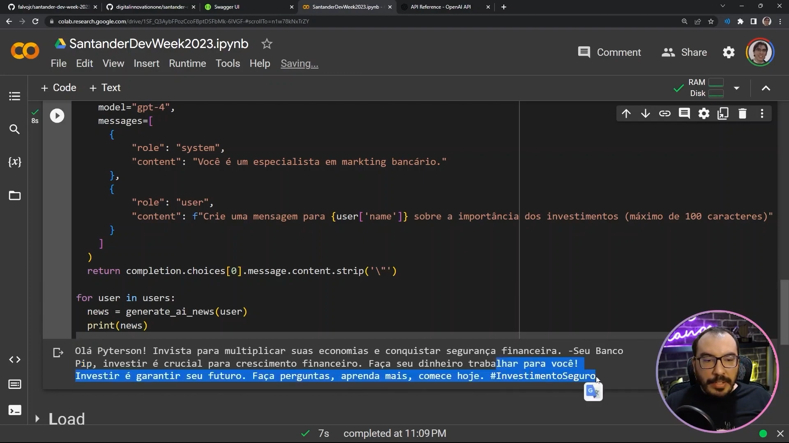
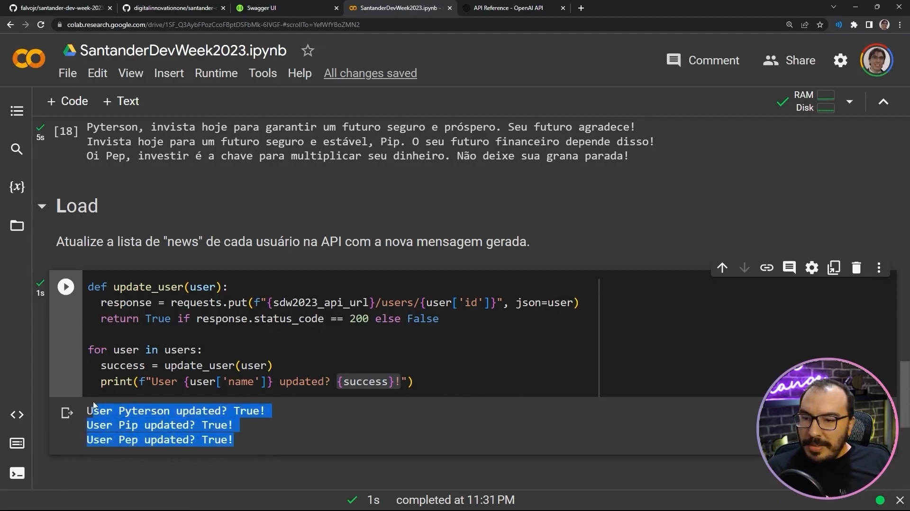

# Explorando IA Generativa em um Pipeline de ETL com Python - Desafio 
 
Olá, este é o meu repositório do desafio de IA Generativa em um Pipeline de ETL com Python, do bootcamp "TOTVS - Fundamentos de Engenharia de Dados e Machine Learning" da Dio.me! 


<br>

## Entendendo o Problema

Neste laboratório do prof. Venilton Falvo Jr., o objetivo é o de criar um projeto de engenharia de dados para treinar a construção de um pipeline de ETL. O professor Venilton vai pretende usar a linguagem Python para a construção de todo o modelo, incluindo o uso de uma APP para buscar dados, uma  IA para criar mensagens de marketing e novamente a API para o carregamento das mensagens criadas
 

Já a minha versão será também de um pipeline de ETL com Python, mas focando na etapa de **Transformação** para trabalhar um pouco mais a fundo a limpeza e a preparação dos dados puxados de dois arquivos contendo os dados: uma arquivo **.csv** e um arquivo *.json**.


Aqui temos a estrutura de dados que será usada para este projeto, que será basicamente a mesma dos dados usados pelo prof. Venilton com a API no seu projeto original:

```
{
  "id": 4,
  "name": "Pyterson",
  "account": {
      "id": 7,
      "number": "00001-1",
      "agency": "0001",
      "balance": 0.0,
      "limit": 500.0
}
```


<br> 

Abaixo temos justamente os formatos alternativos para este laboratório de Pipeline de ETL com Python qu o prof. Venilton também disponibilizou, de modo que os não precisem usar das chamadas à API Rest, podendo focar, basicamente, apenas nas operações de ETL:
1. **Alternativa 1 (Mais Simples)**: Criar uma Lista no Python
    - Ao invés de tentar baixar os dados da API, você pode criar uma lista de usuários (dados fictícios) diretamente no seu código. Assim, você pula a dependência da API e foca na parte legal: usar a IA para gerar mensagens.
2. **Alternativa 2**: Usar um Arquivo CSV Completo
    - Ao invés de um CSV só com IDs, crie um arquivo que já tenha as colunas Nome, Conta e Cartão. Seu código Python vai ler esse arquivo (Extração), gerar as mensagens (Transformação) e salvar em um novo arquivo (Carregamento).


<br>

## Construindo um Novo Projeto de Pipeline de ETL com Python

Como adiantado mais acima, a minha versão para este desafio do prof. Venilton vai de o de trabalhar este projeto focando principalmente na operação de ETL e no Python, de modo que nesse sentido o objetivo vai ser o de trabalhar a pipeline a partir de uma 'Staging Area'.


Para isso, os dados básicos usados pelo prof. Venilton no projeto original foram salvos em dois arquivos de dados diferentes, um no formato **CSV** e outro no formato **JSON**, e depois foram complementados com novos dados, incluindo dados com campos faltantes, nulos, ou simplesmente contendo erros, para que também eles possam ser tratados na etapa de transformação.


Nesse sentido, a primeira tarefa seria transferir os dados ou arquivos de dados do projeto, para uma pasta de 'staging area' e depois importar os dados usando das bibliotecas do próprio Python.


Observe que o trabalho a partir do arquivo **csv** é mais simples, de modo que começando por ele:

```
import pandas as pd

df_csv = pd.read_csv('data/dados-para-etl-e-iagenerativa-com-python.csv')
print(df_csv)
```


<br>

Veja que a leitura do arquivo é feito diretamente pelo método read_csv() do Pandas. Contudo, para o caso do trabalho com **json** que é um tipo de arquivo com uma sintaxe mais complexa, o trabalho será um pouco maior.


Assim, vamos abrir o arquivo com a função padrão do Python, open() e depois com o método load() da biblioteca json:

```
import json

with open ('data/dados-para-etl-e-iagenerativa-com-python.json') as arquivo:
    dados_json = json.load(arquivo) 

df_json = pd.json_normalize(dados_json)
print(df_json)
```


<br> 

Observe também que opós o carregamento dos dados do arquivo json, fora preciso utilizar o método **json_normalize** do Pandas para transformar os dados numa estrutura de data frame para análise.


Assim, temos dois métodos básicos do Pandas que são interessantes para podermos começar a conhecer um pouco mais esses dois arquivos com de usuários dados:

```
DF csv -> (5, 7)
[...]
Data columns (total 7 columns):
 #   Column      Non-Null Count  Dtype  
---  ------      --------------  -----  
 0   ID          5 non-null      int64  
 1   NAME        5 non-null      object 
 2   ID_ACCOUNT  5 non-null      object 
 3   ACC_NUMBER  4 non-null      object 
 4   ACC_AGENCY  5 non-null      float64
 5   BALANCE     4 non-null      float64
 6   LIMIT       3 non-null      float64
dtypes: float64(3), int64(1), object(3)
[...]

DF json - > (5, 12)
[...]
Data columns (total 12 columns):
 #   Column           Non-Null Count  Dtype  
---  ------           --------------  -----  
 0   id               5 non-null      int64  
 1   name             5 non-null      object 
 2   features         5 non-null      object 
 3   news             5 non-null      object 
 4   account.id       5 non-null      int64  
 5   account.number   5 non-null      object 
 6   account.agency   5 non-null      object 
 7   account.balance  4 non-null      float64
 8   account.limit    5 non-null      float64
 9   card.id          5 non-null      int64  
 10  card.number      5 non-null      object 
 11  card.limit       5 non-null      float64
dtypes: float64(3), int64(3), object(6)
[...]
```


<br>

A saída acima foi resumida, mas vemos que os métodos **shape()** e **info()** trazem importantes informações sobre a estrutura dos dados, bem como dos tipos de objetos que compõem os dados. 


Vemos, entre outros, que cada um dos arquivos possui 5 linhas numa estrutura tabular, mas diferem no número de colunas ou variáveis: 6 e 12 respectivamente. E podemos ver também que os dados são formados por diversos tipos objetos do Python (int, object, float, etc.).


Agora, na sequência, podemos ver os resultados dos próximos 3  métodos Pandas, sendo que os dois últimos são usados de forma encadeada para fazer um somatório da quantidade de valores nulos presentes em cada um dos grupos de dados: 

```
print(df_csv.columns)

Index(['ID', 'NAME', 'ID_ACCOUNT', 'ACC_NUMBER', 'ACC_AGENCY', 'BALANCE',
       'LIMIT'],
      dtype='object')
 
print(df_json.columns)

Index(['id', 'name', 'features', 'news', 'account.id', 'account.number',
       'account.agency', 'account.balance', 'account.limit', 'card.id',
       'card.number', 'card.limit'],
      dtype='object')

print("Valores nulos por coluna:")
print(df_csv.isnull().sum())
ID            0
NAME          0
ID_ACCOUNT    0
ACC_NUMBER    1
ACC_AGENCY    0
BALANCE       1
LIMIT         2
dtype: int64

print(df_json.isnull().sum())
id                 0
name               0
features           0
news               0
account.id         0
account.number     0
account.agency     0
account.balance    1
account.limit      0
card.id            0
card.number        0
card.limit         0
dtype: int64
```


<br>

Assim, usando os métodos *columns**, **isnull** e **sum()**, observamos, entre outras coisas, que enquanto os dados advindos do arquivo csv têm 4 valores nulo, os dados vindos do arquivo json possui apenas 1 valor nulo.


Um ponto muito importante de se observar ainda, é o fato de que para além das das diferenças já apontadas nos dois conjuntos de dados, outras importantes diferenças também se sobressaem, como, por exemplo:

- Existe diferença no número de colunas entre os dois conjuntos de dados.
- Existe diferneças nos nomes entre as colunas coincidentes.


Novamente, a biblioteca Pandas que é um grande ecossistema voltado para tarefas gerais para trabalhar com dados, elas mesmo é capaz de oferecer uma grande quantidade de ferramentas para lidar com essas questões.


Assim, abaixo estamos realizando operações para:

- Padronizar o número de colunas entre as duas bases de dados.
- Padronizar os nomes das colunas selecionas em ambos os conjuntos de dados.

```
df_csv.columns = [col.lower() for col in df_csv.columns]
df_json.columns = [col.lower() for col in df_json.columns]


# Corrigir no número de colunas para os conjuntos de dados
df_csv_clean = df_csv.drop(columns=['id_account'])

colunas_interesse_json = ['id', 'name', 'account.number', 'account.agency', 'account.balance', 'account.limit']   
df_json_clean = df_json[colunas_interesse_json].copy() 


# Padronizar os nomes das colunas para os conjuntos de dados
df_columns = ['id', 'name', 'acc_number', 'agency', 'balance', 'limit']
df_csv_clean.columns = df_columns
df_json_clean.columns = df_columns
```


<br> 

Após as transformações realizadas até esse ponto, podemos ver que o resultado são dois conjuntos de dados padronizados:

```
   id      name acc_number  agency  balance  limit
0   4  Pyterson    00001-1     2.0      0.0  500.0
1   5       Pip    00002-2     1.0      0.0  500.0
2   6       Pep    00003-3     1.0      0.0  500.0
3  10    Billie        NaN     0.0    300.0    NaN
4  11      Zeca        001   100.0      NaN    NaN

   id      name acc_number agency  balance  limit
0   4  Pyterson    00001-1   0001      0.0  500.0
1   5       Pip    00002-2   0001      0.0  500.0
2   6       Pep    00003-3   0001      0.0  500.0
3  15      Biro  000020-20             0.0  500.0
4  16       Bob  000021-21   0001      NaN  500.0
```


<br>

E uma vez que temos uma padronização básica aplicada aos dois conjuntos de dados, podemos pensar em fazer a junção ou o 'merge' para reunir tudo em apenas um único conjunto de dados para podermos finalizar os trabalhos de limpeza dos dados, antes de os encaminhados para a etapa seguinte e final de **carregamento** deste pipeline de ETL.


Novamente, aqui, podemos observar que o Pandas reune ferramentas poderosas para auxiliar nesses trabalhos, porque no caso específico que temos à nossa frente, usar uma junção do tipo **outer** com o merge(), nos permitiria deixar um registro de auditoria dos dados, como, por exemplo, aqui, em que vemos que existem entre os dois conjuntos de dados uma discrepância em relação ao valor do **número da agência** para o cliente **Pyterson**:

```
df_unificado = pd.merge(df_csv_clean, df_json_clean, on=['id', 'name'], how='outer')
```


<br>

Veja como temos os valores **2.0** e **0001** para escolher:

```
   id    name_x acc_number_x  agency_x  balance_x  limit_x    name_y acc_number_y agency_y  balance_y  limit_y
0   4  Pyterson      00001-1       2.0        0.0    500.0  Pyterson      00001-1     0001        0.0    500.0
```


<br>

Nesse caso, poderíamos fazer as escolhas necessárias antes de unificar formalmente o conjunto de dados, ou poderíamos fazer isso diretamente usando esse próximo comando resultante do encadeamento de **set_index()** e **combine_first()**:

```
df_final = df_csv_clean.set_index('id').combine_first(df_json_clean.set_index('id')).reset_index()
```


<br>

Agora, abaixo temos o resultado final, em que escolhemos como **fonte de verdade** os dados do conjunto de dados vindos da base **CSV**:

```
   id      name acc_number agency  balance  limit
0   4  Pyterson    00001-1    2.0      0.0  500.0
1   5       Pip    00002-2    1.0      0.0  500.0
2   6       Pep    00003-3    1.0      0.0  500.0
3  10    Billie        NaN    0.0    300.0    NaN
4  11      Zeca        001  100.0      NaN    NaN
5  15      Biro  000020-20             0.0  500.0
6  16       Bob  000021-21   0001      NaN  500.0
```

> [!NOTE]
> Observe que invertendo a ordem de chamada do comando, poderia ser escolhida a outra base de dados como fonte de verdade.


<br>

E, agora que temos os dados todos unificados, podemos ver ainda mais claramente que o processo de arrumação dos dados ainda não está finalizado, porque claramente à uma grande bagunça na forma como os dados são apresentados com relação à diferença na formatação dos valores, valores faltantes e valores nulos, etc.


E, fazendo uso novamente daquele método do método **info()**, que foi utilizado inicialmente para visualizar os dois conjuntos individuais de dados, podemos ver que em termos de tipagem, até que a ferramente Pandas parece ter aplicado corretamente os tipos que poderíamos esperar:

```
Data columns (total 6 columns):
 #   Column      Non-Null Count  Dtype  
---  ------      --------------  -----  
 0   id          7 non-null      int64  
 1   name        7 non-null      object 
 2   acc_number  6 non-null      object 
 3   agency      7 non-null      object 
 4   balance     5 non-null      float64
 5   limit       5 non-null      float64
dtypes: float64(2), int64(1), object(3)
```


<br>

Assim, embora tenhamos algo que parece correto com: 'id' como int, 'name', 'acc_number' e 'agency' como Object ou String e 'balance' e 'limit' como float, os valores precisam necessariamente ser padronizados também.

> [!NOTE]
> Observe que normalmente os valores de 'acc_number' e 'agency', embora pareçam numério, não faria muito sentido utilizá-los para a realização de cálculos, portanto fazendo todo sentido tê-los como strings de texto!


<br>

Assim, o procedimento básico para padronizar os valores das colunas 'balance' e 'limit', seria simplesmente substituir os valores nulos em zero com ponto flutuante:

```
df_final['balance'] = df_final['balance'].fillna(0.0)
df_final['limit'] = df_final['limit'].fillna(0.0)
```


<br> 

Contudo, quando observamos especificamente a coluna'agency' precisamos realizar um processo diferente, porque temos um valor de uma string vazia, que para o Pandas é mais difícil de mapear um valor correlato de substituição:

```
df_final['agency']
Out[37]: 
0      2.0
1      1.0
2      1.0
3      0.0
4    100.0
5         
6     0001
Name: agency, dtype: object
```


<br>

Neste caso, podemos usar Expressões Regulares para gerar um comando capaz de realizar a substituição de falores faltantes para a coluna 'agency' e depois, então, quando já temos um valor de referência com o qual o Pandas pode correlacionar melhor, aplicamos um processo semelhante ao aplicado anteriormente para o caso das colunas anteriores:

```
df_final['agency'] = df_final['agency'].replace(r'^\s*$', np.nan, regex=True)
df_final['agency'] = df_final['agency'].fillna(0).astype(int).astype(str).str.zfill(4)
```


<br>

Acima, temos que a ordem de conversão para os valores da coluna é:

1. Preencher o que é nulo com zero 
2. Converter para inteiro, fazendo sumir o sinal de ponto flutuante 
3. Converter para string 
4. Aplicar a definição de quatro dígitos para o valor da string ou texto


Assim, como resultado final de toda a etapa de **Transfomação** dos dados, ficamos com o seguinte resultado:

```
##### CONJUNTO DE DADOS FINAL TRANSFORMADO #####
   id      name acc_number agency  balance  limit
0   4  Pyterson    00001-1   0002      0.0  500.0
1   5       Pip    00002-2   0001      0.0  500.0
2   6       Pep    00003-3   0001      0.0  500.0
3  10    Billie        NaN   0000    300.0    0.0
4  11      Zeca        001   0100      0.0    0.0
5  15      Biro  000020-20   0000      0.0  500.0
6  16       Bob  000021-21   0001      0.0  500.0
```

> [!NOTE]
> Observe que os valores discrepantes que ainda existem nas colunas de 'acc_number' e 'agency', inclusive um valor nulo, eles já não seriam mais um problema relacionado à pipeline de transformação dos dados, mas sim um problema para a àrea de negócios definir quais seriam os valores corretos para os seus clientes específicos. 
> Ou seja, não cabe ao analista ou engenheiro de dados definir qual seriam os valores das contas correntes ou das agências para clientes específicos, etc.


<br>

Nesse sentido, considerando o que fora proposto no início desse laboratório pelo prof. Venilton, para simular a última etapa deste pequeno pipeline de ETL com Python, propomos, então, exportar os dados finais para um arquivo de backup em csv, bem como de converter os dados para uma string no formato JSON, para que ela pudesse ser convenientemente usada para um envio de dados via HTTP:

``` 
# Criar backup final dos dados em arquivo CSV
df_final.to_csv('backup_clientes_final.csv', index=False, encoding='utf-8')

# Converter o DataFrame para uma string JSON para envio via HTTP
json_para_api = df_final.to_json(orient='records', indent=4)

print(json_para_api)
```

<br>

Finalmente, temos aqui novamente dois grandes métodos dessa excelente biblioteca de dados, Pandas, a primeira exportando os dados para csv e a segunda formatando os dados numa string tipo JSON:

```
[
    {
        "id":4,
        "name":"Pyterson",
        "acc_number":"00001-1",
        "agency":"0002",
        "balance":0.0,
        "limit":500.0
    },
    {
        "id":5,
        "name":"Pip",
        "acc_number":"00002-2",
        "agency":"0001",
        "balance":0.0,
        "limit":500.0
    },
    {
        "id":6,
        "name":"Pep",
        "acc_number":"00003-3",
        "agency":"0001",
        "balance":0.0,
        "limit":500.0
    },
    {
        "id":10,
        "name":"Billie",
        "acc_number":null,
        "agency":"0000",
        "balance":300.0,
        "limit":0.0
    },
    {
        "id":11,
        "name":"Zeca",
        "acc_number":"001",
        "agency":"0100",
        "balance":0.0,
        "limit":0.0
    },
    {
        "id":15,
        "name":"Biro",
        "acc_number":"000020-20",
        "agency":"0000",
        "balance":0.0,
        "limit":500.0
    },
    {
        "id":16,
        "name":"Bob",
        "acc_number":"000021-21",
        "agency":"0001",
        "balance":0.0,
        "limit":500.0
    }
]
```


<br>

## Versão Original do Projeto Pipeline ETL com Python do Prof. Venilton

Para tanto, o prof. Venilton ainda vai se utilizar de uma API Rest da DIO DevWeek 2023 para montar tanto a primeira fase de **Extração de Dados**, quanto a terceira e última fase, **Carregamento de Dados**. 


Nesse sentido, para a API serão feitas chamadas simples, sendo a primeira usando do método HTTP GET para baixar informações de clientes por meio da passagem de um valor para UserID. 


Esses dados extraídos da API vão ser tratados e transformados na fase intermediária de **Transformação dos Dados**, em que o professor vai se utilizar da ferramenta de IA do ChatGPT para a construção de prompts que usem das informações do pipeline para construir mensagens customizadas de marketing para os clientes.  


- **URL e Endpoints da API**:
1. sdw2023_api_url = 'https://sdw-2023-prd.up.railway.app'
2. GET https://sdw-2023-prd.up.railway.app/users/{id}
3. PUT https://sdw-2023-prd.up.railway.app/users/{id}


Estrutura de dados da API DIO DevWeek 2023:

```
{
  "id": 4,
  "name": "Pyterson",
  "account": {
      "id": 7,
      "number": "00001-1",
      "agency": "0001",
      "balance": 0.0,
      "limit": 500.0
}
```


Para a terceira e última etapa do pipeline, o professor vai usar a API novamente, com o método HTTP PUT para retornar os dados transformados pela operação de ETL, que crianram aquelas mensagens de marketing a partir das trasnformações feitas com os prompts do ChatGPT.


<br>

### Construção do Projeto do Professor Venilton
 
O script Python do prof. Venilton começa definindo uma variável com o valor da URL da API Santander DevWeek 2023, bem como a importação das bibliotecas usadas do Python:

```
import pandas as pd
import requests

import json

sdw2023_api_url = 'https://sdw-2023-prd.up.railway.app'
```


<br>

Agora abaixo, é feita a leitura do arquivo com o número dos IDs para extração de dados na API:

```
df = pd.read_csv('SDW2023.csv')
```

<br>

Criando uma lista com os IDs de usuários recuperados:

```
user_ids = df['UserID'].tolist()
print(user_ids)
```


<br>

Criando uma função auxiliar para realizar uma chamada HTTP GET na API Santander DevWeek 2023 e usando a sintaxe de **compressão de listas** para mapear o retorno de uma chamada HTTP uma variável, de acordo com uma condição específica:

```
def get_user(id):
    response = requests.get(f'{sdw2023_api_url}/users/{id}')
    return response.json() if response.status_code == 200 else None


users = [user for id in user_ids if (user := get_user(id)) is not None]
print(json.dumps(users, indent=2))
```

<br>

Para a segunda parte do pipeline, o professor Venilton começa usando a ferramenta Pip do Python para fazer a instalaç]ao das bibliotecas da OpenAI necessárias para a transformação de dados, com a criação das mensagens de marketing automatizadas:

```
!pip install openai
```

> [!NOTE]
> Obeserve que é usado um ponto de exclamação (**!**) antes da ferramenta de instalação, porque o prof. Venilton usou o ambiente de programação do Colab.


<br>

Assim, abaixo temos a importanção da biblioteca da OpenAI que foi instalada logo acima com a ferramenta PIP, bem como é preciso também passar a chave de acesso à API do ChatGPT da plataforma OpenAI:

```
import openai

# Substitua o texto TODO por sua API Key da OpenAI, ela será salva como uma variável de ambiente.
openai_api_key = 'TODO'
```


<br>

Abaixo temos o código principal da transformação de dados para esse pipeline, em que uma função auxiliar é criada para chamar a ferramenta de Cahat **ChatComplition** da OpenAI, passando o modelo LLM a ser usado e o prompt de comando para a ferramenta de chat:

```
def generate_ai_news(user):
    completion = openai.ChatCompletion.create(
        model="gp5-4",
        messages=[
            {
                "role": "system",
                "content": "Você é um especialista em marketing bancário."
            },
            {
                "role": "user",
                "content": f"Crie uma mensagem para {user['name']} sobre a importância dos investimentos (máximo de 100 caracteres)"
            }
        ]
    )
    # Observar que a resposta do Chat é em JSON, portanto o é preciso
    # acessar a chave 'Content', presente em 'choices.message' no seu
    # primeiro valor, lembrando de retirar as aspas do retorno.
    return completion.choices[0].message.content.strip('\"')


for user in users:
    news = generate_ai_news(user)
    print(news)
    user['news'].append({
        "icon": "https://digitalinnovationone.github.io/santander-dev-week-2023-api/icons/credit.svg",
        "description": news
    })
```


Ao final é usado um loop para iterar na lista de clientes do banco que foi puxado da API DevWeek-2023, chamando a ferramanta de chat por meio da função auxiliar e finalmente, o resultado do texto criado pelo chat é apensado em uma estrutura JSON. 





<br>

Finalmente, começa então a etapa de **Carregamento** do pipeline ETL! E agora o prof. Venilton cria uma derradeira função auxiliar para fazer a chamada HTTP PUT para atualizar os dados da API DevWeek-2023 com as mensagens de marketing criadas na etapa anterior da pipeline: 

```
def update_userdata(user):
    response = requests.put(f"{sdw2023_api_url}/users/{user['id']}", json=user)
    return True if response.status_code == 200 else False


for user in users:
    sucess = update_user(user)
    print(f"User {user['name']} updated? {sucess}!")
```


Vemos no uso dos métodos do Python acima, que novamente a biblioteca Resquests é usada para facilitar as chamadas da API, de forma que a função só retorna valor quando a chamada HTTP é bem sucedida com um código **HTTP 200**.


Enquanto que na no loop final é iterada a lista com os dados de usuários sendo usada, é chamada a função auxiliar de HTTP PUT e finalmente passada o JSON com os dados atualizados dos usuários.





<br>

## Outros links:

 - [linkedin:] https://www.linkedin.com/in/marcus-vinicius-richa-183104199/
 - [Github:] https://github.com/ahoymarcus/
 - [My Old Web Portfolio:] https://redux-reactjs-personal-portfolio-webpage-version-2.netlify.app/


