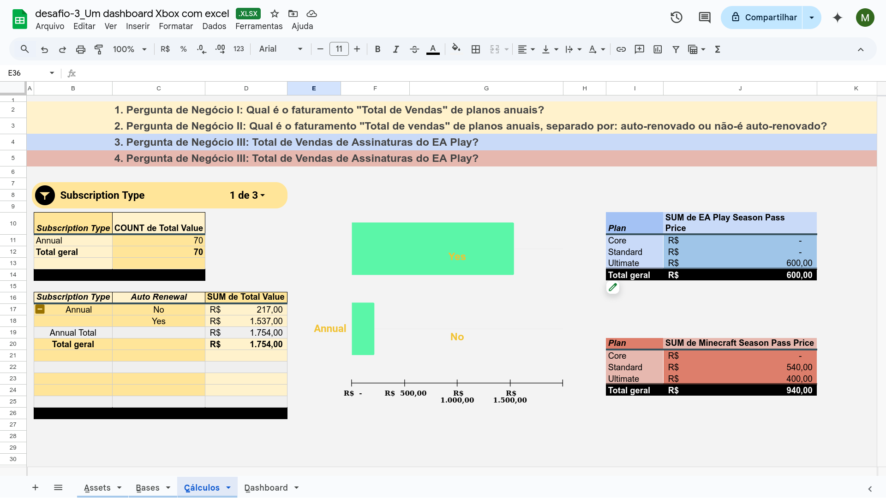
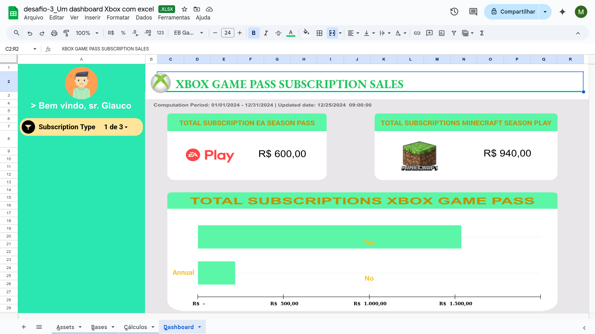

# Criando uma Dashboard de Vendas do Xbox com Excel - Desafio 3
 
Olá, este é o meu repositório para o terceiro desafio do bootcamp "Santander - Excel com Inteligência Artificial" da Dio.me! 

<br>

## Entendendo o Problema

Neste laboratório do prof. Felipe Aguiar, o objetivo é criar um dashboard de vendas com foco na organização de dados com o Excel. Sendo que, ainda como parte deste objetivo, o prof. Felique intenta fazer com que a ferramenta de visualização resultante deste laboratório seja apta para trabalhar com os dados de forma eficaz e com desempenho, no sentido de trazer informações claras e úteis do negócio, permitindo, então, análises eficazes do "desempenho de vendas" que possam servir de base na tomada de decisões dentro da organização da empresa.


Finalmente, para alcançar o resultado proposto acima, o prof. Felipe propõe o uso de um método próprio para usar na gestão e na contrução de planilhas do tipo MS-Excel, de modo a se alcançar um gerenciamento da entrada de dados e de tratamento das informações flexível e manutenível, na criação e disposição de tabelas e gráficos com vistas a se construir análises e de permitir tomadas de decisões.


Em termos de métodologia, o prof. Felipe resume seu método pelas letras "ABCD(E)", sendo a última letra opcional, quando comparada com as que a antecedem:

 - **A -> Assets** (recursos: imagens, videos, gifs, paleta de cores, etc.).
 - **B -> Bases** (que são os dados para gerar a dashboard principal ou outras medidas).  
 - **C -> Cálculos** (trata-se do "meio de campo que processa dados para transformar em informações", ou dito de outra forma, quaisquer regras, linguagens de programação envolvidas, scripts, etc, que sejam aplicáveis aos cálculos).
 - **D -> Dashboard** (trata-se do painel visual propriamente dito)
 - **E -> Extras** (PDFs, DOCs, ou qualquer outro tipo de elemento que não estaria tradicionalmente ligado à tarefa de análise dos dados)  


<br>

## Construindo o Projeto
 
Para alcançar esse desafio de laboratório, o prof. Felipe disponibilou um arquivo inicial do Excel organizado em 4 abas ou planilhas de trabalho, tal qual ele apresentou em sua exposição sobre a sua metodologia de trabalho com análise de dados:

1. Aba Assets: com recursos para projeto
    - Paleta de Cores: com 5 tonalidades.
    - Logos para o dashboard: Logos Xbox e Xbox One. 
    - Ícone
2. Bases: com a base de dados de teste para esse laboratório
3. Cálculos
4. Dashboard


Observe que, como ressalta o prof. Felipe, o objetivo central deste laboratório com Excel é o de trabalhar na análise e na criação de visões com os dados, especificamente de criar inicialmente um dashboard para analisar o desempenho das vendas de produtos ligados à marca Xbox.


A base de dados em si possui campos como:

1. **Subscriber ID**: numérico
2. **Name**: string 
3. **Plan**: 3 categorias (Core, Standar, Ultimate) 
4. **Start Date**: data
5. **Auto Renewal**: booleano 
6. **Subscription Price**: monetário em real
7. **Subscription Type**: 3 categorias (Monthly, Quarterly, Annual) 
8. **EA Play Season Pass**: booleano
9. **EA Play Season Pass Price**: monetário em real
10. **Minecraft Season Pass**: booleano
11. **Minecraft Season Pass Price**: monetário em real
12. **Coupon Value**: monetário em real
13. **Total Value**: monetário em real


<br>

E, já como **pergunta de negócio** base para o dashboard inicial, e que agrega toda a base de serviços oferecidos pela plataforma do Xbox, temos:

```
Pergunta de Negócio I:
Qual é o faturamento "Total de Vendas" de planos anuais?

    ------------------------------------------------------------

Pergunta de Negócio II:
Qual é o faturamento "Total de vendas" de planos anuais, separado por: auto-renovado ou não-é auto-renovado?
```


Partindo dessas perguntas de negócio iniciais, foram criadas duas tabelas dinâmicas para favorecer a visão dos usuários e um gráfico:

 - Tabela dinâmica 1: responsável por agregar a **contagem** das assinaturas.
 - Tabela dinâmica 2: responsável por totalizar o **Total Value** das assinaturas agrupando pelas categorias **renováveis** e **não-renováveis**.
 - Filtro dinâmico unificando as duas tabelas dinâmicas em **mensal**, **quarto de mês**, **anual**.





<br>

Estes testes foram, então, realizados na aba "Cálculos" do projeto. Assim, no sentido de seguir no caminho de apresentar um modelo de análise pronto para o usuário final, foi preparada a aba "Dashboard" justamente para receber esse esquema final de apresentação para a visualização.


<br>

## Formatação da Planilha

Finalmente, para completar o design do modelo de visualização de uma dashboard, o prof. Felipe prepara como área final para a apresentação das visões a aba "Dashboard" do projeto, a qual ele procura aprimorar em termos de experiência ao usuário definindo um design de frontend que se assemelhe aos conhecidos layouts de ferramentas corporativas que são comuns nos ambientes de trabalho.


Para tanto o prof. procura abrir espaços mais à esquerda e mais acima da planilha, preenchendo com cores para marcar esses espaços do layout como se fossem o próprio menu de uma daquelas ferramentas citadas. 


<br>

A seguir, o prof. Felipe completa o dashboard incluindo novas visualizações a partir de novas perguntas de negócio:

```
Pergunta de Negócio III: 
Total de Vendas de Assinaturas do EA Play?

    ---------------------------------------

Pergunta de Negócio IV:
Total de Vendas de Assinaturas do Minecraft Season Pass?
```

 - Tabela dinâmica 3: responsável por agregar o **Total de Vendas** para as assinaturas do **EA Play Season Pass**.
 - Tabela dinâmica 4: responsável por agregar o **Total de Vendas** para as assinaturas do **Minecraft Season Pass**.
  

<br>

Assim, com o intuito de também incorporar essas novas informações à aba "Dashboards", esta que já tinha incorporado anteriormente aquele gráfico de visualização do **Total Subscription Xbox Game Pass** juntamente com o controle de filtro .


Assim, essas duas últimas novas informações, resultados das perguntas de negócio III e IV foram inseridase na forma de cartões de visualização, recurso o qual o prof. Felipe chama de **Big Number**.


Esses novos recursos **Big Numbers** para agregar o total de assinaturas do **EA Play Pass** e do **Minecraft Season Pass** são, então, posicionados juntamente com os demais elementos visuais para completar a aba "Dashboard" que agora passa a trazer uma análise mais completa acerca da totalização dos dados usados como teste neste projeto. 


Como ajuste fino, o prof. Felipe cria na ferramenta do Excel uma vinculação entre o recurso de filtro, que estava relacionado ao gráfico inicialmente colocado na aba Dashboard, para que ele passasse a vincular ao mesmo tempo também a atualização dinâmica dos dois novos recursos de Big Numbers recém inseridos neste dashboard, o que em termos de Usabilidade serve para unificar a visualização como um todo, além de melhorar a Experiência de interatividade do filtro para o usuário (lembrando novamente que esse filtro já se encontrava setado nas categorias de **Subscription Type**: **mensal**, **quarto de mês**, **anual**).


<br>

Finalmente, o prof. Felipe lembra que é essenvial num relatório de dashboard que seja apresentado ao usuário o período a que se refere a visualização, bem como da data da última atulização do relatório!

```
Computation Period: 01/01/2024 - 12/31/2024 | Updated date: 12/25/2024  09:00:00

```


<br>




<br>

## Outros links:

 - [linkedin:] https://www.linkedin.com/in/marcus-vinicius-richa-183104199/
 - [Github:] https://github.com/ahoymarcus/
 - [My Old Web Portfolio:] https://redux-reactjs-personal-portfolio-webpage-version-2.netlify.app/


