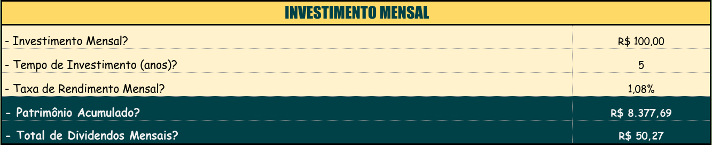
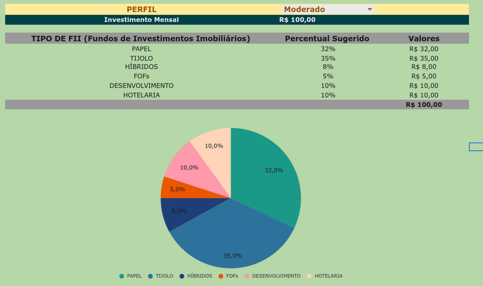
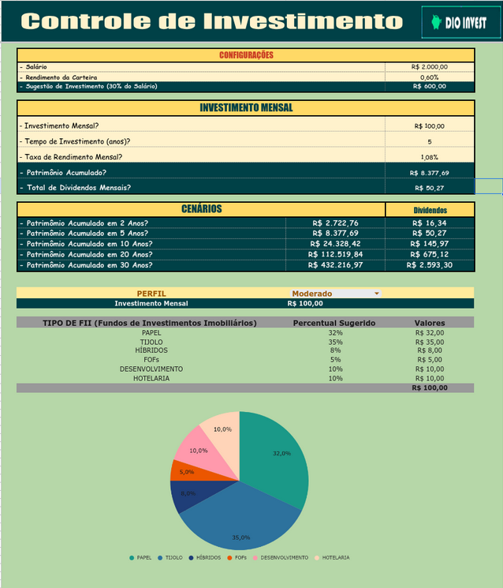

# Criando uma Ferramenta de Controle de Investimentos com Excel - Desafio 1
 
Olá, este é o meu repositório para o primeiro desafio do bootcamp "Santander - Excel com Inteligência Artificial" da Dio.me! 

<br>

## Entendendo o Problema

Neste laboratório do prof. Felipe Aguiar tem como objetivo aplicar os conceito do Excel para o desenvolvimento de uma ferramenta de simulação de investimentos em fundos imobiliários.


Trata-se, então, de um projeto que tem como base o uso de planílhas Excel que permite ao usuário testar interativamente diferentes visões acerca de investimentos em fundos imobiliários, como, por exemplo, quanto investir e em que tipos de fundo imobiliários dividir a sua carteira de investimentos.


<br>

## Construindo o Projeto
 
Para alcançar esse desafio, no laboratório do prof. Felipe, o aluno é guiado pela criação de diversas tabelas para guardar diferentes cenários de investimentos, como por exemplo, analisar os insvestimentos mensais e o crescimento do patrimônio através de certos períodos de tempo: 2, 5, 10 e 20 anos, etc.


Assim, na imagem abaixo, temos o exemplo da tabela com o cenário de investimento mensal:

 

<br>


como forma de gerenciar as informações agregadas interativamente pela ferramenta para o usuário, o prof. Felipe propôs duas estratégias principais:

1. Criação de uma tabela de Configurações trazendo as principais variáveis definidas globalmente para gerir os campos da planilha utilizados pelo usuário.
2. Aplicação do recurso de "Intervalos Nomeados" para facilitar o trabalho do desenvolvedor da ferramenta de criar as referências de cálculos com as células específicas das tabelas a serem agregadas. 
    - Como resultado, isso aumenta bastante a clareza no uso das fórmulas do Excel para referenciar e para calcular os dados das planilhas.


<br>


Buscando aumentar ainda mais a interatividade do usuário com a ferramenta criada, o prof. Felipe construiu também uma seção para gerir o Perfil dos usuários e para propor modelos de investimentos.


Nesse sentido, o prof. disponivilizou um campo configurado com validação para dados de modo a permitir ao usuário a inserção de 3 tipos predefinidos de investidores:

1. Conservador
2. Moderado
3. Agressivo


E para criar a visualização para o usuário, a ferramenta traz tanto uma tabela com os tipos de investimentos em fundos imobiliários, além de percentuais e de valores, bem como um gráfico para facilitar visualmente a análise pelo usuário, sendo tudo isso interativo e definido de acordo com a escolha de perfil feita pelo usuário mesmmo. 


No sentido de controlar todas essas informações agrupadas em um único e mesmo conjunto de tabela e gráfico, o prof. modelou um sistema de referência para a ferramenta utilizando-se de uma tabela auxiliar cruzando todos os tipos de investimentos, com os tipos de perfis e os valores definidos em cada caso. E para referenciar tudo isso, ou seja, o agrupamento de visualização (tabela e gráfico), com todos os dados da tabela auxiliar, o prof. utilizou-se de chaves compostas em ambos os lados da relação visualização e dados, juntamente com a fórmula **PROCV** do excel:

```
=PROCV($C$27&"-"&B31;planilha_auxiliar!B3:E21;4;FALSO)
```

Assim, na fórmula acima, temos a referência feita a uma chave composta construída com dois campos da tabela de de visualização, ou seja, **$C$27&"-"&B31**, para referenciar as mesmas chaves presentes também numa tabela auxiliar de dados, e retornando, nesse sentido, o 4º campo do registro: **"planilha_auxiliar!B3:E21;4;FALSO"**. 




<br>

## Formatação da Planilha

Finalmente, após definidas as funcionalidades principais da ferramenta de controle de investimentos, o prof. Felipe sublinha a importância de se criar uma formatação clara e agradável ao usuário, ou seja, de uma formatação de fácil compreensão de uso por parte do usuário, bem como que fosse capaz de trazer uma boa experiência de uso, seja pela sua flexibilidade, seja pela facilidade de interação com a ferramenta.


 

<br>

## Outros links:

 - [linkedin:] https://www.linkedin.com/in/marcus-vinicius-richa-183104199/
 - [Github:] https://github.com/ahoymarcus/
 - [My Old Web Portfolio:] https://redux-reactjs-personal-portfolio-webpage-version-2.netlify.app/


