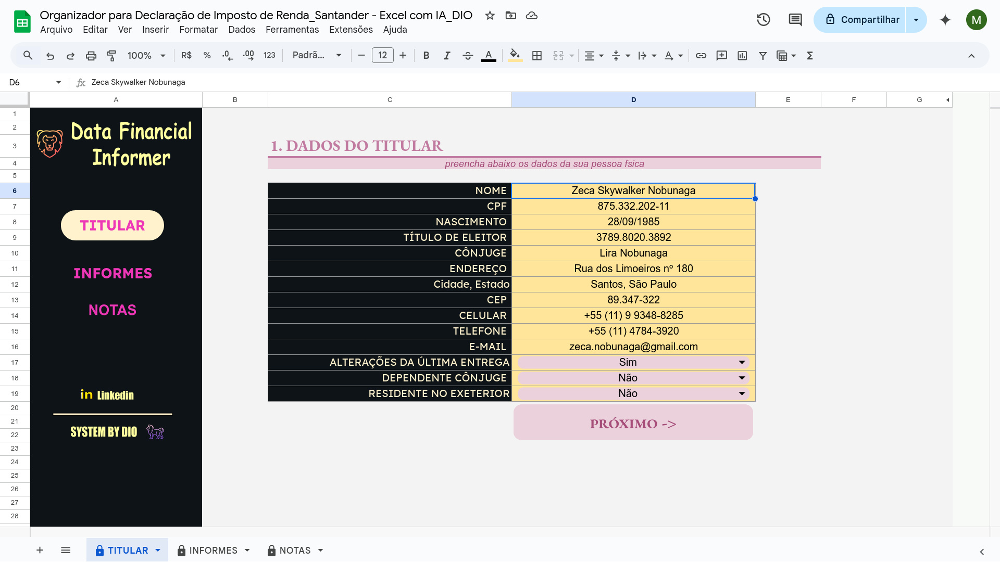
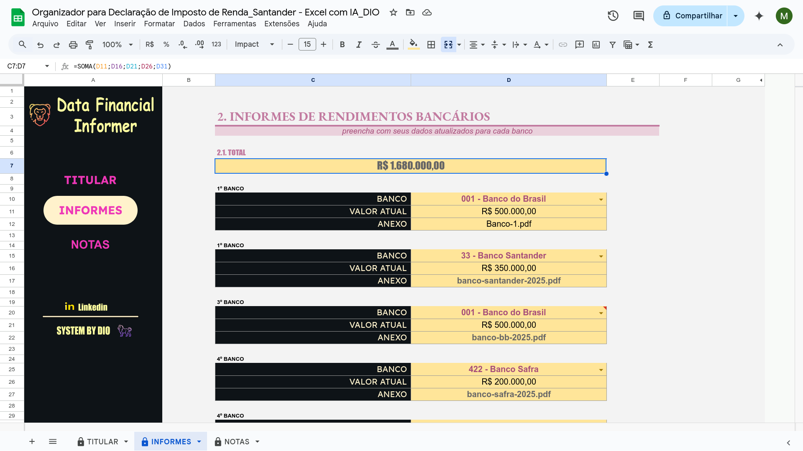
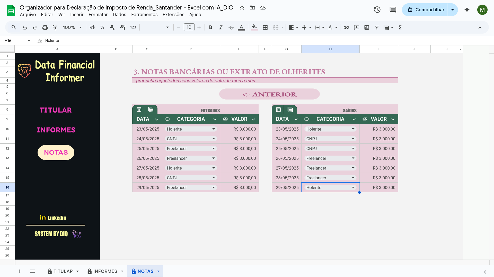

# Criando uma Organizador de Declaração de Imposto de Renda com Excel - Desafio 2
 
Olá, este é o meu repositório para o segundo desafio do bootcamp "Santander - Excel com Inteligência Artificial" da Dio.me! 

<br>

## Entendendo o Problema

Neste laboratório do prof. Felipe Aguiar, é construído um projeto que tem como objetivo continuar a aplicação dos conceito básicos já aprendidos acerca do Excel, bem como o de continuar evoluindo para incluir recursos ainda mais avançados, sendo que nesse sentido, busca-se aqui o desenvolvimento de uma ferramenta deve ser usada para gerenciar e para organizar as finanças pessoais de uma pessoa, especialmente com relação à sua Declaração de Imposto de Renda.


Trata-se, então, de um projeto que tem como base o uso de planílhas Excel que deve permitir ao usuário trabalhar interativamente com seus dados financeiros, com dados disponibilizados para o público por meio das instituições financeiras e do governo, bem com de realizar agregações e gerar visualizações capazes de orientar as decisões do usuário em suas questões financeiras particulares e de imposto de renda.


<br>

## Construindo o Projeto
 
Para alcançar esse desafio, no laboratório do prof. Felipe, o aluno é guiado pela criação de uma ferramenta que começa por destrinchar a necessidade de se pensar na Interatividade, na Usabilidade e na Experiência do usuário, sendo que como tal o prof. escolhe por adotar um padrão sequindo premissas do desenvolvimento de front-end em termos de layout, menus e da disposição dos elementos visuais em geral.


De forma mais específica, em seu projeto de design, o prof. Felipe dispõe inicialmente de três menus ou abas:

1. Dados do titular 
2. Informes bancários 
3. Notas e Recibos


Um aspecto específico da versão deste laboratório que eu precisei trabalhar especificamente neste projeto ao fazer uso da solução open source da Google, o Google Sheets, que possui um ambiente próprio de desenvolvimento e de operação para seus scripts JavaScript, o Google Apps Scripts, é que fora preciso seguir alguns passos adicionais para adaptar alguns recursos do design de frontend para a ferramenta de planilhas, bem como para poder fazer a inclusão dos diferentes links, seja de navegação externa para outros sites, como o site da Linkedin, por exemplo, seja internamente para comunicar diferentes partes das planilhas do projeto.


Assim, em termos gerais, pode-se dizer que um passo a passo para alcançar os objetivos acima envolvia, entre outros:

1. Abrir o aba "Extensões" do Google Sheets.
2. Selecionar o menu "Apps Script".
3. Abrir o editor do Google Apps Script e criar um script JavaScript para controlar a navegação da ferramenta, tanto a interna, quanto a externa.
4. Atribuir aos elementos iterativos do design frontend os scripts respectivos, capazes de controlar a navegação por botões entre as planilha ou abrir links dentro da ferramenta para sites, como o do site do Linkedin.


Abaixo, temos um exemplo de script genério para abrir links externos com o Google Apps Scripts:

```
// Adição de novos links pelo Google Apps Scripts
function abrirLinkGenerico() {
  var url = "URL_DO_SEU_LINK_AQUI";
  var htmlOutput = HtmlService.createHtmlOutput(
      '<span>Clique no link abaixo para acessar:</span><br><br>' +
      '<a href="' + url + '" target="_blank" onclick="google.script.host.close()">Abrir Link</a>'
  )
  .setWidth(350)
  .setHeight(150);

  SpreadsheetApp.getUi().showModalDialog(htmlOutput, 'Abrindo Link');
}
```


Do outro lado, um exemplo de script usado para fazer a navegação interna entre as planilhas da ferramenta a partir de botões criados simulando recursos frontend:

```
function goToSheet1() {
  var spreadsheet = SpreadsheetApp.getActiveSpreadsheet();
  spreadsheet.setActiveSheet(spreadsheet.getSheetByName("TITULAR")); // Substitua pelo nome exato da sua primeira planilha
}
```


A seguir, ainda pensando em tornar a ferramenta mais flexível ao lidar com o gerenciamento dos dados, o prof. Felipe trabalhou não apenas com a formatação básica dos campos e células das planilhas, mas também criando máscaras específicas para receberem dados de cadastro e documentais segundo a sintaxe padrão seguida no Brasil:

- CPF: 000"."000"."000"-"00
- Título de Eleitor: 000"."000"."000
- CEP: 00"."000"-"000
- Celular: "+"00 "("00")" 0 0000"-"0000
- Telefone: "+"00 "("00")" 0000"-"0000


Outras formatações mais avançadas de gestão de dados também foram usadas para definir listas de validação de dados para o usuário, incluindo o uso de uma tabela de apoio com dados e informações de bancos e operadoras financeiras para facilitari, por meio do uso de listas, para a validação da inserção de dados por parte do contribuinte.  


Assim, na imagem abaixo, temos o exemplo da aba inicial da ferramenta trazendo a tabela de cadastro para o usuário:




<br>

## Formatação da Planilha

Finalmente, para completar o design de uma ferramenta financeira flexível ao usuário, além do uso daqueles recursos de interatividade frontend descrito acima, o prof. Felipe também criou seções específicas para dar ao usuário uma experiência completa na tarefa de gerenciar a sua declaração de imposto de renda e de movimentações financeiras.


Abaixo, por exemplo, temos a aba de **Informes Bancários** aonde o usuário pode ir cadastrando todos os seus relacionamentos com as instituições financeiras com as quais está trabalhando:




E na próxima imagem temos a aba da ferramenta aonde o usuário pode fazer o serviço contábil de entrada e de saída para as suas notas bancárias e recibos:




<br>

## Outros links:

 - [linkedin:] https://www.linkedin.com/in/marcus-vinicius-richa-183104199/
 - [Github:] https://github.com/ahoymarcus/
 - [My Old Web Portfolio:] https://redux-reactjs-personal-portfolio-webpage-version-2.netlify.app/


