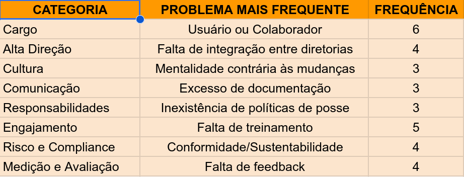
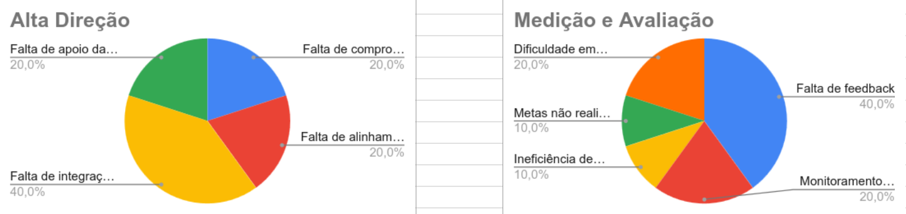

# Análise Descritiva de Dados de Governança de TI com Python e Excel

## Preâmbulo e Objetivos

O objetivo deste projeto é o de apresentar a importância dos processos de Governança de TI para os empreendimentos nos dias atuais, porque mais do que nunca a tecnologia se faz presente nos processos internos das empresas e precisa, agora, criar valor, deixando de ser aquela operação de TI tradicional que se limitava a dar suporte ás operações e ao negócio da organização.


Dessa forma, intentamos fazer o uso da Análise de Dados relacionando potenciais dificuldades inerentes que podemos encontrar, seja nas operações para a implantação de processos de governança de TI, seja para a gestão cotidiana desses processos de governança de TI e de como estas dificuldades podem afetar o trabalho de gestores e de colaboradores na realização de suas funções diárias. 


Assim, considerando que à medida que a TI se torna um recurso cada vez mais natural, ou até mais essencial e crítico dentro das operações das empresas e das organizações, é preciso também que estas sejam capazes de repensar como podem e como devem responder à esses novos desafios de forma a serem capazes de manterem as suas operações em pleno funcionamento, garantindo segurança, quanlidade e sustentabilidade para o negócio:

- Tratar a **TI como investimento** e não apenas como uma operação meramente de suporte.
- Implantar uma gestão de TI que seja capaz de **criar valor para o negócio**, flexibilizando as operações da empresa em todos os seus setores.
- Responder às demandas atuais por **segurança**, começando pela **segurança das informações**, estas que exigem um cumprimento rígido de uma gestão de dados e de informações sensíveis dentro da organização.
- Implantar **Gestão de Risco** para evitar que a organização venha a sofrer perdas financeiras decorrentes desse quadro atual de uma TI conformada por processos mais complexos e que exigem maiores aportes de investimentos.
- Implantar **Gestão de Continuidade** para garantir não apenas resiliência para os processos de TI que não podem parar, mas também para garantir a escalabilidade futura para os negócios, venha o mercado demandar mais crescimento da empresa. 
- Garantir o **cumprimento de regulações e normas** de compliance e de sustentabildiade social.


O procedimento utilizado, então, por este projeto será o de construir uma pequena base de dados relacionados à Governança de TI, mais especificamente ainda relacionados às dificuldades encontradas por gestores e colaboradores no trato com os processos de governança da TI.


Nesse sentido, utilizaremos ferramentas e linguagem de programação para gerar dados e informações capazes de servirem de base para o estudo do contexto geral e para o entendimento daquelas dificuldades apontadas acima relacionadas às dificuldades com p tratp dos complexos processos de governança de TI na atualidade. 


Finalmente, esperamos que este trabalho com os dados gerados permita a este projeto discutir processos capazes de gerar **Decisão** e mais inteligẽncia para o negócio, começando por apresentar **Recomendações Práticas** que sejam aptas a melhorar tanto o curso de implantação dos novos projetos de governança de TI, quanto de melhorar o fluxo dos processos de governança de TI que já estiverem em funcionamento dentro de uma empresa ou organização.    
Nesse sentido, este projeto 


<br>

## Relatório de Governança de TI

### Introdução:

Considerando os objetivos propostos para este trabalho, que é de falar e tentar compreender as principais dificuldades enfrentadas pelas empresas no que diz a Gestão de TI, buscando responder em especial o seguinte quesito:

    - **Quais as principais dificuldades encontradas pelos gestores e usuários nos processos de Governança de TI.**


Considerando ainda estes outros requisitos, inclusive no que toca ao ao “Texto de Apoio”:

- Melhorar a Gestão de TI.
- O aumento da relevância do uso da TI no cenário social em geral.
- A necessidade de implantação do uso de uma TI nas empresas públicas ou privadas, que não seja apenas uma TI de suporte técnico para as operações, mas que possa ser principalmente uma capaz de criar valor para o modelo de negócio, além de poder melhorar os processos administrativos existentes.


Nesse sentido, considerando o objetivo central destacado acima, antes de podermos falar das dificuldades nos processos de governança de TI, primeiro precisamos entender o que poderia ser a gestão de TI e como ela poderia melhorar, bem como entender também a sua relação, quer seja com a gestão da empresa em geral, quer seja com os diversos setores ou áreas de uma empresa pública ou privada, para então, apresentarmos o primeiro esboço das questões que definiriam as dificuldades de gestores e de usuários com a Governança de TI. 


Assim, como visto ao longo do curso, a tecnologia e a TI que têm se tornado essenciais nas relações sociais entre as pessoas, assumem uma importância ainda maior quando se trata da sua implantação e do seu uso nas empresas, sejam elas públicas ou privadas.
Isto porque, à medida que o uso da tecnologia aumenta dentro das empresas, os custos também aumentam, bem como mudam os processos de negócios até então conhecidos dentro de uma gestão tradicional das empresas, implicando em um nível de complexidade ainda maior.


Embora isso possa parecer contraditório, que se implante tecnologia nas empresas para criarmos mais custos e mais complexidades, mas a verdade é que a tecnologia é inserida com objetivos muito específicos, os quais estão inclusive dispostos nos requisitos apontados no começo dessa introdução: criar valor de negócio por meio da tecnologia, melhorar os processos administrativos da empresa e aumento de escala no atendimento aos usuários (internos e externos).


Dessa forma, esses objetivos não são pequenos e nem simples, pois envolvem não apenas a compra de equipamentos e sistemas caros, mas principalmente a compra daqueles que são corretos para o negócio, além da necessidade implantação e integração deles aos novos processos de gestão que precisam ser modelados, incluindo nisso o próprio treino e ambientação de colaboradores e usuários, tanto da gestão empresarial, quanto dos demais setores da empresa.


É justamente, então, para dar conta desses novos desafios que surge a necessidade de um novo modelo de gestão para a TI, porque tal qual o que aconteceu com a gestão tradicional empresarial, a gestão tradicional da TI operava buscando objetivos que hoje já não são mais suficientes para dar conta das novas demandas de processos do setor de TI e da nova escala de serviços oferecidos aos usuários, internos ou externos à empresa.
E, para lidar com esse novo contexto social, os frameworks de gestão de TI mais importantes também acabaram evoluindo, para dessa forma permitir conformar a nova gestão de TI da empresa a essa realidade que não está mais apenas centrada e estruturada no suporte e na infraestrutura do próprio setor de tecnologia, mas sim de estender toda a criação de valor, serviços e padronização à toda a empresa, começando pela alta gestão, incluindo também os demais setores envolvidos.


Surge então a dicotomia de uma Governança de TI e de uma Gestão de TI (tradicional), em que a primeira agora se destaca para assumir uma posição empresarial, colocando-se ao lada da alta gestão e dos demais gestores responsáveis pelos setores de suporte da empresa para permitir remodelar os processos de TI, com qualidade e abrangência, para alcançar a toda empresa e poder criar valor e auxiliar usuários internos e externos igualmente.


<br> 

### Desenvolvimento:

Como visto, então, o objetivo deste trabalho é o de buscar as principais dificuldades encontradas pelos gestores e usuários das empresas em trabalhar com esse novo modelo de processo de gestão de TI, chamado mais especificamente de Governança de TI.
Assim, em vistas de se poder definir quais poderiam ser tais dificuldades, este trabalho segue no sentido de primeiro apresentar uma pequena definição do que seria tal modelo de governança de TI, para num segundo momento buscar, seja no material de estudo de nosso curso, seja na literatura de Gestão da TI encontrada na Internet e na Nuvem, possíveis questões que possam ser candidatas para compor as questões a serem transcrevidas para o questionário direcionado à pesquisa de campo.

Para tratar do primeiro ponto apresentado acima, aquele acerca de uma definição corrente para Governança de TI, buscamos, então, no framework Cobit (mantido pela ISACA ou Information Systems Audit and Control Association) que é a ferramenta mais celebrada pela literatura a gestão de TI, uma ferramenta que foi lançada em 1996 e que hoje, na sua última versão, o Cobit 2019, acumulando a expertise e a robustez de grande parte dos conhecimentos experimentados na área de gestão de TI:

> [!NOTE]
> “A Governança de TI garante que as necessidades, condições e opções das partes interessadas (stakeholders) sejam avaliadas para determinar objetivos corporativos equilibrados e acordados; definindo a direção por meio de priorização e tomada de decisão; e monitorando o desempenho e a conformidade em relação à direção e aos objetivos estabelecidos.” (COBIT 2019 Framework: Introduction and Methodology. Schaumburg, IL: ISACA, 2018)


Ademais, além dessa definição que busca traçar as principais responsabilidades da governança de TI, o Cobit traz três “Pilares de Valor” (EDM02 - Ensured Benefits Delivery: COBIT 2019 Framework: Introduction and Methodology. Schaumburg, IL: ISACA, 2018):

1. Realização de Benefícios: criação de valor por meio de investimentos.
2. Otimização de Riscos: riscos ajustados ao apetite de riscos da empresa e à criticidade dos negócios e das normas/legislação.
3. Otimização de Recursos: garantir a maior eficiência possível às capacidades (pessoas, infraestruturas e aplicações) da empresa.


Já para tratar das principais responsabilidades relacionadas à Implantação de uma Governança de TI, temos visto ao longo do nosso curso que Governança de TI apresenta um novo Ciclo de Vida que é específico desse novo modelo e que precisa ser distinguido daquele que era próprio da gestão de TI mais tradicional:

1. Alinhamento Estratégico e Compliance
2. Decisão, Compromisso, Priorização e Alocação de Recursos
3. Estrutura e Processos. Operações e Gestão
4. Medição e Desempenho


Com relação a esse Ciclo de Vida, observamos ao longo do curso que o Alinhamento da TI é o ponto focal de uma Governança de TI, de forma que ele junto com a definição das Necessidades da Partes Interessadas, da criação de uma Comunicação entre todos os setores da empresa, Criação de uma Política de Segurança, Risco e Compliance, estas todas que seriam responsabilidades essenciais de serem planejadas em qualquer projeto para implantação de uma governança de TI.


Finalmente, nas três últimas etapas do ciclo podemos observar ainda derradeiras responsabilidades que podem também afetar o projeto de implantação, de modo que também precisariam ser devidamente modelados a contento: definição de um Mecanismo de Decisão, Critérios de Priorização e de Portfólio, Relacionamento com Usuários, Relacionamento com Fornecedores, Gestão do Valor da TI e Gestão do Desempenho da TI.


Do outro lado, depois de apresentarmos as grandes responsabilidades de uma Governança de TI, podemos também apontar algumas dificuldades gerais relacionadas à Implantação de Governança de TI que têm sido estudadas por alguns grupos e organizações relacionados à Gestão e à Governança e Projetos de TI no mundo:

1. Chaos Report (The Standish Group): apontaria como principais dificuldades ou causas de falhas:
    - Falta de envolvimento dos usuários.
    - Falta de apoio da alta gestão (Executivos)
    - Requisitos incompletos ou em constante mudança.
2. Global Status Report on the Governance of Enterprise IT (GEIT): que por sua vez faz os seguintes apontamentos:
    - Resistência Cultural: travas advindas da própria gestão e dos colaboradores da empresa, colocando a própria Governança como sendo mais um “encargo burocrático” que lhes é imposto.
    - Dificuldade de Medição: as complexidades de se provar o ROI (Retorno sobre Investimentos) relacionados aos processos de TI.
    - Lacuna de Comunicação: a dificuldade do discurso técnico da área de TI de chegar aos executivos e aos gestores dos demais setores da empresa.
3. Gartner Group:
    - Fadiga de Processos: relacionado à tentativa de se implementar todos os processos de Cobit de uma única vez, gerando problemas aos processos em andamento e grande complexidade aos que são remodelados. 


<br> 

### Confecção do Formulário:

Depois de termos falado da especificamente de questões gerais sobre a Governança de TI, de sua evolução e de seus principais processos, passamos, à definição de até oito questões para conformar o formulário para ser lido e respondido por um Gestor e por um Usuário em uma empresa sobre as dificuldades encontradas com relação aos processos de Governança de TI.


Observe que, devido à importância de se determinar inicialmente não apenas a possível existência de dificuldades com relação aos processos de governança de TI da empresa, mas também de se definir se existe na empresa um conhecimento geral acerca da importância dos processos relacionados a ela, bem como a existência de apoio mútuo entre as partes e comprometimento, iniciamos, então, definindo essas três primeiras questões aos nossos leitores.


Nesse sentido, as primeiras questões do questionário, ao nosso ver, têm a importância de determinar o tom dos questionamentos com relação à compreensão do papel da TI em relação à governança estratégica da empresa:

- A empresa possui atualmente um processo de governança específico de TI?
- Seja o Gestor, sejam os Usuários/Colaboradores da empresa, eles entendem a importância de se separar a  Governança de TI e da Gestão Operacional de TI?


Portanto, para as três primeiras questões, propomos as seguintes redações:

1. Como você definiria a sua relação com os Processos de Governança da sua empresa: como um Gestor ou como um Usuário? 
    - Gestor ou Membro da Alta Direção
    - Usuário ou Colaborador
2. Pensando numa escala de 1 a 5, qual valor indicaria como executivos de alto escalão compreendem o papel estratégico da TI e quais seriam as maiores barreiras para se estabelecer o alinhamento de intenções da TI para com os objetivos da empresa?
3. Culturalmente, quais seriam os maiores entraves existentes à compreensão de que a TI deveria atuar como um importante ativo da empresa, e portanto merecedor de ser pensado como investimento e não como simples gasto? 


Já para as questões remanescentes, cujo o foco seria de buscar por outros tipos de dificuldades mais específicos, como, por exemplo, dos processos de comunicação, riscos, compliance, tudo isso com relação aos processos de governança de TI em geral:   

4. Quais as principais dificuldades de comunicação observadas em relação às partes interessadas (Stakeholders) dentro do processo de governança dos processos? 
5. Quais seriam as maiores dificuldades relacionadas à definição de responsabilidades e à tomada de decisão na TI? Existe o uso de algum tipo de framework para fazer essa atribuição de responsabilidades (como a Matriz RACI, por exemplo)?
6. Quais seriam as maiores dificuldades para engajar, envolver e ganhar a adesão dos colaboradores ou dos usuários aos processos definidos pela governança de TI da empresa para gerir a criação dos produtos ou serviços da empresa?

7. A empresa foi capaz de definir processos eficientes de risco e de compliance de acordo com as necessidades do negócio ou haveria dificuldades implícitas interferindo nesse processo?
8. Considerando que existe uma natural dificuldade no processo de se medir o valor de TI para as empresas, bem como para se lidar com as complexidades da definição de ROI para o negócio, perguntamos se a sua empresa também tem dificuldades nesse sentido?  


<br> 

### Análise Descritiva dos Dados:

Para esta penúltima parte do trabalho, o primeiro passo é a definição da estratégia para a criação do formulário com as questões feitas na seção anterior, bem como de se definir a forma de sua distribuição para gerar os dados para esta pesquisa de campo.
Nesse sentido, com relação à criação do formulário, a ideia é de usar a ferramenta Google Forms, ela que possui uma interface bastante intuitiva e que permite a criação de diferentes tipos de perguntas (múltiplas escolhas, forma de resposta longa, etc.) e que é capaz de gerenciar tanto a publicação do link de endereço para a URL da página da pesquisa, quanto os dados angariados na operação.


> [!IMPORTANT]
> 🔗 Link da pesquisa: https://forms.gle/1ie35UjfhK6qiStM6 


<br>

Já com relação à estratégia de distribuição do formulário, a primeira tentativa foi a de repassar o link da página de pesquisa por email para algumas empresas da região. Entre as empresas, havia também uma importante empresa de marca internacional que oferece tanto produtos eletrônicos, quanto mantém um contrato de terceirização para prestar assistência técnica aos clientes. 


Contudo, até o momento do fechamento deste trabalho os emails não foram retornados e nem o formulário respondido. Cabe apontar que de acordo com o que foi possível observar, as empresas em geral não pareciam ter gestores especializados em TI, inclusive aquela empresa multinacional, que também mantinha um responsável especializado em tecnologia.


Outra estratégia utilizada enquanto eram esperadas as respostas aos emails, foi a de postar na mídia social do Linkedin uma chamada para a participação da comunidade na pesquisa de campo. O texto utilizado na postagem pode ser visto no Apêndice II deste trabalho. 


Provavelmente em função da minha lista restrita de contatos, também não houve até o momento do fechamento deste trabalho resposta por parte da comunidade do Linkedin, o que nos levou a utilizar uma terceira estratégia de apoio, que se definiu pela criação de dados mokados e pela sua subsequente análise com a ferramenta Google Sheets. 


Com relação ao processo de geração dos dados foram criados diferentes casos de respostas para cada questão e depois foram feitos sorteios simples, simulados por meio do uso de ferramentas ou linguagnes de programação.


Poderiam ser usados recursos de sistema operacional, como os do Linux, que possui tanto a variável $RANDOM (echo $((RANDOM % 15)), quanto o comando shuf (shuf -i 1-100 -n 1) do Bash do Linux, que gerava número aleatório para escolher cada uma das respostas para as 8 questões.


No entanto, neste trabalho fora utilizada a linguagem Python, mais especificamente a biblioteca **Pandas** para fazer o sorteio de itens para responder o questionário criado, gerando, então, uma amostra de **10 Casos de Teste** dos questionários das dificuldades de gestores e de colaborados com processos de governança de TI para serem analisados.


Nesta primeira parte do script, temos a importação das bibliotecas de apoio e a definição de uma estrutura de dados de dicionário contento os itens de respostas para cada questão e que devem ser sorteados para o preenchimento de cada um dos **10 Casos de Testes** para análise:

```
import pandas as pd
import random

# Definir dicioário de dados
dados_base = {
    "Cargo": ["Gestor", "Usuário ou Colaborador"],
    "Alta Direção": ["Falta de alinhamento estratégico", "Falta de comprometimento da liderança", "Falta de apoio da diretoria", "Falta de integração entre diretorias"],
    "Cultura": ["Resistência cultural", "Falta de verbas e recursos", "Gastos desnecessários", "Altos custos dos processos", "Processos não criam valor", "Problemas de escala", "Mentalidade contrária às mudanças", "Falta de agilidade", "Dificuldade na adoção de Frameworks"],
    "Comunicação": ["Inexistência de base de conhecimentos", "Falta de padronização", "Excesso de documentação", "Pouca transparência", "Falta de eventos", "Inexistência de meios de comunicação"],
    "Responsabilidades": ["Inexistência de políticas de posse", "Falta de clareza nos processos", "Problemas com portfólio de TI", "Falta de liderança gerencial", "Falta de mapeamento de necessidades", "Incapacidade na gestão de dados"],
    "Engajamento": ["Processos burocráticos", "Falta de entendimento das regras", "Falta de treinamento", "Escassez de talentos", "Dificuldades no gerenciamento", "Problemas de relacionamento/suporte"],
    "Risco e Compliance": ["Falta de integração", "Excesso de regras", "Ineficiência/Perda de agilidade", "Complexidade excessiva", "Sistemas legados", "Incapacidade com novas tecnologias", "Problemas de segurança", "Conformidade/Sustentabilidade", "Falta de gestão de mudanças", "Falta de gestão de incidentes", "Falta de gestão de continuidade"],
    "Medição e Avaliação": ["Ineficiência de KPIs", "Dificuldade em apresentar ROI", "Monitoramento deficiente", "Dificuldade na otimização", "Falta de feedback", "Metas não realistas"]
}
```


Já nesta segunda parte, temos o loop iterativo que vai fazer o preenchimento dos 10 formulários:

```
# Criar os casos de teste (iniciar com 10 amostras)
lista_final_de_casos = []

for i in range(1, 11):
    # IMPORTANTE: criar um dicionário novo para cada caso
    novo_caso = {"ID_Caso": f"Caso {i}"}
   
    # Percorrer cada cadegoria de Questões
    for categoria, opcoes in dados_base.items():
        escolha = random.choice(opcoes)
        novo_caso[categoria] = escolha

    # Adicionar o dicionário de caso individual (com as 8 Questões)
    lista_final_de_casos.append(novo_caso)


# Converter dados para DataFrame (Tabela)
df = pd.DataFrame(lista_final_de_casos)

# Visualizar o resultado final
print(df.head())
```


Finalmente, nesta terceira e última parte do script temos a função Python que vai exportar o resultado final com os dados construídos para um arquivo de formato **CSV** que será utilizado para a análise e para a construção de relatório por meio da ferramenta Sheets da Google:

```  
# Salvar dados finais em Excel/CSV:
#df.to_csv("amostra_governanca_ti.csv", index=False)

#print("---------------------------")
#print("Arquivo gerado com sucesso!")
```


<br>

Abaixo, temos um pequeno sample dos dadoss que foram gerados:

  ID_Caso  ...            Medição e Avaliação
0  Caso 1  ...      Dificuldade na otimização
1  Caso 2  ...      Dificuldade na otimização
2  Caso 3  ...  Dificuldade em apresentar ROI
3  Caso 4  ...  Dificuldade em apresentar ROI
4  Caso 5  ...           Ineficiência de KPIs


De qualquer forma, ao final do processo, após serem gerados os 10 formulários respondidos, estes passaram a ser analisados por este trabalho seguindo o seguinte procedimento:




<br>

Assim, inicialmente podemos ver que, apesar de alguns itens parecerem ter tido uma maior frequência nas respostas, que a amostra ainda parece ter uma distribuição bastante heterogênea, tal qual poderíamos esperar encontrar em situações reais de medição das dificuldades de Governança de TI, uma vez que seria apropriado de se esperar que no caso concreto da observação de diferentes empresas, de diferentes ramos, de diferentes tamanhos e com metas muito específicas, que os desafios apresentados também haveriam de ser bastante específicos a cada uma das operações existentes em cada uma das empresas.


E, continuando no processo de descrição da amostra de dados de simulação, interessante notar também os resultados específicos observados nas questões 2 e 8, respectivamente, sobre a “Alta Direção” e sobre a “Medição e Avaliação”, porque elas parecem tocar em dois fenômenos interessantes para o processo de uma Governança de TI:

1. A Hipótese da Criação de Silos Organizacionais: essa ideia estaria relacionada à criação ou à existência de uma separação ou espaço entre cada uma das áreas ou setores da empresa, criando algo como “silos” que impediram os processos da empresa de fluirem de um lado a outro dentro da empresa.
2. A Geração de Um Sintoma de Falta de Feedback: esta poderia ser a observação de que por estarem separadas e ilhadas as partes ou setores da empresa, que esta falta de integração poderia acabar por impedir as comunicações de ocorrerem ou poderia criar ruído suficiente para prevenir que os processos de Medição e de Avaliação criados para fazer o acompanhamento contínuo dos processos de governança de TI pudessem refletir a verdadeira realidade dos processos que acontecem dentro da empresa.


Finalmente, essa hipotética correlação observada aqui neste simples processo de sorteio de uma amostra de dados de governança de TI, parece implicar ainda que além daquela presunção inicial de que as dificuldades no mundo real haveriam de ser fortemente influenciadas pelo caso concreto de cada empresa (diferentes ramos, tamanhos, metas, etc.), de que deveria haver também forte influência entre diferentes tipos de problemas ou dificuldades entre si, ou seja, de que os problemas de governança não se apresentariam meramente de forma isoladas umas das outras.




<br>

De qualquer forma, mesmo considerando se tratar de uma pesquisa de campo simulada, parece que temos ainda outra interessante correlação de resultados entre as dificuldades ou problemas de governança de TI, que é a encontrada entre as questões 3 e 6, respectivamente, sobre “Cultura” e sobre “Engajamento de Usuários”, porque nelas podemos ver como respostas mais frequentes as dificuldades respectivas: “Mentalidade Contrária às Mudanças” e “Falta de Treinamento”.


Isto porque, poderíamos esperar que também nesses casos, observando-se a realidade concreta das empresas (principalmente no Brasil), o treinamento de colaboradores poderia ser visto antes como interrupção de trabalho ou perda de tempo ou de valor, do que como um ativo relevante para o processo de governança de TI da organização.


Seja como for, considerando esta situação hipotética que alcançamos aqui nessa pesquisa simulada, poderíamos pensar que o problema ou dificuldade apresentado na Questão 2 (Cultura) como aversão ou mentalidade contrária à mudanças não poderia ser tratado senão pela tentativa de se alcançar diretamente os colaboradores da empresa através de treinamentos específicos aplicados para poder ajudá-los a atravessar todo esse processo de mudanças que devem ocorrer durante a implantação de uma governança de TI bem sucedida:


> [!IMPORTANT] 💡 Insight de Governança:
> Sintoma: Baixo Engajamento.
> Causa Identificada: Falta de Treinamento.
> Impacto Cultural: Resistência a novos modelos e frameworks.


<br>

### Conclusão: Recomendações Práticas

Nesta última etapa do trabalho, pensamos que falarmos de “Recomendações Práticas” seria uma forma interessante de se concluir este relatório para que, afinal, é uma pesquisa de campo, ainda que simulada, que visa descobrir as principais dificuldades ou problemas enfrentados por gestores e usuários para lidar com os processos de governança de TI.  


Nesse sentido, respondendo aos dados gerados nesta simulação de pesquisa de campo e considerando especialmente as observações feitas na etapa anterior, entendemos poderiam ser recomendações valiosas a observadas num processo de implantação de uma Governança de TI as seguintes: 

1. Workshop de Integração: para ajudar à tratar aquele problema diagnosticado de “silos organizacionais” dentro da organização e mitigar assim a dificuldade procurando impulsionar o trabalho conjunto entre as diferentes diretorias e a Alta Direção atuando em coesão dentro da empresa.
2. Programa de Alfabetização digital/TI: voltado para ajudar no engajamento dos colaboradores, procurando transformar o sentimento geral de aversão às mudanças, bem como de reduzir o atrito organizacional em geral em função das mudanças realizadas com a implantação dos novos processos de governança de TI.
3. Criação de Canais de Feedback: a estruturação destes canais seria essencial para fechar todo o ciclo de vida das medições, uma vez que apenas a partir de informações confiáveis sobre os processos de governança de TI em uso é que as avaliações realizadas por sobre os KPIs e sobre as Metas empresariais serviriam realmente para auxiliar no processo de tomada de decisões (Data-Driven Decision).   


<br>

## Apêndice I: Formulário

### Governança Estratégica: Burocracia ou Estratégia?

Este formulário busca compreender quais seriam as principais dificuldades encontradas por gestores e usuários ao lidar com os processos de Governança de TI.

* Indica uma pergunta obrigatória

1. Como você definiria a sua relação com os Processos de Governança da sua empresa: como um Gestor ou como um Usuário?  *

Marcar apenas uma oval.

[ ] Gestor ou Membro da Alta Direção
[ ] Usuário ou Colaborador

---

2. Pensando numa escala de 1 a 5, qual valor indicaria como executivos de alto escalão compreendem o papel estratégico da TI e quais seriam as maiores barreiras para se estabelecer o alinhamento de intenções da TI para com os objetivos da empresa? *

Ex: Falta de apoio da diretoria, visão da TI apenas como custo, dificuldade em comunicar o valor da tecnologia para o negócio.

---

3. Culturalmente, quais seriam os maiores entraves existentes à compreensão de que a TI deveria atuar como um importante ativo da empresa, e portanto merecedor de ser pensado como investimento e não como simples gasto? *
Ex: Resistência cultural, falta de verba, falta de treinamento.

---

4. Quais as principais dificuldades de comunicação observadas em relação às partes interessadas (Stakeholders) dentro do processo de governança dos processos? *

Ex: Uso de termos técnicos excessivos, falta de reuniões de acompanhamento, falta de padronização para as operações dos setores.

---

5. Quais seriam as maiores dificuldades relacionadas à definição de responsabilidades e à tomada de decisão na TI? Existe o uso de algum tipo de framework para fazer essa atribuição de responsabilidades (como a Matriz RACI, por exemplo)? *
Ex: Falta de uma política para atribuição de posse específica para ativos específicos,  conflitos entre departamentos.

---

6. Quais seriam as maiores dificuldades para engajar, envolver e ganhar a adesão dos colaboradores ou dos usuários aos processos definidos pela governança de TI da empresa para gerir a criação dos produtos ou serviços da empresa? *
Ex: Usuários acham os processos burocráticos ou não entendem o porquê das regras.

---

7. A empresa foi capaz de definir processos eficientes de risco e de compliance de acordo com as necessidades do negócio ou haveria dificuldades implícitas interferindo nesse processo? *

Ex: Processos de segurança que travam a agilidade do negócio.

---

8. Considerando que existe uma natural dificuldade no processo de se medir o valor de TI para as empresas, bem como para se lidar com as complexidades da definição de ROI para o negócio, perguntamos se a sua empresa também tem dificuldades nesse sentido? *

Ex: Dificuldade em provar financeiramente que um novo servidor ou software trouxe
lucro.


<br>

## Outros links:

 - [linkedin:] https://www.linkedin.com/in/marcus-vinicius-richa-183104199/
 - [Github:] https://github.com/ahoymarcus/
 - [My Old Web Portfolio:] https://redux-reactjs-personal-portfolio-webpage-version-2.netlify.app/


